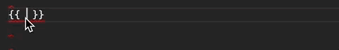

<div dir="rtl" align="right">


# مجموعه سوال و جواب‌های انگولار

> اگه از کتاب خوشتون اومد به گیت‌هابمون مراجعه کنین و بهمون :star: بدین. اگر هم قصد مشارکت داشتید همونجا می‌تونین شروع کنین و ما هم خیلی خوشحال می‌شیم :)

<span class="show-in-print">

> لینک گیت‌هاب ما برای مشارکت برای تولید کتاب‌ها: <a style="float:left" href="http://github.com/mariotek">https://github.com/mariotek</a>

</span>

### نحوه دانلود کتاب به فرمت‌های PDF/Epub

می‌تونین خیلی راحت نسخه آنلاین کتاب استفاده کنین یا اگه به فایل کتاب می‌خوایین دسترسی داشته باشین، از بخش ریلیزهای گیت‌هاب به فرمت‌های مختلف آخرین نسخه کتاب رو می‌تونین دریافت کنین.

<div class="a4 half"></div>

<br />
<br />
<br />


### فهرست

| ردیف | سوال |
|---- | --------- |
|1 | [فریمورک انگولار چیه؟](#فریمورک-انگولار-چیه؟)|
|2 | [فرق بین انگولار و انگولار جی اس چیه؟](#فرق-بین-انگولار-و-انگولار-جی-اس-چیه؟)|
|3 | [تایپ اسکریپت چیه؟](#تایپ-اسکریپت-چیه؟)|
|4 | [یه دیاگرام تصویری از ساختار انگولار بنویس؟](#یه-دیاگرام-تصویری-از-ساختار-انگولار-بنویس؟)|
|5 | [کامپوننت های کلیدی انگولار کدوما هستن؟](#کامپوننت-های-کلیدی-انگولار-کدوما-هستن؟)|
|6 | [directives ها چیا هستن؟](#directives-ها-چیا-هستن؟)|
|7 | [کامپوننت ها چیا هستن؟](#کامپوننت-ها-چیا-هستن؟)|
|8 | [تفاوت های بین directive و کامپوننت چیه؟](#تفاوت-های-بین-directive-و-کامپوننت-چیه؟)|
|9 | [template چیه؟](#template-چیه؟)|
|10| [ماژول چیه؟](#ماژول-چیه؟)|
|11| [lifecycle های مربوط به انگولار چیا هستن؟](#lifecycle-های-مربوط-به-انگولار-چیا-هستن؟)|
|12| [data binding چیه؟](#data-binding-چیه؟)|
|13| [metadata چیه؟](#ٖmetadata-چیه؟)|
|14| [Angular CLI چی هست؟](#Angular-CLI-چی-هست؟)|
|15| [فرق بین constructor و ngOnInit چیه؟](#فرق-بین-constructor-و-ngOnInit-چیه؟)|
|16| [service چیه؟](#service-چیه؟)|
|17| [dependency injection توی انگولار یعنی چی؟](#dependency-injection-توی-انگولار-یعنی-چی؟)|
|18| [ساختار Dependency توی انگولار چطوری چیده میشه؟](#ساختار-Dependency-توی-انگولار-چطوری-چیده-میشه؟)|
|19| [هدف از AsyncPipe چیه؟](#هدف-از-AsyncPipe-چیه؟)|
|20| [بین فایل template داخلی و خارجی کدومو باید انتخاب کرد؟](#بین-فایل-template-داخلی-و-خارجی-کدومو-باید-انتخاب-کرد؟)|
|21| [هدف از directive ngFor چی هستش؟](#1)|
|22| [هدف از directive ngIf چیه؟](#1)|
|23| [اگه از تگ script توی یه templete استفاده کنیم چه اتفاقی میوفته؟](#1)|
|24| [منظور از interpolation چیه؟](#1)|
|25| [template expressions ها چیا هستن?](#1)|
|26| [template statements ها چیا هستن؟](#1)|
|27| [چطوری دیتاهایی که bind شدن رو طبقه بندی میکنی؟](#1)|
|28| [pipe ها چیا هستن؟](#1)|
|29| [یه pipe منظور از پارامتردار شده چیه؟](#1)|
|30| [چطوری زنجیره ای از pipe ها میسازی؟](#1)|
|31| [منظور از pipe سفارشی شده چیه؟](#1)|
|32| [یه مثال از pipe سفارشی شده بزن؟](#1)|
|33| [فرق بین pure pipe و impure pipe چیه؟](#1)|
|34| [منظور از botstrapping module چیه؟](#1)|
|35| [observable ها چیا هستن؟](#1)|
|36| [HttpClient چیه و مزیت های اون چیا هستن؟](#1)|
|37| [چطوری از HttpClient استفاده کنیم؟](#1)|
|38| [چطوری response ها رو به صورت کامل بخونیم؟](#1)|
|39| [چطوری عمل error handling رو انجام میدی؟](#1)|
|40| [RxJS چیه؟](#1)|
|41| [subscribing چیه؟](#1)|
|42| [منطور از observable یه چیه؟](#1)|
|43| [observer جیه؟](#1)|
|44| [تفاوت بین pronise و یه oberservable چیه؟](#1)|
|45| [multicasting چیه؟](#1)|
|46| [جطوری روی observevable ها error handling انجام میدی؟](#1)|
|47| [مختصر شده متصد subscribe چیه؟](#1)|
|48| [توابع مفیدی روی RxJS وجود دارن چیا هستن؟ ](#1)|
|49| [توابع سازنده observable چیا هستن؟](#1)|
|50| [چیه اتفاقی میوفته اگه ما تابع handler برای observer تعریف نکنیم؟](#1)|
|51| [element های انگولار چیا هستن؟](#1)|
|52| [پشتیبانی های مرورگر ها برای element های انگولار چیا هستن؟](#1)|
|53| [element های کاستوم شده چیا هستن؟](#1)|
|54| [bootstrap کردن element های کاستوم شده لازمه؟](#1)|
|55| [ساختار داخلی و نجوه کارکردن element های کاستوم شده چطوریه؟](#1)|
|56| [چطوری کامپوننت عا رو به custom element تبدیل کنیم؟](#1)|
|57| [قوانین مپ کردن بین کامپوننت های انگولار و element های کاستوم چیه؟](#1)|
|58| [چطوری تایپ ها رو برای یه element کاستوم تعریف میکنی؟](#1)|
|59| [کامپوننت های داینامیک چیا هستن؟](#1)|
|60| [انواع مختلف directive ها کدوما هستن؟](#1)|
|61| [چطوری با استفاده از CLI یه directive درست میکنی؟](#1)|
|62| [یه مثال از استفاده directive با اتریبیوت بزن؟](#1)|
|63| [Angular Router چیه؟](#1)|
|64| [هدف از base href tag چیه؟](#1)|
|65| [import های مربوط به router چیه؟](#1)|
|66| [router outlet چیه؟](#1)|
|67| [router link ها چیا هستن؟](#1)|
|68| [منظور از router link های active جیه؟](#1)|
|69| [منظور از router state چیه؟](#1)|
|70| [event های مربوط به router چیا هستن؟](#1)|
|71| [منظور از activated route چیه؟](#1)|
|72| [چطوری router های پروژه ات رو تعریف میکنی؟](#1)|
|73| [هدف از Wildcard route چیه؟](#1)|
|74| [ما همیشه به routing module نیاز داریم؟](#1)|
|75| [Angular Universal چیه؟](#1)|
|76| [انگولار به چن روش کامپایل میشه؟](#1)|
|77| [JIT چیه؟](#1)|
|78| [AOT چیه؟](#1)|
|79| [چرا ما به پروسه کامپایل نیاز داریم؟](#1)|
|80| [مزایای استفاده از AOT چیه؟](#1)|
|81| [روش های کنترل کامپایل شدن با AOT چیا هستن؟](#1)|
|82| [محدودیت هایی که روی metadata وجود داره چیا هستن؟](#1)|
|83| [فاز های کامپایل با استفاده از AOT چیا هستن؟](#1)|
|84| [ ما میتونیم از arrow function ها توی AOT اسنتفاده کنیم؟](#1)|
|85| [هدف از استفاده از فایل های metadata json چیه؟](#1)|
|86| [ توی حالت AOTمیتونیم از همه مزایای جاوااسکریپت برای سینتکس ها استفاده کینیم؟](#1)|
|87| [folding چیه؟](#1)|
|88| [macros چیه؟](#1)|
|89| [چن تا مثال از ارور های مربوط به metatdata بزن؟](#1)|
|90| [منظور از metadata rewriting چیه؟](#1)|
|91| [How do you provide configuration inheritance?](#1)|
|92| [How do you specify angular template compiler options?](#1)|
|93| [How do you enable binding expression validation?](#1)|
|94| [What is the purpose of any type cast function?](#1)|
|95| [What is Non null type assertion operator?](#1)|
|96| [What is type narrowing?](#1)|
|97| [How do you describe various dependencies in angular application?](#1)|
|98| [What is zone?](#1)|
|99| [What is the purpose of common module?](#1)|
|100| [What is codelyzer?](#1)|
|101| [What is angular animation?](#1)|
|102| [What are the steps to use animation module?](#1)|
|103| [What is State function?](#1)|
|104| [What is Style function?](#1)|
|105| [What is the purpose of animate function?](#1)|
|106| [What is transition function?](#1)|
|107| [How to inject the dynamic script in angular?](#1)|
|108| [What is a service worker and its role in Angular?](#1)|
|109| [What are the design goals of service workers?](#1)|
|110| [What are the differences between AngularJS and Angular with respect to dependency injection?](#1)|
|111| [What is Angular Ivy?](#1)|
|112| [What are the features included in ivy preview?](#1)|
|113| [Can I use AOT compilation with Ivy?](#1)|
|114| [What is Angular Language Service?](#1)|
|115| [How do you install angular language service in the project?](#1)|
|116| [Is there any editor support for Angular Language Service?](#1)|
|117| [Explain the features provided by Angular Language Service?](#1)|
|118| [How do you add web workers in your application?](#1)|
|119| [What are the limitations with web workers?](#1)|
|120| [What is Angular CLI Builder?](#1)|
|121| [What is a builder?](#1)|
|122| [How do you invoke a builder?](#1)|
|123| [How do you create app shell in Angular?](#1)|
|124| [What are the case types in Angular?](#1)|
|125| [What are the class decorators in Angular?](#1)|
|126| [What are class field decorators?](#1)|
|127| [What is declarable in Angular?](#1)|
|128| [What are the restrictions on declarable classes?](#1)|
|129| [What is a DI token?](#1)|
|130| [What is Angular DSL?](#1)|
|131| [What is an rxjs Subject?](#1)|
|132| [What is Bazel tool?](#1)|
|133| [What are the advantages of Bazel tool?](#1)|
|134| [How do you use Bazel with Angular CLI?](#1)|
|135| [How do you run Bazel directly?](#1)|
|136| [What is platform in Angular?](#1)|
|137| [What happens if I import the same module twice?](#1)|
|138| [How do you select an element with in a component template?](#1)|
|139| [How do you detect route change in Angular?](#1)|
|140| [How do you pass headers for HTTP client?](#1)|
|141| [What is the purpose of differential loading in CLI?](#1)|
|142| [Is Angular supports dynamic imports?](#1)|
|143| [What is lazy loading?](#1)|
|144| [What are workspace APIs?](#1)|
|145| [How do you upgrade angular version?](#1)|
|146| [What is Angular Material?](#1)|
|147| [How do you upgrade location service of angularjs?](#1)|
|148| [What is NgUpgrade?](#1)|
|149| [How do you test Angular application using CLI?](#1)|
|150| [How to use polyfills in Angular application?](#1)|
|151| [What are the ways to trigger change detection in Angular?](#1)|
|152| [What are the differences of various versions of Angular?](#1)|
|153| [What are the security principles in angular?](#1)|
|154| [What is the reason to deprecate Web Tracing Framework?](#1)|
|155| [What is the reason to deprecate web worker packages?](#1)|
|156| [How do you find angular CLI version?](#1)|
|157| [What is the browser support for Angular?](#1)|
|158| [What is schematic](#1)|
|159| [What is rule in Schematics?](#1)|
|160| [What is Schematics CLI?](#1)|
|161| [What are the best practices for security in angular?](#1)|
|162| [What is Angular security model for preventing XSS attacks?](#1)|
|163| [What is the role of template compiler for prevention of XSS attacks?](#1)|
|164| [What are the various security contexts in Angular?](#16)|
|165| [What is Sanitization? Is angular supports it?](#1n?Is-angular-supports-it)|
|166| [What is the purpose of innerHTML?](#1)|
|167| [What is the difference between interpolated content and innerHTML?](#1)|
|168| [How do you prevent automatic sanitization?](#1)|
|169| [Is safe to use direct DOM API methods in terms of security?](#1)|
|170| [What is DOM sanitizer?](#1)|
|171| [How do you support server side XSS protection in Angular application?](#1n)
|172| [Is angular prevents http level vulnerabilities?](#1)|
|173| [What are Http Interceptors?](#1)|
|174| [What are the applications of HTTP interceptors?](#1)|
|175| [Is multiple interceptors supported in Angular?](#1)|
|176| [How can I use interceptor for an entire application?](#1)|
|177| [How does Angular simplifies Internationalization?](#1)|
|178| [How do you manually register locale data?](#1)|
|179| [What are the four phases of template translation?](#1)|
|180| [What is the purpose of i18n attribute?](#1)|
|181| [What is the purpose of custom id?](#1)|
|182| [What happens if the custom id is not unique?](#1)|
|183| [Can I translate text without creating an element?](#1)|
|184| [How can I translate attribute?](#1)|
|185| [List down the pluralization categories?](#1)|
|186| [What is select ICU expression?](#1)|
|187| [How do you report missing translations?](#1)|
|188| [How do you provide build configuration for multiple locales?](#1)|
|189| [What is an angular library?](#1)|
|190| [What is AOT compiler?](#1)|
|191| [How do you select an element in component template?](#1)|
|192| [What is TestBed?](#1)|
|193| [What is protractor?](#1)|
|194| [What is collection?](#1)|
|195| [How do you create schematics for libraries?](#1)|
|196| [How do you use jquery in Angular?](#1)|
|197| [What is the reason for No provider for HTTP exception?](#1)|
|198| [What is router state?](#1)|
|199| [How can I use SASS in angular project?](#1)|
|200| [What is the purpose of hidden property?](#1)|
|201| [What is the difference between ngIf and hidden property?](#1)|
|202| [What is slice pipe?](#1)|
|203| [What is index property in ngFor directive?](#1)|
|204| [What is the purpose of ngFor trackBy?](#1)|
|205| [What is the purpose of ngSwitch directive?](#1)|
|206| [Is it possible to do aliasing for inputs and outputs?](#1)|
|207| [What is safe navigation operator?](#1)|
|208| [Is any special configuration required for Angular9?](#1)|
|209| [What are type safe TestBed API changes in Angular9?](#1)|
|210| [Is mandatory to pass static flag for ViewChild?](#1)|
|211| [What are the list of template expression operators?](#1s)
|212| [What is the precedence between pipe and ternary operators?](#1s)
|213| [What is an entry component?](#1)|
|214| [What is a bootstrapped component?](#1)|
|215| [How do you manually bootstrap an application?](#1)|
|216| [Is it necessary for bootstrapped component to be entry component?](#1)|
|217| [What is a routed entry component?](#1)|
|218| [Why is not necessary to use entryComponents array every time?](#1)|
|219| [Do I still need to use entryComponents array in Angular9?](#1)|
|220| [Is it all components generated in production build?](#1)|
|221| [What is Angular compiler?](#1)|
|222| [What is the role of ngModule metadata in compilation process?](#1)|
|223| [How does angular finds components, directives and pipes?](#1)|
|224| [Give few examples for NgModules?](#1)|
|225| [What are feature modules?](#1)|
|226| [What are the imported modules in CLI generated feature modules?](#1)|
|227| [What are the differences between ngmodule and javascript module?](#1)|
|228| [What are the possible errors with declarations?](#1)|
|229| [What are the steps to use declaration elements?](#1)|
|230| [What happens if browserModule used in feature module?](#1)|
|231| [What are the types of feature modules?](#1)|
|232| [What is a provider?](#1)|
|233| [What is the recommendation for provider scope?](#1)|
|234| [How do you restrict provider scope to a module?](#1)|
|235| [How do you provide a singleton service?](#1)|
|236| [What are the different ways to remove duplicate service registration?](#1)|
|237| [How does forRoot method helpful to avoid duplicate router instances?](#1)|
|238| [What is a shared module?](#1)|
|239| [Can I share services using modules?](#1)|
|240| [How do you get current direction for locales??](#1)|
|241| [What is ngcc?](#1)|
|242| [What classes should not be added to declarations?](#1)|
|243| [Wat is ngzone?](#1)|
|244| [What is NoopZone?](#1)|
|245| [How do you create displayBlock components?](#1)|
|246| [What are the possible data change scenarios for change detection?](#1)|
|247| [What is a zone context?](#1)|
|248| [What are the lifecycle hooks of a zone?](#1)|
|249| [Which are the methods of NgZone used to control change detection?](#1)|
|250| [How do you change the settings of zonejs?](#1)|
|251| [How do you trigger an animation?](#1)|
|252| [How do you configure injectors with providers at different levels?](#1)|
|253| [Is it mandatory to use injectable on every service class?](#1)|
|254| [What is an optional dependency?](#1)|
|255| [What are the types of injector hierarchies?](#1)|
|256| [What are reactive forms?](#1)|
|257| [What are dynamic forms?](#1)|
|258| [What are template driven forms?](#1)|
|259| [What are the differences between reactive forms and template driven forms?](#1)|
|260| [What are the different ways to group form controls?](#1)|
|261| [How do you update specific properties of a form model?](#1)|
|262| [What is the purpose of FormBuilder?](#1)|
|263| [How do you verify the model changes in forms?](#1)|
|264| [What are the state CSS classes provided by ngModel?](#1)|
|265| [How do you reset the form?](#1)|
|266| [What are the types of validator functions?](#1)|
|267| [Can you give an example of built-in validators?](#1)|
|268| [How do you optimize the performance of async validators?](#1)|
|269| [How to set ngFor and ngIf on the same element?](#1)|
|270| [What is host property in css?](#1)|
|271| [How do you get the current route?](#1)|
|272| [What is Component Test Harnesses?](#1)|
|273| [What is the benefit of Automatic Inlining of Fonts?](#1)|
|274| [What is content projection?](#1)|
|275| [What is ng-content and its purpose?](#1)|


1. ### فریمورک انگولار چیه؟

     Angular یک پلت‌فرم فرانت‌اند منبع باز مبتنی بر **TypeScript** است که ساخت برنامه‌ها را در وب/موبایل/کامپیوتر آسان می‌کند. از ویژگی های اصلی این فریم ورک مانند قالب های اعلامی، تزریق وابستگی، ابزارهای انتها به انتها و بسیاری ویژگی های دیگر برای سهولت توسعه استفاده می شود.

     **[فهرست](#فهرست)**

2. ### فرق بین انگولار و انگولار جی اس چیه؟

     Angular یک فریم ورک کاملاً احیا شده مبتنی بر مؤلفه است که در آن یک برنامه کاربردی درختی از اجزای جداگانه است.

     | AngularJS | Angular |
     |---- | ---------
     | این بر اساس معماری MVC است| این بر اساس Service/Controller است|
     | از جاوا اسکریپت برای ساخت برنامه استفاده می کند|برای نوشتن برنامه، TypeScript را معرفی کرد|
     | بر اساس مفهوم کنترلرها| این یک رویکرد UI مبتنی بر مؤلفه است|
     | یک چارچوب سازگار با موبایل نیست| با توجه به پلتفرم تلفن همراه توسعه یافته است|
     | مشکل در توسعه برنامه کاربردی SEO دوستانه| سهولت در ایجاد برنامه های کاربردی سئو دوستانه|

     **[فهرست](#فهرست)**

3. ### تایپ اسکریپت چیه؟

     TypeScript یک ابر مجموعه تایپ شده از جاوا اسکریپت است که توسط مایکروسافت ایجاد شده است که انواع اختیاری، کلاس ها، async/wait و بسیاری ویژگی های دیگر را اضافه می کند و به جاوا اسکریپت ساده کامپایل می کند. Angular به طور کامل در TypeScript ساخته شده و به عنوان زبان اصلی استفاده می شود.
      شما می توانید آن را به صورت جهانی نصب کنید
     
     <span dir="ltr" align="left">

     ```cmd
     npm install -g typescript
     ```
     
     </span>

     Let's see a simple example of TypeScript usage,
     
     <span dir="ltr" align="left">

     ```typescript
     function greeter(person: string) {
          return "Hello, " + person;
     }

     let user = "Sudheer";

     document.body.innerHTML = greeter(user);
     ```
     
     </span>

     متد greeter فقط نوع رشته را به عنوان آرگومان مجاز می کند.

     **[فهرست](#فهرست)**

4. ### یه دیاگرام تصویری از ساختار انگولار بنویس؟

     بلوک های ساختمان اصلی یک برنامه Angular در نمودار زیر نشان داده شده است
     

     **[فهرست](#فهرست)**

5. ### کامپوننت های کلیدی انگولار کدوما هستن؟

     1. **Component:** اینها بلوک های ساختمانی اصلی برنامه های زاویه ای برای کنترل نماهای HTML هستند.
     2. **Modules:** یک ماژول زاویه‌ای مجموعه‌ای از بلوک‌های ساختمانی پایه زاویه‌ای مانند کامپوننت، دستورالعمل‌ها، خدمات و غیره است. یک برنامه کاربردی به قطعات منطقی تقسیم می‌شود و هر قطعه کد به عنوان "ماژول" نامیده می‌شود که یک وظیفه را انجام می‌دهد.
     3. **Templates:** این نماهای یک برنامه Angular را نشان می دهد.
     4. **Services:** برای ایجاد مؤلفه هایی استفاده می شود که می توانند در کل برنامه به اشتراک گذاشته شوند.
     5. **Metadata:** این می تواند برای افزودن داده های بیشتر به یک کلاس Angular استفاده شود.

     **[فهرست](#فهرست)**

6. ### directives ها چیا هستن؟

     directives ها رفتاری را به یک عنصر DOM موجود یا یک نمونه جزء موجود اضافه می کنند.
     
     <span dir="ltr" align="left">

     ```typescript
     import { Directive, ElementRef, Input } from '@angular/core';

     @Directive({ selector: '[myHighlight]' })
     export class HighlightDirective {
          constructor(el: ElementRef) {
               el.nativeElement.style.backgroundColor = 'yellow';
          }
     }
     ```
     
     </span>

     اکنون این directive رفتار عنصر HTML را با پس‌زمینه زرد مانند زیر گسترش می‌دهد
     
     <span dir="ltr" align="left">

     ```html
     <p myHighlight>Highlight me!</p>
     ```
     
     </span>

     **[فهرست](#فهرست)**

7. ### کامپوننت ها چیا هستن؟

     کامپوننت ها اساسی ترین بلوک سازنده رابط کاربری یک برنامه Angular هستند که درختی از اجزای Angular را تشکیل می دهند. این مؤلفه ها زیر مجموعه دستورالعمل ها هستند. برخلاف دستورات، کامپوننت‌ها همیشه دارای یک الگو هستند و تنها یک جزء را می‌توان به ازای هر عنصر در قالب نمونه‌سازی کرد.
      بیایید یک مثال ساده از کامپوننت Angular را ببینیم
     
     <span dir="ltr" align="left">

     ```typescript
     import { Component } from '@angular/core';

     @Component ({
          selector: 'my-app',
          template: ` <div>
          <h1>{{title}}</h1>
          <div>Learn Angular6 with examples</div>
          </div> `,
     })

     export class AppComponent {
          title: string = 'Welcome to Angular world';
     }
     ```
     
     </span>

     **[فهرست](#فهرست)**

8. ### تفاوت های بین directive و کامپوننت چیه؟

     در یک یادداشت کوتاه، A component(@component) یک دستورالعمل-با-الگو است.

     برخی از تفاوت های عمده به صورت جدولی ذکر شده است

     | Component | Directive |
     |---- | ---------
     | برای ثبت یک مؤلفه، از حاشیه نویسی فراداده @Component استفاده می کنیم  | برای ثبت دستورالعمل‌ها، از حاشیه‌نویسی فراداده @Directive استفاده می‌کنیم |
     | کامپوننت ها معمولا برای ایجاد ویجت های UI استفاده می شوند|دستورالعمل برای افزودن رفتار به یک عنصر DOM موجود استفاده می شود |
     | کامپوننت برای تقسیم برنامه به اجزای کوچکتر استفاده می شود دستورالعمل برای طراحی اجزای قابل استفاده مجدد استفاده می شود|
     | فقط یک جزء می تواند در هر عنصر DOM وجود داشته باشد | بسیاری از دستورالعمل ها را می توان برای هر عنصر DOM استفاده کرد |
     | @View decorator یا templateurl/template اجباری است | دستورالعمل از View استفاده نمی کند|

     **[فهرست](#فهرست)**

9. ### template چیه؟

     یک الگو یک نمای HTML است که در آن می توانید داده ها را با اتصال کنترل ها به ویژگی های یک جزء Angular نمایش دهید. می توانید الگوی جزء خود را در یکی از دو مکان ذخیره کنید. می توانید با استفاده از ویژگی template آن را به صورت درون خطی تعریف کنید، یا می توانید قالب را در یک فایل HTML جداگانه تعریف کنید و با استفاده از ویژگی templateUrl@Component decorator به آن در ابرداده کامپوننت پیوند دهید.

     **Using inline template with template syntax,**

     
     <span dir="ltr" align="left">

     ```typescript
     import { Component } from '@angular/core';

     @Component ({
          selector: 'my-app',
          template: '
          <div>
               <h1>{{title}}</h1>
               <div>Learn Angular</div>
          </div>
          '
     })

     export class AppComponent {
          title: string = 'Hello World';
     }
     ```
     
     </span>

     **Using separate template file such as app.component.html**

     
     <span dir="ltr" align="left">

     ```typescript
     import { Component } from '@angular/core';

     @Component ({
          selector: 'my-app',
          templateUrl: 'app/app.component.html'
     })

     export class AppComponent {
          title: string = 'Hello World';
     }
     ```
     
     </span>

     **[فهرست](#فهرست)**

10. ### ماژول چیه؟

     ماژول ها مرزهای منطقی در برنامه شما هستند و برنامه به ماژول های جداگانه تقسیم می شود تا عملکرد برنامه شما را از هم جدا کند.
      بیایید مثالی از **app.module.ts** ماژول ریشه ای را که با دکوراتور **@NgModule** به شرح زیر اعلام شده است، بیاوریم.

     
     <span dir="ltr" align="left">

     ```typescript
     import { NgModule }      from '@angular/core';
     import { BrowserModule } from '@angular/platform-browser';
     import { AppComponent }  from './app.component';

     @NgModule ({
          imports:      [ BrowserModule ],
          declarations: [ AppComponent ],
          bootstrap:    [ AppComponent ],
          providers: []
     })
     export class AppModule { }
     ```
     
     </span>

     دکوراتور NgModule پنج گزینه مهم (در میان همه) دارد
     1. گزینه imports برای وارد کردن ماژول های وابسته دیگر استفاده می شود. BrowserModule به طور پیش فرض برای هر برنامه زاویه ای مبتنی بر وب مورد نیاز است
     2. گزینه declarations برای تعریف اجزا در ماژول مربوطه استفاده می شود
     3. گزینه bootstrap به Angular می گوید که کدام کامپوننت را در برنامه بوت استرپ کند
     4. گزینه providers برای پیکربندی مجموعه ای از اشیاء تزریقی موجود در انژکتور این ماژول استفاده می شود.
     5. گزینه enterComponents مجموعه ای از اجزایی است که به صورت پویا در view بارگذاری می شوند.

     **[فهرست](#فهرست)**

11. ### lifecycle های مربوط به انگولار چیا هستن؟

     برنامه Angular مجموعه کاملی از فرآیندها را طی می کند یا از زمان شروع تا پایان برنامه یک چرخه حیات دارد.
      نمایش چرخه حیات در نمایش تصویری به شرح زیر است:

     

     1. **ngOnChanges:** هنگامی که مقدار یک ویژگی داده محدود تغییر می کند، این روش فراخوانی می شود.
     2. **ngOnInit:** هر زمان که مقداردهی اولیه دستور/کامپوننت پس از نمایش Angular برای اولین بار خصوصیات داده محدود اتفاق بیفتد، فراخوانی می شود.
     3. **ngDoCheck:** این برای تشخیص و اعمال تغییراتی است که Angular به تنهایی قادر به تشخیص آنها نیست یا نخواهد بود.
     4. **ngAfterContentInit:** پس از اینکه Angular محتوای خارجی را در نمای کامپوننت پروژه می دهد، در پاسخ به این امر فراخوانی می شود.
     5. **ngAfterContentChecked:** این در پاسخ پس از بررسی Angular محتوای پیش بینی شده در کامپوننت فراخوانی می شود.
     6. **ngAfterViewInit:** پس از اینکه Angular نماهای کامپوننت و نماهای فرزند را مقدار دهی اولیه کرد، در پاسخ فراخوانی می شود.
     7. **ngAfterViewChecked:** این در پاسخ پس از بررسی Angular نماهای کامپوننت و نماهای فرزند فراخوانی می شود.
     8. **ngOnDestroy:** این مرحله پاکسازی درست قبل از اینکه Angular دستور/کامپوننت را از بین ببرد است.

     **[فهرست](#فهرست)**

12. ### data binding چیه؟

     Data binding یک مفهوم اصلی در Angular است و امکان تعریف ارتباط بین یک مؤلفه و DOM را فراهم می کند و تعریف برنامه های تعاملی را بدون نگرانی در مورد فشار دادن و کشیدن داده ها بسیار آسان می کند. چهار شکل اتصال داده وجود دارد (به 3 دسته تقسیم می شود) که در نحوه جریان داده ها متفاوت است.
    
     1. **From the Component to the DOM:**

     **Interpolation:** {{ value }}: مقدار یک ویژگی را از جزء اضافه می کند
    
     
     <span dir="ltr" align="left">

     ```html
     <li>Name: {{ user.name }}</li>
     <li>Address: {{ user.address }}</li>
     ```
     
     </span>

     **Property binding:** [property]=”value”: مقدار از کامپوننت به ویژگی مشخص شده یا ویژگی ساده HTML منتقل می شود.
    
     
     <span dir="ltr" align="left">

     ```html
     <input type="email" [value]="user.email">
     ```
     
     </span>

     2. **From the DOM to the Component:**
     **Event binding: (event)=”function”:**هنگامی که یک رویداد DOM خاص اتفاق می افتد (مثلاً: کلیک، تغییر، کلید آپلود)، متد مشخص شده در مؤلفه را فراخوانی کنید.
    
     
     <span dir="ltr" align="left">

     ```html
     <button (click)="logout()"></button>
     ```
     
     </span>

     3. **Two-way binding:**
     **Two-way data binding:** [(ngModel)]=”value”: اتصال دو طرفه داده اجازه می دهد تا جریان داده ها از هر دو طرف انجام شود. برای مثال، در قطعه کد زیر، هر دو ورودی DOM ایمیل و ویژگی ایمیل جزء همگام هستند.
    
     
     <span dir="ltr" align="left">

     ```html
     <input type="email" [(ngModel)]="user.email">
     ```
     
     </span>

     **[فهرست](#فهرست)**

13. ### What is metadata?

     متادیتا برای تزئین یک کلاس استفاده می شود تا بتواند رفتار مورد انتظار کلاس را پیکربندی کند. ابرداده توسط دکوراتورها نمایش داده می شود

     1. **Class decorators**, به عنوان مثال، @Component و @NgModule
    
     
     <span dir="ltr" align="left">

     ```typescript
     import { NgModule, Component } from '@angular/core';

     @Component({
          selector: 'my-component',
          template: '<div>Class decorator</div>',
     })

     export class MyComponent {
          constructor() {
               console.log('Hey I am a component!');
          }
     }

     @NgModule({
          imports: [],
          declarations: [],
     })
     export class MyModule {
          constructor() {
               console.log('Hey I am a module!');
          }
     }
     ```
     
     </span>

     2. **Property decorators** برای ویژگی های داخل کلاس ها استفاده می شود، به عنوان مثال. @import و export
     
     <span dir="ltr" align="left">

     ```typescript
     import { Component, Input } from '@angular/core';

     @Component({
          selector: 'my-component',
          template: '<div>Property decorator</div>'
     })

     export class MyComponent {
          @Input()
          title: string;
     }
     ```
     
     </span>
     
     3. **Method decorators** برای متدهای داخل کلاس ها استفاده می شود، به عنوان مثال. @HostListener
     
     <span dir="ltr" align="left">

     ```typescript
     import { Component, HostListener } from '@angular/core';

     @Component({
          selector: 'my-component',
          template: '<div>Method decorator</div>'
     })
     export class MyComponent {
          @HostListener('click', ['$event'])
          onHostClick(event: Event) {
               // clicked, `event` available
          }
     }
     ```
     
     </span>
     
     4. **Parameter decorators** برای پارامترهای داخل سازنده کلاس استفاده می شود، به عنوان مثال. @Inject، اختیاری
     
     <span dir="ltr" align="left">

     ```typescript
     import { Component, Inject } from '@angular/core';
     import { MyService } from './my-service';

     @Component({
          selector: 'my-component',
          template: '<div>Parameter decorator</div>'
     })
     export class MyComponent {
          constructor(@Inject(MyService) myService) {
               console.log(myService); // MyService
          }
     }
     ```

     </span>

     **[فهرست](#فهرست)**

14. ### Angular CLI چی هست؟

     Angular CLI (** Command Line Interface**) یک رابط خط فرمان برای ساخت داربست و ساخت برنامه های زاویه ای با استفاده از ماژول های سبک nodejs (commonJs) است.
      شما باید با استفاده از دستور زیر npm نصب کنید،

     <span dir="ltr" align="left">

     ```bash
     npm install @angular/cli@latest
     ```

     </span>

     در زیر لیستی از چند دستور وجود دارد که هنگام ایجاد پروژه های زاویه ای به کار می آیند

     1. **Creating New Project:** ng new <project-name>

     2. **Generating Components, Directives & Services:** ng generate/g <feature-name>
        انواع مختلف دستورات عبارتند از
         * ng generate class my-new-class: یک کلاس به برنامه خود اضافه کنید
         * ng تولید کامپوننت my-new-component: یک جزء به برنامه خود اضافه کنید
         * ng generate directive my-new-directive: یک دستورالعمل به برنامه خود اضافه کنید
         * ng generate enum my-new-enum: یک enum به برنامه خود اضافه کنید
         * ng generate module my-new-module: یک ماژول به برنامه خود اضافه کنید
         * تولید لوله my-new-pipe: یک لوله به برنامه خود اضافه کنید
         * ng generate service my-new-service: یک سرویس به برنامه خود اضافه کنید

     3. **Running the Project:** ng serve

     **[فهرست](#فهرست)**

15. ### فرق بین constructor و ngOnInit چیه؟

     کلاس های TypeScript دارای یک روش پیش فرض به نام سازنده است که معمولاً برای هدف اولیه استفاده می شود. در حالی که روش ngOnInit مختص Angular است، به ویژه برای تعریف اتصالات Angular استفاده می شود. حتی اگر سازنده ابتدا فراخوانی می‌شود، ترجیح داده می‌شود همه اتصالات Angular خود را به متد ngOnInit منتقل کنید.
      برای استفاده از ngOnInit، باید رابط OnInit را به صورت زیر پیاده سازی کنید.
     
     <span dir="ltr" align="left">

     ```typescript
     export class App implements OnInit{
          constructor(){
          //called first time before the ngOnInit()
          }

          ngOnInit(){
          //called after the constructor and called  after the first ngOnChanges()
          }
     }
     ```

     </span>

     **[فهرست](#فهرست)**

16. ### service چیه؟

     یک سرویس زمانی استفاده می شود که یک عملکرد مشترک باید به ماژول های مختلف ارائه شود. سرویس‌ها به شما اجازه می‌دهند تا نگرانی‌های مربوط به برنامه شما را بیشتر از هم جدا کرده و ماژولاریت بهتری داشته باشید، زیرا به شما امکان می‌دهد عملکردهای مشترک را از اجزا استخراج کنید.

      بیایید یک repoService ایجاد کنیم که می تواند در بین اجزاء مورد استفاده قرار گیرد،
     
     <span dir="ltr" align="left">

     ```typescript
     import { Injectable } from '@angular/core';
     import { Http } from '@angular/http';

     @Injectable({ // The Injectable decorator is required for dependency injection to work
          // providedIn option registers the service with a specific NgModule
          providedIn: 'root',  // This declares the service with the root app (AppModule)
     })
     export class RepoService{
          constructor(private http: Http){
          }

          fetchAll(){
          return this.http.get('https://api.github.com/repositories');
          }
     }
     ```
     
     </span>

     سرویس فوق از سرویس Http به عنوان یک وابستگی استفاده می کند.

     **[فهرست](#فهرست)**

17. ### dependency injection توی انگولار یعنی چی؟

     تزریق وابستگی (DI)، یک الگوی طراحی برنامه مهم است که در آن یک کلاس به جای ایجاد وابستگی از منابع خارجی درخواست می‌کند. Angular با چارچوب تزریق وابستگی خود برای حل وابستگی ها (سرویس ها یا اشیایی که یک کلاس برای انجام عملکرد خود به آن نیاز دارد) ارائه می شود. بنابراین می توانید خدمات خود را در سراسر برنامه به سرویس های دیگر وابسته کنید.

     **[فهرست](#فهرست)**

18. ### ساختار Dependency توی انگولار چطوری چیده میشه؟

     **[فهرست](#فهرست)**

19. ### هدف از AsyncPipe چیه؟

     AsyncPipe مشترک یک قابل مشاهده یا قول می شود و آخرین مقداری را که منتشر کرده است برمی گرداند. هنگامی که یک مقدار جدید منتشر می شود، لوله مؤلفه ای را که باید بررسی شود برای تغییرات علامت گذاری می کند.

      بیایید یک زمان قابل مشاهده را در نظر بگیریم که به طور مداوم نما را برای هر 2 ثانیه با زمان فعلی به روز می کند.

     
     <span dir="ltr" align="left">

     ```typescript
     @Component({
          selector: 'async-observable-pipe',
          template: `<div><code>observable|async</code>:
               Time: {{ time | async }}</div>`
     })
     export class AsyncObservablePipeComponent {
          time = new Observable(observer =>
          setInterval(() => observer.next(new Date().toString()), 2000)
          );
     }
     ```
     
     </span>

     **[فهرست](#فهرست)**

20. ### بین فایل template داخلی و خارجی کدومو باید انتخاب کرد؟
     
     می توانید الگوی جزء خود را در یکی از دو مکان ذخیره کنید. می توانید آن را به صورت درون خطی با استفاده از ویژگی **template** تعریف کنید، یا می توانید الگو را در یک فایل HTML جداگانه تعریف کنید و با استفاده از ویژگی **templateUrl** در decorator **@Component** به آن در ابرداده کامپوننت پیوند دهید.

      انتخاب بین HTML درون خطی و مجزا یک موضوع سلیقه، شرایط و خط مشی سازمان است. اما معمولاً از قالب درون خطی برای بخش کوچکی از کد و از فایل قالب خارجی برای نمایش های بزرگتر استفاده می کنیم. به طور پیش فرض، Angular CLI کامپوننت ها را با یک فایل الگو تولید می کند. اما می توانید با دستور زیر آن را لغو کنید
    
     <span dir="ltr" align="left">

     ```bash
     ng generate component hero -it
     ```

     </span>

     **[فهرست](#فهرست)**

21. ### هدف از directive ngFor چی هستش؟

     ما از دستورالعمل Angular ngFor در قالب برای نمایش هر آیتم در لیست استفاده می کنیم. به عنوان مثال، در اینجا ما روی لیست کاربران تکرار می کنیم،

     <span dir="ltr" align="left">

     ```html
     <li *ngFor="let user of users">
          {{ user }}
     </li>
     ```
     
     </span>

     متغیر کاربر در دستورالعمل ngFor دو نقل قول a است**template input variable**

     **[فهرست](#فهرست)**

22. ### هدف از directive ngIf چیه؟

     گاهی اوقات یک برنامه فقط در شرایط خاص نیاز به نمایش یک نما یا بخشی از یک نما دارد. دستورالعمل Angular ngIf یک عنصر را بر اساس شرایط درستی/نادرستی درج یا حذف می کند. اگر سن کاربر بیش از 18 سال باشد، برای نمایش پیام مثالی می زنیم.
     
     <span dir="ltr" align="left">

     ```html
     <p *ngIf="user.age > 18">You are not eligible for student pass!</p>
     ```
     
     </span>

     **Note:** Angular پیام را نشان نمی دهد و پنهان نمی کند. در حال افزودن و حذف عنصر پاراگراف از DOM است. که عملکرد را بهبود می بخشد، به خصوص در پروژه های بزرگتر با اتصال داده های زیادی.

     **[فهرست](#فهرست)**

23. ### اگه از تگ script توی یه templete استفاده کنیم چه اتفاقی میوفته؟

     Angular مقدار را ناامن تشخیص می‌دهد و به‌طور خودکار آن را پاکسازی می‌کند، که تگ «اسکریپت» را حذف می‌کند اما محتوای ایمن مانند محتوای متنی برچسب «اسکریپت» را حفظ می‌کند. به این ترتیب خطر حملات تزریق اسکریپت را از بین می برد. اگر همچنان از آن استفاده می کنید، نادیده گرفته می شود و یک هشدار در کنسول مرورگر ظاهر می شود.

     بیایید مثالی از اتصال ویژگی innerHtml که باعث آسیب‌پذیری XSS می‌شود، بیاوریم.

     
     <span dir="ltr" align="left">

     ```typescript
     export class InnerHtmlBindingComponent {
          // For example, a user/attacker-controlled value from a URL.
          htmlSnippet = 'Template <script>alert("0wned")</script> <b>Syntax</b>';
     }
     ```
     
     </span>

     **[فهرست](#فهرست)**

24. ### منظور از interpolation چیه؟

     درون یابی یک نحو خاص است که Angular آن را به ویژگی binding تبدیل می کند. این یک جایگزین مناسب برای اتصال اموال است. با مهاربندهای دوتایی ({{}}) نشان داده می شود. متن بین پرانتزها اغلب نام یک ویژگی جزء است. Angular آن نام را با مقدار رشته خاصیت جزء مربوطه جایگزین می کند.

      بیایید یک مثال بزنیم،

     
     <span dir="ltr" align="left">

     ```html
     <h3>
          {{title}}
          
     </h3>
     ```
     
     </span>

     در مثال بالا، Angular خصوصیات عنوان و url را ارزیابی می کند و جاهای خالی را پر می کند، ابتدا عنوان برنامه پررنگ و سپس URL نمایش داده می شود.

     **[فهرست](#فهرست)**

25. ### template expressions ها چیا هستن?

     یک عبارت الگو مقداری شبیه به هر عبارت جاوا اسکریپت تولید می کند. Angular عبارت را اجرا می کند و آن را به خاصیت یک هدف الزام آور اختصاص می دهد. هدف ممکن است یک عنصر HTML، یک جزء یا یک دستورالعمل باشد. در ویژگی binding، یک عبارت الگو در نقل قول در سمت راست نماد = مانند [property]="expression ظاهر می شود.
      در نحو درون یابی، عبارت الگو با پرانتزهای مجعد دوتایی احاطه شده است. به عنوان مثال، در درون یابی زیر، عبارت الگو {{username}} است،
     
     <span dir="ltr" align="left">

     ```html
     <h3>{{username}}, welcome to Angular</h3>
     ```
     
     </span>

     عبارات جاوا اسکریپت زیر در عبارت قالب ممنوع هستند
      1. assignments (=، +=، -=، ...)
      2. new
      3. زنجیره عبارات با ; یا ،
      4. عملگرهای افزایش و کاهش (++ و --)
     ----------------------------------

     **[فهرست](#فهرست)**

26. ### template statements ها چیا هستن؟

    یک عبارت الگو به رویدادی پاسخ می دهد که توسط یک هدف الزام آور مانند یک عنصر، مؤلفه یا دستورالعمل ایجاد شده است. عبارات الگو در نقل قول در سمت راست نماد = مانند **(رویداد)="statement"** ظاهر می شوند.

     Let's take an example of button click event's statement

     <span dir="ltr" align="left">

     ```html
     <button (click)="editProfile()">Edit Profile</button>
     ```
     
     </span>

     در عبارت بالا، editProfile یک عبارت الگو است. عبارات نحوی جاوا اسکریپت زیر مجاز نیستند.
     1. جدید
     2. عملگرهای افزایش و کاهش، ++ و --
     3. انتساب عملگر، مانند += و -=
     4. عملگرهای بیتی | و &
     5. عملگرهای عبارت الگو
     --------------------------------------

     **[فهرست](#فهرست)**

27. ### چطوری دیتاهایی که bind شدن رو طبقه بندی میکنی؟

     انواع اتصال را می توان به سه دسته دسته بندی کرد که با جهت جریان داده ها متمایز می شوند. آنها به صورت زیر فهرست شده اند،
     
      1. از منبع به مشاهده
      2. از دیدگاه به منبع
      3. View-to-source-to-view

      نحو ممکن الزام آور را می توان به صورت جدولی در زیر ارائه کرد:

     | جهت داده | نحو | نوع |
     |---- | --------- | ---- |
     | از منبع به مشاهده (یک طرفه) | 1. {{expression}} 2. [target]="expression" 3. bind-target="expression" | درون یابی، ویژگی، صفت، طبقه، سبک|
     | از دیدگاه به منبع (یک طرفه) | 1. (target)="statement" 2. on-target="statement" | رویداد |
     | View-to-source-to-view(دو طرفه)| 1. [(target)]="expression" 2. bindon-target="expression"| دوطرفه |

     **[فهرست](#فهرست)**

28. ### pipe ها چیا هستن؟

    یک لوله داده ها را به عنوان ورودی می گیرد و آن را به خروجی دلخواه تبدیل می کند. به عنوان مثال، اجازه دهید یک لوله را برای تبدیل ویژگی تولد یک جزء به تاریخ دوست‌داشتنی با استفاده از لوله **date** در نظر بگیریم.
     
     <span dir="ltr" align="left">

     ```javascript
     import { Component } from '@angular/core';

     @Component({
          selector: 'app-birthday',
          template: `<p>Birthday is {{ birthday | date }}</p>`
     })
     export class BirthdayComponent {
          birthday = new Date(1987, 6, 18); // June 18, 1987
     }
     ```

     </span>

     **[فهرست](#فهرست)**

29. ### یه منظور از pipe پارامتردار شده چیه؟

     یک لوله می تواند هر تعداد پارامتر اختیاری را برای تنظیم دقیق خروجی خود بپذیرد. لوله پارامتر شده را می توان با اعلام نام لوله با علامت دو نقطه ( : ) و سپس مقدار پارامتر ایجاد کرد. اگر لوله چندین پارامتر را می پذیرد، مقادیر را با دو نقطه جدا کنید. بیایید یک مثال تولد با یک قالب خاص (dd/MM/yyyy) در نظر بگیریم:
     
     <span dir="ltr" align="left">

     ```javascript
     import { Component } from '@angular/core';

     @Component({
          selector: 'app-birthday',
          template: `<p>Birthday is {{ birthday | date:'dd/MM/yyyy'}}</p>` // 18/06/1987
     })
     export class BirthdayComponent {
          birthday = new Date(1987, 6, 18);
     }
     ```
     
     </span>

     **Note:** مقدار پارامتر می تواند هر عبارت الگوی معتبری باشد، مانند یک رشته لفظی یا یک ویژگی جزء.

     **[فهرست](#فهرست)**

30. ### چطوری زنجیره ای از pipe ها میسازی؟

     می‌توانید لوله‌ها را در ترکیب‌های بالقوه مفید بر حسب نیاز به هم زنجیر کنید. بیایید یک ویژگی تولد را در نظر بگیریم که از لوله تاریخ (همراه با پارامتر) و لوله های بزرگ مانند زیر استفاده می کند
     
     <span dir="ltr" align="left">

     ```javascript
     import { Component } from '@angular/core';

     @Component({
          selector: 'app-birthday',
          template: `<p>Birthday is {{  birthday | date:'fullDate' | uppercase}} </p>` // THURSDAY, JUNE 18, 1987
     })
     export class BirthdayComponent {
          birthday = new Date(1987, 6, 18);
     }

     ```

     </span>

     **[فهرست](#فهرست)**

31. ### منظور از pipe سفارشی شده چیه؟

     جدا از لوله های داخلی، می توانید لوله سفارشی خود را با ویژگی های کلیدی زیر بنویسید:
     1. پیپ کلاسی است که با متادیتای لوله **@Pipe** تزئین شده است که از کتابخانه هسته انگولار وارد می‌کنید.
     مثلا،
    
     <span dir="ltr" align="left">

     ```cmd
     @Pipe({name: 'myCustomPipe'})
     ```
     
     </span>

     2. کلاس pipe روش تبدیل رابط **PipeTransform** را پیاده سازی می کند که یک مقدار ورودی و به دنبال آن پارامترهای اختیاری را می پذیرد و مقدار تبدیل شده را برمی گرداند.
      ساختار pipeTransform به صورت زیر خواهد بود.
    
     
     <span dir="ltr" align="left">

     ```cmd
     interface PipeTransform {
          transform(value: any, ...args: any[]): any
     }
     ```
     
     </span>

     3. دکوراتور @Pipe به شما امکان می دهد نام لوله ای را که در عبارات قالب استفاده می کنید، تعریف کنید. باید یک شناسه جاوا اسکریپت معتبر باشد.
     
     <span dir="ltr" align="left">

     ```cmd
     template: `{{someInputValue | myCustomPipe: someOtherValue}}`
     ```
     
     </span>

     **[فهرست](#فهرست)**

32. ### یه مثال از pipe سفارشی شده بزن؟

     شما می توانید لوله های قابل استفاده مجدد سفارشی برای تغییر ارزش موجود ایجاد کنید. به عنوان مثال، اجازه دهید یک لوله سفارشی برای یافتن اندازه فایل بر اساس پسوند ایجاد کنیم،
  
     <span dir="ltr" align="left">

     ```javascript
     import { Pipe, PipeTransform } from '@angular/core';

     @Pipe({name: 'customFileSizePipe'})
     export class FileSizePipe implements PipeTransform {
          transform(size: number, extension: string = 'MB'): string {
               return (size / (1024 * 1024)).toFixed(2) + extension;
          }
     }
     ```
     
     </span>

     اکنون می توانید از لوله بالا در قالب عبارت زیر استفاده کنید.
  
     
     <span dir="ltr" align="left">

     ```cmd
         template: `
            <h2>Find the size of a file</h2>
            <p>Size: {{288966 | customFileSizePipe: 'GB'}}</p>
          `
      ```
     
     </span>

     **[فهرست](#فهرست)**

33. ### فرق بین pure pipe و impure pipe چیه؟

     یک لوله خالص تنها زمانی فراخوانی می شود که Angular تغییر در مقدار یا پارامترهای ارسال شده به یک لوله را تشخیص دهد. به عنوان مثال، هرگونه تغییر در یک مقدار ورودی اولیه (رشته، عدد، بولی، نماد) یا یک مرجع شی تغییر یافته (تاریخ، آرایه، تابع، شی). یک لوله ناخالص برای هر چرخه تشخیص تغییر بدون توجه به تغییر مقدار یا پارامترها فراخوانی می شود. به عنوان مثال، یک لوله ناخالص اغلب، به اندازه هر ضربه کلید یا حرکت ماوس، نامیده می شود.

     **[فهرست](#فهرست)**

34. ### منظور از botstrapping module چیه؟

     هر برنامه حداقل یک ماژول Angular دارد، ماژول ریشه ای که برای راه اندازی برنامه بوت استرپ می کنید ماژول بوت استرپینگ نامیده می شود. معمولاً به عنوان AppModule شناخته می شود. ساختار پیش فرض AppModule تولید شده توسط AngularCLI به شرح زیر است: 
     
     <span dir="ltr" align="left">

     ```javascript
     /* JavaScript imports */
     import { BrowserModule } from '@angular/platform-browser';
     import { NgModule } from '@angular/core';
     import { FormsModule } from '@angular/forms';
     import { HttpClientModule } from '@angular/common/http';

     import { AppComponent } from './app.component';

     /* the AppModule class with the @NgModule decorator */
     @NgModule({
          declarations: [
               AppComponent
          ],
          imports: [
               BrowserModule,
               FormsModule,
               HttpClientModule
          ],
          providers: [],
          bootstrap: [AppComponent]
     })
     export class AppModule { }
     ```
     
     </span>

     **[فهرست](#فهرست)**

35. ### observable ها چیا هستن؟

     مشاهده پذیرها بیانی هستند که از ارسال پیام بین ناشران و مشترکین در برنامه شما پشتیبانی می کنند. آنها عمدتاً برای مدیریت رویداد، برنامه نویسی ناهمزمان و مدیریت چندین مقدار استفاده می شوند. در این مورد، شما تابعی را برای انتشار مقادیر تعریف می کنید، اما تا زمانی که یک مصرف کننده در آن مشترک نشود، اجرا نمی شود. سپس مصرف کننده مشترک تا زمانی که عملکرد کامل شود یا تا زمانی که اشتراک خود را لغو نکند، اعلان ها را دریافت می کند.

     **[فهرست](#فهرست)**

36. ### HttpClient چیه و مزیت های اون چیا هستن؟

     اکثر برنامه های کاربردی Front-end با استفاده از رابط XMLHttpRequest یا fetch() API از طریق پروتکل HTTP با سرویس های پشتیبان ارتباط برقرار می کنند. Angular یک API HTTP کلاینت ساده شده به نام **HttpClient** را ارائه می دهد که بر پایه رابط XMLHttpRequest است. این سرویس گیرنده از بسته «@angular/common/http» در دسترس است.
      می توانید در ماژول ریشه خود به صورت زیر وارد کنید،
     
     <span dir="ltr" align="left">

     ```cmd
     import { HttpClientModule } from '@angular/common/http';
     ```
     
     </span>

     مزایای اصلی HttpClient را می توان به شرح زیر ذکر کرد:
      1. دارای ویژگی های تست پذیری است
      2. اشیاء درخواست و پاسخ تایپ شده را ارائه می دهد
      3. رهگیری درخواست و پاسخ
      4. از API های Observalbe پشتیبانی می کند
      5. از مدیریت خطای ساده پشتیبانی می کند

     **[فهرست](#فهرست)**

37. ### چطوری از HttpClient استفاده کنیم؟

     در زیر مراحلی که برای استفاده از HttpClient باید طی شود آورده شده است.
      1. HttpClient را به ماژول root وارد کنید:
     
     <span dir="ltr" align="left">

     ```javascript
     import { HttpClientModule } from '@angular/common/http';
     @NgModule({
          imports: [
               BrowserModule,
               // import HttpClientModule after BrowserModule.
               HttpClientModule,
          ],
          // ......
     })
     export class AppModule {}
     ```
     
     </span>

     2. HttpClient را به برنامه تزریق کنید:
      بیایید یک userProfileService (userprofile.service.ts) به عنوان مثال ایجاد کنیم. همچنین روش get از HttpClient را تعریف می کند
     
     <span dir="ltr" align="left">

     ```javascript
     import { Injectable } from '@angular/core';
     import { HttpClient } from '@angular/common/http';

     const userProfileUrl: string = 'assets/data/profile.json';

     @Injectable()
     export class UserProfileService {
          constructor(private http: HttpClient) { }

          getUserProfile() {
               return this.http.get(this.userProfileUrl);
          }
     }
     ```
     
     </span>

     3. یک مؤلفه برای اشتراک سرویس ایجاد کنید:
      بیایید کامپوننتی به نام UserProfileComponent(userprofile.component.ts) ایجاد کنیم که UserProfileService را تزریق کرده و متد سرویس را فراخوانی می کند.
    
     <span dir="ltr" align="left">

     ```javascript
     fetchUserProfile() {
     this.userProfileService.getUserProfile()
          .subscribe((data: User) => this.user = {
               id: data['userId'],
               name: data['firstName'],
               city:  data['city']
          });
     }
     ```
     
     </span>

     از آنجایی که روش سرویس فوق یک Observable را برمی گرداند که باید در کامپوننت ثبت شود.

     **[فهرست](#فهرست)**

38. ### چطوری response ها رو به صورت کامل بخونیم؟

     ممکن است بدنه پاسخ داده‌های پاسخ کامل را برنگرداند زیرا گاهی اوقات سرورها سرصفحه‌ها یا کد وضعیت خاصی را که برای گردش کار برنامه مهم هستند، برمی‌گردانند. برای دریافت پاسخ کامل، باید از گزینه Observer از HttpClient استفاده کنید.
     
     <span dir="ltr" align="left">

     ```javascript
     getUserResponse(): Observable<HttpResponse<User>> {
          return this.http.get<User>(
          this.userUrl, { observe: 'response' });
     }
     ```
     
     </span>

     اکنون متد HttpClient.get () یک Observable از HttpResponse تایپ شده را به جای داده های JSON برمی گرداند.

     **[فهرست](#فهرست)**

39. ### چطوری عمل error handling رو انجام میدی؟

     اگر درخواست در سرور ناموفق باشد یا به دلیل مشکلات شبکه به سرور نرسد، HttpClient به جای پاسخ موفقیت آمیز، یک شی خطا را برمی گرداند. در این مورد، باید با ارسال شیء خطا به عنوان متد ()subscribe، کامپوننت را کنترل کنید.

      بیایید ببینیم که چگونه می توان آن را در کامپوننت با یک مثال مدیریت کرد،

     
     <span dir="ltr" align="left">

     ```javascript
     fetchUser() {
          this.userService.getProfile()
          .subscribe(
               (data: User) => this.userProfile = { ...data }, // success path
               error => this.error = error // error path
          );
     }
     ```
     
     </span>

     It is always a good idea to give the user some meaningful feedback instead of displaying the raw error object returned from HttpClient.

     **[فهرست](#فهرست)**

40. ### RxJS چیه؟

     RxJS کتابخانه ای برای نوشتن کدهای ناهمزمان و مبتنی بر تماس به سبک عملکردی و واکنشی با استفاده از Observables است. بسیاری از APIها مانند HttpClient RxJS Observables را تولید و مصرف می کنند و همچنین از عملگرها برای پردازش مشاهده پذیرها استفاده می کنند.

      به عنوان مثال، می توانید مشاهده پذیرها و عملگرها را برای استفاده از HttpClient به صورت زیر وارد کنید.

     
     <span dir="ltr" align="left">

     ```cmd
     import { Observable, throwError } from 'rxjs';
     import { catchError, retry } from 'rxjs/operators';
     ```
     
     </span>

     **[فهرست](#فهرست)**

41. ### subscribing چیه؟
     
     یک نمونه قابل مشاهده تنها زمانی شروع به انتشار مقادیر می کند که شخصی در آن مشترک شود. بنابراین باید با فراخوانی متد **subscribe()** از نمونه، مشترک شوید و یک شی ناظر را برای دریافت اعلان‌ها ارسال کنید.

      بیایید نمونه‌ای از ایجاد و اشتراک در یک مشاهده‌پذیر ساده، با مشاهده‌گری که پیام دریافت‌شده را در کنسول ثبت می‌کند، در نظر بگیریم.
     
     <span dir="ltr" align="left">

     ```javascript
     Creates an observable sequence of 5 integers, starting from 1
     const source = range(1, 5);

     // Create observer object
     const myObserver = {
          next: x => console.log('Observer got a next value: ' + x),
          error: err => console.error('Observer got an error: ' + err),
          complete: () => console.log('Observer got a complete notification'),
     };

     // Execute with the observer object and Prints out each item
     source.subscribe(myObserver);
     // => Observer got a next value: 1
     // => Observer got a next value: 2
     // => Observer got a next value: 3
     // => Observer got a next value: 4
     // => Observer got a next value: 5
     // => Observer got a complete notification
     ```
     
     </span>

     **[فهرست](#فهرست)**

42. ### منطور از observable یه چیه؟

     Observable یک شی منحصر به فرد شبیه به Promise است که می تواند به مدیریت کدهای همگام کمک کند. Observable ها بخشی از زبان جاوا اسکریپت نیستند، بنابراین باید به یک کتابخانه معروف Observable به نام RxJS تکیه کنیم.
      مشاهده پذیرها با استفاده از کلمه کلیدی جدید ایجاد می شوند.

      مثال ساده قابل مشاهده را ببینید،

     
     <span dir="ltr" align="left">

     ```cmd
     import { Observable } from 'rxjs';

     const observable = new Observable(observer => {
          setTimeout(() => {
          observer.next('Hello from a Observable!');
          }, 2000);
     });
     ```
     
     </span>

     **[فهرست](#فهرست)**

43. ### observer جیه؟

     Observer یک رابط برای مصرف کننده اعلان های مبتنی بر فشار است که توسط Observable ارائه می شود. دارای ساختار زیر است،
     
     <span dir="ltr" align="left">

     ```cmd
     interface Observer<T> {
          closed?: boolean;
          next: (value: T) => void;
          error: (err: any) => void;
          complete: () => void;
     }
     ```
     
     </span>

     کنترل‌کننده‌ای که رابط Observer را برای دریافت اعلان‌های قابل مشاهده پیاده‌سازی می‌کند، به‌عنوان پارامتری برای مشاهده پذیر به شرح زیر ارسال می‌شود.
     
     <span dir="ltr" align="left">

     ```cmd
     myObservable.subscribe(myObserver);
     ```
     
     </span>

     **Note:** اگر یک کنترل کننده برای یک نوع اعلان ارائه نکنید، ناظر اعلان های آن نوع را نادیده می گیرد.

     **[فهرست](#فهرست)**

44. ### تفاوت بین pronise و یه oberservable چیه؟

     در زیر لیستی از تفاوت های بین وعده و قابل مشاهده است،

      | قابل مشاهده | قول |
      |---- | --------- |
      | اعلامی: محاسبات تا زمان اشتراک شروع نمی شود تا هر زمان که به نتیجه نیاز داشتید، قابل اجرا باشند | اجرا بلافاصله پس از ایجاد|
      | ارائه مقادیر متعدد در طول زمان | فقط یک |
      | روش Subscribe برای مدیریت خطا استفاده می شود که مدیریت خطا را متمرکز و قابل پیش بینی می کند| خطاهای فشاری به کودک وعده می دهد |
      | ارائه زنجیره و اشتراک برای رسیدگی به برنامه های پیچیده | فقط از .then() بند | استفاده می کند

     **[فهرست](#فهرست)**

45. ### multicasting چیه؟

     پخش چندگانه، عمل پخش به فهرستی از چند مشترک در یک اجرا است.

      بیایید ویژگی چند ریختگی را نشان دهیم،

     
     <span dir="ltr" align="left">

     ```javascript
     var source = Rx.Observable.from([1, 2, 3]);
     var subject = new Rx.Subject();
     var multicasted = source.multicast(subject);

     // These are, under the hood, `subject.subscribe({...})`:
     multicasted.subscribe({
          next: (v) => console.log('observerA: ' + v)
     });
     multicasted.subscribe({
          next: (v) => console.log('observerB: ' + v)
     });

     // This is, under the hood, `s
     ```
     
     </span>

     **[فهرست](#فهرست)**

46. ### جطوری روی observevable ها error handling انجام میدی؟

     شما می‌توانید با تعیین یک **بازخوانی خطا** روی ناظر به جای تکیه بر try/catch که در محیط ناهمزمان بی‌اثر هستند، خطاها را مدیریت کنید.

      به عنوان مثال، می توانید خطا را به صورت زیر تعریف کنید.

     
     <span dir="ltr" align="left">

     ```cmd
     myObservable.subscribe({
          next(num) { console.log('Next num: ' + num)},
          error(err) { console.log('Received an errror: ' + err)}
     });
     ```
     
     </span>

     **[فهرست](#فهرست)**

47. ### مختصر شده متصد subscribe چیه؟

     متد subscribe () می‌تواند تعاریف تابع برگشتی را به‌صورت خطی بپذیرد، برای کنترل‌کننده‌های بعدی، خطا و کامل به عنوان نماد دست کوتاه یا متد Subscribe با آرگومان‌های موقعیتی شناخته می‌شود.

      به عنوان مثال، می توانید متد subscribe را به صورت زیر تعریف کنید.

     
     <span dir="ltr" align="left">

     ```javascript
     myObservable.subscribe(
          x => console.log('Observer got a next value: ' + x),
          err => console.error('Observer got an error: ' + err),
          () => console.log('Observer got a complete notification')
     );
     ```
     
     </span>

     **[فهرست](#فهرست)**

48. ### توابع مفیدی روی RxJS وجود دارن چیا هستن؟ 

     کتابخانه RxJS همچنین توابع کاربردی زیر را برای ایجاد و کار با مشاهده پذیرها ارائه می دهد.

      1. تبدیل کدهای موجود برای عملیات همگام به قابل مشاهده
      2. تکرار از طریق مقادیر در یک جریان
      3. نگاشت مقادیر به انواع مختلف
      4. فیلتر کردن جریان ها
      5. آهنگسازی چند جریان

     **[فهرست](#فهرست)**

49. ### توابع سازنده observable چیا هستن؟

     RxJS توابع ایجاد را برای فرآیند ایجاد قابل مشاهده از چیزهایی مانند وعده ها، رویدادها، تایمرها و درخواست های Ajax فراهم می کند. اجازه دهید هر یک از آنها را با یک مثال توضیح دهیم،

      1. از قول یک قابل مشاهده ایجاد کنید
     
     <span dir="ltr" align="left">

     ```javascript
     import { from } from 'rxjs'; // from function
     const data = from(fetch('/api/endpoint')); //Created from Promise
     data.subscribe({
          next(response) { console.log(response); },
          error(err) { console.error('Error: ' + err); },
          complete() { console.log('Completed'); }
     });
     ```
     
     </span>
     
     2. Create an observable that creates an AJAX request
     
     <span dir="ltr" align="left">

     ```javascript
     import { ajax } from 'rxjs/ajax'; // ajax function
     const apiData = ajax('/api/data'); // Created from AJAX request
     // Subscribe to create the request
     apiData.subscribe(res => console.log(res.status, res.response));
     ```
     
     </span>
    
     3. یک قابل مشاهده از یک شمارنده ایجاد کنید
     
     <span dir="ltr" align="left">

     ```javascript
     import { interval } from 'rxjs'; // interval function
     const secondsCounter = interval(1000); // Created from Counter value
     secondsCounter.subscribe(n =>
          console.log(`Counter value: ${n}`
     ));
     ```
     
     </span>

     4. یک قابل مشاهده از یک رویداد ایجاد کنید
    
     <span dir="ltr" align="left">

     ```javascript
     import { fromEvent } from 'rxjs';
     const el = document.getElementById('custom-element');
     const mouseMoves = fromEvent(el, 'mousemove');
     const subscription = mouseMoves.subscribe((e: MouseEvent) => {
          console.log(`Coordnitaes of mouse pointer: ${e.clientX} * ${e.clientY}`);
     });
     ```
     
     </span>

     **[فهرست](#فهرست)**

50. ### چیه اتفاقی میوفته اگه ما تابع handler برای observer تعریف نکنیم؟

     به طور معمول یک شی ناظر می تواند هر ترکیبی از کنترل کننده های نوع اعلان بعدی، خطا و کامل را تعریف کند. اگر یک کنترل کننده برای یک نوع اعلان ارائه نکنید، ناظر فقط اعلان های آن نوع را نادیده می گیرد.

     **[فهرست](#فهرست)**

51. ### element های انگولار چیا هستن؟

     عناصر زاویه‌ای، اجزای زاویه‌ای هستند که به‌عنوان **عناصر سفارشی** (یک استاندارد وب برای تعریف عناصر جدید HTML به روشی فریمورک-آگنوستیک) بسته‌بندی شده‌اند. Angular Elements میزبان یک کامپوننت Angular است که پلی بین داده ها و منطق تعریف شده در کامپوننت و APIهای استاندارد DOM ایجاد می کند، بنابراین راهی برای استفاده از مولفه های Angular در "محیط های غیر زاویه ای" ارائه می دهد.

     **[فهرست](#فهرست)**

52. ### پشتیبانی های مرورگر ها برای element های انگولار چیا هستن؟

     از آنجایی که عناصر Angular به عنوان عناصر سفارشی بسته بندی می شوند، پشتیبانی مرورگر از عناصر زاویه ای مانند پشتیبانی از عناصر سفارشی است.

      این ویژگی در حال حاضر به صورت بومی در تعدادی از مرورگرها پشتیبانی می‌شود و برای مرورگرهای دیگر در انتظار است.

      | مرورگر | پشتیبانی از المان زاویه ای |
      |---- | --------- |
      | کروم | پشتیبانی بومی|
      | اپرا | پشتیبانی بومی |
      | سافاری| پشتیبانی بومی |
      | فایرفاکس | به طور بومی از نسخه 63 به بعد پشتیبانی می شود. باید dom.webcomponents.enabled و dom.webcomponents.customelements.enabled را در مرورگرهای قدیمی فعال کنید |
      | Edge| در حال حاضر در حال انجام است|

     **[فهرست](#فهرست)**

53. ### element های کاستوم شده چیا هستن؟

     عناصر سفارشی (یا اجزای وب) یک ویژگی پلتفرم وب هستند که HTML را با اجازه دادن به شما برای تعریف برچسبی که محتوای آن توسط کد جاوا اسکریپت ایجاد و کنترل می شود، گسترش می دهد. مرورگر یک «CustomElementRegistry» از عناصر سفارشی تعریف شده را حفظ می کند، که یک کلاس جاوا اسکریپت غیر قابل مشاهده را به یک تگ HTML نگاشت می کند. در حال حاضر این ویژگی توسط کروم، فایرفاکس، اپرا و سافاری پشتیبانی می‌شود و در مرورگرهای دیگر از طریق polyfills در دسترس است.

     **[فهرست](#فهرست)**

54. ### bootstrap کردن element های کاستوم شده لازمه؟
     
     خیر، عناصر سفارشی هنگامی که به DOM اضافه می شوند به طور خودکار راه اندازی می شوند (یا شروع می شوند) و وقتی از DOM حذف می شوند به طور خودکار از بین می روند. هنگامی که یک عنصر سفارشی برای هر صفحه ای به DOM اضافه می شود، مانند هر عنصر HTML دیگری به نظر می رسد و رفتار می کند و به دانش خاصی از Angular نیاز ندارد.

     **[فهرست](#فهرست)**

55. ### ساختار داخلی و نجوه کارکردن element های کاستوم شده چطوریه؟

     در زیر مراحل به ترتیب در مورد عملکرد عناصر سفارشی آمده است،
     1. **App registers custom element with browser:** از تابع «createCustomElement()» برای تبدیل یک مؤلفه به کلاسی استفاده کنید که می‌تواند در مرورگر به عنوان یک عنصر سفارشی ثبت شود.
     2. **App adds custom element to DOM:** عنصر سفارشی را درست مانند یک عنصر HTML داخلی مستقیماً به DOM اضافه کنید.
     3. **Browser instantiate component based class:** مرورگر یک نمونه از کلاس ثبت شده ایجاد می کند و آن را به DOM اضافه می کند.
     4. **Instance provides content with data binding and change detection:** محتوای با در قالب با استفاده از کامپوننت و داده های DOM ارائه می شود.
     نمودار جریان عملکرد عناصر سفارشی به شرح زیر است:

     

     **[فهرست](#فهرست)**

56. ### چطوری کامپوننت عا رو به custom element تبدیل کنیم؟
     تبدیل اجزا به عناصر سفارشی شامل **دو** مرحله اصلی است،
      1. **کلاس عنصر سفارشی بسازید:** Angular تابع "createCustomElement()" را برای تبدیل یک جزء Angular (همراه با وابستگی های آن) به یک عنصر سفارشی ارائه می دهد. فرآیند تبدیل رابط «NgElementConstructor» را پیاده‌سازی می‌کند و یک کلاس سازنده ایجاد می‌کند که برای تولید یک نمونه self-bootstrapping از مؤلفه Angular استفاده می‌شود.
      2. ** ثبت کلاس عنصر با مرورگر:** از تابع JS «customElements.define()» برای ثبت سازنده پیکربندی شده و تگ عنصر سفارشی مرتبط با آن با «CustomElementRegistry» مرورگر استفاده می کند. هنگامی که مرورگر با برچسب عنصر ثبت شده روبرو می شود، از سازنده برای ایجاد یک نمونه عنصر سفارشی استفاده می کند.

     The detailed structure would be as follows,
     

     **[فهرست](#فهرست)**

57. ### قوانین مپ کردن بین کامپوننت های انگولار و element های کاستوم چیه؟

     ویژگی های Component و منطق مستقیماً به ویژگی های HTML و سیستم رویداد مرورگر نگاشت می شوند. اجازه دهید آنها را در دو مرحله توصیف کنیم،
      1. CreateCustomElement() API خصوصیات ورودی کامپوننت را با ویژگی های مربوط به عنصر سفارشی تجزیه می کند. به عنوان مثال، جزء @Input('myInputProp') به عنوان ویژگی عنصر سفارشی 'my-input-prop' تبدیل شد.
      2. خروجی های کامپوننت به صورت رویدادهای سفارشی HTML ارسال می شوند که نام رویداد سفارشی با نام خروجی مطابقت دارد. برای مثال، کامپوننت @Output() valueChanged = New EventEmitter() به عنوان عنصر سفارشی با رویداد اعزام به عنوان "valueChanged" تبدیل شده است.

     **[فهرست](#فهرست)**

58. ### چطوری تایپ ها رو برای یه element کاستوم تعریف میکنی؟

     می‌توانید از انواع «NgElement» و «WithProperties» که از @angular/elements صادر شده‌اند استفاده کنید.

      بیایید ببینیم که چگونه می توان آن را با مقایسه با کامپوننت Angular اعمال کرد.
      1. ظرف ساده با ویژگی ورودی به صورت زیر خواهد بود.
    
     
     <span dir="ltr" align="left">

     ```cmd
     @Component(...)
     class MyContainer {
          @Input() message: string;
     }
     ```
     
     </span>

     2. پس از اعمال typescript مقدار ورودی و انواع آنها را تأیید می کند.

     <span dir="ltr" align="left">

     ```javascirpt
     const container = document.createElement('my-container') as NgElement & WithProperties<{message: string}>;
     container.message = 'Welcome to Angular elements!';
     container.message = true;  // <-- ERROR: TypeScript knows this should be a string.
     container.greet = 'News';  // <-- ERROR: TypeScript knows there is no `greet` property on `container`.
     ```
     
     </span>

     **[فهرست](#فهرست)**

59. ### کامپوننت های داینامیک چیا هستن؟

     مؤلفه‌های پویا مؤلفه‌هایی هستند که مکان مؤلفه‌ها در برنامه در زمان ساخت تعریف نشده است، یعنی در هیچ قالب زاویه‌ای استفاده نمی‌شوند. اما کامپوننت نمونه سازی می شود و در زمان اجرا در برنامه قرار می گیرد.

     **[فهرست](#فهرست)**

60. ### انواع مختلف directive ها کدوما هستن؟

     عمدتاً سه نوع دستورالعمل وجود دارد:
      1. ** مؤلفه ها ** - این دستورالعمل ها دارای یک الگو هستند.
      2. **دستورالعمل های ساختاری** — این دستورالعمل ها با افزودن و حذف عناصر DOM، طرح DOM را تغییر می دهند.
      3. **دستورالعمل های ویژگی** - این دستورالعمل ها ظاهر یا رفتار یک عنصر، جزء یا دستورالعمل دیگر را تغییر می دهند.

     **[فهرست](#فهرست)**

61. ### چطوری با استفاده از CLI یه directive درست میکنی؟

     می‌توانید از دستور CLI «ng generate directive» برای ایجاد فایل کلاس دستورالعمل استفاده کنید. فایل منبع (`src/app/components/directivename.directive.ts`)، فایل آزمایشی مربوطه (.spec.ts) را ایجاد می کند و فایل کلاس دستورالعمل را در ماژول ریشه اعلام می کند.

     **[فهرست](#فهرست)**

62. ### یه مثال از استفاده directive با اتریبیوت بزن؟

     بیایید رفتار ساده برجسته کننده را به عنوان یک دستورالعمل مثال برای عنصر DOM در نظر بگیریم. می توانید دستورالعمل ویژگی را با استفاده از مراحل زیر ایجاد و اعمال کنید:

      1. کلاس HighlightDirective با نام فایل «src/app/highlight.directive.ts» ایجاد کنید. در این فایل، باید **Directive** را از کتابخانه هسته وارد کنیم تا متادیتا را اعمال کنیم و **ElementRef** را در سازنده دستورالعمل برای تزریق یک مرجع به عنصر DOM میزبان وارد کنیم.
    
     
     <span dir="ltr" align="left">

     ```javascript
     import { Directive, ElementRef } from '@angular/core';

     @Directive({
     selector: '[appHighlight]'
     })
     export class HighlightDirective {
          constructor(el: ElementRef) {
          el.nativeElement.style.backgroundColor = 'red';
          }
     }
     ```
     
     </span>

     2. دستورالعمل ویژگی را به عنوان یک ویژگی در عنصر میزبان اعمال کنید (به عنوان مثال، <p>)
     
     <span dir="ltr" align="left">

     ```html
     <p appHighlight>Highlight me!</p>
     ```
     
     </span>

     3. برای مشاهده رفتار برجسته در عنصر پاراگراف، برنامه را اجرا کنید
     
     <span dir="ltr" align="left">

     ```cmd
     ng serve
     ```
     
     </span>

     **[فهرست](#فهرست)**

63. ### Angular Router چیه؟

     روتر زاویه ای مکانیزمی است که در آن هنگام انجام وظایف برنامه توسط کاربران، ناوبری از یک نمای به نمای بعدی انجام می شود. مفاهیم یا مدل ناوبری برنامه مرورگر را به عاریت گرفته است.

     **[فهرست](#فهرست)**

64. ### هدف از base href tag چیه؟

     برنامه مسیریابی باید عنصر <base> را به عنوان اولین فرزند در تگ <head> به index.html اضافه کند تا نحوه نوشتن URL های پیمایش را نشان دهد. اگر پوشه برنامه ریشه برنامه است، می توانید مقدار href را به صورت زیر تنظیم کنید
     
     <span dir="ltr" align="left">

     ```html
     <base href="/">
     ```
     
     </span>

     **[فهرست](#فهرست)**

65. ### import های مربوط به router چیه؟

     Angular Router که نمایانگر یک کامپوننت خاص برای یک URL معین است، بخشی از Angular Core نیست. در کتابخانه ای به نام «@angular/router» برای وارد کردن اجزای مورد نیاز روتر موجود است. به عنوان مثال، ما آنها را در ماژول برنامه مانند زیر وارد می کنیم.
     
     <span dir="ltr" align="left">

     ```cmd
     import { RouterModule, Routes } from '@angular/router';
     ```
     
     </span>

     **[فهرست](#فهرست)**

66. ### router outlet چیه؟

     RouterOutlet یک دستورالعمل از کتابخانه روتر است و به عنوان یک مکان نگهدار عمل می کند که نقطه ای را در قالب مشخص می کند که روتر باید اجزای آن خروجی را نمایش دهد. خروجی روتر مانند یک جزء استفاده می شود،
     
     <span dir="ltr" align="left">

     ```html
     <router-outlet></router-outlet>
     <!-- Routed components go here -->
     ```
     
     </span>

     **[فهرست](#فهرست)**

67. ### router link ها چیا هستن؟

     RouterLink یک دستورالعمل در تگ های لنگر است که به روتر کنترل آن عناصر را می دهد. از آنجایی که مسیرهای ناوبری ثابت هستند، می توانید مقادیر رشته ای را به دستورالعمل پیوند مسیریاب به صورت زیر اختصاص دهید.
     
     <span dir="ltr" align="left">

     ```html
     <h1>Angular Router</h1>
     <nav>
          <a routerLink="/todosList" >List of todos</a>
          <a routerLink="/completed" >Completed todos</a>
     </nav>
     <router-outlet></router-outlet>
     ```
     
     </span>

     **[فهرست](#فهرست)**

68. ### منظور از منظور از router state چیه؟     
     RouterLinkActive دستورالعملی است که کلاس‌های css را برای اتصالات فعال RouterLink بر اساس RouterState فعلی تغییر می‌دهد. به عنوان مثال، روتر کلاس های CSS را زمانی که این پیوند فعال است اضافه می کند و زمانی که پیوند غیر فعال است حذف می کند. به عنوان مثال، می توانید آنها را مانند زیر به RouterLinks اضافه کنید.
     
     <span dir="ltr" align="left">

     ```html
     <h1>Angular Router</h1>
     <nav>
          <a routerLink="/todosList" routerLinkActive="active">List of todos</a>
          <a routerLink="/completed" routerLinkActive="active">Completed todos</a>
     </nav>
     <router-outlet></router-outlet>
     ```
     
     </span>

     **[فهرست](#فهرست)**

69. ### What is router state?

     RouterState درختی از مسیرهای فعال شده است. هر گره در این درخت از بخش های URL "مصرف شده"، پارامترهای استخراج شده و داده های حل شده می داند. با استفاده از «سرویس روتر» و ویژگی «routerState» می‌توانید از هر کجای برنامه به RouterState فعلی دسترسی داشته باشید.
     
     <span dir="ltr" align="left">

     ```cmd
     @Component({templateUrl:'template.html'})
     class MyComponent {
          constructor(router: Router) {
          const state: RouterState = router.routerState;
          const root: ActivatedRoute = state.root;
          const child = root.firstChild;
          const id: Observable<string> = child.params.map(p => p.id);
          //...
          }
     }
     ```
     
     </span>

     **[فهرست](#فهرست)**

event های مربوط به router چیا هستن؟events?

     در طول هر ناوبری، روتر رویدادهای ناوبری را از طریق ویژگی Router.events منتشر می کند که به شما امکان می دهد چرخه حیات مسیر را ردیابی کنید.

     توالی رویدادهای روتر به شرح زیر است:

     1. NavigationStart,
     2. RouteConfigLoadStart,
     3. RouteConfigLoadEnd,
     4. RoutesRecognized,
     5. GuardsCheckStart,
     6. ChildActivationStart,
     7. ActivationStart,
     8. GuardsCheckEnd,
     9. ResolveStart,
     10. ResolveEnd,
     11. ActivationEnd
     12. ChildActivationEnd
     13. NavigationEnd,
     14. NavigationCancel,
     15. NavigationError
     16. Scroll

     **[فهرست](#فهرست)**

71. ### منظور از activated route چیه؟

     ActivatedRoute حاوی اطلاعاتی در مورد یک مسیر مرتبط با یک جزء بارگذاری شده در یک خروجی است. همچنین می توان از آن برای عبور از درخت حالت روتر استفاده کرد. ActivatedRoute به عنوان یک سرویس روتر برای دسترسی به اطلاعات تزریق می شود. در مثال زیر می توانید به مسیر و پارامترهای مسیر دسترسی داشته باشید.
     
     <span dir="ltr" align="left">

     ```cmd
     @Component({...})
     class MyComponent {
          constructor(route: ActivatedRoute) {
          const id: Observable<string> = route.params.pipe(map(p => p.id));
          const url: Observable<string> = route.url.pipe(map(segments => segments.join('')));
          // route.data includes both `data` and `resolve`
          const user = route.data.pipe(map(d => d.user));
          }
     }
     ```
     
     </span>

     **[فهرست](#فهرست)**

72. ### چطوری router های پروژه ات رو تعریف میکنی؟

     یک روتر باید با لیستی از تعاریف مسیر پیکربندی شود. شما روتر را با مسیرها از طریق روش «RouterModule.forRoot()» پیکربندی می‌کنید و نتیجه را به آرایه «واردات» AppModule اضافه می‌کنید.
     
     <span dir="ltr" align="left">

     ```javascript
     const appRoutes: Routes = [
          { path: 'todo/:id',      component: TodoDetailComponent },
          {
               path: 'todos',
               component: TodosListComponent,
               data: { title: 'Todos List' }
          },
          { 
               path: '',
               redirectTo: '/todos',
               pathMatch: 'full'
          },
          { path: '**', component: PageNotFoundComponent }
     ];

     @NgModule({
          imports: [
               RouterModule.forRoot(
                    appRoutes,
                    { enableTracing: true } // <-- debugging purposes only
               )
               // other imports here
          ],
          // ...
     })
     export class AppModule { }
     ```
     
     </span>

     **[فهرست](#فهرست)**

73. ### هدف از Wildcard route چیه؟

     اگر URL با هیچ یک از مسیرهای از پیش تعریف شده مطابقت نداشته باشد، باعث می شود روتر خطایی ایجاد کند و برنامه را خراب کند. در این حالت می توانید از مسیر wildcard استفاده کنید. یک مسیر عام دارای یک مسیر متشکل از دو ستاره برای مطابقت با هر URL است.

      به عنوان مثال، شما می توانید PageNotFoundComponent را برای مسیر wildcard به صورت زیر تعریف کنید

     
     <span dir="ltr" align="left">

     ```cmd
     { path: '**', component: PageNotFoundComponent }
     ```
     
     </span>

     **[فهرست](#فهرست)**

74. ### ما همیشه به routing module نیاز داریم؟

     نه، ماژول مسیریابی یک انتخاب طراحی است. وقتی پیکربندی ساده است، می‌توانید از ماژول مسیریابی (مثلاً AppRoutingModule) صرفنظر کنید و پیکربندی مسیریابی را مستقیماً در ماژول همراه (مثلاً AppModule) ادغام کنید. اما زمانی توصیه می شود که پیکربندی پیچیده باشد و شامل خدمات تخصصی نگهبان و حل کننده باشد.

     **[فهرست](#فهرست)**

75. ### Angular Universal چیه؟

     Angular Universal یک ماژول رندر سمت سرور برای برنامه های Angular در سناریوهای مختلف است. این یک پروژه جامعه محور است و در بسته @angular/platform-server موجود است. اخیرا Angular Universal با Angular CLI ادغام شده است.

     **[فهرست](#فهرست)**

76. ### انگولار به چن روش کامپایل میشه؟

     Angular دو راه برای کامپایل برنامه شما ارائه می دهد.
      1. به موقع (JIT)
      2. پیش از زمان (AOT)

     **[فهرست](#فهرست)**

77. ### What is JIT?

     Just-in-Time (JIT) نوعی کامپایل است که برنامه شما را در زمان اجرا در مرورگر کامپایل می کند. هنگامی که دستورات CLI ng build (فقط ساخت) یا ng serve (ساخت و ارائه به صورت محلی) را اجرا می کنید، کامپایل JIT پیش فرض است. به عنوان مثال، دستورات زیر برای کامپایل JIT استفاده می شود،
     
     <span dir="ltr" align="left">

     ```cmd
     ng build
     ng serve
     ```
     
     </span>

     **[فهرست](#فهرست)**

78. ### What is AOT?

     Ahead-of-Time (AOT) نوعی کامپایل است که برنامه شما را در زمان ساخت کامپایل می کند. برای کامپایل AOT، گزینه «--aot» را با دستور ng build یا ng serve به شرح زیر اضافه کنید.
     
     <span dir="ltr" align="left">

     ```cmd
     ng build --aot
     ng serve --aot
     ```
     
     </span>

     **نکته:** دستور ng build با --prod meta-flag ('ng build --prod') به طور پیش فرض با AOT کامپایل می شود.

     **[فهرست](#فهرست)**

79. ### چرا ما به پروسه کامپایل نیاز داریم؟

     کامپوننت ها و قالب های Angular را نمی توان مستقیماً توسط مرورگر درک کرد. به همین دلیل برنامه های Angular قبل از اینکه بتوانند در مرورگر اجرا شوند نیاز به یک فرآیند کامپایل دارند. برای مثال، در کامپایل AOT، هر دو کد Angular HTML و TypeScript در مرحله ساخت قبل از اجرای مرورگر به کد جاوا اسکریپت کارآمد تبدیل می‌شوند.

     **[فهرست](#فهرست)**

80. ### مزایای استفاده از AOT چیه؟

     1. ** رندر سریعتر: ** مرورگر یک نسخه از پیش کامپایل شده برنامه را دانلود می کند. بنابراین می تواند برنامه را بلافاصله بدون کامپایل کردن برنامه رندر کند.
      2. ** درخواست های ناهمزمان کمتر: ** قالب های HTML خارجی و برگه های سبک CSS را در برنامه جاوا اسکریپت قرار می دهد که درخواست های جداگانه ajax را حذف می کند.
      3. **اندازه دانلود فریمورک Angular کوچکتر:** نیازی به دانلود کامپایلر Angular ندارد. از این رو به طور چشمگیری حجم برنامه را کاهش می دهد.
      4. **تشخیص خطاهای قالب زودتر:** خطاهای اتصال قالب را در مرحله ساخت خود شناسایی و گزارش می کند.
      5. **امنیت بهتر:** قالب ها و اجزای HTML را در جاوا اسکریپت کامپایل می کند. بنابراین هیچ حمله تزریقی وجود نخواهد داشت.

     **[فهرست](#فهرست)**

81. ### روش های کنترل کامپایل شدن با AOT چیا هستن؟

     شما می توانید کامپایل برنامه خود را به دو روش کنترل کنید،
      1. با ارائه گزینه های کامپایلر قالب در فایل `tsconfig.json`
      2. با پیکربندی فراداده Angular با دکوراتورها

     **[فهرست](#فهرست)**

82. ### محدودیت هایی که روی metadata وجود داره چیا هستن؟

     در Angular، شما باید ابرداده را با محدودیت های کلی زیر بنویسید:
      1. نحو عبارت را با در محدوده پشتیبانی شده از ویژگی های جاوا اسکریپت بنویسید
      2. کامپایلر فقط می تواند به نمادهایی که صادر شده اند ارجاع دهد
      3. فقط توابع پشتیبانی شده توسط کامپایلر را فراخوانی کنید
      4. اعضای کلاس تزئین شده و محدود به داده ها باید عمومی باشند.

     **[فهرست](#فهرست)**

83. ### فاز های کامپایل با استفاده از AOT چیا هستن؟

     کامپایلر AOT در سه فاز کار می کند،
      1. **تحلیل کد:** کامپایلر نمایشی از منبع را ثبت می کند
      2. **تولید کد:** تفسیر را کنترل می کند و همچنین محدودیت هایی را در مورد آنچه تفسیر می کند ایجاد می کند.
      3. ** اعتبار سنجی: ** در این مرحله، کامپایلر الگوی Angular از کامپایلر TypeScript برای اعتبارسنجی عبارات الزام آور در قالب ها استفاده می کند.

     **[فهرست](#فهرست)**

84. ###  ما میتونیم از arrow function ها توی AOT اسنتفاده کنیم؟

     خیر، توابع پیکان یا توابع لامبدا را نمی توان برای تخصیص مقادیر به ویژگی های دکوراتور استفاده کرد. به عنوان مثال، قطعه زیر نامعتبر است:

     
     <span dir="ltr" align="left">

     ```cmd
     @Component({
          providers: [{
          provide: MyService, useFactory: () => getService()
          }]
     })
     ```
     
     </span>

     To fix this, it has to be changed as following exported function:
     
     <span dir="ltr" align="left">

     ```cmd
     function getService(){
          return new MyService();
     }

     @Component({
          providers: [{
          provide: MyService, useFactory: getService
          }]
     })
     ```
     
     </span>

     اگر همچنان از تابع arrow استفاده می کنید، یک گره خطا به جای تابع ایجاد می کند. وقتی کامپایلر بعداً این گره را تفسیر می‌کند، یک خطا گزارش می‌کند تا تابع فلش را به یک تابع صادر شده تبدیل کند.
    **نکته:** از Angular5 به بعد، کامپایلر به طور خودکار این بازنویسی را در حین انتشار فایل js. انجام می دهد.

     **[فهرست](#فهرست)**

85. ### هدف از استفاده از فایل های metadata json چیه؟
     
     فایل metadata.json را می‌توان به‌عنوان نموداری از ساختار کلی فراداده‌های تزئینگر، که به‌عنوان یک درخت نحو انتزاعی (AST) نشان داده می‌شود، در نظر گرفت. در طول مرحله تجزیه و تحلیل، جمع‌آورنده AOT ابرداده‌های ثبت‌شده در تزئینات Angular را اسکن می‌کند و اطلاعات فراداده را در فایل‌های .metadata.json، یک عدد برای هر فایل .d.ts، خروجی می‌دهد.

     **[فهرست](#فهرست)**

86. ###  توی حالت AOTمیتونیم از همه مزایای جاوااسکریپت برای سینتکس ها استفاده کینیم؟
     
     خیر، گردآورنده AOT زیرمجموعه ای از (یا محدود) ویژگی های جاوا اسکریپت را درک می کند. اگر عبارتی از نحو پشتیبانی نشده استفاده کند، گردآورنده یک گره خطا در فایل .metadata.json می نویسد. بعداً، کامپایلر در صورتی که برای تولید کد برنامه به آن تکه متادیتا نیاز داشته باشد، خطایی را گزارش می‌کند.

     **[فهرست](#فهرست)**

87. ### folding چیه؟

     کامپایلر فقط می تواند ارجاعات به نمادهای صادر شده در ابرداده را حل کند. جایی که برخی از اعضای غیرصادراتی هنگام تولید کد تا می شوند. i.e Folding فرآیندی است که در آن گردآورنده یک عبارت را در حین جمع آوری ارزیابی می کند و نتیجه را به جای عبارت اصلی در .metadata.json ثبت می کند.
      به عنوان مثال، کامپایلر نمی تواند مرجع انتخابگر را ارجاع دهد زیرا صادر نشده است
     
     <span dir="ltr" align="left">

     ```cmd
     let selector = 'app-root';
     @Component({
          selector: selector
     })
     ```
     
     </span>

     در انتخابگر درون خطی تا می شود
     
     <span dir="ltr" align="left">

     ```cmd
     @Component({
          selector: 'app-root'
          })
     ```
     
     </span>

     به یاد داشته باشید که کامپایلر نمی تواند همه چیز را تا کند. به عنوان مثال، عملگر گسترش بر روی آرایه ها، اشیاء ایجاد شده با استفاده از کلمات کلیدی جدید و فراخوانی تابع.

    **[فهرست](#فهرست)**

88. ### macros چیه؟

     کامپایلر AOT از ماکروها به شکل توابع یا متدهای ایستا پشتیبانی می کند که عبارتی را در یک عبارت بازگشتی واحد برمی گرداند.
      به عنوان مثال، یک تابع ماکرو زیر را در نظر بگیرید،
     
     <span dir="ltr" align="left">

     ```cmd
     export function wrapInArray<T>(value: T): T[] {
          return [value];
     }
     ```

     </span>

    می توانید از آن در داخل ابرداده به عنوان یک عبارت استفاده کنید،


     
     <span dir="ltr" align="left">

     ```cmd
     @NgModule({
          declarations: wrapInArray(TypicalComponent)
     })
     export class TypicalModule {}
     ```
     
     </span>

     The compiler treats the macro expression as it written directly
     
     <span dir="ltr" align="left">

     ```cmd
     @NgModule({
          declarations: [TypicalComponent]
     })
     export class TypicalModule {}
     ```
     
     </span>

     **[فهرست](#فهرست)**

89. ### چن تا مثال از ارور های مربوط به metatdata بزن؟


     1. **فرم عبارت پشتیبانی نمی شود:** برخی از ویژگی های زبان خارج از نحو بیان محدود کامپایلر که در فراداده های زاویه ای استفاده می شود می توانند این خطا را ایجاد کنند.
         بیایید برخی از این نمونه ها را ببینیم،
    
     
     <span dir="ltr" align="left">

     ```cmd
     1. export class User { ... }
           const prop = typeof User; // typeof is not valid in metadata
     2. { provide: 'token', useValue: { [prop]: 'value' } }; // bracket notation is not valid in metadata
     ```
     
     </span>

     2. **ارجاع به یک نماد محلی (غیرصادراتی):** کامپایلر با نماد ارجاعی به یک نماد تعریف شده محلی مواجه شد که یا صادر نشده یا مقداردهی اولیه نشده است.
      بیایید این خطا را مثال بزنیم،
    
     
     <span dir="ltr" align="left">

     ```javascript
     // ERROR
     let username: string; // neither exported nor initialized

     @Component({
     selector: 'my-component',
     template: ... ,
     providers: [
          { provide: User, useValue: username }
     ]
     })
     export class MyComponent {}
     ```
     
     </span>

     You can fix this by either exporting or initializing the value,
     
     <span dir="ltr" align="left">

     ```javascript
     export let username: string; // exported
     (or)
     let username = 'John'; // initialized
     ```
     
     </span>

     3. ** فراخوانی تابع پشتیبانی نمی شود: ** کامپایلر در حال حاضر از عبارات تابع یا توابع لامبدا پشتیبانی نمی کند. برای مثال، نمی‌توانید useFactory ارائه‌دهنده را روی یک تابع ناشناس یا تابع فلش مانند زیر تنظیم کنید.

     <span dir="ltr" align="left">

     ```javascript
     providers: [
          { provide: MyStrategy, useFactory: function() { ... } },
          { provide: OtherStrategy, useFactory: () => { ... } }
     ]
     ```
     
     </span>

     You can fix this with exported function
     
     <span dir="ltr" align="left">

     ```javascript
        export function myStrategy() { ... }
        export function otherStrategy() { ... }
        ... // metadata
        providers: [
            { provide: MyStrategy, useFactory: myStrategy },
            { provide: OtherStrategy, useFactory: otherStrategy },
        ]
     ```
     
     </span>

     4. **متغیر تخریب شده یا ثابت پشتیبانی نمی شود:** کامپایلر ارجاع به متغیرهای اختصاص داده شده توسط ساختارشکنی را پشتیبانی نمی کند. به عنوان مثال، شما نمی توانید چیزی شبیه به این بنویسید:
     
     <span dir="ltr" align="left">

     ```javascript
     import { user } from './user';

     // destructured assignment to name and age
     const {name, age} = user;
     ... //metadata
     providers: [
          {provide: Name, useValue: name},
          {provide: Age, useValue: age},
     ]
     ```
     
     </span>

     شما می توانید این مشکل را با مقادیر غیر تخریب شده برطرف کنید

     <span dir="ltr" align="left">

     ```javascript
        import { user } from './user';
        ... //metadata
        providers: [
            {provide: Name, useValue: user.name},
            {provide: Age, useValue: user.age},
          ]
     ```
     
     </span>

     **[فهرست](#فهرست)**

90. ### منظور از metadata rewriting چیه؟

     بازنویسی متادیتا فرآیندی است که در آن کامپایلر عبارتی را که فیلدهایی مانند useClass، useValue، useFactory و داده را مقداردهی اولیه می کند، به یک متغیر صادر شده تبدیل می کند که جایگزین عبارت می شود. به یاد داشته باشید که کامپایلر این بازنویسی را در حین انتشار فایل js انجام می دهد اما در فایل های تعریف (فایل .d.ts) این کار را انجام نمی دهد.

    **[فهرست](#فهرست)**

91. ### How do you provide configuration inheritance?

     Angular Compiler از وراثت پیکربندی از طریق Extend در tsconfig.json در angularCompilerOptions پشتیبانی می کند. به عنوان مثال، پیکربندی از فایل پایه (به عنوان مثال، tsconfig.base.json) ابتدا بارگیری می شود، سپس توسط آنهایی که در فایل پیکربندی ارثی هستند، لغو می شوند.
     
     <span dir="ltr" align="left">

     ```javascript
     {
          "extends": "../tsconfig.base.json",
          "compilerOptions": {
          "experimentalDecorators": true,
          ...
          },
          "angularCompilerOptions": {
          "fullTemplateTypeCheck": true,
          "preserveWhitespaces": true,
          ...
          }
     }
     ```
     
     </span>

     **[فهرست](#فهرست)**

92. ### How do you specify angular template compiler options?

     گزینه های کامپایلر قالب زاویه ای به عنوان اعضای شی **angularCompilerOptions** در فایل tsconfig.json مشخص شده اند. این گزینه ها در مجاورت گزینه های کامپایلر typescript مشخص می شوند.
     
     <span dir="ltr" align="left">

     ```javascript
     {
          "compilerOptions": {
          "experimentalDecorators": true,
                    ...
          },
          "angularCompilerOptions": {
          "fullTemplateTypeCheck": true,
          "preserveWhitespaces": true,
                    ...
          }
     }
     ```
     
     </span>

     **[فهرست](#فهرست)**

93. ### How do you enable binding expression validation?

     شما می توانید صریحاً با افزودن گزینه کامپایلر **fullTemplateTypeCheck** در "angularCompilerOptions" tsconfig.json پروژه، اعتبار سنجی عبارت binding را فعال کنید. هنگامی که یک خطای نوع در عبارت اتصال الگو تشخیص داده می شود، پیام های خطا تولید می کند.

     برای مثال، جزء زیر را در نظر بگیرید:

     
     <span dir="ltr" align="left">

     ```javascript
     @Component({
          selector: 'my-component',
          template: '{{user.contacts.email}}'
     })
     class MyComponent {
          user?: User;
     }
     ```
     
     </span>

     این باعث ایجاد خطای زیر می شود:
     
     <span dir="ltr" align="left">

     ```cmd
     my.component.ts.MyComponent.html(1,1): : Property 'contacts' does not exist on type 'User'. Did you mean 'contact'?
     ```
     
     </span>

     **[فهرست](#فهرست)**

94. ### What is the purpose of any type cast function?

     می توانید بررسی نوع عبارت binding را با استفاده از تابع cast نوع $any() غیرفعال کنید (با احاطه کردن عبارت). در مثال زیر، خطای Property contacts does not exist با فرستادن کاربر به هر نوع سرکوب شده است.
     
     <span dir="ltr" align="left">

     ```javascript
     template: '{{ $any(user).contacts.email }}'
     ```
     
     </span>

     تابع $any() cast نیز با این کار می کند تا امکان دسترسی به اعضای اعلام نشده کامپوننت را فراهم کند.
     
     <span dir="ltr" align="left">

     ```javascript
     template: '{{ $any(this).contacts.email }}'
     ```
     
     </span>

     **[فهرست](#فهرست)**

95. ### What is Non null type assertion operator?
     
     برای سرکوب خطای Object is assibly 'undefined' می توانید از عملگر اظهاری نوع غیر تهی استفاده کنید. در مثال زیر، ویژگی های کاربر و مخاطب همیشه با هم تنظیم می شوند، به این معنی که اگر کاربر غیر تهی باشد، مخاطب همیشه غیر تهی است. خطا در مثال با استفاده از contact!.email سرکوب شده است.

     
     <span dir="ltr" align="left">

     ```javascript
     @Component({
          selector: 'my-component',
          template: '<span *ngIf="user"> {{user.name}} contacted through {{contact!.email}} </span>'
     })
     class MyComponent {
          user?: User;
          contact?: Contact;

          setData(user: User, contact: Contact) {
          this.user = user;
          this.contact = contact;
          }
     }
     ```
     
     </span>

     **[فهرست](#فهرست)**

96. ### What is type narrowing?

     عبارت مورد استفاده در یک دستورالعمل ngIf برای محدود کردن اتحادیه های نوع در کامپایلر الگوی Angular مشابه عبارت if در تایپ اسکریپت استفاده می شود. بنابراین *ngIf به کامپایلر typeScript اجازه می دهد استنباط کند که داده های مورد استفاده در عبارت binding هرگز تعریف نشده نخواهد بود.

     
     <span dir="ltr" align="left">

     ```javascript
     @Component({
          selector: 'my-component',
          template: '<span *ngIf="user"> {{user.contact.email}} </span>'
     })
     class MyComponent {
          user?: User;
     }
     ```
     
     </span>

     **[فهرست](#فهرست)**

97. ### How do you describe various dependencies in angular application?

     بخش وابستگی های package.json با در یک برنامه زاویه ای را می توان به صورت زیر تقسیم کرد:

     1. ** بسته های زاویه ای: ** هسته زاویه ای و ماژول های اختیاری. نام بسته آنها @angular/ شروع می شود.
     2. **بسته های پشتیبانی:** کتابخانه های شخص ثالثی که برای اجرای برنامه های Angular باید وجود داشته باشند.
     3. ** بسته های Polyfill: ** Polyfill شکاف ها را در پیاده سازی جاوا اسکریپت مرورگر وصل می کند.

     **[فهرست](#فهرست)**

98. ### What is zone?

     Zone یک زمینه اجرایی است که در تمام وظایف ناهمگام باقی می ماند. هنگامی که عملیات جاوا اسکریپت بومی رویدادها را افزایش می دهد، Angular برای اجرای فرآیندهای تشخیص تغییر Angular به zone.js متکی است.

     **[فهرست](#فهرست)**

99. ### What is the purpose of common module?

     خدمات، لوله‌ها و دستورالعمل‌های مورد نیاز معمولاً توسط ماژول @angular/common ارائه شده است. جدا از این HttpClientModule در زیر angular/common/http@ موجود است.

     **[فهرست](#فهرست)**

100. ### What is codelyzer?

     Codelyzer مجموعه ای از قوانین tslint را برای تجزیه و تحلیل کد استاتیک پروژه های Angular TypeScript ارائه می دهد. می توانید تحلیلگر کد استاتیک را روی برنامه های وب، NativeScript، Ionic و غیره اجرا کنید. Angular CLI از این پشتیبانی می کند و می توان از آن به صورت زیر استفاده کرد.
     
     <span dir="ltr" align="left">

     ```bash
     ng new codelyzer
     ng lint
     ```
     
     </span>

     **[فهرست](#فهرست)**

101. ### What is angular animation?

     سیستم انیمیشن Angular بر اساس عملکرد CSS ساخته شده است تا هر خاصیتی را که مرورگر آن را قابل انیمیشن می داند، متحرک کند. این ویژگی‌ها شامل موقعیت‌ها، اندازه‌ها، تبدیل‌ها، رنگ‌ها، حاشیه‌ها و غیره است. ماژول‌های Angular برای انیمیشن‌ها **@angular/animations** و **@angular/platform-browser** هستند و این وابستگی‌ها به طور خودکار به پروژه شما اضافه می‌شوند. شما یک پروژه با استفاده از Angular CLI ایجاد می کنید.

     **[فهرست](#فهرست)**

102. ### What are the steps to use animation module?

     برای پیاده سازی انیمیشن در پروژه زاویه ای خود باید مراحل زیر را دنبال کنید.

     1. **Enabling the animations module:**BrowserAnimationsModule را وارد کنید تا قابلیت‌های انیمیشن را به ماژول برنامه Angular root خود اضافه کنید (به عنوان مثال، src/app/app.module.ts).
     
     
     <span dir="ltr" align="left">

     ```javascript
     import { NgModule } from '@angular/core';
     import { BrowserModule } from '@angular/platform-browser';
     import { BrowserAnimationsModule } from '@angular/platform-browser/animations';

     @NgModule({
          imports: [
          BrowserModule,
          BrowserAnimationsModule
          ],
          declarations: [ ],
          bootstrap: [ ]
     })
     export class AppModule { }
     ```
     
     </span>

     2. **Importing animation functions into component files:** توابع انیمیشن مورد نیاز را از @angular/animations در فایل‌های مؤلفه وارد کنید (به عنوان مثال، src/app/app.component.ts).
     
     
     <span dir="ltr" align="left">

     ```javascript
         import {
           trigger,
           state,
           style,
           animate,
           transition,
           // ...
         } from '@angular/animations';
     ```
     
     </span>

     3. **Adding the animation metadata property:** یک ویژگی ابرداده به نام animations اضافه کنید: در دکوراتور @Component() در فایل های کامپوننت (به عنوان مثال src/app/app.component.ts)
     
     
     <span dir="ltr" align="left">

     ```cmd
         @Component({
           selector: 'app-root',
           templateUrl: 'app.component.html',
           styleUrls: ['app.component.css'],
           animations: [
             // animation triggers go here
           ]
         })
     ```
     
     </span>

     **[فهرست](#فهرست)**

103. ### What is State function?

     تابع state() Angular برای تعریف حالت های مختلف برای فراخوانی در پایان هر انتقال استفاده می شود. این تابع دو آرگومان می گیرد: یک نام منحصر به فرد مانند open یا بسته و یک تابع style().

      به عنوان مثال، می توانید یک تابع حالت باز بنویسید 
     
     <span dir="ltr" align="left">

     ```cmd
     state('open', style({
       height: '300px',
       opacity: 0.5,
       backgroundColor: 'blue'
     })),
     ```
     
     </span>

     **[فهرست](#فهرست)**

104. ### What is Style function?

     تابع style برای تعریف مجموعه‌ای از سبک‌ها برای مرتبط کردن با یک نام وضعیت استفاده می‌شود. برای تنظیم ویژگی های سبک CSS باید از آن به همراه تابع state() استفاده کنید. به عنوان مثال، در حالت بسته، دکمه دارای ارتفاع 100 پیکسل، کدورت 0.8 و رنگ زمینه سبز است.

 
     
     <span dir="ltr" align="left">

     ```cmd
     state('close', style({
       height: '100px',
       opacity: 0.8,
       backgroundColor: 'green'
     })),
     ```
     
     </span>

     **نکته:** The style attributes must be in camelCase.

     **[فهرست](#فهرست)**

105. ### What is the purpose of animate function?

     انیمیشن‌های Angular روشی قدرتمند برای پیاده‌سازی انیمیشن‌های پیچیده و قانع‌کننده برای اپلیکیشن وب تک صفحه‌ای Angular شما هستند.
     
     <span dir="ltr" align="left">

     ```cmd
        import { Component, OnInit, Input } from '@angular/core';
        import { trigger, state, style, animate, transition } from '@angular/animations';
    
        @Component({
        selector: 'app-animate',
        templateUrl: `<div [@changeState]="currentState" class="myblock mx-auto"></div>`,
        styleUrls: `.myblock {
            background-color: green;
            width: 300px;
            height: 250px;
            border-radius: 5px;
            margin: 5rem;
            }`,
        animations: [
            trigger('changeState', [
            state('state1', style({
                backgroundColor: 'green',
                transform: 'scale(1)'
            })),
            state('state2', style({
                backgroundColor: 'red',
                transform: 'scale(1.5)'
            })),
            transition('*=>state1', animate('300ms')),
            transition('*=>state2', animate('2000ms'))
            ])
        ]
        })
        export class AnimateComponent implements OnInit {
    
            @Input() currentState;
    
            constructor() { }
    
            ngOnInit() {
            }
        }
     ```
     
     </span>

     **[فهرست](#فهرست)**

106. ### What is transition function?

     تابع انتقال انیمیشن برای تعیین تغییراتی که بین یک حالت و حالت دیگر در یک دوره زمانی رخ می دهد استفاده می شود. دو آرگومان را می پذیرد: آرگومان اول عبارتی را می پذیرد که جهت بین دو حالت گذار را مشخص می کند و آرگومان دوم تابع animate() را می پذیرد.

      بیایید یک مثال انتقال حالت از باز به بسته با انتقال نیم ثانیه بین حالت ها را در نظر بگیریم.

 
     
     <span dir="ltr" align="left">

     ```cmd
     transition('open => closed', [
       animate('500ms')
     ]),
     ```
     
     </span>

     **[فهرست](#فهرست)**

107. ### How to inject the dynamic script in angular?

     با استفاده از DomSanitizer می‌توانیم Html، Style، Script، Url پویا را تزریق کنیم.

     ```
     
     </span>
     import { Component, OnInit } from '@angular/core';
     import { DomSanitizer } from '@angular/platform-browser';
     @Component({
        selector: 'my-app',
        template: `
            <div [innerHtml]="htmlSnippet"></div>
        `,
     })
     export class App {
            constructor(protected sanitizer: DomSanitizer) {}
            htmlSnippet: string = this.sanitizer.bypassSecurityTrustScript("<script>safeCode()</script>");
        }
     ```
     
     </span>

     **[فهرست](#فهرست)**

108. ### What is a service worker and its role in Angular?

     Service Worker یک اسکریپت است که در مرورگر وب اجرا می شود و حافظه پنهان یک برنامه را مدیریت می کند. با شروع از نسخه 5.0.0، Angular با یک سرویس کارگر ارائه می شود. Angular service worker برای بهینه سازی تجربه کاربر نهایی از استفاده از یک برنامه کاربردی از طریق اتصال شبکه کند یا غیرقابل اعتماد طراحی شده است، در حالی که خطرات ارائه محتوای قدیمی را نیز به حداقل می رساند.

     **[فهرست](#فهرست)**

109. ### What are the design goals of service workers?

     1. یک برنامه را مانند نصب یک برنامه بومی کش می کند
     2. یک برنامه در حال اجرا با همان نسخه از همه فایل ها بدون هیچ فایل ناسازگاری به کار خود ادامه می دهد
     3. هنگامی که برنامه را به روز می کنید، آخرین نسخه کاملاً کش شده را بارگیری می کند
     4. هنگامی که تغییرات منتشر می شود، بلافاصله در پس زمینه به روز می شود
     5. Service Workers پهنای باند را با بارگیری منابع صرفه جویی می کند که فقط زمانی که آنها تغییر کرده اند.

     **[فهرست](#فهرست)**

110. ### What are the differences between AngularJS and Angular with respect to dependency injection?

     تزریق وابستگی یک جزء مشترک در AngularJS و Angular است، اما تفاوت‌های کلیدی بین این دو فریم‌ورک در نحوه عملکرد واقعی آن وجود دارد.

      | AngularJS | Angular |
      |---- | ---------
      | توکن های تزریق وابستگی همیشه رشته ای هستند | توکن ها می توانند انواع مختلفی داشته باشند. آنها اغلب کلاس هستند و گاهی اوقات می توانند رشته باشند. |
      | دقیقاً یک انژکتور وجود دارد حتی اگر یک برنامه کاربردی چند ماژول است | یک سلسله مراتب درختی از انژکتورها وجود دارد که برای هر جزء یک انژکتور ریشه و یک انژکتور اضافی وجود دارد. |

     **[فهرست](#فهرست)**

111. ### What is Angular Ivy?

     Angular Ivy یک موتور رندر جدید برای Angular است. می‌توانید نسخه پیش‌نمایش Ivy را از نسخه 8 Angular انتخاب کنید.

     1. با استفاده از پرچم --enable-ivy با دستور ng new می توانید ivy را در یک پروژه جدید فعال کنید

      
     
     <span dir="ltr" align="left">

     ```bash
     ng new ivy-demo-app --enable-ivy
     ```
     
     </span>

     2. می‌توانید با افزودن گزینه «enableIvy» در «angularCompilerOptions» در «tsconfig.app.json» پروژه خود، آن را به یک پروژه موجود اضافه کنید.      
     
     <span dir="ltr" align="left">

     ```javascript
     {
          "compilerOptions": { ... },
          "angularCompilerOptions": {
          "enableIvy": true
          }
     }
     ```
     
     </span>

     **[فهرست](#فهرست)**

112. ### What are the features included in ivy preview?

     می توانید با پیش نمایش Ivy انتظار ویژگی های زیر را داشته باشید.

     1. کد تولید شده که خواندن و اشکال زدایی آن در زمان اجرا آسان تر است
     2. زمان بازسازی سریعتر
     3. بهبود اندازه محموله
     4. بررسی نوع قالب بهبود یافته است

     **[فهرست](#فهرست)**

113. ### Can I use AOT compilation with Ivy?

     بله، این یک پیکربندی توصیه شده است. همچنین، کامپایل AOT با Ivy سریعتر است. بنابراین باید گزینه های ساخت پیش فرض (با در angular.json) را برای پروژه خود تنظیم کنید تا همیشه از کامپایل AOT استفاده کند.

  
     
     <span dir="ltr" align="left">

     ```cmd
      {
        "projects": {
          "my-project": {
            "architect": {
              "build": {
                "options": {
                  ...
                  "aot": true,
                }
              }
            }
          }
        }
      }
      ```
     
     </span>

     **[فهرست](#فهرست)**

114. ### What is Angular Language Service?

     سرویس زبان Angular راهی برای دریافت تکمیل، خطا، نکات و پیمایش در قالب‌های Angular شما است، چه خارجی در یک فایل HTML باشند و چه در حاشیه‌نویسی/تزیینات در یک رشته تعبیه شده باشند. این قابلیت را دارد که به طور خودکار تشخیص دهد که شما در حال باز کردن یک فایل Angular هستید، فایل tsconfig.json شما را می خواند، تمام الگوهایی را که در برنامه خود دارید پیدا می کند و سپس تمام خدمات زبان را ارائه می دهد.

     **[فهرست](#فهرست)**

115. ### How do you install angular language service in the project?

     با دستور npm زیر می توانید Angular Language Service را در پروژه خود نصب کنید.

     <span dir="ltr" align="left">

     ```cmd
      npm install --save-dev @angular/language-service
     ```
     
     </span>

     پس از آن موارد زیر را به بخش "compilerOptions" tsconfig.json پروژه خود اضافه کنید
     
     <span dir="ltr" align="left">

     ```cmd
      "plugins": [
          {"name": "@angular/language-service"}
      ]
     ```
     
     </span>

     **نکته:** خدمات تکمیل و تشخیص فقط برای فایل های .ts کار می کند. برای پشتیبانی از فایل های HTML باید از افزونه های سفارشی استفاده کنید.

     **[فهرست](#فهرست)**

116. ### Is there any editor support for Angular Language Service?

     بله، سرویس زبان Angular در حال حاضر برای Visual Studio Code و WebStorm IDE در دسترس است. شما باید سرویس زبان زاویه ای را با استفاده از افزونه و devDependency نصب کنید. در ویرایشگر sublime، باید تایپ اسکریپتی را نصب کنید که دارای مدل پلاگین سرویس زبان است.

     **[فهرست](#فهرست)**

117. ### Explain the features provided by Angular Language Service?

     اساساً 3 ویژگی اصلی توسط Angular Language Service ارائه شده است.

     1. **Autocompletion:** تکمیل خودکار می تواند زمان توسعه شما را با ارائه امکانات و نکات متنی در حین تایپ در درون یابی و عناصر، سرعت بخشد.

          

     2. **Error checking:** همچنین می تواند به شما در مورد اشتباهات کدتان هشدار دهد.

          

     3. **Navigation:** ناوبری به شما این امکان را می دهد که یک کامپوننت، دایرکتیو، ماژول را نگه دارید و سپس F12 را کلیک کرده و فشار دهید تا مستقیماً به تعریف آن بروید.

          

     **[فهرست](#فهرست)**

118. ### How do you add web workers in your application?
     شما می توانید وب کارگر را در هر جایی از برنامه خود اضافه کنید. برای مثال، اگر فایل حاوی محاسبات گران قیمت شما «src/app/app.component.ts» است، می‌توانید با استفاده از دستور «ng generate web-worker app» یک Web Worker اضافه کنید که «src/app/app» را ایجاد می‌کند. فایل کارگر وب worker.ts. این دستور اقدامات زیر را انجام می دهد

     1. پروژه خود را برای استفاده از Web Workers پیکربندی کنید
     2. app.worker.ts را برای دریافت پیام اضافه می کند
      
     
     <span dir="ltr" align="left">

     ```cmd
     addEventListener('message', ({ data }) => {
          const response = `worker response to ${data}`;
          postMessage(response);
     });
     ```
     
     </span>

      3. فایل کامپوننت «app.component.ts» با فایل web worker به‌روزرسانی شد
     
     <span dir="ltr" align="left">

     ```javascript
     if (typeof Worker !== 'undefined') {
          // Create a new
          const worker = new Worker('./app.worker', { type: 'module' });
          worker.onmessage = ({ data }) => {
          console.log('page got message: $\{data\}');
          };
          worker.postMessage('hello');
     } else {
          // Web Workers are not supported in this environment.
     }
     ```
     
     </span>

     **نکته:** ممکن است نیاز داشته باشید که کد اولیه web worker داربست خود را برای ارسال پیام به و از آن تغییر دهید.

     **[فهرست](#فهرست)**

119. ### What are the limitations with web workers?
     هنگام استفاده از Web Workers در پروژه های Angular باید دو نکته مهم را به خاطر بسپارید:

     1.برخی از محیط‌ها یا پلتفرم‌ها (مانند @angular/platform-server) که در رندر سمت سرور استفاده می‌شوند، از Web Workers پشتیبانی نمی‌کنند. در این مورد باید مکانیزم بازگشتی برای انجام محاسبات برای کار در این محیط ها فراهم کنید.
     2. اجرای Angular در وب‌کار با استفاده از «@angular/platform-webworker» هنوز در Angular CLI پشتیبانی نمی‌شود.

     **[فهرست](#فهرست)**

120. ### What is Angular CLI Builder?
     در Angular8، CLI Builder API پایدار است و در دسترس توسعه دهندگانی است که می خواهند «Angular CLI» را با افزودن یا تغییر دستورات سفارشی کنند. برای مثال، می‌توانید یک سازنده را برای انجام یک کار کاملاً جدید یا تغییر اینکه کدام ابزار شخص ثالث توسط یک دستور موجود استفاده می‌شود، فراهم کنید.

     **[فهرست](#فهرست)**

121. ### What is a builder?
     یک تابع سازنده یعنی تابعی که از "API Architect" برای انجام یک فرآیند پیچیده مانند "build" یا "test" استفاده می کند. کد سازنده در یک بسته npm تعریف شده است. به عنوان مثال، BrowserBuilder یک ساخت بسته وب را برای یک هدف مرورگر اجرا می کند و KarmaBuilder سرور Karma را راه اندازی می کند و یک بسته وب را برای آزمایش های واحد اجرا می کند.

     **[فهرست](#فهرست)**

122. ### How do you invoke a builder?
     دستور Angular CLI «ng run» برای فراخوانی سازنده ای با پیکربندی هدف خاص استفاده می شود. فایل پیکربندی فضای کاری، «angular.json»، حاوی تنظیمات پیش‌فرض برای سازنده‌های داخلی است.

     **[فهرست](#فهرست)**

123. ### How do you create app shell in Angular?
     پوسته برنامه راهی برای ارائه بخشی از برنامه شما از طریق یک مسیر در زمان ساخت است. این برای اولین بار رنگ آمیزی برنامه شما که به سرعت ظاهر می شود مفید است زیرا مرورگر می تواند HTML و CSS ایستا را بدون نیاز به مقداردهی اولیه جاوا اسکریپت ارائه دهد. شما می توانید با استفاده از Angular CLI که یک پوسته برنامه برای اجرای سمت سرور برنامه شما ایجاد می کند، به این هدف برسید.

  
     
     <span dir="ltr" align="left">

     ```cmd
     ng generate appShell [options] (or)
     ng g appShell [options]
     ```
     
     </span>

     **[فهرست](#فهرست)**

124. ### What are the case types in Angular?

     Angular از قراردادهای بزرگ برای تشخیص نام انواع مختلف استفاده می کند. Angular لیستی از انواع موارد زیر را دنبال می کند.

     1. **camelCase :** نمادها، ویژگی‌ها، روش‌ها، نام لوله‌ها، انتخاب‌کننده‌های دستورالعمل غیرمولفه، ثابت‌ها از حروف کوچک در حرف اول آیتم استفاده می‌کنند. به عنوان مثال، "selectedUser"
     2. **UpperCamelCase (or PascalCase):** نام کلاس‌ها، از جمله کلاس‌هایی که اجزا، رابط‌ها، NgModules، دستورالعمل‌ها و لوله‌ها را تعریف می‌کنند، از حروف بزرگ در حرف اول آیتم استفاده می‌کنند.
     3. **dash-case (or "kebab-case"):** در قسمت توصیفی نام فایل ها، انتخابگرهای مؤلفه از خط تیره بین کلمات استفاده می شود. به عنوان مثال، "app-user-list".
     4. **UPPER_UNDERSCORE_CASE:** همه ثابت ها از حروف بزرگ مرتبط با خط زیر استفاده می کنند. به عنوان مثال، "NUMBER_OF_USERS".

     **[فهرست](#فهرست)**

125. ### What are the class decorators in Angular?

     دکوراتور کلاس، دکوراتوری است که بلافاصله قبل از تعریف کلاس ظاهر می شود، که کلاس را از نوع معین اعلام می کند و ابرداده مناسب برای نوع را فراهم می کند.

     لیست زیر از دکوراتورها در زیر کلاس دکوراتورها آمده است:

     1. @Component()
     2. @Directive()
     3. @Pipe()
     4. @Injectable()
     5. @NgModule()

     **[فهرست](#فهرست)**

126. ### What are class field decorators?

     دکوراتورهای فیلد کلاس عباراتی هستند که بلافاصله قبل از یک فیلد در تعریف کلاس اعلام می شوند که نوع آن فیلد را مشخص می کند. برخی از نمونه ها عبارتند از: @input و @output، 
     
     <span dir="ltr" align="left">

     ```cmd
      @Input() myProperty;
      @Output() myEvent = new EventEmitter();
      ```
     
     </span>

     **[فهرست](#فهرست)**

127. ### What is declarable in Angular?

     Declarable یک نوع کلاس است که می توانید آن را به لیست اعلانات یک NgModule اضافه کنید. انواع کلاس ها مانند کامپوننت ها، دستورالعمل ها و لوله ها را می توان در ماژول اعلام کرد. ساختار اعلامیه ها به این صورت خواهد بود  
     
     <span dir="ltr" align="left">

     ```cmd
      declarations: [
        YourComponent,
        YourPipe,
        YourDirective
      ],
      ```
     
     </span>

     **[فهرست](#فهرست)**

128. ### What are the restrictions on declarable classes?

     کلاس های زیر نباید تعریف شوند،

     1. کلاسی که قبلاً در NgModule دیگری اعلام شده است
      2. کلاس های Ngmodule
      3. کلاس های خدماتی
      4. کلاس های کمکی

     **[فهرست](#فهرست)**

129. ### What is a DI token?

     توکن DI یک توکن جستجوی مرتبط با ارائه دهنده وابستگی در سیستم تزریق وابستگی است. انژکتور یک نقشه ارائه دهنده توکن داخلی دارد که در صورت درخواست وابستگی به آن ارجاع می دهد و رمز DI کلید نقشه است. بیایید استفاده از DI Token را مثال بزنیم،

     
     <span dir="ltr" align="left">

     ```cmd
      const BASE_URL = new InjectionToken<string>('BaseUrl');
      const injector =
         Injector.create({providers: [{provide: BASE_URL, useValue: 'http://some-domain.com'}]});
      const url = injector.get(BASE_URL);
     ```
     
     </span>

     **[فهرست](#فهرست)**

130. ### What is Angular DSL?

     یک زبان دامنه خاص (DSL) یک زبان کامپیوتری است که برای یک دامنه کاربردی خاص تخصصی شده است. Angular زبان مخصوص دامنه (DSL) خود را دارد که به ما اجازه می‌دهد تا سینتکس html مانند خاص Angular را در بالای html معمولی بنویسیم. این کامپایلر خود را دارد که این نحو را به html کامپایل می کند که مرورگر بتواند آن را درک کند. این DSL در NgModules مانند انیمیشن ها، فرم ها و مسیریابی و ناوبری تعریف شده است.

      اساساً شما 3 نحو اصلی را در Angular DSL خواهید دید.

     1. `()`: برای رویدادهای خروجی و DOM استفاده می شود.
     2. `[]`: برای ورودی و ویژگی های خاص عنصر DOM استفاده می شود.
     3. `*`: دستورالعمل های ساختاری (*ngFor یا *ngIf) ساختار DOM را تحت تاثیر قرار می دهد/تغییر می دهد.

     **[فهرست](#فهرست)**

131. ### what is an rxjs subject in Angular

     یک موضوع RxJS نوع خاصی از Observable است که اجازه می‌دهد مقادیر برای بسیاری از Observerها چندپخشی شوند. در حالی که مشاهده پذیرهای ساده یکپارچه هستند (هر مشاهده کننده مشترک دارای اجرای مستقل از Observable است)، سوژه ها چندپخشی هستند.
      
     یک موضوع مانند یک مشاهده پذیر است، اما می تواند برای بسیاری از مشاهده کنندگان چندپخش شود. سوژه ها مانند EventEmitters هستند: آنها یک رجیستری از شنوندگان زیادی را نگهداری می کنند.

     <span dir="ltr" align="left">

     ``` typescript
      import { Subject } from 'rxjs';
 
        const subject = new Subject<number>();

        subject.subscribe({
          next: (v) => console.log(`observerA: ${v}`)
        });
        subject.subscribe({
          next: (v) => console.log(`observerB: ${v}`)
        });

        subject.next(1);
        subject.next(2);
     ```
     
     </span>

     **[فهرست](#فهرست)**

132.  ### What is Bazel tool?

     Bazel یک ابزار ساخت قدرتمند است که توسط گوگل توسعه یافته و به طور گسترده مورد استفاده قرار می گیرد و می تواند وابستگی های بین بسته های مختلف و اهداف ساخت را پیگیری کند. در Angular8 می توانید برنامه CLI خود را با Bazel بسازید.
     **نکته:** خود فریم ورک Angular با Bazel ساخته شده است.

     **[فهرست](#فهرست)**

133.  ### What are the advantages of Bazel tool?

     1. این امکان را ایجاد می کند که با همان ابزار بک اند و جلویی شما را بسازید
     2. ساخت افزایشی و تست
     3. این امکان را ایجاد می کند که از راه دور ساخت و حافظه پنهان در یک مزرعه ساخت.

     **[فهرست](#فهرست)**

134. ### How do you use Bazel with Angular CLI?

     بسته @angular/bazel سازنده ای را ارائه می دهد که به Angular CLI اجازه می دهد از Bazel به عنوان ابزار ساخت استفاده کند.
     1. **Use in an existing applciation:** @angular/bazel را با استفاده از CLI اضافه کنید
     
     <span dir="ltr" align="left">

     ```cmd
     ng add @angular/bazel
     ```
     
     </span>
     
     2. **Use in a new application:** بسته را نصب کنید و برنامه را با گزینه مجموعه ایجاد کنید
     
     <span dir="ltr" align="left">

     ```cmd
     npm install -g @angular/bazel
     ng new --collection=@angular/bazel
     ```
     
     </span>
     وقتی از دستورات ng build و ng serve استفاده می کنید، Bazel در پشت صحنه استفاده می شود و نتایج را در پوشه dist/bin خروجی می دهد.

     **[فهرست](#فهرست)**

135. ### How do you run Bazel directly?

     گاهی اوقات ممکن است بخواهید سازنده Angular CLI را دور بزنید و Bazel را مستقیماً با استفاده از Bazel CLI اجرا کنید. می توانید با استفاده از بسته @bazel/bazel npm آن را به صورت سراسری نصب کنید. یعنی Bazel CLI در بسته @bazel/bazel موجود است. بعد از اینکه بتوانید دستورات رایج زیر را اعمال کنید،

     <span dir="ltr" align="left">

     ```javascrippt
     bazel build [targets] // Compile the default output artifacts of the given targets.
     bazel test [targets] // Run the tests with *_test targets found in the pattern.
     bazel run [target]: Compile the program represented by target and then run it.
     ```
     
     </span>

     **[فهرست](#فهرست)**

136. ### What is platform in Angular?

     پلتفرم زمینه ای است که یک برنامه Angular در آن اجرا می شود. رایج ترین پلت فرم برای برنامه های Angular یک مرورگر وب است، اما همچنین می تواند یک سیستم عامل برای یک دستگاه تلفن همراه یا یک وب سرور باشد. Runtime-Platform توسط بسته‌های angular/platform-*@ ارائه می‌شود و این بسته‌ها به برنامه‌هایی که از «@angular/core» و «@angular/common» استفاده می‌کنند اجازه می‌دهند در محیط‌های مختلف اجرا شوند.
      به عنوان مثال، Angular می تواند به عنوان چارچوب مستقل از پلت فرم در محیط های مختلف استفاده شود، به عنوان مثال،

     1. در حین اجرا در مرورگر، از بسته پلتفرم-مرورگر استفاده می کند.
      2. هنگامی که SSR (رندر سمت سرور) استفاده می شود، از بسته «پلتفرم-سرور» برای ارائه اجرای وب سرور استفاده می کند.

     **[فهرست](#فهرست)**

137. ### What happens if I import the same module twice?

     اگر چندین ماژول یک ماژول را وارد کند، angular آن را فقط یک بار ارزیابی می کند (وقتی اولین بار با ماژول روبرو می شود). از این شرط پیروی می کند حتی ماژول در هر سطحی در سلسله مراتب NgModules وارد شده ظاهر می شود.

     **[فهرست](#فهرست)**

138. ### How do you select an element with in a component template?

     برای دسترسی مستقیم به عناصر موجود در نما می توانید از دستورالعمل `@ViewChild` استفاده کنید. بیایید عنصر ورودی را با یک مرجع بگیریم،
     
     <span dir="ltr" align="left">

     ```html
     <input #uname>
     ```
     
     </span>

     و view child Directive را تعریف کرده و در قلاب چرخه حیات ngAfterViewInit به آن دسترسی پیدا کنید
 
     
     <span dir="ltr" align="left">

     ```cmd
     @ViewChild('uname') input;

     ngAfterViewInit() {
       console.log(this.input.nativeElement.value);
     }
     ```
     
     </span>

     **[فهرست](#فهرست)**

139. ### How do you detect route change in Angular?

     در Angular7 می توانید برای تشخیص تغییرات در روتر مشترک شوید. اشتراک رویدادهای روتر به شرح زیر خواهد بود:

     <span dir="ltr" align="left">

     ```cmd
     this.router.events.subscribe((event: Event) => {})
     ```
     
     </span>

     بیایید یک جزء ساده برای تشخیص تغییرات روتر در نظر بگیریم 
     
     <span dir="ltr" align="left">

     ```cmd
     import { Component } from '@angular/core';
     import { Router, Event, NavigationStart, NavigationEnd, NavigationError } from '@angular/router';

     @Component({
         selector: 'app-root',
         template: `<router-outlet></router-outlet>`
     })
     export class AppComponent {

         constructor(private router: Router) {

             this.router.events.subscribe((event: Event) => {
                 if (event instanceof NavigationStart) {
                     // Show loading indicator and perform an action
                 }

                 if (event instanceof NavigationEnd) {
                     // Hide loading indicator and perform an action
                 }

                 if (event instanceof NavigationError) {
                     // Hide loading indicator and perform an action
                     console.log(event.error); // It logs an error for debugging
                 }
             });
        }
     }
     ```
     
     </span>

     **[فهرست](#فهرست)**

140. ### How do you pass headers for HTTP client?

     می‌توانید مستقیماً نقشه شی را برای مشتری http ارسال کنید یا کلاس HttpHeaders را برای تهیه هدرها ایجاد کنید.
     
     <span dir="ltr" align="left">

     ```cmd
     constructor(private _http: HttpClient) {}
     this._http.get('someUrl',{
        headers: {'header1':'value1','header2':'value2'}
     });

     (or)
     let headers = new HttpHeaders().set('header1', headerValue1); // create header object
     headers = headers.append('header2', headerValue2); // add a new header, creating a new object
     headers = headers.append('header3', headerValue3); // add another header

     let params = new HttpParams().set('param1', value1); // create params object
     params = params.append('param2', value2); // add a new param, creating a new object
     params = params.append('param3', value3); // add another param

     return this._http.get<any[]>('someUrl', { headers: headers, params: params })
     ```
     
     </span>

     **[فهرست](#فهرست)**

141. ### What is the purpose of differential loading in CLI?

     از انتشار Angular8 به بعد، برنامه‌ها با استفاده از استراتژی بارگذاری تفاضلی از CLI ساخته می‌شوند تا دو باندل جداگانه به عنوان بخشی از برنامه مستقر شما بسازند.

     1. اولین ساخت شامل نحو ES2015 است که از مزیت پشتیبانی داخلی در مرورگرهای مدرن بهره می‌برد، پلی‌فیل‌های کمتری ارسال می‌کند و منجر به اندازه بسته‌ای کوچک‌تر می‌شود.
      2. ساخت دوم شامل نحو قدیمی ES5 برای پشتیبانی از مرورگرهای قدیمی با تمام پلی‌فیل‌های لازم است. اما این باعث می شود اندازه بسته بزرگتر شود.

     **نکته:** این استراتژی برای پشتیبانی از چندین مرورگر استفاده می شود، اما فقط کد مورد نیاز مرورگر را بارگیری می کند.

     **[فهرست](#فهرست)**

142. ### Is Angular supports dynamic imports?

     بله، Angular 8 از واردات پویا در پیکربندی روتر پشتیبانی می کند. به عنوان مثال، می‌توانید از دستور import برای بارگذاری تنبل ماژول با استفاده از روش «loadChildren» استفاده کنید و توسط IDEها (VSCode و WebStorm)، بسته وب و غیره قابل درک است.
      قبلاً به صورت زیر نوشته شده بودید تا ماژول ویژگی را با تنبلی بارگیری کنید. به اشتباه، اگر در نام ماژول اشتباه تایپی داشته باشید، همچنان رشته را می‌پذیرد و در طول زمان ساخت، خطا می‌دهد.
 
     
     <span dir="ltr" align="left">

     ```cmd
     {path: ‘user’, loadChildren: ‘./users/user.module#UserModulee’},
     ```
     
     </span>

     این مشکل با استفاده از واردات پویا حل می شود و IDE ها می توانند آن را در طول زمان کامپایل پیدا کنند.
 
     
     <span dir="ltr" align="left">

     ```cmd
     {path: ‘user’, loadChildren: () => import(‘./users/user.module’).then(m => m.UserModule)};
     ```
     
     </span>

     **[فهرست](#فهرست)**

143. ### What is lazy loading?

     Lazy loading یکی از کاربردی ترین مفاهیم Angular Routing است. این به ما کمک می کند تا به جای دانلود همه چیز در یک بسته بزرگ، صفحات وب را به صورت تکه ای دانلود کنیم. برای بارگذاری تنبل با بارگیری ناهمزمان ماژول ویژگی برای مسیریابی هر زمان که لازم باشد با استفاده از ویژگی «loadChildren» استفاده می شود. بیایید هر دو ماژول ویژگی «مشتری» و «سفارش» را مانند زیر بارگیری کنیم.
 
     
     <span dir="ltr" align="left">

     ```cmd
     const routes: Routes = [
       {
         path: 'customers',
         loadChildren: () => import('./customers/customers.module').then(module => module.CustomersModule)
       },
       {
         path: 'orders',
         loadChildren: () => import('./orders/orders.module').then(module => module.OrdersModule)
       },
       {
         path: '',
         redirectTo: '',
         pathMatch: 'full'
       }
     ];
     ```
     
     </span>

     **[فهرست](#فهرست)**

144. ### What are workspace APIs?

     نسخه Angular 8.0 API های Workspace را معرفی می کند تا خواندن و اصلاح فایل angular.json را برای توسعه دهندگان به جای تغییر دستی آسان تر کند. در حال حاضر، تنها فرمت Storage3 پشتیبانی شده، فرمت مبتنی بر JSON است که توسط Angular CLI استفاده می‌شود. می‌توانید گزینه بهینه‌سازی را برای build target به صورت زیر فعال یا اضافه کنید.
 
     
     <span dir="ltr" align="left">

     ```cmd
     import { NodeJsSyncHost } from '@angular-devkit/core/node';
     import { workspaces } from '@angular-devkit/core';

     async function addBuildTargetOption() {
         const host = workspaces.createWorkspaceHost(new NodeJsSyncHost());
         const workspace = await workspaces.readWorkspace('path/to/workspace/directory/', host);

         const project = workspace.projects.get('my-app');
         if (!project) {
           throw new Error('my-app does not exist');
         }

         const buildTarget = project.targets.get('build');
         if (!buildTarget) {
           throw new Error('build target does not exist');
         }

         buildTarget.options.optimization = true;

         await workspaces.writeWorkspace(workspace, host);
     }

     addBuildTargetOption();
     ```
     
     </span>

     **[فهرست](#فهرست)**

145. ### How do you upgrade angular version?

     ارتقای Angular با استفاده از دستور Angular CLI «ng update» همانطور که در زیر ذکر شده است بسیار ساده تر است. به عنوان مثال، اگر از Angular 7 به 8 ارتقا دهید، وارد کردن مسیر لود شده تنبل شما به صورت خودکار به نحو واردات جدید منتقل می شود.
     
     <span dir="ltr" align="left">

     ```bash
     $ ng update @angular/cli @angular/core
     ```
     
     </span>

     **[فهرست](#فهرست)**

146. ### What is Angular Material?

     Angular Material مجموعه ای از اجزای طراحی متریال برای فریم ورک Angular است که از مشخصات طراحی متریال پیروی می کند. با استفاده از Angular Material می توانید Material Design را به راحتی اعمال کنید. نصب را می توان از طریق npm یا نخ انجام داد،
     
     <span dir="ltr" align="left">

     ```bash
     npm install --save @angular/material @angular/cdk @angular/animations
     (OR)
     yarn add @angular/material @angular/cdk @angular/animations
     ```
     
     </span>

     از دو نسخه اخیر همه مرورگرهای اصلی پشتیبانی می کند. آخرین نسخه متریال Angular 8.1.1 است

     **[فهرست](#فهرست)**

147. ### How do you upgrade location service of angularjs?

     اگر از سرویس «$location» در برنامه قدیمی AngularJS خود استفاده می‌کنید، اکنون می‌توانید از «LocationUpgradeModule» (سرویس مکان یکپارچه) استفاده کنید که مسئولیت‌های سرویس «$location» را به سرویس «Location» در Angular می‌گذارد. بیایید این ماژول را مانند زیر به AppModule اضافه کنیم،
 
     
     <span dir="ltr" align="left">

     ```cmd
     // Other imports ...
     import { LocationUpgradeModule } from '@angular/common/upgrade';

     @NgModule({
       imports: [
         // Other NgModule imports...
         LocationUpgradeModule.config()
       ]
     })
     export class AppModule {}
     ```
     
     </span>

     **[فهرست](#فهرست)**

148. ### What is NgUpgrade?

     NgUpgrade یک کتابخانه است که توسط تیم Angular گردآوری شده است که می توانید از آن در برنامه های خود برای ترکیب و مطابقت اجزای AngularJS و Angular و پل زدن سیستم های تزریق وابستگی AngularJS و Angular استفاده کنید.

     **[فهرست](#فهرست)**

149. ### How do you test Angular application using CLI?

     Angular CLI همه موارد مورد نیاز را با چارچوب تست Jasmine دانلود و نصب می کند. برای دیدن نتایج آزمون فقط باید «ng test» را اجرا کنید. به‌طور پیش‌فرض، این دستور برنامه را در حالت تماشا می‌سازد و «Karma test runner» را راه‌اندازی می‌کند. خروجی نتایج آزمون به صورت زیر خواهد بود:
     
     <span dir="ltr" align="left">

     ```bash
     10% building modules 1/1 modules 0 active
     ...INFO [karma]: Karma v1.7.1 server started at http://0.0.0.0:9876/
     ...INFO [launcher]: Launching browser Chrome ...
     ...INFO [launcher]: Starting browser Chrome
     ...INFO [Chrome ...]: Connected on socket ...
     Chrome ...: Executed 3 of 3 SUCCESS (0.135 secs / 0.205 secs)
     ```
     
     </span>

     **نکته:** یک مرورگر کروم نیز باز می شود و خروجی تست را در "Jasmine HTML Reporter" نمایش می دهد.

     **[فهرست](#فهرست)**

150. ### How to use polyfills in Angular application?

     Angular CLI به طور رسمی از polyfills پشتیبانی می کند. هنگامی که یک پروژه جدید با دستور ng new ایجاد می کنید، یک فایل پیکربندی `src/polyfills.ts` به عنوان بخشی از پوشه پروژه شما ایجاد می شود. این فایل شامل اجباری و بسیاری از polyfill های اختیاری به عنوان دستورهای واردات جاوا اسکریپت است. بیایید پلی پرها را دسته بندی کنیم،

     1. **Mandatory polyfills:** هنگامی که پروژه خود را با دستور ng new و دستورهای import مربوطه فعال در فایل 'src/polyfills.ts' فعال می کنید، اینها به طور خودکار نصب می شوند.
     2. **Optional polyfills:** شما باید بسته npm آن را نصب کنید و سپس دستور import را در فایل 'src/polyfills.ts' ایجاد کنید.
     به عنوان مثال، ابتدا باید بسته زیر npm را برای افزودن انیمیشن های وب (اختیاری) polyfill نصب کنید.
     
     <span dir="ltr" align="left">

     ```bash
     npm install --save web-animations-js
     ```
     
     </span>
     
     و دستور import را در فایل polyfill ایجاد کنید.   
     
     <span dir="ltr" align="left">

     ```cmd
     import 'web-animations-js';
     ```
     
     </span>

     **[فهرست](#فهرست)**

151. ### What are the ways to trigger change detection in Angular?

     می‌توانید ApplicationRef یا NgZone یا ChangeDetectorRef را به کامپوننت خود تزریق کنید و از روش‌های خاص زیر برای شروع تشخیص تغییر در Angular استفاده کنید. یعنی 3 راه ممکن وجود دارد،

     1. **ApplicationRef.tick():** از این روش برای پردازش صریح تشخیص تغییر و عوارض جانبی آن استفاده کنید. درخت کامپوننت کامل را بررسی می کند.
     2. **NgZone.run(callback):** عملکرد برگشت به تماس را در داخل منطقه Angular ارزیابی می کند.
     3. **ChangeDetectorRef.detectChanges():** فقط اجزاء و بچه ها را تشخیص می دهد.

     **[فهرست](#فهرست)**

152. ### What are the differences of various versions of Angular?

     نسخه های مختلفی از فریم ورک Angular وجود دارد. بیایید ویژگی های تمام نسخه های مختلف را ببینیم،

     1. **Angular 1:**
          * Angular 1 (AngularJS) اولین فریم ورک زاویه ای است که در سال 2010 منتشر شد.
          * AngularJS برای دستگاه های تلفن همراه ساخته نشده است.
          * بر پایه کنترلرهایی با معماری MVC ساخته شده است.
     2. **Angular 2:**
          * Angular 2 در سال 2016 منتشر شد. Angular 2 بازنویسی کامل نسخه Angular1 است.
          * مشکلات عملکرد نسخه Angular 1 در نسخه Angular 2 برطرف شده است.
          * Angular 2 برخلاف نسخه Angular 1 از ابتدا برای دستگاه های تلفن همراه ساخته شده است.
          * Angular 2 مبتنی بر کامپوننت است.
     3. **Angular 3:**
          * نسخه های مختلف بسته در Angular 2 به شرح زیر است:
          * @angular/core نسخه 2.3.0
          * @angular/compiler نسخه 2.3.0
          * @angular/http نسخه 2.3.0
          * @angular/router نسخه 3.3.0
          * بسته روتر قبلاً نسخه 3 است، بنابراین برای جلوگیری از سردرگمی به نسخه Angular 4 و نسخه 3 نادیده گرفته شده است.
     4. **Angular 4:**
          * اندازه فایل کد تولید شده توسط کامپایلر در حالت AOT بسیار کاهش یافته است.
          * با Angular 4 اندازه بسته‌های تولیدی صدها کیلوبایت کاهش می‌یابد.
          * ویژگی های انیمیشن از angular/core حذف شده و به عنوان یک بسته جداگانه تشکیل می شود.
          * پشتیبانی از Typescript 2.1 و 2.2.
          * جهانی زاویه ای
          * HttpClient جدید
     5. **Angular 5:**
          * Angular 5 زاویه ای را سریعتر می کند. زمان بارگذاری و زمان اجرا را بهبود بخشید.
          * با بهینه ساز ساخت جدید ارسال می شود.
          * پشتیبانی از Typescript 2.5.
          * کارگر خدماتی
     6. **Angular 6:**
          * در ماه می 2018 منتشر شد.
          * شامل رابط خط فرمان زاویه ای (CLI)، کیت توسعه اجزا (CDK)، بسته مواد زاویه ای، عناصر زاویه ای.
          * رفع اشکال سرویس کارگر.
          * i18n
          * حالت آزمایشی برای آیوی.
          * RxJS 6.0
          * لرزش درخت
     7. **Angular 7:**
          * در اکتبر 2018 منتشر شد.
          * TypeScript 3.1
          * RxJS 6.3
          * Angular CLI جدید
          * قابلیت CLI Prompts توانایی پرسیدن سوالات از کاربر را قبل از اجرا فراهم می کند. مانند گفتگوی تعاملی بین کاربر و CLI است
          * با بهبود قابلیت CLI Prompts، به توسعه دهندگان کمک می کند تا تصمیم بگیرند. دستورات جدید ng از کاربران می‌خواهند مسیریابی و انواع سبک‌های CSS (SCSS) و ng add @angular/material تم و ژست‌ها یا انیمیشن‌ها را می‌خواهد.
     8. **Angular 8:**
          * در ماه می 2019 منتشر شد.
          * TypeScript 3.4
     9. **Angular 9:**
          * در فوریه 2020 منتشر شد.
          * TypeScript 3.7
          * Ivy به طور پیش فرض فعال است
     10. **Angular 10:**
          * در ژوئن 2020 منتشر شد.
          * TypeScript 3.9
          * TSlib 2.0

     **[فهرست](#فهرست)**

153. ### What are the security principles in angular?

     در زیر لیستی از اصول امنیتی در زاویه ای آورده شده است.

     1. باید از استفاده مستقیم از APIهای DOM اجتناب کنید.
     2. شما باید Content Security Policy (CSP) را فعال کرده و وب سرور خود را برای بازگرداندن هدرهای مناسب CSP HTTP پیکربندی کنید.
     3. باید از کامپایلر قالب آفلاین استفاده کنید.
     4. باید از محافظ XSS سمت سرور استفاده کنید.
     5. باید از DOM Sanitizer استفاده کنید.
     6. شما باید از حملات CSRF یا XSRF جلوگیری کنید.

     **[فهرست](#فهرست)**

154. ### What is the reason to deprecate Web Tracing Framework?

     Angular از ادغام با Web Tracing Framework (WTF) به منظور اجرای عملیات پشتیبانی شده است. از آنجایی که به خوبی نگهداری نمی شود و در اکثر برنامه ها شکسته می شود، در آخرین نسخه منسوخ شده است.

     **[فهرست](#فهرست)**

155. ### What is the reason to deprecate web worker packages?

     هر دو «@angular/platform-webworker» و «@angular/platform-webworker-dynamic» رسماً منسوخ شده‌اند، تیم Angular متوجه شد که اجرای برنامه Angular روی Web worker عمل خوبی نیست.

     **[فهرست](#فهرست)**

156. ### How do you find angular CLI version?

     Angular CLI نسخه نصب شده خود را با استفاده از روش های مختلف زیر با استفاده از دستور ng ارائه می دهد
 
     
     <span dir="ltr" align="left">

     ```bash
     ng v
     ng version
     ng -v
     ng --version
     ```
     
     </span>

     و خروجی به صورت زیر خواهد بود:
     
     <span dir="ltr" align="left">

     ```bash
     Angular CLI: 1.6.3
     Node: 8.11.3
     OS: darwin x64
     Angular:
     ...
     ```
     
     </span>

     **[فهرست](#فهرست)**

157. ### What is the browser support for Angular?

     Angular از جدیدترین مرورگرها پشتیبانی می کند که شامل مرورگرهای دسکتاپ و موبایل می شود.

     | مرورگر | نسخه |
     |---- | --------- |
     | کروم | آخرین |
     | فایرفاکس | آخرین |
     | لبه | 2 جدیدترین نسخه اصلی |
     | IE | 11، 10، 9 (حالت سازگاری پشتیبانی نمی شود) |
     | سافاری | 2 جدیدترین نسخه اصلی |
     | اینترنت اکسپلورر موبایل | 11 |
     | iOS | 2 جدیدترین نسخه اصلی |
     | اندروید | 7.0، 6.0، 5.0، 5.1، 4.4 |

     **[فهرست](#فهرست)**

158. ### What is schematic?

     این یک کتابخانه داربستی است که نحوه تولید یا تبدیل یک پروژه برنامه نویسی را با ایجاد، اصلاح، تغییر شکل یا جابجایی فایل ها و کد تعریف می کند. قوانینی را تعریف می کند که بر روی یک فایل سیستم مجازی به نام درخت عمل می کنند.

     **[فهرست](#فهرست)**

159. ### What is rule in Schematics?

     در دنیای شماتیک، این تابعی است که روی درخت فایل برای ایجاد، حذف یا اصلاح فایل‌ها به شیوه‌ای خاص عمل می‌کند.

     **[فهرست](#فهرست)**

160. ### What is Schematics CLI?

     طرحواره ها با ابزار خط فرمان خود به نام Schematics CLI عرضه می شوند. برای نصب شماتیک های اجرایی استفاده می شود که می توانید از آن برای ایجاد یک مجموعه شماتیک جدید با نام اولیه شماتیک استفاده کنید. پوشه مجموعه یک فضای کاری برای شماتیک ها است. همچنین می توانید از دستور schematics برای اضافه کردن یک شماتیک جدید به مجموعه موجود یا گسترش یک شماتیک موجود استفاده کنید. شما می توانید Schematic CLI را بصورت سراسری به صورت زیر نصب کنید.
     
     <span dir="ltr" align="left">

     ```bash
     npm install -g @angular-devkit/schematics-cli
     ```
     
     </span>

     **[فهرست](#فهرست)**

161. ### What are the best practices for security in angular?

     در زیر بهترین شیوه های امنیتی در زاویه ای آورده شده است.

     1. از آخرین نسخه های کتابخانه Angular استفاده کنید
     2. کپی Angular خود را تغییر ندهید
     3. از API های Angular که در مستندات به عنوان "ریسک امنیتی" علامت گذاری شده اند، خودداری کنید.

     **[فهرست](#فهرست)**

162. ### What is Angular security model for preventing XSS attacks?

     Angular به طور پیش فرض همه مقادیر را غیرقابل اعتماد می داند. به عنوان مثال، Angular پاکسازی می‌کند و از مقادیر نامعتبر فرار می‌کند وقتی یک مقدار از یک الگو، از طریق ویژگی، ویژگی، سبک، کلاس اتصال یا درون‌یابی در DOM درج می‌شود.

     **[فهرست](#فهرست)**

163. ### What is the role of template compiler for prevention of XSS attacks?

     کامپایلر قالب آفلاین از آسیب پذیری های ناشی از تزریق قالب جلوگیری می کند و عملکرد برنامه را تا حد زیادی بهبود می بخشد. بنابراین توصیه می شود از کامپایلر قالب آفلاین در استقرار تولید بدون ایجاد پویا هیچ قالبی استفاده کنید.

     **[فهرست](#فهرست)**

164. ### What are the various security contexts in Angular?

     Angular زمینه های امنیتی زیر را برای پاکسازی تعریف می کند:

     1. **HTML:** هنگام تفسیر یک مقدار به عنوان HTML مانند اتصال به innerHtml استفاده می شود.
     2. **Style:** هنگام اتصال CSS به ویژگی style استفاده می شود.
     3. **URL:** برای ویژگی های URL مانند `<a href>` استفاده می شود.
     4. **Resource URL:** این یک URL است که به عنوان کدی مانند `<script src>` بارگیری و اجرا می شود.

     **[فهرست](#فهرست)**

165. ### What is Sanitization? Is angular supports it?

     **Sanitization** بازرسی یک مقدار نامعتبر است که آن را به مقداری تبدیل می کند که برای درج آن در DOM ایمن است. بله، Angular از ضد عفونی کردن پشتیبانی می کند. مقادیر نامعتبر را برای HTML، سبک‌ها و URLها پاکسازی می‌کند، اما پاکسازی URLهای منبع ممکن نیست زیرا حاوی کد دلخواه هستند.

     **[فهرست](#فهرست)**

166. ### What is the purpose of innerHTML?

     innerHtml یکی از ویژگی های HTML-Elements است که به شما امکان می دهد محتوای html آن را به صورت برنامه ریزی شده تنظیم کنید. بیایید قطعه کد html زیر را در تگ «<div>» با استفاده از binding innerHTML مانند زیر نمایش دهیم.
     
     <span dir="ltr" align="left">

     ```html
     <div [innerHTML]="htmlSnippet"></div>
     ```
     
     </span>

     و ویژگی htmlSnippet را از هر جزء تعریف کنید
     
     <span dir="ltr" align="left">

     ```javascript
     export class myComponent {
       htmlSnippet: string = '<b>Hello World</b>, Angular';
     }
     ```
     
     </span>

     متأسفانه این ویژگی می تواند باعث ایجاد اشکالات امنیتی Cross Site Scripting (XSS) در صورت مدیریت نادرست شود.

     **[فهرست](#فهرست)**

167. ### What is the difference between interpolated content and innerHTML?

     تفاوت اصلی بین کد درون یابی شده و کد داخلی در رفتار کد تفسیر شده است. محتوای درون‌یابی همیشه حذف می‌شود، یعنی HTML تفسیر نمی‌شود و مرورگر براکت‌های زاویه‌ای را در محتوای متن عنصر نمایش می‌دهد. در جایی که در innerHTML binding، محتوا تفسیر می شود، یعنی مرورگر کاراکترهای < و > را به عنوان HTMLEntities تبدیل می کند. به عنوان مثال، استفاده در قالب به صورت زیر خواهد بود.
     
     <span dir="ltr" align="left">

     ```html
     <p>Interpolated value:</p>
     <div >{{htmlSnippet}}</div>
     <p>Binding of innerHTML:</p>
     <div [innerHTML]="htmlSnippet"></div>
     ```
     
     </span>

     and the property defined in a component.
     
     <span dir="ltr" align="left">

     ```javascript
     export class InnerHtmlBindingComponent {
       htmlSnippet = 'Template <script>alert("XSS Attack")</script> <b>Code attached</b>';
     }
     ```
     
     </span>

     حتی با وجود اینکه innerHTML binding شانس حمله XSS را ایجاد می کند، Angular این مقدار را ناامن تشخیص می دهد و به طور خودکار آن را پاکسازی می کند.

     **[فهرست](#فهرست)**

168. ### How do you prevent automatic sanitization?

     گاهی اوقات برنامه ها واقعاً نیاز دارند که کدهای اجرایی مانند نمایش `<iframe>` را از یک URL داشته باشند. در این مورد، باید با گفتن اینکه یک مقدار را بررسی کرده اید، نحوه تولید آن را بررسی کرده اید و مطمئن شده اید که همیشه ایمن است، از پاکسازی خودکار در Angular جلوگیری کنید. اساساً شامل 2 مرحله است،

     1. Inject DomSanitizer: می توانید DomSanitizer را در کامپوننت به عنوان پارامتر در سازنده تزریق کنید.
     2. با فراخوانی برخی از روش‌های زیر، مقدار قابل اعتماد را علامت‌گذاری کنید

         1. bypassSecurityTrustHtml
         2. bypassSecurityTrustScript
         3. bypassSecurityTrustStyle
         4. bypassSecurityTrustUrl
         5. bypassSecurityTrustResourceUrl

     به عنوان مثال، استفاده از url خطرناک به آدرس اینترنتی مورد اعتماد به صورت زیر خواهد بود.
     
     <span dir="ltr" align="left">

     ```javascript
     constructor(private sanitizer: DomSanitizer) {
       this.dangerousUrl = 'javascript:alert("XSS attack")';
       this.trustedUrl = sanitizer.bypassSecurityTrustUrl(this.dangerousUrl);
     ```
     
     </span>

     **[فهرست](#فهرست)**

169. ### Is safe to use direct DOM API methods in terms of security?

     خیر، APIها یا روش‌های داخلی مرورگر DOM به‌طور خودکار از شما در برابر آسیب‌پذیری‌های امنیتی محافظت نمی‌کنند. در این مورد توصیه می شود به جای تعامل مستقیم با DOM از قالب های Angular استفاده کنید. اگر اجتناب ناپذیر است، از عملکردهای ضدعفونی داخلی Angular استفاده کنید.

     **[فهرست](#فهرست)**

170. ### What is DOM sanitizer?

     «DomSanitizer» برای کمک به جلوگیری از اشکالات امنیتی Cross Site Scripting (XSS) با پاکسازی مقادیر برای ایمن بودن استفاده در زمینه‌های مختلف DOM استفاده می‌شود.

     **[فهرست](#فهرست)**

171. ### How do you support server side XSS protection in Angular application?

     حفاظت XSS سمت سرور در یک برنامه زاویه ای با استفاده از زبان قالبی که به طور خودکار از مقادیر برای جلوگیری از آسیب پذیری های XSS در سرور فرار می کند، پشتیبانی می شود. اما از زبان قالب برای تولید الگوهای Angular در سمت سرور استفاده نکنید که خطر زیادی برای معرفی آسیب‌پذیری‌های تزریق قالب ایجاد می‌کند.

     **[فهرست](#فهرست)**

172. ### Is angular prevents http level vulnerabilities?

     Angular دارای پشتیبانی داخلی برای جلوگیری از آسیب‌پذیری‌های سطح http مانند جعل درخواست بین سایتی (CSRF یا XSRF) و گنجاندن اسکریپت بین سایتی (XSSI) است. حتی اگر این آسیب‌پذیری‌ها باید در سمت سرور کاهش یابند، Angular کمک‌هایی را برای آسان‌تر کردن ادغام در سمت کلاینت ارائه می‌کند.
     
     1. HttpClient از مکانیزم نشانه ای پشتیبانی می کند که برای جلوگیری از حملات XSRF استفاده می شود
     2. کتابخانه HttpClient قرارداد پاسخ‌های JSON پیشوندی را تشخیص می‌دهد (که js غیرقابل اجرا با نویسه‌های ")]}'،\\n" کد می‌کند) و به طور خودکار رشته ")]}'،\\n" را از همه پاسخ‌های قبل حذف می‌کند. تجزیه بیشتر

     **[فهرست](#فهرست)**

173. ### What are Http Interceptors?

     رهگیرهای Http بخشی از @angular/common/http هستند که درخواست‌های HTTP را از برنامه شما به سرور و برعکس در پاسخ‌های HTTP بررسی و تبدیل می‌کنند. این رهگیرها می توانند انواع مختلفی از وظایف ضمنی، از احراز هویت گرفته تا ثبت را انجام دهند.

     نحو رابط HttpInterceptor مانند زیر است.
     
     <span dir="ltr" align="left">

     ```cmd
     interface HttpInterceptor {
       intercept(req: HttpRequest<any>, next: HttpHandler): Observable<HttpEvent<any>>
     }
     ```
     
     </span>

     شما می توانید با اعلان یک کلاس سرویس که متد intercept() رابط HttpInterceptor را پیاده سازی می کند، از interceptors استفاده کنید. 
     
     <span dir="ltr" align="left">

     ```javascript
     @Injectable()
     export class MyInterceptor implements HttpInterceptor {
         constructor() {}
         intercept(req: HttpRequest<any>, next: HttpHandler): Observable<HttpEvent<any>> {
             ...
         }
     }
     ```
     
     </span>

     پس از آن می توانید از آن در ماژول خود استفاده کنید،
     
     <span dir="ltr" align="left">

     ```javascript
     @NgModule({
         ...
         providers: [
             {
                 provide: HTTP_INTERCEPTORS,
                 useClass: MyInterceptor,
                 multi: true
             }
         ]
         ...
     })
     export class AppModule {}
     ```
     
     </span>

     **[فهرست](#فهرست)**

174. ### What are the applications of HTTP interceptors?

     رهگیرهای HTTP را می توان برای انواع مختلفی از وظایف استفاده کرد،

     1. Authentication
     2. Logging
     3. Caching
     4. Fake backend
     5. URL transformation
     6. Modifying headers

     **[فهرست](#فهرست)**

175. ### Is multiple interceptors supported in Angular?

     بله، Angular از چندین رهگیر در یک زمان پشتیبانی می کند. می توانید چندین رهگیر را در ویژگی ارائه دهندگان تعریف کنید:
     
     <span dir="ltr" align="left">

     ```javascript
     providers: [
          { provide: HTTP_INTERCEPTORS, useClass: MyFirstInterceptor, multi: true },
          { provide: HTTP_INTERCEPTORS, useClass: MySecondInterceptor, multi: true }
     ],
     ```
     
     </span>

     رهگیرها به ترتیبی که ارائه شده اند فراخوانی می شوند. i.n، MyFirst Interceptor ابتدا در پیکربندی رهگیرهای بالا فراخوانی می شود.

     **[فهرست](#فهرست)**

176. ### How can I use interceptor for an entire application?

     می‌توانید با وارد کردن «HttpClientModule» فقط در AppModule خود، از همان نمونه «HttpInterceptors» برای کل برنامه استفاده کنید، و رهگیرها را به انژکتور برنامه root اضافه کنید.
      برای مثال، بیایید کلاسی را تعریف کنیم که در برنامه root قابل تزریق باشد.
     
     <span dir="ltr" align="left">

     ```js
     @Injectable()
     export class MyInterceptor implements HttpInterceptor {
          intercept(
               req: HttpRequest<any>,
               next: HttpHandler
          ): Observable<HttpEvent<any>> {
               return next.handle(req).do(event => {
                    if (eventt instanceof HttpResponse) {
                         // Code goes here
                    }
               });
          }
     }
     ```
     
     </span>

    پس از آن، HttpClientModule را در AppModule وارد کنید
     
     <span dir="ltr" align="left">

     ```js
     @NgModule({
          declarations: [AppComponent],
          imports: [BrowserModule, HttpClientModule],
          providers: [
               { provide: HTTP_INTERCEPTORS, useClass: MyInterceptor, multi: true }
          ],
          bootstrap: [AppComponent]
     })
     export class AppModule {}
     ```
     
     </span>

     **[فهرست](#فهرست)**

177. ### How does Angular simplifies Internationalization?

     Angular زمینه های بین المللی سازی زیر را ساده می کند:

     1. نمایش تاریخ، عدد، درصد و ارز در قالب محلی.
     2. آماده سازی متن در قالب های مؤلفه برای ترجمه.
     3. رسیدگی به اشکال جمع کلمات.
     4. مدیریت متن جایگزین.

     **[فهرست](#فهرست)**

178. ### How do you manually register locale data?

     به‌طور پیش‌فرض، Angular فقط حاوی داده‌های محلی برای en-US است که انگلیسی است که در ایالات متحده آمریکا صحبت می‌شود. اما اگر می‌خواهید روی محلی دیگر تنظیم کنید، باید داده‌های محلی را برای آن محلی جدید وارد کنید. پس از آن می توانید با استفاده از روش «registerLocaleData» ثبت نام کنید و نحو این روش به شکل زیر است.
     
     <span dir="ltr" align="left">

     ```cmd
     registerLocaleData(data: any, localeId?: any, extraData?: any): void
     ```
     
     </span>

     به عنوان مثال، اجازه دهید ما زبان آلمانی را وارد کنیم و آن را در برنامه ثبت کنیم
     
     <span dir="ltr" align="left">

     ```javascript
     import { registerLocaleData } from '@angular/common';
     import localeDe from '@angular/common/locales/de';

     registerLocaleData(localeDe, 'de');
     ```
     
     </span>

     **[فهرست](#فهرست)**

179. ### What are the four phases of template translation?

     فرآیند ترجمه قالب i18n دارای چهار مرحله است:

     1. **Mark static text messages in your component templates for translation:** می توانید i18n را روی هر تگ عنصری که متن ثابت آن باید ترجمه شود قرار دهید. به عنوان مثال، برای عنوان زیر به ویژگی i18n نیاز دارید.
     
     
     <span dir="ltr" align="left">

     ```html
     <h1 i18n>Hello i18n!</h1>
     ```
     
     </span>

     2. **Create a translation file:** از دستور Angular CLI xi18n برای استخراج متن علامت گذاری شده در یک فایل منبع ترجمه استاندارد صنعتی استفاده کنید. به عنوان مثال، پنجره ترمینال را در ریشه پروژه برنامه باز کنید و دستور CLI xi18n را اجرا کنید.
     
     
     <span dir="ltr" align="left">

          ```bash
          ng xi18n
          ```
          
     </span>

     دستور بالا فایلی به نام «messages.xlf» در دایرکتوری ریشه پروژه شما ایجاد می کند.

     **Note:** می توانید گزینه های دستوری را برای تغییر قالب، نام، مکان و محل منبع فایل استخراج شده ارائه کنید.

     3. **Edit the generated translation file:** متن استخراج شده را به زبان مقصد ترجمه کنید. در این مرحله، یک پوشه محلی سازی (مانند «locale») در زیر پوشه ریشه (src) ایجاد کنید و سپس با کپی کردن و تغییر نام فایل پیش فرض messages.xlf، فایل ترجمه زبان مقصد را ایجاد کنید. شما باید گره متن منبع را کپی کنید و ترجمه را تحت تگ هدف ارائه دهید.
     به عنوان مثال، فایل ترجمه (messages.de.xlf) را برای زبان آلمانی ایجاد کنید
     
     
     <span dir="ltr" align="left">

     ```html
     <trans-unit id="greetingHeader" datatype="html">
     <source>Hello i18n!</source>
     <target>Hallo i18n !</target>
     <note priority="1" from="description">A welcome header for this sample</note>
     <note priority="1" from="meaning">welcome message</note>
     </trans-unit>
     ```
          
     </span>

     4. **Merge the completed translation file into the app:** شما باید از دستور ساخت Angular CLI برای کامپایل برنامه، انتخاب یک پیکربندی خاص محلی، یا مشخص کردن گزینه های دستور زیر استفاده کنید.

     1. --i18nFile=path to the translation file
     2. --i18nFormat=format of the translation file
     3. --i18nLocale= locale id

     **[فهرست](#فهرست)**

180. ### What is the purpose of i18n attribute?

     ویژگی Angular i18n محتوای قابل ترجمه را علامت گذاری می کند. این یک ویژگی سفارشی است که توسط ابزارها و کامپایلرهای Angular شناسایی می شود. کامپایلر پس از ترجمه آن را حذف می کند.

     **Note:** به یاد داشته باشید که i18n یک دستورالعمل Angular نیست.

     **[فهرست](#فهرست)**

181. ### What is the purpose of custom id?

     هنگامی که متن قابل ترجمه را تغییر می‌دهید، ابزار استخراج Angular یک شناسه جدید برای آن واحد ترجمه ایجاد می‌کند. به دلیل این رفتار، باید هر بار فایل ترجمه را با شناسه جدید به روز کنید.

     برای مثال، فایل ترجمه «messages.de.xlf.html» برای برخی از پیام‌های متنی زیر واحد انتقال ایجاد کرده است:
     
     <span dir="ltr" align="left">

     ```html
     <trans-unit id="827wwe104d3d69bf669f823jjde888" datatype="html">
     ```
     
     </span>

     می‌توانید با تعیین یک شناسه سفارشی در ویژگی i18n با استفاده از پیشوند @@ از این به‌روزرسانی دستی ویژگی «id» اجتناب کنید.
     
     <span dir="ltr" align="left">

     ```html
     <h1 i18n="@@welcomeHeader">Hello i18n!</h1>
     ```
     
     </span>

     **[فهرست](#فهرست)**

182. ### What happens if the custom id is not unique?

     شما باید شناسه های سفارشی را منحصر به فرد تعریف کنید. اگر از یک شناسه برای دو پیام متنی مختلف استفاده می کنید، فقط اولین مورد استخراج می شود. اما ترجمه آن به جای هر دو پیامک اصلی استفاده می شود.

     برای مثال، بیایید همان شناسه سفارشی myCustomId را برای دو پیام تعریف کنیم:
     
     <span dir="ltr" align="left">

     ```html
     <h2 i18n="@@myCustomId">Good morning</h3>
     <!-- ... -->
     <h2 i18n="@@myCustomId">Good night</p>
     ```
     
     </span>

     و واحد ترجمه برای اولین متن در زبان آلمانی به عنوان
     
     <span dir="ltr" align="left">

     ```html
     <trans-unit id="myId" datatype="html">
       <source>Good morning</source>
       <target state="new">Guten Morgen</target>
     </trans-unit>
     ```
     
     </span>

     از آنجایی که شناسه سفارشی یکسان است، هر دو عنصر در ترجمه حاوی متنی مشابه زیر هستند
     
     <span dir="ltr" align="left">

     ```html
     <h2>Guten Morgen</h2>
     <h2>Guten Morgen</h2>
     ```
     
     </span>

     **[فهرست](#فهرست)**

183. ### Can I translate text without creating an element?

     بله، می‌توانید با استفاده از ویژگی «<ng-container>» به آن دست پیدا کنید. معمولاً برای ترجمه باید محتوای متنی را با ویژگی i18n بپیچید. اما اگر نمی‌خواهید یک عنصر DOM جدید فقط به خاطر ترجمه ایجاد کنید، می‌توانید متن را در یک عنصر <ng-container> بپیچید.
     
     <span dir="ltr" align="left">

     ```html
     <ng-container i18n>I'm not using any DOM element for translation</ng-container>
     ```
     
     </span>

     به یاد داشته باشید که «<ng-container>» به یک نظر html تبدیل می شود

     **[فهرست](#فهرست)**

184. ### How can I translate attribute?

     می‌توانید ویژگی‌ها را با پیوست کردن ویژگی «i18n-x» ترجمه کنید، جایی که x نام ویژگی برای ترجمه است. به عنوان مثال، می توانید ویژگی عنوان تصویر را به صورت زیر ترجمه کنید. 
     
     <span dir="ltr" align="left">

     ```html
     
     ```
     
     </span>
    به هر حال، شما همچنین می توانید معنی، توضیحات و شناسه را با نحو i18n-x="<meaning>|<description>@@<id>" اختصاص دهید.

     **[فهرست](#فهرست)**

185. ### List down the pluralization categories?

     تعدد بسته به زبان دارای دسته های زیر است.
     1. = 0 (یا هر عدد دیگری)
     2. صفر
     3. یک
     4. دو
     5. تعداد کمی
     6. بسیاری
     7. دیگر

     **[فهرست](#فهرست)**

186. ### What is select ICU expression?

     عبارت ICU شبیه عبارات جمع است با این تفاوت که شما از بین ترجمه های جایگزین بر اساس مقدار رشته به جای عدد انتخاب می کنید. در اینجا شما آن مقادیر رشته را تعریف می کنید.

     بیایید مؤلفه را با ویژگی «residenceStatus» که دارای مقادیر ممکن «شهروند»، «مقیم دائم» و «خارجی» است، در نظر بگیریم و پیام آن مقادیر را به ترجمه‌های مناسب نگاشت می‌کند.
     
     <span dir="ltr" align="left">

     ```html
     <span i18n>The person is {residenceStatus, select, citizen {citizen} permanent resident {permanentResident} foreigner {foreigner}}</span>
     ```
     
     </span>

     **[فهرست](#فهرست)**

187. ### How do you report missing translations?

     به‌طور پیش‌فرض، هنگامی که ترجمه وجود ندارد، پیام هشداری مانند «ترجمه از دست رفته برای پیام «somekey» ایجاد می‌کند. اما می توانید با سطح متفاوتی از پیام در کامپایلر Angular به صورت زیر پیکربندی کنید.
     
     1. **Error:** خطا میده اگر از کامپایل AOT استفاده می کنید، بیلد با شکست مواجه می شود. اما اگر از کامپایل JIT استفاده می کنید، برنامه بارگذاری نمی شود.
     2. **Warning (default):** این یک اخطار «مفقود ترجمه» را در کنسول یا پوسته نشان می‌دهد.
     3. **Ignore:** هیچ کاری نمی کند.

     اگر از کامپایلر AOT استفاده می کنید، باید تغییراتی را در بخش پیکربندی فایل پیکربندی Angular CLI خود، angular.json انجام دهید.
     
     <span dir="ltr" align="left">

     ```js
     "configurations": {
       ...
       "de": {
         ...
         "i18nMissingTranslation": "error"
       }
     }
     ```
     
     </span>

     اگر از کامپایلر JIT استفاده می کنید، سطح هشدار را در پیکربندی کامپایلر در بوت استرپ با افزودن ویژگی MissingTranslationStrategy به صورت زیر مشخص کنید:
     
     <span dir="ltr" align="left">

     ```js
     import { MissingTranslationStrategy } from '@angular/core';
     import { platformBrowserDynamic } from '@angular/platform-browser-dynamic';
     import { AppModule } from './app/app.module';

     platformBrowserDynamic().bootstrapModule(AppModule, {
       missingTranslation: MissingTranslationStrategy.Error,
       providers: [
         // ...
       ]
     });
     ```
     
     </span>

     **[فهرست](#فهرست)**

188. ### How do you provide build configuration for multiple locales?

     می‌توانید پیکربندی ساخت مانند مسیر فایل ترجمه، نام، قالب و آدرس برنامه را در تنظیمات «پیکربندی» فایل Angular.json ارائه کنید. به عنوان مثال، نسخه آلمانی برنامه شما بیلد را به صورت زیر پیکربندی کرده است:
 
     
     <span dir="ltr" align="left">

     ```cmd
     "configurations": {
          "de": {
               "aot": true,
               "outputPath": "dist/my-project-de/",
               "baseHref": "/fr/",
               "i18nFile": "src/locale/messages.de.xlf",
               "i18nFormat": "xlf",
               "i18nLocale": "de",
               "i18nMissingTranslation": "error",
          }
     }
     ```
     
     </span>

     **[فهرست](#فهرست)**

189. ### What is an angular library?

     کتابخانه Angular یک پروژه Angular است که با یک برنامه تفاوت دارد زیرا نمی تواند به تنهایی اجرا شود. باید وارد شده و در یک برنامه استفاده شود. برای مثال، می‌توانید کتابخانه «سرویس‌کار» را به یک برنامه Angular وارد یا اضافه کنید که یک برنامه کاربردی را به یک برنامه وب پیشرو (PWA) تبدیل می‌کند.

     **Note:** شما می توانید کتابخانه شخص ثالث خود را ایجاد کنید و آن را به عنوان بسته npm منتشر کنید تا در یک برنامه استفاده شود.

     **[فهرست](#فهرست)**

190. ### What is AOT compiler?

     کامپایلر AOT بخشی از یک فرآیند ساخت است که یک بسته برنامه کوچک، سریع و آماده برای اجرا تولید می‌کند، معمولاً برای تولید. این کد Angular HTML و TypeScript شما را در مرحله ساخت قبل از دانلود و اجرای آن کد به کد جاوا اسکریپت کارآمد تبدیل می کند.

     **[فهرست](#فهرست)**

191. ### How do you select an element in component template?

     شما می توانید هر عنصر DOM را از طریق ElementRef با تزریق آن به سازنده کامپوننت خود کنترل کنید. یعنی کامپوننت باید سازنده ای با پارامتر ElementRef داشته باشد،
     
     <span dir="ltr" align="left">

     ```cmd
     constructor(myElement: ElementRef) {
        el.nativeElement.style.backgroundColor = 'yellow';
     }
     ```
     
     </span>

     **[فهرست](#فهرست)**

192. ### What is TestBed?

     TestBed یک api برای نوشتن تست های واحد برای برنامه های Angular و کتابخانه های آن است. حتی با وجود اینکه ما هنوز تست‌های خود را در Jasmine می‌نویسیم و با استفاده از Karma اجرا می‌کنیم، این API راه آسان‌تری برای ایجاد اجزا، مدیریت تزریق، آزمایش رفتار ناهمزمان و تعامل با برنامه ما ارائه می‌کند.

     **[فهرست](#فهرست)**

193. ### What is protractor?

     نقاله یک چارچوب تست سرتاسر برای برنامه های Angular و AngularJS است. این برنامه آزمایش هایی را بر روی برنامه شما که در یک مرورگر واقعی اجرا می شود، اجرا می کند و مانند یک کاربر با آن تعامل دارد.
     
     <span dir="ltr" align="left">

     ```cmd
     npm install -g protractor
     ```
     
     </span>

     **[فهرست](#فهرست)**

194. ### What is collection?

     مجموعه مجموعه ای از شماتیک های مرتبط است که در یک بسته npm جمع آوری شده است. به عنوان مثال، مجموعه `@schematics/angular` در Angular CLI برای اعمال تبدیل به یک پروژه برنامه وب استفاده می شود. شما می توانید مجموعه شماتیک خود را برای سفارشی سازی پروژه های زاویه ای ایجاد کنید.

     **[فهرست](#فهرست)**

195. ### How do you create schematics for libraries?

     شما می توانید مجموعه های شماتیک خود را برای ادغام کتابخانه خود با Angular CLI ایجاد کنید. این مجموعه ها به عنوان 3 شماتیک اصلی طبقه بندی می شوند.
     1. **Add schematics:** این شماتیک ها برای نصب کتابخانه در یک فضای کاری Angular با استفاده از دستور "ng add" استفاده می شود.
         برای مثال، @angular/material schematic به دستور add دستور نصب و راه اندازی Angular Material و theming را می دهد.
     2. **Generate schematics**: این شماتیک ها برای اصلاح پروژه ها، افزودن پیکربندی ها و اسکریپت ها و مصنوعات داربست در کتابخانه با استفاده از دستور "ng generate" استفاده می شوند.
         برای مثال، @angular/material schematic شماتیک های تولید را برای اجزای UI فراهم می کند. فرض کنید مولفه جدول با استفاده از "ng generate @angular/material:table" تولید شده است.
     3. **Update schematics:** این شماتیک ها برای به روز رسانی وابستگی های کتابخانه و تنظیم برای شکستن تغییرات در نسخه جدید کتابخانه با استفاده از دستور "ng update" استفاده می شود.
         به عنوان مثال، @angular/material به روز رسانی شماتیک مواد و وابستگی های cdk را با استفاده از دستور ng update @angular/material به روز می کند.

     **[فهرست](#فهرست)**

196. ### How do you use jquery in Angular?

     می توانید با استفاده از 3 مرحله ساده از jquery در Angular استفاده کنید.

     1. **Install the dependency:** ابتدا وابستگی jquery را با استفاده از npm نصب کنید
     
     <span dir="ltr" align="left">

     ```cmd
          npm install --save jquery
     ```
     
     </span>

     2. **Add the jquery script:** در پروژه Angular-CLI، مسیر نسبی را به jquery در فایل angular.json اضافه کنید.
     
     <span dir="ltr" align="left">

     ```cmd
     "scripts": [
          "node_modules/jquery/dist/jquery.min.js"
     ]
     ```
     
     </span>

     3. **Start using jquery:** عنصر را در قالب تعریف کنید. در حالی که متغیر jquery را اعلام کرده و کلاس های CSS را روی عنصر اعمال کنید.
     
     <span dir="ltr" align="left">

     ```html
     <div id="elementId">
          <h1>JQuery integration</h1>
     </div>
     ```
     
     </span>
     
     
     <span dir="ltr" align="left">

     ```cmd
     import {Component, OnInit} from '@angular/core';

     declare var $: any; // (or) import * as $ from 'jquery';

     @Component({
          selector: 'app-root',
          templateUrl: './app.component.html',
          styleUrls: ['./app.component.css']
     })
     export class AppComponent implements OnInit {
          ngOnInit(): void {
               $(document).ready(() => {
                    $('#elementId').css({'text-color': 'blue', 'font-size': '150%'});
               });
          }
     }
     ```
     
     </span>

     **[فهرست](#فهرست)**

197. ### What is the reason for No provider for HTTP exception?

     این استثنا به دلیل عدم وجود HttpClientModule در ماژول شما است. شما فقط باید در ماژول به صورت زیر وارد کنید:
     
     <span dir="ltr" align="left">

     ```cmd
     import { HttpClientModule } from '@angular/common/http';

     @NgModule({
       imports: [
         BrowserModule,
         HttpClientModule,
       ],
       declarations: [ AppComponent ],
       bootstrap:    [ AppComponent ]
     })
     export class AppModule { }
     ```
     
     </span>

     **[فهرست](#فهرست)**

198. ### What is router state?

     RouteState یک رابط است که وضعیت روتر را به عنوان درختی از مسیرهای فعال نشان می دهد.
     
     <span dir="ltr" align="left">

     ```cmd
     interface RouterState extends Tree {
       snapshot: RouterStateSnapshot
       toString(): string
     }
     ```
     
     </span>

     با استفاده از سرویس Router و ویژگی routerState می توانید از هر نقطه در برنامه Angular به RouterState فعلی دسترسی داشته باشید.

     **[فهرست](#فهرست)**

199. ### How can I use SASS in angular project?

     هنگامی که پروژه خود را با cli زاویه ای ایجاد می کنید، می توانید از دستور "ng new" استفاده کنید. تمام اجزای شما را با فایل های sass از پیش تعریف شده تولید می کند.
     
     <span dir="ltr" align="left">

     ```cmd
     ng new My_New_Project --style=sass
     ```
     
     </span>

     اما اگر سبک موجود خود را در پروژه خود تغییر می دهید، از دستور ng set استفاده کنید.
     
     <span dir="ltr" align="left">

     ```cmd
     ng set defaults.styleExt scss
     ```
     
     </span>

     **[فهرست](#فهرست)**

200. ### What is the purpose of hidden property?

     ویژگی hidden برای نشان دادن یا پنهان کردن عنصر DOM مرتبط بر اساس یک عبارت استفاده می شود. می توان آن را نزدیک به دستورالعمل «ng-show» در AngularJS مقایسه کرد. فرض کنید می خواهید نام کاربری را بر اساس در دسترس بودن کاربر با استفاده از ویژگی "مخفی" نشان دهید.
     
     <span dir="ltr" align="left">

     ```cmd
     <div [hidden]="!user.name">
       My name is: {{user.name}}
     </div>
     ```
     
     </span>

     **[فهرست](#فهرست)**

201. ### What is the difference between ngIf and hidden property?

     تفاوت اصلی این است که *ngIf عنصر را از DOM حذف می کند، در حالی که [hidden] در واقع با تنظیم «display:none» با سبک CSS بازی می کند. به طور کلی اضافه کردن و حذف موارد از DOM برای اقدامات مکرر گران است.

     **[فهرست](#فهرست)**

202. ### What is slice pipe?

     لوله slice برای ایجاد یک آرایه یا رشته جدید حاوی زیرمجموعه (برش) از عناصر استفاده می شود. سینتکس به شکل زیر است:
     
     <span dir="ltr" align="left">

     ```cmd
     {{ value_expression | slice : start [ : end ] }}
     ```
     
     </span>

     به عنوان مثال، شما می توانید لیست "hello" را بر اساس یک آرایه تبریک ارائه کنید،
     
     <span dir="ltr" align="left">

     ```cmd
     @Component({
       selector: 'list-pipe',
       template: `<ul>
         <li *ngFor="let i of greeting | slice:0:5">{{i}}</li>
       </ul>`
     })
     export class PipeListComponent {
       greeting: string[] = ['h', 'e', 'l', 'l', 'o', 'm','o', 'r', 'n', 'i', 'n', 'g'];
     }
     ```
     
     </span>

     **[فهرست](#فهرست)**

203. ### What is index property in ngFor directive?

    ویژگی index دستورالعمل NgFor برای برگرداندن شاخص مبتنی بر صفر مورد در هر تکرار استفاده می شود. شما می توانید شاخص را در یک متغیر ورودی الگو گرفته و از آن در قالب استفاده کنید.

     به عنوان مثال، می‌توانید ایندکس را در متغیری به نام indexVar بگیرید و با استفاده از دستور ngFor به صورت زیر آن را با نام todo نمایش دهید.
 
     
     <span dir="ltr" align="left">

     ```cmd
     <div *ngFor="let todo of todos; let i=index">{{i + 1}} - {{todo.name}}</div>
     ```
     
     </span>

     **[فهرست](#فهرست)**

204. ### What is the purpose of ngFor trackBy?

     هدف اصلی استفاده از *ngFor with trackBy بهینه سازی عملکرد است. معمولاً اگر از NgFor با مجموعه داده‌های بزرگ استفاده می‌کنید، یک تغییر کوچک به یک آیتم با حذف یا اضافه کردن یک مورد، می‌تواند باعث ایجاد آبشاری از دستکاری‌های DOM شود. در این مورد، Angular فقط یک لیست تازه از ارجاعات اشیاء جدید و جایگزینی عناصر DOM قدیمی با تمام عناصر DOM جدید را می بیند. می‌توانید با ارائه یک تابع «trackBy» که فهرست و مورد فعلی را به‌عنوان آرگومان می‌گیرد و باید شناسه منحصربه‌فرد این مورد را برگرداند، به Angular کمک کنید تا موارد اضافه یا حذف شده را ردیابی کند.

     For example, lets set trackBy to the trackByTodos() method
     
     <span dir="ltr" align="left">

     ```cmd
     <div *ngFor="let todo of todos; trackBy: trackByTodos">
       ({{todo.id}}) {{todo.name}}
     </div>
     ```
     
     </span>

     and define the trackByTodos method, 
     
     <span dir="ltr" align="left">

     ```cmd
     trackByTodos(index: number, item: Todo): number { return todo.id; }
     ```
     
     </span>

     **[فهرست](#فهرست)**

205. ### What is the purpose of ngSwitch directive?

     دستورالعمل **NgSwitch** شبیه دستور سوئیچ جاوا اسکریپت است که یک عنصر را از بین چندین عنصر ممکن بر اساس یک شرط سوئیچ نمایش می دهد. در این حالت فقط عنصر انتخاب شده در DOM قرار می گیرد. همراه با دستورات «NgSwitch»، «NgSwitchCase» و «NgSwitchDefault» استفاده شده است.

     به عنوان مثال، اجازه دهید جزئیات مرورگر را بر اساس مرورگر انتخابی با استفاده از دستورالعمل ngSwitch نمایش دهیم.
     
     <span dir="ltr" align="left">

     ```cmd
     <div [ngSwitch]="currentBrowser.name">
          <chrome-browser    *ngSwitchCase="'chrome'"    [item]="currentBrowser"></chrome-browser>
          <firefox-browser   *ngSwitchCase="'firefox'"     [item]="currentBrowser"></firefox-browser>
          <opera-browser     *ngSwitchCase="'opera'"  [item]="currentBrowser"></opera-browser>
          <safari-browser     *ngSwitchCase="'safari'"   [item]="currentBrowser"></safari-browser>
          <ie-browser  *ngSwitchDefault           [item]="currentItem"></ie-browser>
     </div>
     ```
     
     </span>

     **[فهرست](#فهرست)**

206. ### Is it possible to do aliasing for inputs and outputs?

     بله، به دو صورت می توان برای ورودی ها و خروجی ها نام مستعار انجام داد.

     1. **نام مستعار در ابرداده:** ورودی ها و خروجی ها در فراداده با استفاده از یک رشته (:) با نقطه مشخص (:) با نام ویژگی دستوری در سمت چپ و نام مستعار عمومی در سمت راست نام مستعار می شوند. یعنی در قالب ویژگی Name:alias خواهد بود.
     
     <span dir="ltr" align="left">

     ```cmd
     inputs: ['input1: buyItem'],
     outputs: ['outputEvent1: completedEvent']
     ```
     
     </span>

     2. **Aliasing with @Input()/@Output() decorator:** نام مستعار را می توان با ارسال نام مستعار به @Input()/@Output() decorator.i.e برای نام دارایی مشخص کرد. به شکل @Input(نام مستعار) یا @Output(نام مستعار) خواهد بود.
     
     <span dir="ltr" align="left">

     ```cmd
     @Input('buyItem') input1: string;
     @Output('completedEvent') outputEvent1 = new EventEmitter<string>();
     ```
     
     </span>

     **[فهرست](#فهرست)**

207. ### What is safe navigation operator?

     اپراتور navigation  ایمن (؟) (یا به عنوان اپراتور الویس شناخته می شود) برای محافظت در برابر مقادیر null و undefined در مسیرهای ویژگی استفاده می شود، زمانی که شما از وجود یا عدم وجود یک مسیر اطلاع ندارید. یعنی مقدار مسیر شی را در صورت وجود برمی گرداند، در غیر این صورت مقدار null را برمی گرداند.

     For example, you can access nested properties of a user profile easily without null reference errors as below,
     
     <span dir="ltr" align="left">

     ```cmd
     <p>The user firstName is: {{user?.fullName.firstName}}</p>
     ```
     
     </span>

     Using this safe navigation operator, Angular framework stops evaluating the expression when it hits the first null value and renders the view without any errors.

     **[فهرست](#فهرست)**

208. ### Is any special configuration required for Angular9?

     شما به پیکربندی خاصی نیاز ندارید. در Angular9، رندر Ivy کامپایلر پیش فرض Angular است. اگرچه Ivy خود Angular8 در دسترس است، باید آن را در فایل tsconfig.json به صورت زیر پیکربندی کنید:
     
     <span dir="ltr" align="left">

     ```cmd
     "angularCompilerOptions": {    "enableIvy": true  }
     ```
     
     </span>

     **[فهرست](#فهرست)**

209. ### What are type safe TestBed API changes in Angular9?

     Angular 9 با جایگزینی تابع get قدیمی با روش inject جدید، تغییرات ایمن نوع را در تغییرات TestBed API ارائه می‌کند. زیرا روش TestBed.get از نظر نوع ایمن نیست. استفاده به شرح زیر خواهد بود، 
     
     <span dir="ltr" align="left">

     ```cmd
     TestBed.get(ChangeDetectorRef) // returns any. It is deprecated now.

     TestBed.inject(ChangeDetectorRef) // returns ChangeDetectorRef
     ```
     
     </span>

     **[فهرست](#فهرست)**

210. ### Is mandatory to pass static flag for ViewChild?

     در Angular 8، پرچم استاتیک برای ViewChild مورد نیاز است. در حالی که در Angular9، دیگر نیازی به عبور از این ویژگی ندارید. هنگامی که با استفاده از «ng update» به Angular9 به‌روزرسانی کردید، انتقال اسکریپت { static: false } را در همه جا حذف می‌کند.
     
     <span dir="ltr" align="left">

     ```cmd
     @ViewChild(ChildDirective) child: ChildDirective; // Angular9 usage
     @ViewChild(ChildDirective, { static: false }) child: ChildDirective; //Angular8 usage
     ```
     
     </span>

     **[فهرست](#فهرست)**

211. ### What are the list of template expression operators?

     زبان عبارت الگوی Angular از سه عملگر خاص قالب پشتیبانی می کند.
     1. اپراتور لوله
     2. اپراتور ناوبری ایمن
     3. عملگر ادعای غیر تهی

     **[فهرست](#فهرست)**

212. ### What is the precedence between pipe and ternary operators?

     اپراتور لوله نسبت به اپراتور سه تایی (?:) اولویت بیشتری دارد. به عنوان مثال، عبارت «اول؟ دوم : سوم | چهارم به عنوان «اول؟ دوم : (سوم | چهارم)`.

     **[فهرست](#فهرست)**

213. ### What is an entry component?

     مؤلفه ورودی هر مؤلفه ای است که Angular به طور ضروری بارگذاری می کند (یعنی عدم ارجاع آن در قالب) بر اساس نوع. به دلیل این رفتار، کامپایلر Angular در طول کامپایل نمی تواند آنها را پیدا کند. این مؤلفه ها به صورت پویا با «ComponentFactoryResolver» ایجاد می شوند.

      اساساً دو نوع اصلی از مؤلفه های ورودی وجود دارد که به شرح زیر است:
      1. مؤلفه ریشه بوت استرپ
      2. مؤلفه ای که در مسیر مشخص می کنید

     **[فهرست](#فهرست)**

214. ### What is a bootstrapped component?

     کامپوننت بوت استرپ یک جزء ورودی است که Angular در طول فرآیند بوت استرپ یا زمان راه اندازی برنامه در DOM بارگذاری می کند. به طور کلی، این مؤلفه بوت استرپ یا ریشه به عنوان «AppComponent» در ماژول ریشه شما با استفاده از ویژگی «bootstrap» به شرح زیر نامگذاری می شود.
     
     <span dir="ltr" align="left">

     ```js
     @NgModule({
          declarations: [
               AppComponent
          ],
          imports: [
               BrowserModule,
               FormsModule,
               HttpClientModule,
               AppRoutingModule
          ],
          providers: [],
          bootstrap: [AppComponent] // bootstrapped entry component need to be declared here
     })
     ```
     
     </span>

     **[فهرست](#فهرست)**

215. ### How do you manually bootstrap an application?

     می‌توانید به جای استفاده از آرایه بوت استرپ در حاشیه‌نویسی «@NgModule» از هوک «ngDoBootstrap» برای راه‌اندازی دستی برنامه استفاده کنید. این قلاب بخشی از رابط «DoBootstap» است.
     
     <span dir="ltr" align="left">

     ```js
     interface DoBootstrap {
       ngDoBootstrap(appRef: ApplicationRef): void
     }
     ```
     
     </span>

     ماژول باید رابط فوق را پیاده سازی کند تا از هوک برای بوت استرپینگ استفاده کند.
     
     <span dir="ltr" align="left">

     ```js
     class AppModule implements DoBootstrap {
       ngDoBootstrap(appRef: ApplicationRef) {
         appRef.bootstrap(AppComponent); // bootstrapped entry component need to be passed
       }
     }
     ```
     
     </span>

     **[فهرست](#فهرست)**

216. ### Is it necessary for bootstrapped component to be entry component?

     بله، کامپوننت بوت استرپ باید جزء ورودی باشد. این به این دلیل است که فرآیند بوت استرپ یک فرآیند ضروری است.

     **[فهرست](#فهرست)**

217. ### What is a routed entry component?

     اجزای مورد اشاره در پیکربندی روتر به عنوان اجزای ورودی مسیریابی نامیده می شوند. این جزء ورودی مسیریابی شده در تعریف مسیر به صورت زیر تعریف شده است:
     
     <span dir="ltr" align="left">

     ```js
     const routes: Routes = [
       {
         path: '',
         component: TodoListComponent // router entry component
       }
     ];
     ```
     
     </span>

     از آنجایی که تعریف روتر شما را ملزم می کند که کامپوننت را در دو مکان (روتر و ورودی کامپوننت) اضافه کنید، این اجزا همیشه جزء ورودی هستند.

      **توجه:** کامپایلرها به اندازه کافی هوشمند هستند که تعریف روتر را تشخیص دهند و به طور خودکار جزء روتر را به "entryComponents" اضافه کنند.

     **[فهرست](#فهرست)**

218. ### Why is not necessary to use entryComponents array every time?

     اغلب اوقات، برای تنظیم اجزای ورودی در آرایه ورودیComponents ngModule decorator نیازی به صراحت ندارید. زیرا angular کامپوننت‌ها را هم از تعاریف @NgModule.bootstrap و هم مسیر را به‌طور خودکار به اجزای ورودی اضافه می‌کند.

     **[فهرست](#فهرست)**

219. ### Do I still need to use entryComponents array in Angular9?

     خیر. در نسخه‌های زاویه‌ای قبلی، آرایه ورودی Components از ngModule decorator استفاده می‌شود تا به کامپایلر بگوید کدام مؤلفه‌ها ایجاد شده و به‌صورت پویا در view درج می‌شوند. در Angular9، این دیگر با Ivy مورد نیاز نیست.

     **[فهرست](#فهرست)**

220. ### Is it all components generated in production build?

     خیر، فقط اجزای ورودی و اجزای قالب در بیلدهای تولید ظاهر می شوند. اگر یک جزء جزء ورودی نباشد و در یک الگو یافت نشود، تکان دهنده درخت آن را دور می اندازد. به همین دلیل، مطمئن شوید که فقط اجزای ورودی واقعی را برای کاهش اندازه بسته اضافه کنید.

     **[فهرست](#فهرست)**

221. ### What is Angular compiler?

     کامپایلر Angular برای تبدیل کد برنامه به کد جاوا اسکریپت استفاده می شود. نشان‌گذاری الگو را می‌خواند، آن را با کد کلاس مؤلفه مربوطه ترکیب می‌کند و کارخانه‌های مؤلفه را منتشر می‌کند که نمایش جاوا اسکریپت مؤلفه را همراه با عناصر فراداده @Component ایجاد می‌کند.

     **[فهرست](#فهرست)**

222. ### What is the role of ngModule metadata in compilation process?

     ابرداده `@NgModule` برای اینکه به کامپایلر Angular بگوید چه اجزایی برای این ماژول کامپایل شود و چگونه این ماژول را با ماژول‌های دیگر پیوند دهد استفاده می‌شود.

     **[فهرست](#فهرست)**

223. ### How does angular finds components, directives and pipes?

     کامپایلر Angular زمانی یک کامپوننت یا دستورالعمل را در قالب پیدا می کند که بتواند با انتخابگر آن کامپوننت یا دستورالعمل در آن الگو مطابقت داشته باشد. در حالی که اگر نام لوله در سینتکس لوله قالب HTML ظاهر شود، یک لوله پیدا می کند.

     **[فهرست](#فهرست)**

224. ### Give few examples for NgModules?

     کتابخانه های اصلی زاویه ای و کتابخانه های شخص ثالث به عنوان ngmodules در دسترس هستند. 
      1. کتابخانه های زاویه ای مانند FormsModule ، HttpclientModule و Routermodule Ngmodules هستند. 
      2. بسیاری از کتابخانه های شخص ثالث مانند طراحی مواد ، یونی و AngularFire2 Ngmodules هستند.

     **[فهرست](#فهرست)**

225. ### What are feature modules?

     ماژول های ویژگی Ngmodules هستند که به منظور سازماندهی کد استفاده می شوند. ماژول ویژگی را می توان با استفاده از دستور زیر در فهرست root با Angular CLI ایجاد کرد ،
     
     <span dir="ltr" align="left">

     ```cmd
     ng generate module MyCustomFeature //
     ```
     
     </span>

     Angular CLI پوشه ای به نام "My-Custom-Feature" با پرونده ای در داخل "My-Custom-Feature.module.ts" با محتویات زیر ایجاد می کند
     
     <span dir="ltr" align="left">

     ```cmd
     import { NgModule } from '@angular/core';
     import { CommonModule } from '@angular/common';

     @NgModule({
       imports: [
         CommonModule
       ],
       declarations: []
     })
     export class MyCustomFeature { }
     ```
     
     </span>

     **Note:**  پسوند "ماژول" نباید در این نام وجود داشته باشد زیرا CLI آن را ضمیمه می کند.

     **[فهرست](#فهرست)**

226. ### What are the imported modules in CLI generated feature modules?

     در ماژول ویژگی CLI تولید شده ، دو بیانیه واردات JavaScript در بالای پرونده وجود دارد
     1. **NgModule:** برای استفاده از دکوراتور `@ngmodule '
     2. **CommonModule:** این دستورالعمل های متداول بسیاری مانند "ngif" و "ngfor" را ارائه می دهد.

     **[فهرست](#فهرست)**

227. ### What are the differences between ngmodule and javascript module?

     در زیر تفاوت های اصلی بین Ngmodule زاویه ای و ماژول JavaScript وجود دارد: 

      | ngmodule | ماژول JavaScript | 
      | ---- | --------- | 
      | فقط کلاسهای قابل اعلام Ngmodule | هیچ کلاس محدودیتی وجود ندارد | 
      | کلاسهای ماژول را فقط در آرایه اعلامیه ها لیست کنید | می تواند تمام کلاسهای عضو را در یک پرونده غول پیکر تعریف کند | 
      | این فقط کلاسهای قابل اعلام را که متعلق به آن است صادر می کند یا از ماژول های دیگر وارد می کند | این می تواند هر کلاس را صادر کند | 
      | با افزودن ارائه دهندگان به ارائه آرایه | کل برنامه را با خدمات گسترش دهید | نمی توان برنامه را با خدمات گسترش داد |

     **[فهرست](#فهرست)**

228. ### What are the possible errors with declarations?

     دو خطای احتمالی متداول با آرایه اعلامیه وجود دارد: 

      1. اگر از یک مؤلفه بدون اعلام آن استفاده می کنید ، Angular یک پیام خطا را برمی گرداند. 
      2. اگر سعی می کنید در بیش از یک ماژول همان کلاس را اعلام کنید ، کامپایلر خطایی را منتشر می کند.

     **[فهرست](#فهرست)**

229. ### What are the steps to use declaration elements?

     در زیر مراحل لازم برای استفاده از عناصر اعلامیه وجود دارد. 
      1. عنصر (مؤلفه ، دستورالعمل و لوله) را ایجاد کنید و آن را از پرونده ای که در آن نوشتید صادر کنید 
      2. آن را به ماژول مناسب وارد کنید. 
      3. آن را در آرایه اعلامیه ngmodule اعلام کنید.


     **[فهرست](#فهرست)**

230. ### What happens if browserModule used in feature module?

     اگر "BrowserModule" را به یک ماژول ویژگی بارگذاری شده تنبل وارد می کنید ، Angular خطایی را برمی گرداند که به شما می گوید در عوض از "CommonModule" استفاده کنید. از آنجا که ارائه دهندگان BrowserModule برای کل برنامه هستند ، بنابراین فقط باید در ماژول ریشه باشد ، نه در ماژول ویژگی. در حالی که ماژول های ویژگی فقط به دستورالعمل های مشترک در Commodule نیاز دارند.

     

     **[فهرست](#فهرست)**

231. ### What are the types of feature modules?

     در زیر پنج دسته ماژول های ویژگی ، 
     1. ** دامنه: ** یک تجربه کاربر اختصاص داده شده به یک دامنه برنامه خاص (به عنوان مثال ، سفارش ، ثبت نام و غیره را قرار دهید) 
     2. ** مسیریابی: ** اینها ماژول های ویژگی دامنه هستند که اجزای برتر آنها اهداف مسیرهای ناوبری روتر هستند. 
     3. ** مسیریابی: ** پیکربندی مسیریابی را برای ماژول دیگر فراهم می کند. 
     4. ** سرویس: ** این سرویس های نرم افزاری مانند دسترسی به داده ها و پیام رسانی را ارائه می دهد (به عنوان مثال ، httpclientmodule) 
     5. ** ویجت: ** این مؤلفه ها ، دستورالعمل ها و لوله ها را در دسترس ماژول های خارجی قرار می دهد (به عنوان مثال ، کتابخانه های شخص ثالث مانند UI مواد)

     **[فهرست](#فهرست)**

232. ### What is a provider?

     ارائه دهنده دستورالعمل سیستم تزریق وابستگی در مورد چگونگی به دست آوردن ارزش برای وابستگی (خدمات با نام مستعار ایجاد شده) است. این سرویس را می توان با استفاده از Angular CLI به شرح زیر ارائه داد:
 
     
     <span dir="ltr" align="left">

     ```cmd
     ng generate service my-service
     ```
     
     </span>

     سرویس ایجاد شده توسط CLI به شرح زیر خواهد بود:
     
     <span dir="ltr" align="left">

     ```js
     import { Injectable } from '@angular/core';

     @Injectable({
          providedIn: 'root', //Angular provide the service in root injector
     })

     export class MyService {
     }
     ```
     
     </span>

     **[فهرست](#فهرست)**

233. ### What is the recommendation for provider scope?

     شما همیشه باید خدمات خود را در انژکتور ریشه ارائه دهید مگر اینکه موردی وجود داشته باشد که بخواهید این سرویس فقط در صورت وارد کردن یک ngmodule خاص در دسترس باشد.

     **[فهرست](#فهرست)**

234. ### How do you restrict provider scope to a module?

     به جای آن می توان دامنه ارائه دهنده خدمات را به یک ماژول خاص محدود کرد و به جای آن در دسترس کل برنامه قرار گرفت. دو روش ممکن برای انجام آن وجود دارد.
     1. **Using providedIn in service:**
     
     <span dir="ltr" align="left">

     ```js
     import { Injectable } from '@angular/core';
     import { SomeModule } from './some.module';

     @Injectable({
          providedIn: SomeModule,
     })
     export class SomeService {
     }
     ```
     
     </span>

     2. **Declare provider for the service in module:**
     
     <span dir="ltr" align="left">

     ```js
     import { NgModule } from '@angular/core';

     import { SomeService } from './some.service';

     @NgModule({
          providers: [SomeService],
     })
     export class SomeModule {
     }
     ```
     
     </span>

     **[فهرست](#فهرست)**

235. ### How do you provide a singleton service?

     دو روش ممکن برای ارائه یک سرویس مجرد وجود دارد.

     1. ویژگی ارائه شده از injectable () را روی "ریشه" تنظیم کنید. این روش ارجح (شروع از Angular 6.0) از ایجاد یک سرویس Singleton است زیرا خدمات شما را لرزان می کند.   
     
     <span dir="ltr" align="left">

     ```js
     import { Injectable } from '@angular/core';

     @Injectable({
          providedIn: 'root',
     })
     export class MyService {
     }
     ```
     
     </span>

     2. سرویس را در ماژول root یا در یک ماژول که فقط توسط ماژول ریشه وارد می شود ، وارد کنید. از آن برای ثبت خدمات قبل از Angular 6.0 استفاده شده است.
     
     <span dir="ltr" align="left">

     ```js
     @NgModule({
          // ...
          providers: [MyService],
          // ...
     })
     ```
     
     </span>

     **[فهرست](#فهرست)**

236. ### What are the different ways to remove duplicate service registration?

     اگر یک ماژول تعریف و اعلامیه ها را تعریف کند ، بارگیری ماژول در ماژول های چند ویژگی ، ثبت نام سرویس را کپی می کند. در زیر روشهای مختلفی برای جلوگیری از این رفتار تکراری آورده شده است. 
      1. به جای ثبت سرویس در ماژول ، از نحو ارائه شده استفاده کنید. 
      2. خدمات خود را در ماژول خود جدا کنید. 
      3. روشهای Forroot () و Forchild () را در ماژول تعریف کنید.

     **[فهرست](#فهرست)**

237. ### How does forRoot method helpful to avoid duplicate router instances?

     اگر ماژول «Routermodule» روش استاتیک Forroot () ندارد ، هر ماژول ویژگی یک نمونه روتر جدید را فوری می کند ، که به دلیل موارد تکراری منجر به کاربرد شکسته می شود. پس از استفاده از روش forroot () ، ماژول برنامه root `routermodule.forroot (...)` را وارد می کند و روتر می شود و همه ماژول های ویژگی واردات `routermodule.forchild (...)` که روتر دیگری را فوری نمی کند.

     **[فهرست](#فهرست)**

238. ### What is a shared module?

     ماژول مشترک ماژولی است که در آن دستورالعمل ها ، لوله ها و اجزای متداول را در یک ماژول که به اشتراک گذاشته شده است (وارد می کنید) در طول برنامه قرار دهید. 

      به عنوان مثال ، ماژول مشترک زیر واردات متداول ، formsmodule برای دستورالعمل های مشترک و مؤلفه ها ، لوله ها و دستورالعمل ها بر اساس نیاز ،
 
     
     <span dir="ltr" align="left">

     ```js
     import { CommonModule } from '@angular/common';
     import { NgModule } from '@angular/core';
     import { FormsModule } from '@angular/forms';
     import { UserComponent } from './user.component';
     import { NewUserDirective } from './new-user.directive';
     import { OrdersPipe } from './orders.pipe';

     @NgModule({
          imports:      [ CommonModule ],
          declarations: [ UserComponent, NewUserDirective, OrdersPipe ],
          exports:      [ UserComponent, NewUserDirective, OrdersPipe,
                         CommonModule, FormsModule ]
     })
     export class SharedModule { }
     ```
     
     </span>

     **[فهرست](#فهرست)**

239. ### Can I share services using modules?

     نه ، توصیه نمی شود با وارد کردن ماژول خدمات را به اشتراک بگذارید. یعنی ماژول ها را وارد کنید وقتی می خواهید فقط از دستورالعمل ها ، لوله ها و مؤلفه ها استفاده کنید. بهترین روش برای به دست آوردن خدمات مشترک از طریق "تزریق وابستگی زاویه ای" است زیرا وارد کردن یک ماژول منجر به یک نمونه خدمات جدید خواهد شد.

     **[فهرست](#فهرست)**

240. ### How do you get current direction for locales?

     در زاویه 9.1 ، می توان از روش API "getLocalEdirection" برای به دست آوردن جهت فعلی در برنامه خود استفاده کرد. این روش برای پشتیبانی از مناطق راست به چپ برای برنامه های مبتنی بر بین المللی شما مفید است.
     
     <span dir="ltr" align="left">

     ```js
     import { getLocaleDirection, registerLocaleData } from '@angular/common';
     import { LOCALE_ID } from '@angular/core';
     import localeAr from '@angular/common/locales/ar';

     // ...

     constructor(@Inject(LOCALE_ID) locale) {
         const directionForLocale = getLocaleDirection(locale); // Returns 'rtl' or 'ltr' based on the current locale
         registerLocaleData(localeAr, 'ar-ae');
         const direction = getLocaleDirection('ar-ae'); // Returns 'rtl'

         // Current direction is used to provide conditional logic here
     }
     ```
     
     </span>

     **[فهرست](#فهرست)**

241. ### What is ngcc?

     NGCC (کامپایلر سازگاری زاویه ای) ابزاری است که Node_Module را با NDEDULE با NDIV NGC به قالب سازگار با پیچک ساخته می کند. اسکریپت `postinstall` از pack.json مطمئن خواهد شد که node_modules شما با رندر پیچک سازگار خواهد بود.
     
     <span dir="ltr" align="left">

     ```js
     "scripts": {
        "postinstall": "ngcc"
     }
     ```
     
     </span>

     Whereas, Ivy compiler (ngtsc), which compiles Ivy-compatible code.

     **[فهرست](#فهرست)**

242. ### What classes should not be added to declarations?

     انواع کلاس زیر نباید به اعلامیه ها اضافه شود 
     1. کلاس که قبلاً در هر ماژول دیگری اعلام شده است. 
     2. دستورالعمل های وارد شده از یک ماژول دیگر. 
     3. کلاس های ماژول. 
     4. کلاسهای خدمات. 
     5. کلاس ها و اشیاء غیر حرکتی ، مانند رشته ها ، اعداد ، توابع ، مدل های موجودیت ، تنظیمات ، منطق تجارت و کلاس های یاور.

     **[فهرست](#فهرست)**

243. ### What is NgZone?

     Angular خدماتی به نام NGZONE را ارائه می دهد که منطقه ای به نام "Angular" ایجاد می کند تا در صورت رضایت از شرایط زیر ، به طور خودکار تشخیص تغییر را ایجاد کند. 
     1. هنگامی که یک عملکرد همگام سازی یا ASYNC اجرا می شود. 
     2. هنگامی که هیچ برنامه ریزی میکروتاسکی برنامه ریزی نشده است.

     **[فهرست](#فهرست)**

244. ### What is NoopZone?

    منطقه به طور پیش فرض در برنامه های زاویه ای بارگیری و مورد نیاز است و به زاویه کمک می کند تا بداند چه موقع باعث تشخیص تغییر می شود. به این ترتیب ، این باعث می شود که توسعه دهندگان Sures روی توسعه برنامه و نه اصلی ترین قسمت زاویه ای متمرکز شوند. همچنین می توانید از Angular بدون منطقه استفاده کنید اما تشخیص تغییر باید به تنهایی اجرا شود و «Zone Zone» باید در فرآیند bootstrap پیکربندی شود. 
     بیایید دو مرحله زیر را برای حذف Zone.js دنبال کنیم. 
     1. واردات Zone.js را از polyfills.ts حذف کنید.    
     
     <span dir="ltr" align="left">

     ```js
     /***************************************************************************************************
     * Zone JS is required by default for Angular itself.
     */
     // import 'zone.js/dist/zone';  // Included with Angular CLI.
     ```
     
     </span>

     2. Bootstrap Angular با منطقه NOOP در SRC/Main.ts.
     
     <span dir="ltr" align="left">

     ```js
     platformBrowserDynamic().bootstrapModule(AppModule, {ngZone: 'noop'})
          .catch(err => console.error(err));
     ```
     
     </span>

     **[فهرست](#فهرست)**

245. ### How do you create displayBlock components?

     به طور پیش فرض ، Angular CLI مؤلفه هایی را در یک حالت نمایش داده شده درون خطی ایجاد می کند (یعنی صفحه نمایش: درون خطی). اما ایجاد مؤلفه هایی با نمایشگر امکان پذیر است: سبک بلوک با استفاده از گزینه "DisplayBlock":
     
     <span dir="ltr" align="left">

     ```js
     ng generate component my-component --displayBlock
     ```
     
     </span>

     (OR) the option can be turned on by default in Angular.json with `schematics.@schematics/angular:component.displayBlock` key value as true.

     **[فهرست](#فهرست)**

246. ### What are the possible data update scenarios for change detection?

     تشخیص تغییر در سناریوهای زیر کار می کند که در آن داده ها برای به روزرسانی برنامه HTML نیاز دارند. 
     1. ** اولیه سازی مؤلفه: ** در حالی که راه اندازی کاربرد زاویه ای ، زاویه ای باعث می شود `ApplicationRef.tick ()` برای تماس با تشخیص تغییر و مشاهده. 
     2. ** شنونده رویداد: ** شنونده رویداد DOM می تواند داده ها را در یک مؤلفه زاویه ای به روز کند و باعث تغییر در تغییر نیز شود.
     
     <span dir="ltr" align="left">

     ```js
     @Component({
          selector: 'app-event-listener',
          template: `
          <button (click)="onClick()">Click</button>
          {{message}}`
     })
     export class EventListenerComponent {
          message = '';

          onClick() {
               this.message = 'data updated';
          }
     }
     ```
     
     </span>

     3. **HTTP Data Request:** می توانید از طریق درخواست HTTP داده ها را از یک سرور دریافت کنید
     
     <span dir="ltr" align="left">

     ```js
     data = 'default value';
     constructor(private httpClient: HttpClient) {}

     ngOnInit() {
          this.httpClient.get(this.serverUrl).subscribe(response => {
               this.data = response.data; // change detection will happen automatically
          });
     }
     ```
     
     </span>

     4. **Macro tasks setTimeout() or setInterval():** می توانید داده ها را در عملکرد پاسخ به تماس SettimeOut یا SetInterval به روز کنید
     
     <span dir="ltr" align="left">

     ```js
     data = 'default value';

     ngOnInit() {
          setTimeout(() => {
               this.data = 'data updated'; // Change detection will happen automatically
          });
     }
     ```
     
     </span>

     5. **Micro tasks Promises:** شما می توانید داده ها را در عملکرد پاسخ به قول وعده به روز کنید
     
     <span dir="ltr" align="left">

     ```js
     data = 'initial value';

     ngOnInit() {
          Promise.resolve(1).then(v => {
               this.data = v; // Change detection will happen automatically
          });
     }
     ```
     
     </span>

     6. **Async operations like Web sockets and Canvas:** داده ها را می توان به صورت ناهمزمان با استفاده از websocket.onmessage () و canvas.toblob () به روز کرد.

     **[فهرست](#فهرست)**

247. ### What is a zone context?
     
     زمینه اجرای یک مفهوم انتزاعی است که اطلاعات مربوط به محیط را در کد فعلی اجرا می کند. یک منطقه زمینه اعدام را فراهم می کند که در عملیات ناهمزمان ادامه می یابد ، به عنوان زمینه منطقه خوانده می شود. به عنوان مثال ، زمینه منطقه در عملکرد برگشت به تماس در خارج و داخل SettimeOut یکسان خواهد بود ،
  
     
     <span dir="ltr" align="left">

     ```js
     zone.run(() => {
          // outside zone
          expect(zoneThis).toBe(zone);
          setTimeout(function() {
               // the same outside zone exist here
               expect(zoneThis).toBe(zone);
          });
     });
     ```
     
     </span>

      The current zone is retrieved through `Zone.current`.

     **[فهرست](#فهرست)**

248. ### What are the lifecycle hooks of a zone?

     چهار قلاب چرخه عمر برای عملیات ناهمزمان از Zone.js. وجود دارد.

     1. **onScheduleTask:** این قلاب هنگام برنامه ریزی یک کار ناهمزمان جدید ایجاد می شود. به عنوان مثال ، وقتی با SetTimeOut تماس می گیرید ()
     
     <span dir="ltr" align="left">

     ```js
     onScheduleTask: function(delegate, curr, target, task) {
          console.log('new task is scheduled:', task.type, task.source);
          return delegate.scheduleTask(target, task);
     }
     ```
     
     </span>

     2. **onInvokeTask:** این قلاب هنگامی که یک کار ناهمزمان در حال انجام است ، ایجاد می کند. به عنوان مثال ، هنگامی که پاسخ به تماس SettimeOut () در حال اجرا است.
     
     <span dir="ltr" align="left">

     ```js
     onInvokeTask: function(delegate, curr, target, task, applyThis, applyArgs) {
          console.log('task will be invoked:', task.type, task.source);
          return delegate.invokeTask(target, task, applyThis, applyArgs);
     }
     ```
     
     </span>

     3. **onHasTask:** این قلاب هنگامی که وضعیت یک نوع کار در داخل یک منطقه از پایدار (بدون کار در منطقه) به ناپایدار تغییر می کند (یک کار جدید در منطقه برنامه ریزی شده است) یا از ناپایدار تا پایدار تغییر می کند.
     
     <span dir="ltr" align="left">

     ```js
     onHasTask: function(delegate, curr, target, hasTaskState) {
          console.log('task state changed in the zone:', hasTaskState);
          return delegate.hasTask(target, hasTaskState);
     }
     ```
     
     </span>

     4. **onInvoke:** این قلاب هنگامی که یک عملکرد همزمان در منطقه اجرا می شود ، ایجاد می شود.
     
     <span dir="ltr" align="left">

     ```js
     onInvoke: function(delegate, curr, target, callback, applyThis, applyArgs) {
          console.log('the callback will be invoked:', callback);
          return delegate.invoke(target, callback, applyThis, applyArgs);
     }
     ```
     
     </span>

     **[فهرست](#فهرست)**

249. ### What are the methods of NgZone used to control change detection?

     سرویس NGZONE یک روش `run () را ارائه می دهد که به شما امکان می دهد عملکردی را در داخل منطقه زاویه ای اجرا کنید. این عملکرد برای اجرای API های شخص ثالث که توسط منطقه اداره نمی شوند و باعث تشخیص تغییر خودکار در زمان صحیح می شوند ، استفاده می شود.
     
     <span dir="ltr" align="left">

     ```js
     export class AppComponent implements OnInit {
       constructor(private ngZone: NgZone) {}
       ngOnInit() {
         // use ngZone.run() to make the asynchronous operation in the angular zone
         this.ngZone.run(() => {
           someNewAsyncAPI(() => {
             // update the data of the component
           });
         });
       }
     }
     ```
     
     </span>

     در حالی که "روش runoutsideangular ()` استفاده می شود وقتی که نمی خواهید تغییر تغییر را ایجاد کنید.
     
     <span dir="ltr" align="left">

     ```js
     export class AppComponent implements OnInit {
       constructor(private ngZone: NgZone) {}
       ngOnInit() {
         // Use this method when you know no data will be updated
         this.ngZone.runOutsideAngular(() => {
           setTimeout(() => {
             // update component data and don't trigger change detection
           });
         });
       }
     }
     ```
     
     </span>

     **[فهرست](#فهرست)**

250. ### How do you change the settings of zonejs?

     شما می توانید با پیکربندی آنها در یک پرونده جداگانه ، تنظیمات منطقه را تغییر داده و درست پس از واردات Zonejs وارد کنید. 
      به عنوان مثال ، شما می توانید Patch Monkey RequestAnimationFrame () را غیرفعال کنید تا از تغییر برای به روزرسانی داده به عنوان یک تنظیم جلوگیری کنید و از وقایع DOM (یک رویداد Mousemove یا Scroll) جلوگیری کنید تا تغییر تغییر را ایجاد کند. بیایید بگوییم پرونده جدید به نام Zone-flags.js ،
     
     <span dir="ltr" align="left">

     ```js
     // disable patching requestAnimationFrame
     (window as any).__Zone_disable_requestAnimationFrame = true;

     // disable patching specified eventNames
     (window as any).__zone_symbol__UNPATCHED_EVENTS = ['scroll', 'mousemove'];
     ```
     
     </span>

     پرونده پیکربندی فوق را می توان در یک پرونده polyfill.ts به شرح زیر وارد کرد:
     
     <span dir="ltr" align="left">

     ```js
     /***************************************************************************************************
      * Zone JS is required by default for Angular.
      */
     import `./zone-flags`;
     import 'zone.js/dist/zone';  // Included with Angular CLI.
     ```
     
     </span>

     **[فهرست](#فهرست)**

251. ### How do you trigger an animation?

     Angular یک عملکرد "ماشه ()" برای انیمیشن را به منظور جمع آوری حالت ها و انتقال با یک نام انیمیشن خاص فراهم می کند تا بتوانید آن را به عنصر تحریک در الگوی HTML وصل کنید. این عملکرد را برای تغییرات تماشا می کند و هنگام تغییر ، اقدامات را آغاز می کند. 
      به عنوان مثال ، بیایید Trigger به نام "Updown" ایجاد کنیم و آن را به عنصر دکمه وصل کنیم.
     
     <span dir="ltr" align="left">

     ```js
     @Component({
          selector: 'app-up-down',
          animations: [
               trigger('upDown', [
                    state('up', style({
                    height: '200px',
                    opacity: 1,
                    backgroundColor: 'yellow'
                    })),
                    state('down', style({
                    height: '100px',
                    opacity: 0.5,
                    backgroundColor: 'green'
                    })),
                    transition('up => down', [
                    animate('1s')
                    ]),
                    transition('down => up', [
                    animate('0.5s')
                    ]),
               ]),
          ],
          templateUrl: 'up-down.component.html',
          styleUrls: ['up-down.component.css']
     })

     export class UpDownComponent {
          isUp = true;

          toggle() {
               this.isUp = !this.isUp;
          }
     }

     ```
     
     </span>

     **[فهرست](#فهرست)**

252. ### How do you configure injectors with providers at different levels?

     با تعیین مقدار ابرداده می توانید انژکتورها را با ارائه دهندگان در سطوح مختلف برنامه خود پیکربندی کنید. پیکربندی می تواند در یکی از سه مکان اتفاق بیفتد ،

     1. In the `@Injectable()` decorator for the service itself
     2. In the `@NgModule()` decorator for an NgModule
     3. In the `@Component()` decorator for a component

     **[فهرست](#فهرست)**

253. ### Is it mandatory to use injectable on every service class?

     نه. اگر کلاس دارای دکوراتورهای زاویه ای دیگری بر روی آن باشد یا هیچ وابستگی نداشته باشد ، دکوراتور `injectable ()` `injectable () لازم نیست. اما نکته مهم در اینجا هر کلاس است که با زاویه تزریق می شود تزئین شده است. 
      یعنی اگر دکوراتور را اضافه کنیم ، ابرداده "طراحی: پارامترها" اضافه می شود ، و تزریق وابستگی می تواند کار خود را انجام دهد. این دلیل دقیق اضافه کردن دکوراتور injectable () در یک سرویس در صورتی است که این سرویس دارای برخی وابستگی ها باشد. 
      به عنوان مثال ، بیایید تغییرات مختلف AppService را در یک جزء ریشه مشاهده کنیم ،
     
     1. AppService زیر را می توان بدون هیچ مشکلی در AppComponent تزریق کرد. این امر به این دلیل است که هیچ سرویس وابستگی در AppService وجود ندارد.
     
     
     <span dir="ltr" align="left">

     ```js
     export class AppService {
          constructor() {
          console.log('A new app service');
          }
     }
     ```
     
     </span>

     2. AppService زیر با دکوراتور ساختگی و Httpservice می تواند بدون هیچ مشکلی در AppComponent تزریق شود. این امر به این دلیل است که اطلاعات متا با دکوراتور ساختگی تولید می شود.
     
     <span dir="ltr" align="left">

     ```js
     function SomeDummyDecorator() {
          return (constructor: Function) => console.log(constructor);
     }

     @SomeDummyDecorator()
     export class AppService {
          constructor(http: HttpService) {
          console.log(http);
          }
     }
     ```
     
     </span>

     و کد JavaScript تولید شده از خدمات فوق دارای اطلاعات متا در مورد httpservice است ،
     
     <span dir="ltr" align="left">

     ```js
     var AppService = (function () {
          function AppService(http) {
               console.log(http);
          }
          AppService = __decorate([
               core_1.Injectable(),
               __metadata('design:paramtypes', [http_service_1.HttpService])
          ], AppService);
          return AppService;
     }());
     exports.AppService = AppService;
     ```
     
     </span>

     3. AppService زیر با تزئینات injectable و httpservice می تواند بدون هیچ مشکلی در AppComponent تزریق شود. این امر به این دلیل است که اطلاعات متا با تزئینات تزریقی تولید می شود.
     
     <span dir="ltr" align="left">

     ```js
     @Injectable({
          providedIn: 'root',
     })
     export class AppService {
          constructor(http: HttpService) {
          console.log(http);
          }
     }
     ```
     
     </span>

     **[فهرست](#فهرست)**

254. ### What is an optional dependency?

     وابستگی اختیاری یک دکوراتور پارامتر است که در پارامترهای سازنده مورد استفاده قرار می گیرد ، که این پارامتر را به عنوان یک وابستگی اختیاری نشان می دهد. به همین دلیل ، در صورت عدم یافتن وابستگی ، چارچوب DI تهی را تهی می کند. 
      به عنوان مثال ، اگر شما یک ارائه دهنده logger را در هیچ کجا ثبت نکنید ، انژکتور مقدار logger (یا سرویس logger) را در کلاس زیر تنظیم می کند.
     
     <span dir="ltr" align="left">

     ```js
     import { Optional } from '@angular/core';

     constructor(@Optional() private logger?: Logger) {
       if (this.logger) {
         this.logger.log('This is an optional dependency message');
       } else {
         console.log('The logger is not registered');
       }
     }
     ```
     
     </span>

     **[فهرست](#فهرست)**

255. ### What are the types of injector hierarchies?

     There are two types of injector hierarchies in Angular

     1. **ModuleInjector hierarchy:** آن را با استفاده از حاشیه نویسی ngmodule () یا injectable () در سطح ماژول پیکربندی می کند.
     2. **ElementInjector hierarchy:**این به طور ضمنی در هر عنصر DOM ایجاد کرد. همچنین به طور پیش فرض خالی است ، مگر اینکه آن را در ویژگی ارائه دهندگان در Directive () یا component () پیکربندی کنید.

     **[فهرست](#فهرست)**

256. ### What are reactive forms?

     فرم های واکنشی یک رویکرد مدل محور برای ایجاد فرم ها به سبک واکنشی است (ورودی های فرم با گذشت زمان تغییر می کنند). اینها در اطراف جریانهای قابل مشاهده ساخته شده اند ، جایی که ورودی ها و مقادیر فرم به عنوان جریان مقادیر ورودی ارائه می شوند. بیایید مراحل زیر را برای ایجاد فرم های واکنشی دنبال کنیم ،
     1. ماژول فرم های واکنشی را ثبت کنید که دستورالعمل های واکنش پذیر را در برنامه شما اعلام می کند
     
     
     <span dir="ltr" align="left">

     ```js
     import { ReactiveFormsModule } from '@angular/forms';

     @NgModule({
          imports: [
          // other imports ...
          ReactiveFormsModule
          ],
     })
     export class AppModule { }
     ```
     
     </span>

     2. یک نمونه جدید FormControl ایجاد کنید و آن را در مؤلفه ذخیره کنید.
     
     <span dir="ltr" align="left">

     ```js
     import { Component } from '@angular/core';
     import { FormControl } from '@angular/forms';

     @Component({
          selector: 'user-profile',
          styleUrls: ['./user-profile.component.css']
     })
     export class UserProfileComponent {
          userName = new FormControl('');
     }
     ```
     
     </span>

     3. FormControl را در الگوی ثبت کنید.
     
     <span dir="ltr" align="left">

     ```js
     <label>
          User name:
          <input type="text" [formControl]="userName">
     </label>
     ```
     
     </span>

     سرانجام ، مؤلفه با کنترل فرم واکنشی به شرح زیر ظاهر می شود:
     
     <span dir="ltr" align="left">

     ```js
     import { Component } from '@angular/core';
     import { FormControl } from '@angular/forms';

     @Component({
          selector: 'user-profile',
          styleUrls: ['./user-profile.component.css']
          template: `
          <label>
               User name:
               <input type="text" [formControl]="userName">
          </label>
          `
     })
     export class UserProfileComponent {
          userName = new FormControl('');
     }
     ```
     
     </span>

     **[فهرست](#فهرست)**

257. ### What are dynamic forms?

     فرم های پویا الگویی است که در آن ما یک فرم را به صورت پویا بر اساس ابرداده می سازیم که یک مدل شی تجاری را توصیف می کند. می توانید آنها را بر اساس API فرم واکنشی ایجاد کنید.

     **[فهرست](#فهرست)**


258. ### What are template driven forms?

     فرم های محور الگوی فرم های مدل محور هستند که در آن می نویسید که منطق ، اعتبار سنجی ، کنترل و غیره را در قسمت الگوی کد با استفاده از دستورالعمل ها می نویسید. آنها برای سناریوهای ساده مناسب هستند و از اتصال دو طرفه با نحو [(ngmodel)] استفاده می کنند. 
      به عنوان مثال ، می توانید با دنبال کردن مراحل ساده زیر ، فرم ثبت را به راحتی ایجاد کنید ،

     1. FormsModule را در آرایه واردات ماژول برنامه وارد کنید
     
     <span dir="ltr" align="left">

     ```js
     import { BrowserModule } from '@angular/platform-browser';
     import { NgModule } from '@angular/core';
     import {FormsModule} from '@angular/forms'
     import { RegisterComponent } from './app.component';
     
     @NgModule({
          declarations: [
               RegisterComponent,
          ],
          imports: [
               BrowserModule,
               FormsModule
          ],
          providers: [],
          bootstrap: [RegisterComponent]
     })
     export class AppModule { }
     ```
     
     </span>

     2. با استفاده از نحو ngmodel فرم را از الگوی به مؤلفه وصل کنید    
     
     <span dir="ltr" align="left">

     ```html
     <input type="text" class="form-control" id="name"
               required
               [(ngModel)]="model.name" name="name">
     ```
     
     </span>

     3. برای ایجاد نمونه های FormControl و ثبت آنها ، دستورالعمل NGFORM را به برچسب <form> وصل کنید
     
     <span dir="ltr" align="left">

     ```js
     <form #registerForm="ngForm">
     ```
     
     </span>

     4. پیام اعتبار سنجی را برای کنترل فرم اعمال کنید   
     
     <span dir="ltr" align="left">

     ```html
     <label for="name">Name</label>
     <input type="text" class="form-control" id="name"
               required
               [(ngModel)]="model.name" name="name"
               #name="ngModel">
     <div [hidden]="name.valid || name.pristine"
          class="alert alert-danger">
          Please enter your name
     </div>
     ```
     
     </span>

     5. بیایید فرم را با دستورالعمل ngsubmit ارسال کنیم و دکمه نوع = "ارسال" را در پایین فرم اضافه کنیم تا فرم ارسال شود.
     
     <span dir="ltr" align="left">

     ```html
     <form (ngSubmit)="onSubmit()" #heroForm="ngForm">
     // Form goes here
     <button type="submit" class="btn btn-success" [disabled]="!registerForm.form.valid">Submit</button>
     ```
     
     </span>

     سرانجام ، فرم ثبت نام الگوی محور به شرح زیر ظاهر می شود.
     
     <span dir="ltr" align="left">

     ```html
     <div class="container">
          <h1>Registration Form</h1>
          <form (ngSubmit)="onSubmit()" #registerForm="ngForm">
               <div class="form-group">
                    <label for="name">Name</label>
                    <input type="text" class="form-control" id="name"
                         required
                         [(ngModel)]="model.name" name="name"
                         #name="ngModel">
                    <div [hidden]="name.valid || name.pristine"
                         class="alert alert-danger">
                    Please enter your name
                    </div>
               </div>
               <button type="submit" class="btn btn-success" [disabled]="!registerForm.form.valid">Submit</button>
          </form>
     </div>
     ```
     
     </span>

     **[فهرست](#فهرست)**

259. ### What are the differences between reactive forms and template driven forms?
     
    در زیر تفاوت های اصلی بین اشکال واکنشی و فرم های محور الگو وجود دارد 

      | ویژگی | واکنشی | الگوی محور | 
      | ---- | ---- | --------- | 
      | تنظیم مدل فرم | ایجاد شده (نمونه formcontrol) در مؤلفه صریح | ایجاد شده توسط بخشنامه ها | 
      | به روزرسانی داده ها | همزمان | ناهمزمان | 
      | اعتبار سنجی سفارشی | تعریف شده به عنوان توابع | تعریف شده به عنوان دستورالعمل | 
      | تست | هیچ تعامل با چرخه تشخیص تغییر | نیاز به دانش در مورد فرآیند تشخیص تغییر | 
      | جهش پذیری | تغییر ناپذیر (با بازگرداندن مقدار جدید برای نمونه FormControl) | قابل تغییر (خاصیت همیشه به ارزش جدید اصلاح شده) | 
      | مقیاس پذیری | مقیاس پذیر تر با استفاده از API های سطح پایین | کمتر مقیاس پذیر به دلیل انتزاع در APIS |

     **[فهرست](#فهرست)**


260. ### What are the different ways to group form controls?

     اشکال واکنشی دو روش برای گروه بندی چندین کنترل مرتبط را ارائه می دهد. 

      1. ** FormGroup **: یک فرم را با مجموعه ای از کنترل های ثابت تعریف می کند که می توانند در یک شیء با هم مدیریت شوند. این ویژگی ها و روش های مشابه مشابه با یک نمونه FormControl است. 
     
      این فرم گروه می تواند برای ایجاد اشکال پیچیده مانند شکل زیر توخالی شود.
    
     
     <span dir="ltr" align="left">

     ```js
     import { Component } from '@angular/core';
     import { FormGroup, FormControl } from '@angular/forms';

     @Component({
          selector: 'user-profile',
               templateUrl: './user-profile.component.html',
               styleUrls: ['./user-profile.component.css']
          })
          export class UserProfileComponent {
          userProfile = new FormGroup({
               firstName: new FormControl(''),
               lastName: new FormControl(''),
               address: new FormGroup({
                    street: new FormControl(''),
                    city: new FormControl(''),
                    state: new FormControl(''),
                    zip: new FormControl('')
                    })
          });

          onSubmit() {
               // Store this.userProfile.value in DB
          }
     }
     ```
     
     </span>
    
     
     <span dir="ltr" align="left">

     ```html
     <form [formGroup]="userProfile" (ngSubmit)="onSubmit()">

     <label>
          First Name:
          <input type="text" formControlName="firstName">
     </label>

     <label>
          Last Name:
          <input type="text" formControlName="lastName">
     </label>

     <div formGroupName="address">
          <h3>Address</h3>

          <label>
              Street:
              <input type="text" formControlName="street">
          </label>

          <label>
              City:
              <input type="text" formControlName="city">
          </label>

          <label>
              State:
              <input type="text" formControlName="state">
          </label>

          <label>
              Zip Code:
              <input type="text" formControlName="zip">
          </label>
          </div>
          <button type="submit" [disabled]="!userProfile.valid">Submit</button>
     </form>
     ```
     
     </span>

     2. ** FormArray:** یک فرم پویا را در قالب آرایه تعریف می کند ، جایی که می توانید کنترل ها را در زمان اجرا اضافه و حذف کنید. این امر برای اشکال پویا مفید است وقتی نمی دانید چه تعداد کنترل در گروه وجود خواهد داشت.
       
     
     <span dir="ltr" align="left">

     ```js
     import { Component } from '@angular/core';
     import { FormArray, FormControl } from '@angular/forms';

     @Component({
          selector: 'order-form',
          templateUrl: './order-form.component.html',
          styleUrls: ['./order-form.component.css']
     })
     export class OrderFormComponent {
          constructor () {
               this.orderForm = new FormGroup({
               firstName: new FormControl('John', Validators.minLength(3)),
               lastName: new FormControl('Rodson'),
               items: new FormArray([
               new FormControl(null)
               ])
               });
          }

          onSubmitForm () {
               // Save the items this.orderForm.value in DB
          }

          onAddItem () {
               this.orderForm.controls
               .items.push(new FormControl(null));
          }

          onRemoveItem (index) {
               this.orderForm.controls['items'].removeAt(index);
          }
     }
     ```
     
     </span>
       
     
     <span dir="ltr" align="left">

     ```html
     <form [formControlName]="orderForm" (ngSubmit)="onSubmit()">

          <label>
               First Name:
               <input type="text" formControlName="firstName">
          </label>

          <label>
               Last Name:
               <input type="text" formControlName="lastName">
          </label>

          <div>
               <p>Add items</p>
               <ul formArrayName="items">
                    <li *ngFor="let item of orderForm.controls.items.controls; let i = index">
                         <input type="text" formControlName="{{i}}">
                         <button type="button" title="Remove Item" (click)="onRemoveItem(i)">Remove</button>
                    </li>
               </ul>
               <button type="button" (click)="onAddItem">
                    Add an item
               </button>
          </div>
     </form>
     ```
     
     </span>

     **[فهرست](#فهرست)**

261. ### How do you update specific properties of a form model?

     برای به روزرسانی خصوصیات خاص تعریف شده در مدل فرم می توانید از روش `patchValue () استفاده کنید. به عنوان مثال ، می توانید نام و خیابان مشخصات خاص را با کلیک بر روی دکمه Update همانطور که در زیر آمده است ، به روز کنید.
 
     
     <span dir="ltr" align="left">

     ```js
     updateProfile() {
       this.userProfile.patchValue({
         firstName: 'John',
         address: {
           street: '98 Crescent Street'
         }
       });
     }
     ```
     
     </span>
 
     
     <span dir="ltr" align="left">

     ```html
       <button (click)="updateProfile()">Update Profile</button>
     ```
     
     </span>

     You can also use `setValue` method to update properties.

     **Note:** Remember to update the properties against the exact model structure.

     **[فهرست](#فهرست)**

262. ### What is the purpose of FormBuilder?
     
     FormBuilder به عنوان شکر نحوی برای ایجاد آسان نمونه هایی از یک فرمل ، فرم گروه یا فرم آررای استفاده می شود. این برای کاهش میزان دیگ بخار مورد نیاز برای ساخت اشکال واکنشی پیچیده مفید است. این به عنوان یک کلاس یاور تزریقی بسته `@angular/forms" در دسترس است.

     For example, the user profile component creation becomes easier as shown here.

     
     <span dir="ltr" align="left">

     ```js
     export class UserProfileComponent {
          profileForm = this.formBuilder.group({
               firstName: [''],
               lastName: [''],
               address: this.formBuilder.group({
                    street: [''],
                    city: [''],
                    state: [''],
                    zip: ['']
               }),
          });
          constructor(private formBuilder: FormBuilder) { }
     }
     ```
     
     </span>

     **[فهرست](#فهرست)**

263. ### How do you verify the model changes in forms?

     شما می توانید یک ویژگی دریافت کننده (بیایید بگوییم ، تشخیصی) را در داخل مؤلفه اضافه کنید تا یک نمایش JSON از مدل را در طول توسعه بازگرداند. این برای تأیید اینکه آیا مقادیر واقعاً از جعبه ورودی به مدل جریان دارند و برعکس یا خیر ، مفید است.
     
     <span dir="ltr" align="left">

     ```js
     export class UserProfileComponent {

       model = new User('John', 29, 'Writer');

       // TODO: Remove after the verification
       get diagnostic() { return JSON.stringify(this.model); }
     }
     ```
     
     </span>

     and add `diagnostic` binding near the top of the form
 
     
     <span dir="ltr" align="left">

     ```html
     {{diagnostic}}
     <div class="form-group">
       // FormControls goes here
     </div>
     ```
     
     </span>

     **[فهرست](#فهرست)**

264. ### What are the state CSS classes provided by ngModel?

     دستورالعمل NGMODEL کنترل فرم را با کلاسهای ویژه CSS زاویه ای به روز می کند تا وضعیت آن را منعکس کند. بیایید لیست کلاس ها را با فرمت جدولی پیدا کنیم ، 

      | حالت کنترل فرم | اگر درست | اگر نادرست | 
      | ---- | --------- | --- | 
      | بازدید | ng-touched | ng-untouched | 
      | ارزش تغییر کرده است | ng-dirty | NG-Pristine | 
      | ارزش معتبر است | NG-VILID | NG-Invalid |

     **[فهرست](#فهرست)**

265. ### How do you reset the form?

    در یک فرم مدل محور ، می توانید فرم را فقط با فراخوانی تابع "تنظیم مجدد ()" در مدل فرم ما تنظیم کنید. 
      به عنوان مثال ، می توانید مدل فرم را در ارسال به شرح زیر تنظیم کنید ،
     <span dir="ltr" align="left">

     ```js
     onSubmit() {
       if (this.myform.valid) {
         console.log("Form is submitted");
         // Perform business logic here
         this.myform.reset();
       }
     }
     ```
     
     </span>

    اوه ، مدل فرم شما فرم را به حالت بکر اصلی خود بازنشانی می کند.

     **[فهرست](#فهرست)**

266. ### What are the types of validator functions?

     در اشکال واکنشی ، اعتبار سنج ها می توانند توابع همزمان یا ناهمزمان باشند ، 
     
     1. ** اعتبار سنجی همگام سازی: ** این توابع همزمان هستند که نمونه کنترل را می گیرند و بلافاصله مجموعه ای از خطاهای اعتبار سنجی یا تهی را برمی گردانند. همچنین ، این توابع ضمن فوری کنترل فرم ، به عنوان آرگومان دوم تصویب شدند. موارد اصلی استفاده ، چک های ساده ای هستند مانند اینکه آیا یک میدان خالی است ، خواه از حداکثر طول و غیره باشد. 
     2. ** اعتبار سنج های Async: ** این توابع ناهمزمان هستند که نمونه کنترل را می گیرند و یک وعده یا قابل مشاهده را باز می گردانند که بعداً مجموعه ای از خطاهای اعتبار سنجی یا تهی را منتشر می کند. همچنین ، این توابع ضمن فوری کنترل فرم ، به عنوان آرگومان دوم تصویب شدند. موارد اصلی استفاده ، اعتبارسنجی پیچیده مانند ضربه زدن به سرور برای بررسی در دسترس بودن نام کاربری یا ایمیل است.

     The representation of these validators looks like below
 
     
     <span dir="ltr" align="left">

     ```js
     this.myForm = formBuilder.group({
         firstName: ['value'],
         lastName: ['value', *Some Sync validation function*],
         email: ['value', *Some validation function*, *Some asynchronous validation function*]
     });
     ```
     
     </span>

     **[فهرست](#فهرست)**

267. ### Can you give an example of built-in validators?

     n فرم های واکنشی ، می توانید از اعتبار سنجی داخلی مانند "مورد نیاز" و "minl طول" در کنترل فرم ورودی خود استفاده کنید. به عنوان مثال ، فرم ثبت نام می تواند این اعتبار سنج ها را در قسمت ورودی نام داشته باشد
 
     
     <span dir="ltr" align="left">

     ```js
     this.registrationForm = new FormGroup({
          'name': new FormControl(this.hero.name, [
               Validators.required,
               Validators.minLength(4),
          ])
     });
     ```
     
     </span>

     در حالی که در فرم های الگوی محور ، هر دو اعتبار سنجی «مورد نیاز» و `minl طول به عنوان ویژگی ها موجود است.

     **[فهرست](#فهرست)**

268. ### How do you optimize the performance of async validators?

     از آنجا که همه اعتبار سنج ها پس از هر تغییر ارزش فرم اجرا می شوند ، با ضربه زدن به API خارجی در هر کلید ، تأثیر عمده ای بر عملکرد با اعتبار سنج های ASYNC ایجاد می کند. این وضعیت را می توان با تأخیر در اعتبار فرم با تغییر ویژگی UpdateON از تغییر (پیش فرض) برای ارسال یا تاری ، از آن جلوگیری کرد. 
      استفاده بر اساس انواع فرم متفاوت خواهد بود.

     1. **Template-driven forms:** Set the property on `ngModelOptions` directive
     
     
     <span dir="ltr" align="left">

     ```html
     <input [(ngModel)]="name" [ngModelOptions]="{updateOn: 'blur'}">
     ```
     
     </span>

     2. **Reactive-forms:** Set the property on FormControl instance
     
     
     <span dir="ltr" align="left">

     ```js
     name = new FormControl('', {updateOn: 'blur'});
     ```
     
     </span>

     **[فهرست](#فهرست)**

269. ### How to set ngFor and ngIf on the same element?
     
     بعضی اوقات ممکن است شما نیاز به NGFOR و NGIF در همان عنصر داشته باشید اما متأسفانه قصد دارید در زیر خطای الگو با آن روبرو شوید.
 
     
     <span dir="ltr" align="left">

     ```cmd
      Template parse errors: Can't have multiple template bindings on one element.
     ```
     
     </span>
     
     در این حالت ، شما باید از ng-container یا ng-template استفاده کنید. 
      بیایید بگوییم اگر سعی می کنید موارد را فقط در صورت موجود بودن موارد حلقه کنید ، کد زیر خطایی را در مرورگر پرتاب می کند
  
     
     <span dir="ltr" align="left">

     ```html
     <ul *ngIf="items" *ngFor="let item of items">
          <li></li>
     </ul>
     ```
     
     </span>

     and it can be fixed by
     
     <span dir="ltr" align="left">

     ```html
     <ng-container *ngIf="items">
          <ul *ngFor="let item of items">
               <li></li>
          </ul>
     </ng-container>
     ```
     
     </span>

     **[فهرست](#فهرست)**

270. ### What is host property in css?

     از انتخاب کننده شبه کلاس "میزبان" برای هدف قرار دادن سبک های موجود در عنصری که میزبان مؤلفه است استفاده می شود. از آنجا که عنصر میزبان در الگوی مؤلفه والدین قرار دارد ، شما نمی توانید از طریق سایر مؤلفه ها به وسیله دیگر به عنصر میزبان برسید. 
     به عنوان مثال ، شما می توانید یک مرز برای عنصر والدین ایجاد کنید ، همانطور که در زیر وجود دارد ،
 
     
     <span dir="ltr" align="left">

     ```js
     //Other styles for app.component.css
     //...
     :host {
       display: block;
       border: 1px solid black;
       padding: 20px;
     }
     ```
     
     </span>

     **[فهرست](#فهرست)**

271. ### How do you get the current route?

     در Angular ، یک ویژگی url از بسته روتر برای رسیدن به مسیر فعلی وجود دارد. شما باید چند مرحله زیر را دنبال کنید ،

     1. Import Router from @angular/router
 
     
     <span dir="ltr" align="left">

     ```js
     import { Router } from '@angular/router';
     ```
     
     </span>

     2. Inject router inside constructor
     
     <span dir="ltr" align="left">

     ```js
     constructor(private router: Router ) {

     }
     ```
     
     </span>

     3. Access url parameter
     
     <span dir="ltr" align="left">

     ```js
     console.log(this.router.url); //  /routename
     ```
     
     </span>

     **[فهرست](#فهرست)**

272. ### What is Component Test Harnesses?

     مهار مؤلفه یک API آزمایش در اطراف یک دستورالعمل یا مؤلفه زاویه ای است تا با مخفی کردن جزئیات اجرای از مجموعه های آزمایش ، تست ها را ساده تر کند. این می تواند بین تست های واحد ، تست های ادغام و تست های پایان به پایان به اشتراک گذاشته شود. ایده برای مهارهای مؤلفه از الگوی ** pageObject ** که معمولاً برای آزمایش ادغام استفاده می شود ، حاصل می شود.

     **[فهرست](#فهرست)**
     
273. ### What is the benefit of Automatic Inlining of Fonts?

     در طول زمان کامپایل ، Angular CLI فونت هایی را که برنامه شما از آن استفاده می کند ، بارگیری و درون خطی می کند. این به روزرسانی عملکرد اولین رنگ محتوا (FCP) را سرعت می بخشد و این ویژگی به طور پیش فرض در برنامه های ساخته شده با نسخه 11 فعال می شود.

     **[فهرست](#فهرست)**

274. ### What is content projection?

     طرح ریزی محتوا الگویی است که در آن شما محتوای مورد نظر خود را در داخل یک مؤلفه دیگر وارد می کنید یا پروژه می کنید.
   
     **[فهرست](#فهرست)**

275. ### What is ng-content and its purpose?

     از Content NG برای وارد کردن محتوا به صورت پویا در مؤلفه استفاده می شود که به افزایش قابلیت استفاده مجدد مؤلفه کمک می کند.
     
     **[فهرست](#فهرست)**
