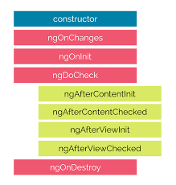

<div dir="rtl" align="right">


# مجموعه سوال و جواب‌های انگولار

> اگه از کتاب خوشتون اومد به گیت‌هابمون مراجعه کنین و بهمون :star: بدین. اگر هم قصد مشارکت داشتید همونجا می‌تونین شروع کنین و ما هم خیلی خوشحال می‌شیم :)

<span class="show-in-print">

> لینک گیت‌هاب ما برای مشارکت برای تولید کتاب‌ها: <a style="float:left" href="http://github.com/mariotek">https://github.com/mariotek</a>

</span>

### نحوه دانلود کتاب به فرمت‌های PDF/Epub

می‌تونین خیلی راحت نسخه آنلاین کتاب استفاده کنین یا اگه به فایل کتاب می‌خوایین دسترسی داشته باشین، از بخش ریلیزهای گیت‌هاب به فرمت‌های مختلف آخرین نسخه کتاب رو می‌تونین دریافت کنین.

<div class="a4 half"></div>

<br />
<br />
<br />


### فهرست

| ردیف | سوال |
|---- | --------- |
|1 | [فریمورک انگولار چیه؟](#فریمورک-انگولار-چیه؟)|
|2 | [فرق بین انگولار و انگولار جی اس چیه؟](#فرق-بین-انگولار-و-انگولار-جی-اس-چیه؟)|
|3 | [تایپ اسکریپت چیه؟](#تایپ-اسکریپت-چیه؟)|
|4 | [یه دیاگرام تصویری از ساختار انگولار بنویس؟](#یه-دیاگرام-تصویری-از-ساختار-انگولار-بنویس؟)|
|5 | [کامپوننت های کلیدی انگولار کدوما هستن؟](#کامپوننت-های-کلیدی-انگولار-کدوما-هستن؟)|
|6 | [directive ها چیا هستن؟](#directive-ها-چیا-هستن؟)|
|7 | [کامپوننت ها چیا هستن؟](#کامپوننت-ها-چیا-هستن؟)|
|8 | [تفاوت های بین directive و کامپوننت چیه؟](#تفاوت-های-بین-directive-و-کامپوننت-چیه؟)|
|9 | [template چیه؟](#template-چیه؟)|
|10| [ماژول چیه؟](#ماژول-چیه؟)|
|11| [lifecycle های مربوط به انگولار چیا هستن؟](#lifecycle-های-مربوط-به-انگولار-چیا-هستن؟)|
|12| [data binding چیه؟](#data-binding-چیه؟)|
|13| [metadata چیه؟](#ٖmetadata-چیه؟)|
|14| [Angular CLI چی هست؟](#Angular-CLI-چی-هست؟)|
|15| [فرق بین constructor و ngOnInit چیه؟](#فرق-بین-constructor-و-ngOnInit-چیه؟)|
|16| [service چیه؟](#service-چیه؟)|
|17| [dependency injection توی انگولار یعنی چی؟](#dependency-injection-توی-انگولار-یعنی-چی؟)|
|18| [ساختار Dependency توی انگولار چطوری چیده میشه؟](#ساختار-Dependency-توی-انگولار-چطوری-چیده-میشه؟)|
|19| [هدف از AsyncPipe چیه؟](#هدف-از-AsyncPipe-چیه؟)|
|20| [بین فایل template داخلی و خارجی کدومو باید انتخاب کرد؟](#بین-فایل-template-داخلی-و-خارجی-کدومو-باید-انتخاب-کرد؟)|
|21| [هدف از directive ngFor چی هستش؟](#هدف-از-directive-ngFor-چی-هستش؟)|
|22| [هدف از directive ngIf چیه؟](#هدف-از-directive-ngIf-چیه؟)|
|23| [اگه از تگ script توی یه templete استفاده کنیم چه اتفاقی میوفته؟](#اگه-از-تگ-script-توی-یه-templete-استفاده-کنیم-چه-اتفاقی-میوفته؟)|
|24| [منظور از interpolation چیه؟](#منظور-از-interpolation-چیه؟)|
|25| [template expression ها چیا هستن?](#template-expressions-ها-چیا-هستن?)|
|26| [template statements ها چیا هستن؟](#template-statements-ها-چیا-هستن؟)|
|27| [چطوری دیتاهایی که bind شدن رو طبقه بندی میکنی؟](#چطوری-دیتاهایی-که-bind-شدن-رو-طبقه-بندی-میکنی؟)|
|28| [pipe ها چیا هستن؟](#pipe-ها-چیا-هستن؟)|
|29| [یه pipe منظور از پارامتردار شده چیه؟](#یه-pipe-منظور-از-پارامتردار-شده-چیه؟)|
|30| [چطوری زنجیره ای از pipe ها میسازی؟](#چطوری-زنجیره-ای-از-pipe-ها-میسازی؟)|
|31| [منظور از pipe سفارشی شده چیه؟](#منظور-از-pipe-سفارشی-شده-چیه؟)|
|32| [یه مثال از pipe سفارشی شده بزن؟](#یه-مثال-از-pipe-سفارشی-شده-بزن؟)|
|33| [فرق بین pure pipe و impure pipe چیه؟](#فرق-بین-pure-pipe-و-impure-pipe-چیه؟)|
|34| [منظور از botstrapping module چیه؟](#منظور-از-botstrapping-module-چیه؟)|
|35| [observable ها چیا هستن؟](#observable-ها-چیا-هستن؟)|
|36| [HttpClient چیه و مزیت های اون چیا هستن؟](#HttpClient-چیه-و-مزیت-های-اون-چیا-هستن؟)|
|37| [چطوری از HttpClient استفاده کنیم؟](#چطوری-از-HttpClient-استفاده-کنیم؟)|
|38| [چطوری response ها رو به صورت کامل بخونیم؟](#چطوری-response-ها-رو-به-صورت-کامل-بخونیم؟)|
|39| [چطوری عمل error handling رو انجام میدی؟](#چطوری-عمل-error-handling-رو-انجام-میدی؟)|
|40| [RxJS چیه؟](#RxJS-چیه؟)|
|41| [subscribing چیه؟](#subscribing-چیه؟)|
|42| [منطور از observable یه چیه؟](#منطور-از-observable-یه-چیه؟)|
|43| [observer جیه؟](#observer-جیه؟)|
|44| [تفاوت بین pronise و یه oberservable چیه؟](#تفاوت-بین-pronise-و-یه-oberservable-چیه؟)|
|45| [multicasting چیه؟](#multicasting-چیه؟)|
|46| [جطوری روی observevable ها error handling انجام میدی؟](#جطوری-روی-observevable-ها-error-handling-انجام-میدی؟)|
|47| [مختصر شده متصد subscribe چیه؟](#مختصر-شده-متصد-subscribe-چیه؟)|
|48| [توابع مفیدی روی RxJS وجود دارن چیا هستن؟](#توابع-مفیدی-روی-RxJS-وجود-دارن-چیا-هستن؟)|
|49| [توابع سازنده observable چیا هستن؟](#توابع-سازنده-observable-چیا-هستن؟)|
|50| [چیه اتفاقی میوفته اگه ما تابع handler برای observer تعریف نکنیم؟](#چیه-اتفاقی-میوفته-اگه-ما-تابع-handler-برای-observer-تعریف-نکنیم؟)|
|51| [element های انگولار چیا هستن؟](#element-های-انگولار-چیا-هستن؟)|
|52| [پشتیبانی های مرورگر ها برای element های انگولار چیا هستن؟](#پشتیبانی-های-مرورگر-ها-برای-element-های-انگولار-چیا-هستن؟)|
|53| [element های کاستوم شده چیا هستن؟](#element-های-کاستوم-شده-چیا-هستن؟)|
|54| [bootstrap کردن element های کاستوم شده لازمه؟](#bootstrap-کردن-element-های-کاستوم-شده-لازمه؟)|
|55| [ساختار داخلی و نجوه کارکردن element های کاستوم شده چطوریه؟](#ساختار-داخلی-و-نجوه-کارکردن-element-های-کاستوم-شده-چطوریه؟)|
|56| [چطوری کامپوننت عا رو به custom element تبدیل کنیم؟](#چطوری-کامپوننت-عا-رو-به-custom-element-تبدیل-کنیم؟)|
|57| [قوانین مپ کردن بین کامپوننت های انگولار و element های کاستوم چیه؟](#قوانین-مپ-کردن-بین-کامپوننت-های-انگولار-و-element-های-کاستوم-چیه؟)|
|58| [چطوری تایپ ها رو برای یه element کاستوم تعریف میکنی؟](#چطوری-تایپ-ها-رو-برای-یه-element-کاستوم-تعریف-میکنی؟)|
|59| [کامپوننت های داینامیک چیا هستن؟](#کامپوننت-های-داینامیک-چیا-هستن؟)|
|60| [انواع مختلف directive ها کدوما هستن؟](#انواع-مختلف-directive-ها-کدوما-هستن؟)|
|61| [چطوری با استفاده از CLI یه directive درست میکنی؟](#چطوری-با-استفاده-از-CLI-یه-directive-درست-میکنی؟)|
|62| [یه مثال از استفاده directive با اتریبیوت بزن؟](#یه-مثال-از-استفاده-directive-با-اتریبیوت-بزن؟)|
|63| [Angular Router چیه؟](#Angular-Router-چیه؟)|
|64| [هدف از base href tag چیه؟](#هدف-از-base-href-tag-چیه؟)|
|65| [import های مربوط به router چیه؟](#import-های-مربوط-به-router-چیه؟)|
|66| [router outlet چیه؟](#router-outlet-چیه؟)|
|67| [router link ها چیا هستن؟](#router-link-ها-چیا-هستن؟)|
|68| [منظور از router link های active جیه؟](#منظور-از-router-link-های-active-جیه؟)|
|69| [منظور از router state چیه؟](#منظور-از-router-state-چیه؟)|
|70| [event های مربوط به router چیا هستن؟](#event-های-مربوط-به-router-چیا-هستن؟)|
|71| [منظور از activated route چیه؟](#منظور-از-activated-route-چیه؟)|
|72| [چطوری router های پروژه ات رو تعریف میکنی؟](#چطوری-router-های-پروژه-ات-رو-تعریف-میکنی؟)|
|73| [هدف از Wildcard route چیه؟](#هدف-از-Wildcard-route-چیه؟)|
|74| [ما همیشه به routing module نیاز داریم؟](#ما-همیشه-به-routing-module-نیاز-داریم؟)|
|75| [Angular Universal چیه؟](#Angular-Universal-چیه؟)|
|76| [انگولار به چن روش کامپایل میشه؟](#انگولار-به-چن-روش-کامپایل-میشه؟)|
|77| [JIT چیه؟](#JIT-چیه؟)|
|78| [AOT چیه؟](#AOT-چیه؟)|
|79| [چرا ما به پروسه کامپایل نیاز داریم؟](#چرا-ما-به-پروسه-کامپایل-نیاز-داریم؟)|
|80| [مزایای استفاده از AOT چیه؟](#مزایای-استفاده-از-AOT-چیه؟)|
|81| [روش های کنترل کامپایل شدن با AOT چیا هستن؟](#روش-های-کنترل-کامپایل-شدن-با-AOT-چیا-هستن؟)|
|82| [محدودیت هایی که روی metadata وجود داره چیا هستن؟](#محدودیت-هایی-که-روی-metadata-وجود-داره-چیا-هستن؟)|
|83| [فاز های کامپایل با استفاده از AOT چیا هستن؟](#فاز-های-کامپایل-با-استفاده-از-AOT-چیا-هستن؟)|
|84| [ ما میتونیم از arrow function ها توی AOT اسنتفاده کنیم؟](#-ما-میتونیم-از-arrow-function-ها-توی-AOT-اسنتفاده-کنیم؟)|
|85| [هدف از استفاده از فایل های metadata json چیه؟](#هدف-از-استفاده-از-فایل-های-metadata-json-چیه؟)|
|86| [ توی حالت AOTمیتونیم از همه مزایای جاوااسکریپت برای سینتکس ها استفاده کینیم؟](#-توی-حالت-AOTمیتونیم-از-همه-مزایای-جاوااسکریپت-برای-سینتکس-ها-استفاده-کینیم؟)|
|87| [folding چیه؟](#folding-چیه؟)|
|88| [macros چیه؟](#macros-چیه؟)|
|89| [چن تا مثال از ارور های مربوط به metatdata بزن؟](#چن-تا-مثال-از-ارور-های-مربوط-به-metatdata-بزن؟)|
|90| [منظور از metadata rewriting چیه؟](#منظور-از-metadata-rewriting-چیه؟)|
|91| [توی انگولار چطوری وراثت کانفیگ رو انجام میدی؟](#توی-انگولار-چطوری-وراثت-کانفیگ-رو-انجام-میدی؟)|
|92| [چطوری آپشن های کامپایلرانگولار رو تنظیم میکنی؟](#چطوری-آپشن-های-کامپایلرانگولار-رو-تنظیم-میکنی؟)|
|93| [چطوری اعتبارسنجی مربوط به قسمت های بایند شده رو فعال کنیم؟](#چطوری-اعتبارسنجی-مربوط-به-قسمت-های-بایند-شده-رو-فعال-کنیم؟)|
|94| [هدف از any type توی cast function چیه؟](#هدف-از-any-type-توی-cast-function-چیه؟)|
|95| [non null تایپ ](#1)|
|96| [منظور از type narrowing چیه؟](#منظور-از-type-narrowing-چیه؟)|
|97| [چطوری dependency های مختلف توی انگولار تعریف میکنی؟](#چطوری-dependency-های-مختلف-توی-انگولار-تعریف-میکنی؟)|
|98| [zone توی انگولار چیه؟](#zone-توی-انگولار-چیه؟)|
|99| [هدف از ماژول مشترک توی انگولار چیه؟](#هدف-از-ماژول-مشترک-توی-انگولار-چیه؟)|
|100| [codelyzer چیه؟](#codelyzer-چیه؟)|
|101| [angular animation چیه؟](#angular-animation-چیه؟)|
|102| [مراحل استفاده از ماژول های animation چیه؟](#مراحل-استفاده-از-ماژول-های-animation-چیه؟)|
|103| [تابع state چیه؟](#تابع-state-چیه؟)|
|104| [هدف از تابع style چیه؟](#هدف-از-تابع-style-چیه؟)|
|105| [هدف از تابع animate چیه؟](#هدف-از-تابع-animate-چیه؟)|
|106| [تابع transition چیه؟](#تابع-transition-چیه؟)|
|107| [چطوری کد های dynamاسکریپت های رو توی کدمون وارد کنیم؟](#چطوری-کد-های-dynamاسکریپت-های-رو-توی-کدمون-وارد-کنیم؟)|
|108| [service worker چیه و نقشش توی انگولار چیه؟](#service-worker-چیه-و-نقشش-توی-انگولار-چیه؟)|
|109| [اهدافی که ما با استفاده از service worker دنبال اونا هستیم چیان؟](#اهدافی-که-ما-با-استفاده-از-service-worker-دنبال-اونا-هستیم-چیان؟)|
|110| [تفاوت های بین angularJs و Angular درمورد dependency injection چیا هستن؟](#تفاوت-های-بین-angularJs-و-Angular-درمورد-dependency-injection-چیا-هستن؟)|
|111| [Angular Ivy چیه؟](#Angular-Ivy-چیه؟)|
|112| [قابلیت هایی که توی حالت ivy وجود دارن چیا هستن؟](#قابلیت-هایی-که-توی-حالت-ivy-وجود-دارن-چیا-هستن؟)|
|113| [میتونیم از مدل کامپایل AOT توی حالت Ivy استفاده کنیم؟](#میتونیم-از-مدل-کامپایل-AOT-توی-حالت-Ivy-استفاده-کنیم؟)|
|114| [سرویس زبان انگولار چیه؟](#سرویس-زبان-انگولار-چیه؟)|
|115| [چطوری از سرویس زبان انگولار توی پروژمون استفاده کنیم؟](#چطوری-از-سرویس-زبان-انگولار-توی-پروژمون-استفاده-کنیم؟)|
|116| [ادیتوری که سرویس زبان انگولار رو ساپورت گنن وجود داره؟](#ادیتوری-که-سرویس-زبان-انگولار-رو-ساپورت-گنن-وجود-داره؟)|
|117| [قابلیت هایی که توی سرویس زبان انگولار وجود دارن چیا هستن؟](#قابلیت-هایی-که-توی-سرویس-زبان-انگولار-وجود-دارن-چیا-هستن؟)|
|118| [چطوری web worker توی پروژه ات اضافه می کنی؟](#چطوری--worker-توی-پروژه-ات-اضافه-می-کنی؟)|
|119| [محدودیت ها موقع استفاده کردن از Web worker ها چیا هستن؟](#محدودیت-ها-موقع-استفاده-کردن-از-Web-worker-ها-چیا-هستن؟)|
|120| [Angular CLI Builder چیه؟](#Angular-CLI-Builder-چیه؟)|
|121| [منظور از Builder چیه؟](#منظور-از-Builder-چیه؟)|
|122| [چطوری یه builder](#1)|
|123| [چطوری توی انگولار یه app shell ایجاد میکنی؟](#چطوری-توی-انگولار-یه-app-shell-ایجاد-میکنی؟)|
|124| [استانداردcase type ها برای استفاده توی انگولار چیا هستن؟](#استانداردcase-type-ها-برای-استفاده-توی-انگولار-چیا-هستن؟)|
|125| [class decorator ها توی انگولار چیا هستن؟](#class-decorator-ها-توی-انگولار-چیا-هستن؟)|
|126| [class feild decorator چیه؟](#class-feild-decorator-چیه؟)|
|127| [declarable توی انگولار چیه ؟](#declarable-توی-انگولار-چیه-؟)|
|128| [محدودیت هایی که توی declarble class ها داریم چیا هستن؟](#محدودیت-هایی-که-توی-declarble-class-ها-داریم-چیا-هستن؟)|
|129| [DI token چیه؟](#DI-token-چیه؟)|
|130| [Angular DSL چیه؟](#Angular-DSL-چیه؟)|
|131| [rxjs Subject چیه؟](#rxjs-Subject-چیه؟)|
|132| [Bazel tool چیه؟](#Bazel-tool-چیه؟)|
|133| [مزایای استفاده از ابزار Bazel چیه؟](#مزایای-استفاده-از-ابزار-Bazel-چیه؟)|
|134| [چطوری از ابزار Bazel توی CLI انگولار استفاده میکنی؟](#چطوری-از-ابزار-Bazel-توی-CLI-انگولار-استفاده-میکنی؟)|
|135| [چطوری ابزار Bazel رو مستقیما اجرا میکنی؟](#چطوری-ابزار-Bazel-رو-مستقیما-اجرا-میکنی؟)|
|136| [platform توی انگولار چیه؟](#platform-توی-انگولار-چیه؟)|
|137| [اگه یه ماژول رو دوبار import کنیم چه اتفاقی میوفته؟](#اگه-یه-ماژول-رو-دوبار-import-کنیم-چه-اتفاقی-میوفته؟)|
|138| [چطوری یه المنت رو با استفاده از template گامپوننت انتخاب میکنی؟](#چطوری-یه-المنت-رو-با-استفاده-از-template-گامپوننت-انتخاب-میکنی؟)|
|139| [چطوری توی انگولار route رو تغییر میدی؟](#چطوری-توی-انگولار-route-رو-تغییر-میدی؟)|
|140| [چطوری headers رو برای کاربر HTTP میفرستی؟](#چطوری-headers-رو-برای-کاربر-HTTP-میفرستی؟)|
|141| [هدف از defferentail loading توی CLI چیه؟](#هدف-از-defferentail-loading-توی-CLI-چیه؟)|
|142| [انگولار از dynamic import پشتیبانی میگنه؟](#انگولار-از-dynamic-import-پشتیبانی-میگنه؟)|
|143| [منظور از lazy loading چیه؟](#منظور-از-lazy-loading-چیه؟)|
|144| [منظور از workspace API چیه؟](#منظور-از-workspace-API-چیه؟)|
|145| [چطوری ورژن انگولار رو بروزرسانی میکنی؟](#چطوری-ورژن-انگولار-رو-بروزرسانی-میکنی؟)|
|146| [Angular Material چیه؟](#Angular-Material-چیه؟)|
|147| [چطوری location service رو توی انگولار اپدیت میکنی؟](#چطوری-location-service-رو-توی-انگولار-اپدیت-میکنی؟)|
|148| [NgUpgrade چیه؟](#NgUpgrade-چیه؟)|
|149| [چطوری اپلیکیشن انگولارتو با استفاده از CLI تست میکنی؟](#چطوری-اپلیکیشن-انگولارتو-با-استفاده-از-CLI-تست-میکنی؟)|
|150| [چطوری از polyfill ها توی اپلیکیشن انگولار استفاده میکنی؟](#چطوری-از-polyfill-ها-توی-اپلیکیشن-انگولار-استفاده-میکنی؟)|
|151| [روش های گه برای فعال سازی change detection استفاده میشن چیا هستن؟](#روش های-گه-برای-فعال-سازی-change-detection-استفاده-میشن-چیا-هستن؟)|
|152| [ورژن های مختلف انگولار چیا هستن و تفاوتشون چیه؟](#ورژن-های-مختلف-انگولار-چیا-هستن-و-تفاوتشون-چیه؟)|
|153| [قوانین امنیتی که توی انگولار وجود دارن چیا هستن؟](#قوانین-امنیتی-که-توی-انگولار-وجود-دارن-چیا-هستن؟)|
|154| [چرا دیگه از فریم ورک های web tracking استفاده نمیشه؟ ](#چرا-دیگه-از-فریم-ورک-های-web-tracking-استفاده-نمیشه؟-)|
|155| [چرا دیگه از پکیج های web worker استفاده نمیشه؟](#چرا-دیگه-از-پکیج-های-web-worker-استفاده-نمیشه؟)|
|156| [چطوری ورژن CLI انگولار رو پیدا میکنی؟](#چطوری-ورژن-CLI-انگولار-رو-پیدا-میکنی؟)|
|157| [ورژن هایی که از انگولار پشتیبانی میکنن کدوما هستن؟](#ورژن-هایی-که-از-انگولار-پشتیبانی-میکنن-کدوما-هستن؟)|
|158| [schematic چیه؟](#schematic-چیه؟)|
|159| [قوانینی که توی Schematices چیا هستن؟](#قوانینی-که-توی-Schematices-چیا-هستن؟)|
|160| [Schematics CLI چیه؟](#Schematics-CLI-چیه؟)|
|161| [بهترین حالت پیاده سازی قوانین امنیتی توی انگولار چیه؟](#بهترین-حالت-پیاده-سازی-قوانین-امنیتی-توی-انگولار-چیه؟)|
|162| [توی انگولار چطوری از XSS Atack جلوگیری میکنی؟](#توی-انگولار-چطوری-از-XSS-Atack-جلوگیری-میکنی؟)|
|163| [قانون مربوط به جلوگیری از حمله XSS توی کامپایلر انگولار چیه؟](#قانون-مربوط-به-جلوگیری-از-حمله-XSS-توی-کامپایلر-انگولار-چیه؟)|
|164| [موضوع های امنیتی مختلف که توی انگولار  وجود دارن چیا هستن؟](#موضوع-های-امنیتی-مختلف-که-توی-انگولار--وجود-دارن-چیا-هستن؟)|
|165| [Sanitization چیه و انگولار ازش پشتیبانی میکنه؟](#Sanitization-چیه-و-انگولار-ازش-پشتیبانی-میکنه؟)|
|166| [هدف از innerHTML چیه؟](#هدف-از-innerHTML-چیه؟)|
|167| [تفاوت بین interpolated content و innerHTML چیه؟](#تفاوت-بین-interpolated-content-و-innerHTML-چیه؟)|
|168| [چطوری از sanitizaltion خودکار جلوگیری میکنی؟](#چطوری-از-sanitizaltion-خودکار-جلوگیری-میکنی؟)|
|169| [استفاده کردن مستقیم از DOM API مشکل امنیتی داره یا نه؟](#استفاده-کردن-مستقیم-از-DOM-API-مشکل-امنیتی-داره-یا-نه؟)|
|170| [DOM sanitizer چیه؟](#DOM-sanitizer-چیه؟)|
|171| [چطوری سمت سرور از حمله XSS توی انگولار جلوگیری میکنی؟](#چطوری-سمت-سرور-از-حمله-XSS-توی-انگولار-جلوگیری-میکنی؟)|
|172| [انگولار از حمله های سطح http جلوگیری میکنه؟](#انگولار-از-حمله-های-سطح-http-جلوگیری-میکنه؟)|
|173| [Http Interceptors ها چیا هستن؟](#Http-Interceptors-ها-چیا-هستن؟)|
|174| [کاربرد های مربوط به HTTP interceptor ها چیا هستن؟](#کاربرد-های-مربوط-به-HTTP-interceptor-ها-چیا-هستن؟)|
|175| [داشتن interceptor های چن تایی توی انگولار پشتیبانی میشه؟](#داشتن-interceptor-های-چن-تایی-توی-انگولار-پشتیبانی-میشه؟)|
|176| [چطوری میتونم از interceptor برای کل پروژه استفاده کنم؟](#چطوری-میتونم-از-interceptor-برای-کل-پروژه-استفاده-کنم؟)|
|177| [چطوری انگولار internationalization رو انجام میده؟](#چطوری-انگولار-internationalization-رو-انجام-میده؟)|
|178| [چطوری به صورت دستی دیتای لوکال رو ذخیره میکنی؟](#چطوری-به-صورت-دستی-دیتای-لوکال-رو-ذخیره-میکنی؟)|
|179| [چهار فازی که برای ترجمه انجام میشه چیا هستن؟](#چهار-فازی-که-برای-ترجمه-انجام-میشه-چیا-هستن؟)|
|180| [هدف از اتربیوت i18n چیه ؟](#هدف-از-اتربیوت-i18n-چیه-؟)|
|181| [هدف از custom id چیه؟](#هدف-از-custom-id-چیه؟)|
|182| [اگه یه custom id, unique نباشه چه اتفاقی میوفته؟](#اگه-یه-custom-id,-unique-نباشه-چه-اتفاقی-میوفته؟)|
|183| [میتونم یه متن رو بدون ساخت المنت ترجمه کنم؟](#میتونم-یه-متن-رو-بدون-ساخت-المنت-ترجمه-کنم؟)|
|184| [چطوری میتونم اتربیوت ها رو ترجمه کنم؟](#چطوری-میتونم-اتربیوت-ها-رو-ترجمه-کنم؟)|
|185| [دسته بندی های pluralization رو لیست کن؟](#دسته-بندی-های-pluralization-رو-لیست-کن؟)|
|186| [عبارت برای انتخاب ICU چیه؟](#عبارت-برای-انتخاب-ICU-چیه؟)|
|187| [چطوری ترجمه های ناقص رو گزارش میکنی؟](#چطوری-ترجمه-های-ناقص-رو-گزارش-میکنی؟)|
|188| [چطوری برای مناطق مختلف build رو کانفیگ میکنی؟](#1)|
|189| [منظور از کتابخونه انگولار چیه؟](#1)|
|190| [کامپایلر AOT چیه؟](#1)|
|191| [چطوری یه المنت رو از توی ساختار کامپوننت انتخاب میکنی؟](#1)|
|192| [TestBed چیه؟](#1)|
|193| [protractor چیه؟](#1)|
|194| [منظور زا  collection چیه؟](#1)|
|195| [How do you create schematics for libraries?](#1)|
|196| [چطوری از Jquery توی انگولار استفاده میکنی؟](#1)|
|197| [What is the reason for No provider for HTTP exception?](#1)|
|198| [منظور از router state چیه؟](#1)|
|199| [چطوری میتونم از SASS توی پروژه انگولار استفاده کنم؟](#1)|
|200| [هدف از hidden property چیه؟](#1)|
|201| [فرق بین ngIf و hidden property چیه؟](#1)|
|202| [slice pipe چیه؟](#1)|
|203| [برای دابرکتیو ngFor پراپرتی index چیه؟](#برای-دابرکتیو-ngFor-پراپرتی-index-چیه؟)|
|204| [هدف از ngFor trackBy چیه؟](#1)|
|205| [هدف از دایرکتیو ngSwitch  چیه؟](#1)|
|206| [Is it possible to do aliasing for inputs and outputs?](#1)|
|207| [منظور از اپراتور امن safe navigation چیه؟](#1)|
|208| [تنظیمات خاصی برای انگولار 9 نیازه؟](#1)|
|209| [تغییرات تایپ های امن TestBed API توی انگولار 9 چیا بودن؟](#1)|
|210| [ارسال فلگ static برای ViewChild اجباریه؟](#1)|
|211| [لیست مربوط به اپراتور های template expression چیا هستن؟](#1)|
|212| [فرق بین pipe و ternary operator ها چیه؟](#1)|
|213| [منظور از entry component چیه؟](#1)|
|214| [منظور از bootstraped component چیه؟](#1)|
|215| [چطوری به صورت دستی یه app رو bootstrap میکنی؟](#1)|
|216| [لازمه که یه کامپوننت رو بوت استرپ کنیم که به یه  entry component تبدیل بشه؟](#1)|
|217| [منظور از routed entry component چیه؟](#1)|
|218| [چرا استفاده از آزایه entry coponenet همیشه اجباری نیست؟ ](#1)|
|219| [ما توی انگولار 9 به آرایه entry component نیاز داریم؟ ](#1)|
|220| [همه ی کامپوننت ها موقع build گرفتن ایحاد میشن؟](#1)|
|221| [منظور از کامپایلر انگولار چیه؟](#1)|
|222| [نقش ngModule metadata توی مراحل کامپایل چیه ؟](#1)|
|223| [انگولار چطوری کامپوننت ها رو تشخیص میده؟ با directive ها یا pipe ها؟](#1)|
|224| [یه مثال برای NgModules بزن؟](#1)|
|225| [feature module ها چیا هستن؟](#1)|
|226| [ماژول های import شده داخل CLI ساخته شده توسط feature module ها چیا هستن؟](#1)|
|227| [تفاوت های بین ngmodule و javascript module چیا هستن؟](#1)|
|228| [ارور هایی که میتونه با declaration ایجاد بشه چیا هستن؟](#1)|
|229| [مراحلی که باید طی بشه  برای اینکه declaration element استفاده کنیم چیا هستن؟](#1)|
|230| [چه اتفاقی میوفته اگه ما از browserModule داخل feature module استفاده کنیم؟](#1)|
|231| [تایپ های مربوط به feature module ها چیا هستن؟](#1)|
|232| [منظور از provider چیه؟](#1)|
|233| [نیازمندی های مروبط به provider scope چیا هستن؟](#1)|
|234| [چطوری یه ماژول رو برای provider scope اجباری میکنی؟](#1)|
|235| [چطوری یه سرویس singleton رو ایجاد میکنی؟](#1)|
|236| [روش های مختلف حذف سرویس های تکراری register شده چیه؟](#1)|
|237| [چطوری متد forRoot برای جلوگیری از duplicate شدن router instance مناسبه؟](#1)|
|238| [منظور از shared module چیه؟](#1)|
|239| [میتونیم سرویس هایی رو بر اساس ماژول به اشتراک بذاریم؟](#1)|
|240| [چطوری direction فعلی رو برای locales بدست میاری؟](#1)|
|241| [ngcc چیه؟](#1)|
|242| [کدوم class ها نباید به declaration ها اضافه بشن؟](#1)|
|243| [ngzone چیه؟](#1)|
|244| [NoopZone چیه؟](#1)|
|245| [چطوری کامپوننت های displayBlock ایجاد میکنی؟](#1)|
|246| [حالت هایی که موقع حساسیت به تغییر میتونه ایجاد بشه چیا هستن؟](#1)|
|247| [منظور از zone context چیه؟](#1)|
|248| [هوک های lifecycle مروبوط به یک zone چیا هستن؟](#1)|
|249| [چه متد هایی از ngZone برای کنترل حساسیت تغییر استفاده میشه؟](#1)|
|250| [جطوری تنظیمات مربوط به zonejs رو تغییر میدی؟](#1)|
|251| [چطوری یه انیمیشن رو trigger میکنی؟](#1)|
|252| [چطوری injector ها رو با provider ها برای لول های مختلف کانفیگ میکنی؟](#1)|
|253| [آیا استفاده از تزریق در هر کلاس service اجباریه؟](#1)|
|254| [منظور از optional dependency چیه؟](#1)|
|255| [تایپ های مربوط به injector هرمی چیا هستن؟](#1)|
|256| [reactive form ها چیا هستن؟](#1)|
|257| [dynamic form ها چیا هستن؟](#1)|
|258| [template driven form ها چیا هستن؟](#1)|
|259| [فرق بین فرم های ری اکتیو و template driven form ها چیا هستن؟](#1)|
|260| [روش هایی که برای group کردن فرم کنترل ها وجود داره چیا هستن؟](#1)|
|261| [چطوری پراپرتی های یه فرم مدل رو اپدیت میکنی؟>](#1)|
|262| [هدف از FormBuilder چیه؟](#1)|
|263| [چطوری مدل تغییرات توی فرم رو اعتبار سنجی میکنی؟](#1)|
|264| [کلاس هایی که با  ngModel تامین شدن چیا هستن؟](#1)|
|265| [چطوری یه فرم رو ریست میکنی؟](#1)|
|266| [تایپ های مربوط به validator فانکشن چیا هستن؟](#1)|
|267| [میتونی چن تا مثال از validator های build-in بزنی ؟](#1)|
|268| [چطوری پرفورمنس validator های async رو بیتشر میکنی؟](#1)|
|269| [چطوری ngfor  و ngIf برای یه المان همزمان تنظیم کنیم؟](#1)|
|270| [منظور از پراپرتی host توی css چیه؟](#1)|
|271| [چطوری route فعلی رو بدست میاری؟](#1)|
|272| [مهار تست های کامپوننت چیه؟](#1)|
|273| [مزایای inlining اتوماتیک چیه؟](#1)|
|274| [content projection چیه؟](#1)|
|275| [ng-content به چی میگن و هدف از اون چیه؟](#1)|


1. ### فریمورک انگولار چیه؟

     Angular یک پلت‌فرم فرانت‌اند اوپن سورس مبتنی بر **TypeScript** هس که ساخت برنامه‌ها تو وب/موبایل/کامپیوتر رو برامون اسونتر میکنه. از ویژگی های اصلی این فریم ورک میشه به قالب های declarative dependency injection، ابزارهای end to end و خیلی ویژگی های دیگه که برای اسونتر شدن توسعه استفاده میشه اشاره کرد.

     **[فهرست](#فهرست)**

2. ### فرق بین انگولار و انگولار جی اس چیه؟

     Angular یه فریم ورک کاملاً کامپوننت بیس هستش که تو اون یه app ساختار درختی از کامپوننت ها هستش.

     | AngularJS | Angular |
     |---- | ---------
     | بر اساس معماری MVC هستش| بر اساس Service/Controller هستش|
     | از جاوا اسکریپت برای ساخت app استفاده میکنه|برای نوشتن app، TypeScript رو معرفی کرد|
     | بر اساس مفهوم کنترلرها| یه رویکرد UI مبتنی بر کامپوونت هستش|
     | یک چارچوب سازگار با موبایل نیست| میشه برای پلتفرم تلفن همراه ازش استفاده کرد|
     | ساخت برنامه با مشکلات مربوط به سئو | ساخت برنامه با سئو مناسب|

     **[فهرست](#فهرست)**

3. ### تایپ اسکریپت چیه؟

     TypeScript یک ابر مجموعه تایپ های جاوا اسکریپت هستش که توسط مایکروسافت ساخته شده که انواع تایپ های optional، class ها، async/wait و خیلی ویژگی های دیگه رو اضافه می کنه و به جاوا اسکریپت ساده کامپایل می کنه. Angular به طور کامل تو TypeScript ساخته شده و به عنوان زبان اصلی استفاده می شه.
     ما می تونیم اونو به صورت گلوبال نصب کنیم
     
     <span dir="ltr" align="left">

     ```cmd
     npm install -g typescript
     ```
     
     </span>

     بیاین یه مثال از نحوه استفاده از تایپ اسکریپت ببینیم
     
     <span dir="ltr" align="left">

     ```typescript
     function greeter(person: string) {
          return "Hello, " + person;
     }

     let user = "Sudheer";

     document.body.innerHTML = greeter(user);
     ```
     
     </span>

     متد greeter فقط تایپ string رو به عنوان آرگومان اجازه میده.

     **[فهرست](#فهرست)**

4. ### یه دیاگرام تصویری از ساختار انگولار بنویس؟

     بلوک های ساختمان اصلی یک برنامه Angular رو میتونیم توی دیاگرام زیر ببینیم
     

     **[فهرست](#فهرست)**

5. ### کامپوننت های کلیدی انگولار کدوما هستن؟

     1. **Component:** اینها بلوک های ساخت اصلی برنامه های انگولار برای کنترل نماهای HTML هستش.
     2. **Modules:** یک ماژول انگولار مجموعه‌ای از بلوک‌های ساخت پایه انگولار مثل کامپوننت، directive ها service ها و غیره هستش. یک برنامه کاربردی به قطعات منطقی تقسیم میشه و هر قطعه کد به عنوان "ماژول" ازش استفاده میشه که یه وظیفه رو انجام میده.
     3. **Templates:** این نماهای یک برنامه Angular رو نشون میده.
     4. **Services:** برای ایجاد مؤلفه هایی استفاده می شه که می تونن تو کل برنامه به اشتراک گذاشته شن.
     5. **Metadata:** از این مورد می تونیم برای اضافه کردن داده های بیشتر به یک کلاس Angular استفاده کنیم.

     **[فهرست](#فهرست)**

6. ### directive ها چیا هستن؟

     directive ها رفتاری رو به یه کامپوننت DOM موجود یا یه المنت موجود Dom اضافه می کنن.
     
     <span dir="ltr" align="left">

     ```typescript
     import { Directive, ElementRef, Input } from '@angular/core';

     @Directive({ selector: '[myHighlight]' })
     export class HighlightDirective {
          constructor(el: ElementRef) {
               el.nativeElement.style.backgroundColor = 'yellow';
          }
     }
     ```
     
     </span>

     این directive رفتار عنصر HTML رو با پس‌زمینه زرد رو اینطوری پیاده سازی میکنه
     
     <span dir="ltr" align="left">

     ```html
     <p myHighlight>Highlight me!</p>
     ```
     
     </span>

     **[فهرست](#فهرست)**

7. ### کامپوننت ها چیا هستن؟

     کامپوننت ها اساسی ترین بلوک سازنده رابط کاربری یک برنامه Angular هستن که درختی از اجزای Angular رو تشکیل هستن. این مؤلفه ها زیر مجموعه directive ها هست. برخلاف دستورات، کامپوننت‌ها همیشه دارای یک الگون و تنها یک جزء رو میشه به ازای هر عنصر تو قالب نمونه‌سازی کرد.
     یک مثال ساده از کامپوننت Angular رو ببینیم
     
     <span dir="ltr" align="left">

     ```typescript
     import { Component } from '@angular/core';

     @Component ({
          selector: 'my-app',
          template: ` <div>
          <h1>{{title}}</h1>
          <div>Learn Angular6 with examples</div>
          </div> `,
     })

     export class AppComponent {
          title: string = 'Welcome to Angular world';
     }
     ```
     
     </span>

     **[فهرست](#فهرست)**

8. ### تفاوت های بین directive و کامپوننت چیه؟

     | Component | Directive |
     |---- | ---------
     | برای ثبت یه کامپوننت از meta-data @Component استفاده می کنیم  | برای ثبت directive ها از meta-data @Directive استفاده می‌کنیم |
     | کامپوننت ها معمولا برای ایجاد ویجت های UI استفاده می شن|directive ها برای افزودن رفتار به یک عنصر DOM موجود استفاده می شن |
     | کامپوننت برای تقسیم برنامه به اجزای کوچکتر استفاده می شه | دستورالعمل برای طراحی اجزای قابل استفاده مجدد استفاده می شه|
     | فقط یک جزء می تونه تو هر عنصر DOM وجود داشته باشه | بسیاری از directive ها رو میشه برای هر عنصر DOM استفاده کرد |
     | @View decorator یا templateurl/template اجباریه | دستورالعمل از View استفاده نمیکنه|

     **[فهرست](#فهرست)**

9. ### template چیه؟

     یک template یک نمای HTML هس که توی اون می تونیم داده ها رو با اتصال کنترل ها به ویژگی های یک جزء Angular نشون بدیم. می تونیم الگوی جزء خودمون رو تو یکی از دو مکان ذخیره کنیم. می تونیم با استفاده از ویژگی template اون رو به صورت درون خطی تعریف کینم یا می تونیم قالب رو توی یک فایل HTML جداگانه تعریف کنیم و با استفاده از ویژگی templateUrl@Component decorator به اون تو ابرداده کامپوننت پیوند بدیم.

     **Using inline template with template syntax,**

     
     <span dir="ltr" align="left">

     ```typescript
     import { Component } from '@angular/core';

     @Component ({
          selector: 'my-app',
          template: '
          <div>
               <h1>{{title}}</h1>
               <div>Learn Angular</div>
          </div>
          '
     })

     export class AppComponent {
          title: string = 'Hello World';
     }
     ```
     
     </span>

     **Using separate template file such as app.component.html**

     
     <span dir="ltr" align="left">

     ```typescript
     import { Component } from '@angular/core';

     @Component ({
          selector: 'my-app',
          templateUrl: 'app/app.component.html'
     })

     export class AppComponent {
          title: string = 'Hello World';
     }
     ```
     
     </span>

     **[فهرست](#فهرست)**

10. ### ماژول چیه؟

     ماژول ها مرزهای منطقی تو برنامه هستن و برنامه به ماژول های جداگانه تقسیم می شن که عملکرد برنامه رو از هم جدا کنن.
     بیاین مثالی از **app.module.ts** ماژول core رو که با دکوراتور **@NgModule** بزنیم.

     
     <span dir="ltr" align="left">

     ```typescript
     import { NgModule }      from '@angular/core';
     import { BrowserModule } from '@angular/platform-browser';
     import { AppComponent }  from './app.component';

     @NgModule ({
          imports:      [ BrowserModule ],
          declarations: [ AppComponent ],
          bootstrap:    [ AppComponent ],
          providers: []
     })
     export class AppModule { }
     ```
     
     </span>

     دکوراتور NgModule پنج گزینه مهم ( میان همه) داره
     1. گزینه imports برای وارد کردن ماژول های وابسته دیگر استفاده می شه. BrowserModule به طور پیش فرض برای هر برنامه انگولار مبتنی بر وب لازمه
     2. گزینه declarations برای تعریف اجزا تو ماژول مربوطه استفاده می شه
     3. گزینه bootstrap به Angular می گه که کدوم کامپوننت رو تو برنامه بوت استرپ کنه
     4. گزینه providers برای پیکربندی مجموعه ای از اشیاء تزریقی موجود تو انژکتور این ماژول استفاده می شن.
     5. گزینه enterComponents مجموعه ای از اجزاییه که به صورت پویا تو view بارگذاری می شن.

     **[فهرست](#فهرست)**

11. ### lifecycle های مربوط به انگولار چیا هستن؟

     Angular مجموعه کاملی از فرآیندها رو طی می کنه یا از زمان شروع تا پایان برنامه یک lifecycle دارد.
     نمایش lifecycle رو متونیم تو شکل زیر ببینیم:

     

     1. **ngOnChanges:** هنگامی که مقدار یک ویژگی داده محدود تغییر می کنه این روش فراخوانی می شه.
     2. **ngOnInit:** هر زمان که مقداردهی اولیه دستور/کامپوننت پس از نمایش Angular برای اولین بار خصوصیات داده محدود اتفاق بیفتد، فراخوانی می شه.
     3. **ngDoCheck:** این برای تشخیص و اعمال تغییراتی است که Angular به تنهایی قادر به تشخیص آنها نیست یا نخواهد بود.
     4. **ngAfterContentInit:** پس از اینکه Angular محتوای خارجی را در نمای کامپوننت پروژه میده، در پاسخ به این امر فراخوانی می شه.
     5. **ngAfterContentChecked:** این در پاسخ پس از بررسی Angular محتوای پیش بینی شده در کامپوننت فراخوانی می شه.
     6. **ngAfterViewInit:** پس از اینکه Angular نماهای کامپوننت و نماهای فرزند را مقدار دهی اولیه کرد، در پاسخ فراخوانی می شه.
     7. **ngAfterViewChecked:** این در پاسخ پس از بررسی Angular نماهای کامپوننت و نماهای فرزند فراخوانی می شه.
     8. **ngOnDestroy:** این مرحله پاکسازی درست قبل از اینکه Angular دستور/کامپوننت را از بین ببرد است.

     **[فهرست](#فهرست)**

12. ### data binding چیه؟

     Data binding یک مفهوم اصلی در Angular است و امکان تعریف ارتباط بین یک مؤلفه و DOM رو فراهم میکنه و تعریف برنامه های تعاملی رو بدون نگرانی در مورد فشار دادن و کشیدن داده ها بسیار آسان میکنه. چهار شکل اتصال داده وجود دارد (به 3 دسته تقسیم می شه) که در نحوه جریان داده ها متفاوت است.
    
     1. **From the Component to the DOM:**

     **Interpolation:** {{ value }}: مقدار یک ویژگی رو از جزء اضافه می کنه
    
     
     <span dir="ltr" align="left">

     ```html
     <li>Name: {{ user.name }}</li>
     <li>Address: {{ user.address }}</li>
     ```
     
     </span>

     **Property binding:** [property]=”value”: مقدار از کامپوننت به ویژگی مشخص شده یا ویژگی ساده HTML منتقل می شه.
    
     
     <span dir="ltr" align="left">

     ```html
     <input type="email" [value]="user.email">
     ```
     
     </span>

     2. **From the DOM to the Component:**
     **Event binding: (event)=”function”:**هنگامی که یک رویداد DOM خاص اتفاق می افتد (مثلاً: کلیک، تغییر، کلید آپلود)، متد مشخص شده در مؤلفه رو فراخوانی میکنه.
    
     
     <span dir="ltr" align="left">

     ```html
     <button (click)="logout()"></button>
     ```
     
     </span>

     3. **Two-way binding:**
     **Two-way data binding:** [(ngModel)]=”value”: اتصال دو طرفه داده اجازه می دهد تا جریان داده ها از هر دو طرف انجام شه. برای مثال، در قطعه کد زیر، هر دو ورودی DOM ایمیل و ویژگی ایمیل جزء همگام هستن.
    
     
     <span dir="ltr" align="left">

     ```html
     <input type="email" [(ngModel)]="user.email">
     ```
     
     </span>

     **[فهرست](#فهرست)**

13. ### metadata چیه؟

     metadata برای تزئین یک کلاس استفاده میشه تا بتونه رفتار مورد انتظار کلاس را پیکربندی کنه. metadata توسط دکوراتورها نمایش داده می شه

     1. **Class decorators**, برای مثال، @Component و @NgModule
    
     
     <span dir="ltr" align="left">

     ```typescript
     import { NgModule, Component } from '@angular/core';

     @Component({
          selector: 'my-component',
          template: '<div>Class decorator</div>',
     })

     export class MyComponent {
          constructor() {
               console.log('Hey I am a component!');
          }
     }

     @NgModule({
          imports: [],
          declarations: [],
     })
     export class MyModule {
          constructor() {
               console.log('Hey I am a module!');
          }
     }
     ```
     
     </span>

     2. **Property decorators** برای ویژگی های داخل کلاس ها استفاده می شه برای مثال. @import و export
     
     <span dir="ltr" align="left">

     ```typescript
     import { Component, Input } from '@angular/core';

     @Component({
          selector: 'my-component',
          template: '<div>Property decorator</div>'
     })

     export class MyComponent {
          @Input()
          title: string;
     }
     ```
     
     </span>
     
     3. **Method decorators** برای متدهای داخل کلاس ها استفاده می شه برای مثال. @HostListener
     
     <span dir="ltr" align="left">

     ```typescript
     import { Component, HostListener } from '@angular/core';

     @Component({
          selector: 'my-component',
          template: '<div>Method decorator</div>'
     })
     export class MyComponent {
          @HostListener('click', ['$event'])
          onHostClick(event: Event) {
               // clicked, `event` available
          }
     }
     ```
     
     </span>
     
     4. **Parameter decorators** برای پارامترهای داخل سازنده کلاس استفاده می شه برای مثال. @Inject، اختیاری
     
     <span dir="ltr" align="left">

     ```typescript
     import { Component, Inject } from '@angular/core';
     import { MyService } from './my-service';

     @Component({
          selector: 'my-component',
          template: '<div>Parameter decorator</div>'
     })
     export class MyComponent {
          constructor(@Inject(MyService) myService) {
               console.log(myService); // MyService
          }
     }
     ```

     </span>

     **[فهرست](#فهرست)**

14. ### Angular CLI چی هست؟

     Angular CLI (**Command Line Interface**) یک رابط خط فرمان برای ساخت چارچوب مشخص و ساخت برنامه های انگولار با استفاده از ماژول های استایل nodejs (commonJs) است.
     شما باید با استفاده از دستور زیر npm نصب کنید،

     <span dir="ltr" align="left">

     ```bash
     npm install @angular/cli@latest
     ```

     </span>

     لیست زیر لیستی از چند دستور که هنگام ایجاد پروژه های انگولار ای به کار میان آورده شده

     1. **ساخت یه پروژه:** ng new <project-name>

     2. **ساخت Component ها, Directive ها و Service ها:** ng generate/g <feature-name>
        انواع مختلف دستورات
         * ng generate class my-new-class: یک کلاس به برنامه خودتون اضافه کنین
         * ng تولید کامپوننت my-new-component: یک کامپوننت به برنامه خودتون اضافه کنین
         * ng generate directive my-new-directive: یک directive به برنامه خودتون اضافه کنین
         * ng generate enum my-new-enum: یک enum به برنامه خودتون اضافه کنین
         * ng generate module my-new-module: یک ماژول به برنامه خودتون اضافه کنین
         * تولید لوله my-new-pipe: یک pipe به برنامه خودتون اضافه کنین
         * ng generate service my-new-service: یک service به برنامه خودتون اضافه کنین

     3. **برای اجرای پروژه:** ng serve

     **[فهرست](#فهرست)**

15. ### فرق بین constructor و ngOnInit چیه؟

     کلاس های TypeScript دارای یک روش پیش فرض به نام constructor هستش که معمولاً برای هدف اولیه استفاده می شه. در حالی که روش ngOnInit مختص Angular است، به ویژه برای تعریف اتصالات Angular استفاده می شه. حتی اگه constructor ابتدا فراخوانی می‌شه، ترجیح داده می‌شه همه اتصالات Angular خود را به متد ngOnInit منتقل کنین.
     برای استفاده از ngOnInit، باید رابط OnInit را به صورت زیر پیاده سازی میشه.
     
     <span dir="ltr" align="left">

     ```typescript
     export class App implements OnInit{
          constructor(){
          //called first time before the ngOnInit()
          }

          ngOnInit(){
          //called after the constructor and called  after the first ngOnChanges()
          }
     }
     ```

     </span>

     **[فهرست](#فهرست)**

16. ### service چیه؟

     یه service زمانی استفاده می شه که یک عملکرد مشترک باید به ماژول های مختلف انجام شه. سرویس‌ها به شما اجازه میده تا نگرانی‌های مربوط به برنامه شما را بیشتر از هم جدا و ساختار ماژولاریت بهتری داشته باشین، چون به شما امکان میده عملکردهای مشترک رو از اجزا خارج کنین.

     بیاین یه repoService ایجاد کنیم که می تونه بین کامپوننت ها استفاده شه
     
     <span dir="ltr" align="left">

     ```typescript
     import { Injectable } from '@angular/core';
     import { Http } from '@angular/http';

     @Injectable({ // The Injectable decorator is required for dependency injection to work
          // providedIn option registers the service with a specific NgModule
          providedIn: 'root',  // This declares the service with the root app (AppModule)
     })
     export class RepoService{
          constructor(private http: Http){
          }

          fetchAll(){
          return this.http.get('https://api.github.com/repositories');
          }
     }
     ```
     
     </span>

     سرویس بالا از سرویس Http به عنوان یک وابستگی استفاده می کنه.

     **[فهرست](#فهرست)**

17. ### dependency injection توی انگولار یعنی چی؟

     dependency injection(DI)، یک الگوی طراحی برنامه مهمیه که تو اون یه کلاس به جای ایجاد dependency از منابع خارجی درخواست کنه. Angular با چارچوب dependency injection خود برای حل dependency ها (سرویس ها یا اشیایی که یک کلاس برای انجام عملکرد خود به آن نیاز داره) ارائه می شه. بنابراین می تونین service هاتون رو تو کل برنامه به سرویس های دیگر وابسته کنین.

     **[فهرست](#فهرست)**

18. ### ساختار Dependency توی انگولار چطوری چیده میشه؟

     **[فهرست](#فهرست)**

19. ### هدف از AsyncPipe چیه؟

     AsyncPipe مشترک یک قابل مشاهده یا قول می شه و آخرین مقداری رو که منتشر کرده برمی گردونه. هنگامی که یه مقدار جدید منتشر می شه، pipe مؤلفه ای رو که باید بررسی شه برای تغییرات علامت گذاری می کنه.

     بیاین یک زمان قابل مشاهده را در نظر بگیریم که به طور مداوم نما را برای هر 2 ثانیه با زمان فعلی به روز می کنه.

     
     <span dir="ltr" align="left">

     ```typescript
     @Component({
          selector: 'async-observable-pipe',
          template: `<div><code>observable|async</code>:
               Time: {{ time | async }}</div>`
     })
     export class AsyncObservablePipeComponent {
          time = new Observable(observer =>
          setInterval(() => observer.next(new Date().toString()), 2000)
          );
     }
     ```
     
     </span>

     **[فهرست](#فهرست)**

20. ### بین فایل template داخلی و خارجی کدومو باید انتخاب کرد؟
     
     می تونین الگوی کامپوننت خودتون رو تو یکی از دو مکان ذخیره کنین. می تونین اون رو به صورت درون خطی با استفاده از ویژگی **template** تعریف کنین، یا می تونین الگو رو در یک فایل HTML جداگانه تعریف کنین و با استفاده از ویژگی **templateUrl** در decorator **@Component** به اون در ابرداده کامپوننت پیوند بدین.

     انتخاب بین HTML درون خطی و مجزا یک موضوع سلیقه، شرایط و خط مشی سازمان است. اما معمولاً از قالب درون خطی برای بخش کوچکی از کد و از فایل قالب خارجی برای نمایش های بزرگتر استفاده می کنیم. به طور پیش فرض، Angular CLI کامپوننت ها رو با یک فایل الگو تولید می کنه. اما می تونین با دستور زیر اون رو لغو کنین
    
     <span dir="ltr" align="left">

     ```bash
     ng generate component hero -it
     ```

     </span>

     **[فهرست](#فهرست)**

21. ### هدف از directive ngFor چی هستش؟

     ما از directive Angular ngFor در قالب برای نمایش هر آیتم در لیست استفاده می کنیم. برای مثال، در اینجا ما روی لیست کاربران تکرار می کنیم،

     <span dir="ltr" align="left">

     ```html
     <li *ngFor="let user of users">
          {{ user }}
     </li>
     ```
     
     </span>

     متغیر کاربر در دستورالعمل ngFor دو نقل قول a است**template input variable**

     **[فهرست](#فهرست)**

22. ### هدف از directive ngIf چیه؟

     گاهی اوقات یه برنامه فقط در شرایط خاص نیاز به نمایش یه view یا بخشی از یه view داره. دستورالعمل Angular ngIf یک عنصر را بر اساس شرایط درستی/نادرستی درج یا حذف می کنه. اگر سن کاربر بیش از 18 سال باشد، برای نمایش پیام مثالی می زنیم.
     
     <span dir="ltr" align="left">

     ```html
     <p *ngIf="user.age > 18">You are not eligible for student pass!</p>
     ```
     
     </span>

     **Note:** Angular پیام را نشان نمی دهد و پنهان نمی کنه. در حال افزودن و حذف عنصر پاراگراف از DOM است. که عملکرد را بهبود میده به خصوص در پروژه های بزرگتر با اتصال داده های زیادی.

     **[فهرست](#فهرست)**

23. ### اگه از تگ script توی یه templete استفاده کنیم چه اتفاقی میوفته؟

     Angular مقدار رو ناامن تشخیص میده و به‌طور خودکار آن رو پاکسازی می‌کنه، که تگ «اسکریپت» رو حذف می‌کند اما محتوای ایمن مانند محتوای متنی برچسب «اسکریپت» رو حفظ میکنه. به این ترتیب خطر حملات تزریق اسکریپت رو از بین می برد. اگر همچنان از آن استفاده می کنید، نادیده گرفته می شه و یک هشدار در کنسول مرورگر ظاهر می شه.

     بیایید مثالی از اتصال ویژگی innerHtml که باعث آسیب‌پذیری XSS میشه بیاوریم.

     
     <span dir="ltr" align="left">

     ```typescript
     export class InnerHtmlBindingComponent {
          // For example, a user/attacker-controlled value from a URL.
          htmlSnippet = 'Template <script>alert("0wned")</script> <b>Syntax</b>';
     }
     ```
     
     </span>

     **[فهرست](#فهرست)**

24. ### منظور از interpolation چیه؟

     interpolation یه نحو خاصیه که Angular آن رو به ویژگی binding تبدیل می کنه. این یه جایگزین مناسب برای اتصال اموال است. با مهاربندهای دوتایی ({{}}) نشان داده میشه. متن بین پرانتزها اغلب نام یه ویژگی جزء است. Angular آن نام را با مقدار رشته خاصیت جزء مربوطه جایگزین می کنه.

     بیاین یه مثال بزنیم،

     
     <span dir="ltr" align="left">

     ```html
     <h3>
          {{title}}
          
     </h3>
     ```
     
     </span>

     در مثال بالا، Angular خصوصیات عنوان و url رو ارزیابی می کنه و جاهای خالی رو پر می کنه، ابتدا عنوان برنامه پررنگ و سپس URL نمایش داده می شه.

     **[فهرست](#فهرست)**

25. ### template expression ها چیا هستن?

     یه template expression مقداری شبیه به هر عبارت جاوا اسکریپت تولید می کنه. Angular عبارت رو اجرا می کنه و اون رو به به دیتای هدف اضافه میکنه. هدف ممکنه یه عنصر HTML، یه کامپوننت یا یه directive باشد. در ویژگی binding، یه template expression تو نقل قول تو سمت راست نماد = مثل [property]="expression ظاهر می شه.
     در نحو درون یابی، template expression با پرانتزهای مجعد دوتایی احاطه شده. برای مثال، در درون یابی پایین template expression {{username}} هستش
     
     <span dir="ltr" align="left">

     ```html
     <h3>{{username}}, welcome to Angular</h3>
     ```
     
     </span>

     عبارات جاوا اسکریپت زیر در عبارت قالب ممنوع هستن
     1. assignments (=، +=، -=، ...)
     2. new
     3. زنجیره عبارات با ; یا ،
     4. عملگرهای افزایش و کاهش (++ و --)
     ----------------------------------

     **[فهرست](#فهرست)**

26. ### template statements ها چیا هستن؟

    یه template statements به رویدادی پاسخ میده که توسط یک دیتای هدف مثل یک المنت مؤلفه یا directive ساخته شده. عبارات الگو تو نقل قول تو سمت راست نماد = مانند **(رویداد)="statement"** ظاهر می شن.

     بیاین برای گذاشتن ایونت روی دکمه یه مثال بزنیم

     <span dir="ltr" align="left">

     ```html
     <button (click)="editProfile()">Edit Profile</button>
     ```
     
     </span>

     تو عبارت بالا، editProfile یه template expration هستش. عبارات نحوی جاوا اسکریپت زیر مجاز نیستند.
     1. new
     2. عملگرهای افزایش و کاهش، ++ و --
     3. انتساب عملگر، مانند += و -=
     4. عملگرهای بیتی | و &
     5. عملگرهای template expression
     --------------------------------------

     **[فهرست](#فهرست)**

27. ### چطوری دیتاهایی که bind شدن رو طبقه بندی میکنی؟

     انواع اتصال رو میشه به سه دسته دسته بندی کرد که با جهت جریان داده ها متمایز می شن:
     
     1. source-to-view
     2. view-to-source
     3. View-to-source-to-view

     دیتا هدف خروجی رو می توان به صورت جدولی در زیر ارائه کرد:

     | جهت داده | نحو | نوع |
     |---- | --------- | ---- |
     | از منبع به مشاهده (یک طرفه) | 1. {{expression}} 2. [target]="expression" 3. bind-target="expression" | درون یابی، ویژگی، صفت، طبقه، سبک|
     | از دیدگاه به منبع (یک طرفه) | 1. (target)="statement" 2. on-target="statement" | رویداد |
     | View-to-source-to-view(دو طرفه)| 1. [(target)]="expression" 2. bindon-target="expression"| دوطرفه |

     **[فهرست](#فهرست)**

28. ### pipe ها چیا هستن؟

    یک pipe داده ها رو به عنوان ورودی می گیره و اون رو به خروجی دلخواه تبدیل می کنه. برای مثال، اجازه بدین یک pipe رو برای تبدیل ویژگی birthday کامپوننت به تاریخ قابل استفاده با استفاده از pipe **date** در نظر بگیریم.
     
     <span dir="ltr" align="left">

     ```javascript
     import { Component } from '@angular/core';

     @Component({
          selector: 'app-birthday',
          template: `<p>Birthday is {{ birthday | date }}</p>`
     })
     export class BirthdayComponent {
          birthday = new Date(1987, 6, 18); // June 18, 1987
     }
     ```

     </span>

     **[فهرست](#فهرست)**

29. ### یه منظور از pipe پارامتردار شده چیه؟

     یه pipe می تونه هر تعداد پارامتر اختیاری رو برای تنظیم دقیق خروجیش قبول کنه. pipe پارامتر شده رو می شه با اعلام نام pipe با علامت دو نقطه ( : ) و بعد مقدار پارامتر ایجاد کرد. اگه pipe چن تا پارامتر رو میگیرع مقادیر رو با دو نقطه جدا کنین. بیاین یک مثال تولد با یک قالب خاص (dd/MM/yyyy) در نظر بگیریم:
     
     <span dir="ltr" align="left">

     ```javascript
     import { Component } from '@angular/core';

     @Component({
          selector: 'app-birthday',
          template: `<p>Birthday is {{ birthday | date:'dd/MM/yyyy'}}</p>` // 18/06/1987
     })
     export class BirthdayComponent {
          birthday = new Date(1987, 6, 18);
     }
     ```
     
     </span>

     **Note:** مقدار پارامتر می تونه هر عبارت الگوی معتبری باشه مثل یه رشته لفظی یا یه ویژگی جزء.

     **[فهرست](#فهرست)**

30. ### چطوری زنجیره ای از pipe ها میسازی؟

     میتونین pipe رو تو ترکیب‌های بالقوه مفید بر حسب نیاز به هم زنجیر کنین. بیایید یه ویژگی تولد رو تو نظر بگیریم که از لوله تاریخ (همراه با پارامتر) و pipe های بزرگ مثل زیر استفاده می کنه
     
     <span dir="ltr" align="left">

     ```javascript
     import { Component } from '@angular/core';

     @Component({
          selector: 'app-birthday',
          template: `<p>Birthday is {{  birthday | date:'fullDate' | uppercase}} </p>` // THURSDAY, JUNE 18, 1987
     })
     export class BirthdayComponent {
          birthday = new Date(1987, 6, 18);
     }

     ```

     </span>

     **[فهرست](#فهرست)**

31. ### منظور از pipe سفارشی شده چیه؟

     جدا از pipe های داخلی، می تونین pipe سفارشی خود رو با ویژگی های کلیدی زیر بنویسید:
     1. پیپ کلاسی است که با metadata pipe **@Pipe** تزئین شده که از کتابخونه هسته انگولار import می‌کنید.
     مثلا،
    
     <span dir="ltr" align="left">

     ```cmd
     @Pipe({name: 'myCustomPipe'})
     ```
     
     </span>

     2. کلاس pipe روش تبدیل رابط **PipeTransform** رو پیاده سازی میکنه که یه مقدار ورودی و به دنبال اون پارامترهای optional رو قبول میکنه و مقدار تبدیل شده رو برمیگردونه'.
     ساختار pipeTransform رو اینطوری انجام میدیم.
    
     
     <span dir="ltr" align="left">

     ```cmd
     interface PipeTransform {
          transform(value: any, ...args: any[]): any
     }
     ```
     
     </span>

     3. دکوراتور @Pipe به شما امکان می ده نام pipe تو عبارات قالب استفاده می کنید، تعریف کنید. باید یه شناسه جاوا اسکریپت معتبر باشه.
     
     <span dir="ltr" align="left">

     ```cmd
     template: `{{someInputValue | myCustomPipe: someOtherValue}}`
     ```
     
     </span>

     **[فهرست](#فهرست)**

32. ### یه مثال از pipe سفارشی شده بزن؟

     ما می تونیم pipe های قابل استفاده مجدد سفارشی برای تغییر ارزش موجود ایجاد کنیم. برای مثال، اجازه بدین یه pipe سفارشی برای یافتن اندازه فایل بر اساس پسوند ایجاد کنیم،
  
     <span dir="ltr" align="left">

     ```javascript
     import { Pipe, PipeTransform } from '@angular/core';

     @Pipe({name: 'customFileSizePipe'})
     export class FileSizePipe implements PipeTransform {
          transform(size: number, extension: string = 'MB'): string {
               return (size / (1024 * 1024)).toFixed(2) + extension;
          }
     }
     ```
     
     </span>

     حالا می تونیم از pipe بالا تو قالب عبارت پایین استفاده کنیم.
  
     
     <span dir="ltr" align="left">

     ```cmd
         template: `
            <h2>Find the size of a file</h2>
            <p>Size: {{288966 | customFileSizePipe: 'GB'}}</p>
          `
      ```
     
     </span>

     **[فهرست](#فهرست)**

33. ### فرق بین pure pipe و impure pipe چیه؟

     یه pipe خالص تنها زمانی فراخوانی میشه که Angular تغییر تو مقدار یا پارامترهای ارسال شده به یه pipe رو تشخیص بده. برای مثال، هرگونه تغییر تو یه مقدار ورودی اولیه (رشته، عدد، بولی، نماد) یا یه مرجع شی تغییر یافته (تاریخ، آرایه، تابع، object). یه pipe ناخالص برای هر چرخه تشخیص تغییر بدون توجه به تغییر مقدار یا پارامترها فراخوانی میشه. برای مثال، یه pipe ناخالص اغلب، به اندازه هر ضربه کلید یا حرکت ماوس، نامیده میشه.

     **[فهرست](#فهرست)**

34. ### منظور از botstrapping module چیه؟

     هر برنامه حداقل یک ماژول Angular دارد، ماژول ریشه ای که برای راه اندازی برنامه بوت استرپ می کنید ماژول بوت استرپینگ نامیده میشه. معمولاً به عنوان AppModule شناخته میشه. ساختار پیش فرض AppModule تولید شده توسط AngularCLI رو اینطوری انجام میدیم: 
     
     <span dir="ltr" align="left">

     ```javascript
     /* JavaScript imports */
     import { BrowserModule } from '@angular/platform-browser';
     import { NgModule } from '@angular/core';
     import { FormsModule } from '@angular/forms';
     import { HttpClientModule } from '@angular/common/http';

     import { AppComponent } from './app.component';

     /* the AppModule class with the @NgModule decorator */
     @NgModule({
          declarations: [
               AppComponent
          ],
          imports: [
               BrowserModule,
               FormsModule,
               HttpClientModule
          ],
          providers: [],
          bootstrap: [AppComponent]
     })
     export class AppModule { }
     ```
     
     </span>

     **[فهرست](#فهرست)**

35. ### observable ها چیا هستن؟

     مشاهده پذیرها بیانی هستند که از ارسال پیام بین ناشران و مشترکین تو برنامه شما پشتیبانی می کنن. آنها عمدتاً برای مدیریت رویداد، برنامه نویسی ناهمزمان و مدیریت چندین مقدار استفاده میشن. تو اون مورد، شما تابعی رو برای انتشار مقادیر تعریف می کنین اما تا زمانی که یک مصرف کننده تو اون مشترک نشه اجرا نمیشه. بعد مصرف کننده مشترک تا زمانی که عملکرد کامل شه یا تا زمانی که اشتراکشون رو لغو نکنن اعلان ها رو دریافت کنن.

     **[فهرست](#فهرست)**

36. ### HttpClient چیه و مزیت های اون چیا هستن؟

     اکثر برنامه های کاربردی Front-end با استفاده از رابط XMLHttpRequest یا fetch() API از طریق پروتکل HTTP با سرویس های پشتیبان ارتباط برقرار می کنن. Angular یک API HTTP کلاینت ساده شده به نام **HttpClient** رو ارائه می دن که بر پایه رابط XMLHttpRequest است. این سرویس گیرنده از بسته «@angular/common/http» در دسترس است.
     می تونین در ماژول ریشه خود به صورت زیر import کنین
     
     <span dir="ltr" align="left">

     ```cmd
     import { HttpClientModule } from '@angular/common/http';
     ```
     
     </span>

     مزایای اصلی HttpClient رو می شه به شرح زیر ذکر کرد:
      1. دارای ویژگی های تست پذیریه
      2. اشیاء درخواست و پاسخ تایپ شده رو ارائه می ده
      3. رهگیری درخواست و پاسخ
      4. از API های Observalbe پشتیبانی میکنه
      5. از مدیریت خطای ساده پشتیبانی میکنه

     **[فهرست](#فهرست)**

37. ### چطوری از HttpClient استفاده کنیم؟

     در زیر مراحلی که برای استفاده از HttpClient باید طی شود آورده شده است.
     1. HttpClient را به ماژول root وارد کنید:
     
     <span dir="ltr" align="left">

     ```javascript
     import { HttpClientModule } from '@angular/common/http';
     @NgModule({
          imports: [
               BrowserModule,
               // import HttpClientModule after BrowserModule.
               HttpClientModule,
          ],
          // ......
     })
     export class AppModule {}
     ```
     
     </span>

     2. HttpClient را به برنامه تزریق کنید:
      بیایید یک userProfileService (userprofile.service.ts) برای مثال ایجاد کنیم. همچنین روش get از HttpClient را تعریف میکنه
     
     <span dir="ltr" align="left">

     ```javascript
     import { Injectable } from '@angular/core';
     import { HttpClient } from '@angular/common/http';

     const userProfileUrl: string = 'assets/data/profile.json';

     @Injectable()
     export class UserProfileService {
          constructor(private http: HttpClient) { }

          getUserProfile() {
               return this.http.get(this.userProfileUrl);
          }
     }
     ```
     
     </span>

     3. یک مؤلفه برای اشتراک سرویس ایجاد کنید:
      بیایید کامپوننتی به نام UserProfileComponent(userprofile.component.ts) ایجاد کنیم که UserProfileService را تزریق کرده و متد سرویس را فراخوانی میکنه.
    
     <span dir="ltr" align="left">

     ```javascript
     fetchUserProfile() {
     this.userProfileService.getUserProfile()
          .subscribe((data: User) => this.user = {
               id: data['userId'],
               name: data['firstName'],
               city:  data['city']
          });
     }
     ```
     
     </span>

     از اونجایی که روش سرویس بالا یه Observable را برمی گردونه که باید تو کامپوننت ثبت شه.

     **[فهرست](#فهرست)**

38. ### چطوری response ها رو به صورت کامل بخونیم؟

     ممکنه بدنه پاسخ داده‌های پاسخ کامل را برنگردونه چون گاهی اوقات سرورها سرصفحه‌ها یا کد وضعیت خاصی را که برای گردش کار برنامه مهم هستند، برمیگردونه. برای دریافت پاسخ کامل، باید از گزینه Observer از HttpClient استفاده کنیم.
     
     <span dir="ltr" align="left">

     ```javascript
     getUserResponse(): Observable<HttpResponse<User>> {
          return this.http.get<User>(
          this.userUrl, { observe: 'response' });
     }
     ```
     
     </span>

     اکنون متد HttpClient.get () یک Observable از HttpResponse تایپ شده را به جای داده های JSON برمی گرداند.

     **[فهرست](#فهرست)**

39. ### چطوری عمل error handling رو انجام میدی؟

     اگر درخواست در سرور ناموفق باشد یا به دلیل مشکلات شبکه به سرور نرسد، HttpClient به جای پاسخ موفقیت آمیز، یک شی خطا را برمی گرداند. در این مورد، باید با ارسال شیء خطا به عنوان متد ()subscribe، کامپوننت را کنترل کنید.

      بیایید ببینیم که چگونه می توان آن را در کامپوننت با یک مثال مدیریت کرد،

     
     <span dir="ltr" align="left">

     ```javascript
     fetchUser() {
          this.userService.getProfile()
          .subscribe(
               (data: User) => this.userProfile = { ...data }, // success path
               error => this.error = error // error path
          );
     }
     ```
     
     </span>

     همیشه خوبه که به کاربر فیدبک معنی داری رو به جای ارورهای http برگردونیم

     **[فهرست](#فهرست)**

40. ### RxJS چیه؟

     RxJS کتابخونه ای برای نوشتن کدهای async و مبتنی بر تماس به سبک عملکردی و واکنشی با استفاده از Observables است. بسیاری از APIها مانند HttpClient RxJS Observables را تولید و مصرف می کنند و همچنین از عملگرها برای پردازش مشاهده پذیرها استفاده می کنند.

     برای مثال، می تونین مشاهده پذیرها و عملگرها را برای استفاده از HttpClient به صورت زیر وارد کنید.

     
     <span dir="ltr" align="left">

     ```cmd
     import { Observable, throwError } from 'rxjs';
     import { catchError, retry } from 'rxjs/operators';
     ```
     
     </span>

     **[فهرست](#فهرست)**

41. ### subscribing چیه؟
     
     یه instance Observable تنها زمانی شروع به انتشار مقادیر میکنه که شخصی در آن مشترک شود. بنابراین باید با فراخوانی متد **subscribe()** از نمونه، مشترک شوید و یه شی ناظر را برای دریافت اعلان‌ها ارسال کنید.

      بریم نمونه‌ای از ساخت و subscribe در یه observable ساده، با observer ای که پیامی رو تو کنسول برمیگردونه در نظر بگیریم.
     
     <span dir="ltr" align="left">

     ```javascript
     Creates an observable sequence of 5 integers, starting from 1
     const source = range(1, 5);

     // Create observer object
     const myObserver = {
          next: x => console.log('Observer got a next value: ' + x),
          error: err => console.error('Observer got an error: ' + err),
          complete: () => console.log('Observer got a complete notification'),
     };

     // Execute with the observer object and Prints out each item
     source.subscribe(myObserver);
     // => Observer got a next value: 1
     // => Observer got a next value: 2
     // => Observer got a next value: 3
     // => Observer got a next value: 4
     // => Observer got a next value: 5
     // => Observer got a complete notification
     ```
     
     </span>

     **[فهرست](#فهرست)**

42. ### منطور از observable یه چیه؟

     Observable یک شی منحصر به فرد شبیه به Promise است که می تونه به مدیریت کدهای همگام کمک کنه. Observable ها بخشی از زبان جاوا اسکریپت نیستن بنابراین باید به یک کتابخونه معروف Observable به نام RxJS تکیه کنیم.
     Observable ها با استفاده از کلمه کلیدی جدید ایجاد میشن.

     مثال ساده Observable برای رو ببینیم

     
     <span dir="ltr" align="left">

     ```cmd
     import { Observable } from 'rxjs';

     const observable = new Observable(observer => {
          setTimeout(() => {
          observer.next('Hello from a Observable!');
          }, 2000);
     });
     ```
     
     </span>

     **[فهرست](#فهرست)**

43. ### observer جیه؟

     Observer یک رابط برای مصرف کننده اعلان های push-based است که توسط Observable ارائه میشه. ساختاری مثل مثال زیر داره
     
     <span dir="ltr" align="left">

     ```cmd
     interface Observer<T> {
          closed?: boolean;
          next: (value: T) => void;
          error: (err: any) => void;
          complete: () => void;
     }
     ```
     
     </span>

     کنترل‌کننده‌ای که رابط Observer را برای دریافت اعلان‌های قابل مشاهده پیاده‌سازی میکنه به‌عنوان پارامتری برای مشاهده پذیر ارسال شه.
     
     <span dir="ltr" align="left">

     ```cmd
     myObservable.subscribe(myObserver);
     ```
     
     </span>

     **Note:** اگر یک کنترل کننده برای یک نوع اعلان ارائه نکنین ناظر اعلان های اون نوع رو نادیده می گیره.

     **[فهرست](#فهرست)**

44. ### تفاوت بین pronise و یه oberservable چیه؟


      | oberservable | pronise |
      |---- | --------- |
      | اعلامی: محاسبات تا زمان اشتراک شروع نمیشه تا هر زمان که به نتیجه نیاز داشتید، قابل اجرا باشند | اجرا بلافاصله پس از ایجاد|
      | ارائه مقادیر متعدد در طول زمان | فقط یک |
      | روش Subscribe برای مدیریت خطا استفاده میشه که مدیریت خطا را متمرکز و قابل پیش بینی میکنه| خطاها رو به فرزند promise ارسال میکنه |
      | ارائه زنجیره و اشتراک برای رسیدگی به برنامه های پیچیده | فقط از .then() بند | استفاده میکنه

     **[فهرست](#فهرست)**

45. ### multicasting چیه؟

     multicasting عمل پخش به فهرستی از چند مشترک در یک اجرا هستش.

     بیایید ویژگی چند ریختگی را نشان دهیم،

     
     <span dir="ltr" align="left">

     ```javascript
     var source = Rx.Observable.from([1, 2, 3]);
     var subject = new Rx.Subject();
     var multicasted = source.multicast(subject);

     // These are, under the hood, `subject.subscribe({...})`:
     multicasted.subscribe({
          next: (v) => console.log('observerA: ' + v)
     });
     multicasted.subscribe({
          next: (v) => console.log('observerB: ' + v)
     });

     // This is, under the hood, `s
     ```
     
     </span>

     **[فهرست](#فهرست)**

46. ### جطوری روی observevable ها error handling انجام میدی؟

     شما می‌توانید با تعیین یک **بازخوانی خطا** روی ناظر به جای تکیه بر try/catch که در محیط async بی‌اثر هستن خطاها را مدیریت کنین.

     برای مثال، می تونین خطا رو اینطوری تعریف کنید.

     
     <span dir="ltr" align="left">

     ```cmd
     myObservable.subscribe({
          next(num) { console.log('Next num: ' + num)},
          error(err) { console.log('Received an errror: ' + err)}
     });
     ```
     
     </span>

     **[فهرست](#فهرست)**

47. ### مختصر شده متصد subscribe چیه؟

     متد subscribe () می‌تونه تعاریف تابع برگشتی را به‌صورت خطی قبول کنه برای کنترل‌کننده‌های بعدی، خطا و کامل به عنوان نماد دست کوتاه یا متد Subscribe با آرگومان‌های موقعیتی شناخته میشه.

     برای مثال، می تونین متد subscribe رو به این صورت تعریف کنین.

     
     <span dir="ltr" align="left">

     ```javascript
     myObservable.subscribe(
          x => console.log('Observer got a next value: ' + x),
          err => console.error('Observer got an error: ' + err),
          () => console.log('Observer got a complete notification')
     );
     ```
     
     </span>

     **[فهرست](#فهرست)**

48. ### توابع مفیدی روی RxJS وجود دارن چیا هستن؟ 

     کتابخونه RxJS همچنین توابع کاربردی زیر را برای ایجاد و کار با مشاهده پذیرها ارائه می دهد.

      1. تبدیل کدهای موجود برای عملیات همگام به قابل مشاهده
      2. تکرار از طریق مقادیر در یک جریان
      3. نگاشت مقادیر به انواع مختلف
      4. فیلتر کردن جریان ها
      5. آهنگسازی چند جریان

     **[فهرست](#فهرست)**

49. ### توابع سازنده observable چیا هستن؟

     RxJS توابع ایجاد را برای فرآیند ایجاد observable از چیزهایی مانند promise ها، رویدادها، تایمرها و درخواست های Ajax فراهم میکنه. بیاین هر کدومشون رو با یک مثال توضیح بدیم

      1. از promise یک observable ایجاد کنید
     
     <span dir="ltr" align="left">

     ```javascript
     import { from } from 'rxjs'; // from function
     const data = from(fetch('/api/endpoint')); //Created from Promise
     data.subscribe({
          next(response) { console.log(response); },
          error(err) { console.error('Error: ' + err); },
          complete() { console.log('Completed'); }
     });
     ```
     
     </span>
     
     2. Create an observable that creates an AJAX request
     
     <span dir="ltr" align="left">

     ```javascript
     import { ajax } from 'rxjs/ajax'; // ajax function
     const apiData = ajax('/api/data'); // Created from AJAX request
     // Subscribe to create the request
     apiData.subscribe(res => console.log(res.status, res.response));
     ```
     
     </span>
    
     3. یک قابل مشاهده از یک شمارنده ایجاد کنید
     
     <span dir="ltr" align="left">

     ```javascript
     import { interval } from 'rxjs'; // interval function
     const secondsCounter = interval(1000); // Created from Counter value
     secondsCounter.subscribe(n =>
          console.log(`Counter value: ${n}`
     ));
     ```
     
     </span>

     4. یک قابل مشاهده از یک رویداد ایجاد کنید
    
     <span dir="ltr" align="left">

     ```javascript
     import { fromEvent } from 'rxjs';
     const el = document.getElementById('custom-element');
     const mouseMoves = fromEvent(el, 'mousemove');
     const subscription = mouseMoves.subscribe((e: MouseEvent) => {
          console.log(`Coordnitaes of mouse pointer: ${e.clientX} * ${e.clientY}`);
     });
     ```
     
     </span>

     **[فهرست](#فهرست)**

50. ### چیه اتفاقی میوفته اگه ما تابع handler برای observer تعریف نکنیم؟

     به طور معمول یک شی ناظر می تونه هر ترکیبی از کنترل کننده های نوع اعلان بعدی، خطا و کامل را تعریف کنه. اگر یک کنترل کننده برای یک نوع اعلان تعریف نکنین ناظر فقط اعلان های آن نوع را نادیده می گیره.

     **[فهرست](#فهرست)**

51. ### element های انگولار چیا هستن؟

     عناصر انگولار، اجزای انگولار هستند که به‌عنوان **عناصر سفارشی** (یک استاندارد وب برای تعریف عناصر جدید HTML به روشی فریمورک-آگنوستیک) بسته‌بندی شده‌اند. Angular Elements میزبان یک کامپوننت Angular است که پلی بین داده ها و منطق تعریف شده در کامپوننت و APIهای استاندارد DOM ایجاد میکنه، بنابراین راهی برای استفاده از مولفه های Angular در "محیط های غیر انگولاری" ارائه می دهد.

     **[فهرست](#فهرست)**

52. ### پشتیبانی های مرورگر ها برای element های انگولار چیا هستن؟

     از آنجایی که عناصر Angular به عنوان عناصر سفارشی بسته بندی میشن، پشتیبانی مرورگر از عناصر انگولاری مانند پشتیبانی از عناصر سفارشی است.

     این ویژگی در حال حاضر به صورت بومی در تعدادی از مرورگرها پشتیبانی میشه و برای مرورگرهای دیگر در انتظار است.

      | مرورگر | پشتیبانی از المان انگولاری |
      |---- | --------- |
      | کروم | پشتیبانی بومی|
      | اپرا | پشتیبانی بومی |
      | سافاری| پشتیبانی بومی |
      | فایرفاکس | به طور بومی از نسخه 63 به بعد پشتیبانی میشه. باید dom.webcomponents.enabled و dom.webcomponents.customelements.enabled را در مرورگرهای قدیمی فعال کنید |
      | Edge| در حال حاضر در حال انجام است|

     **[فهرست](#فهرست)**

53. ### element های کاستوم شده چیا هستن؟

     عناصر سفارشی (یا اجزای وب) یک ویژگی پلتفرم وب هستند که HTML را با اجازه دادن به شما برای تعریف برچسبی که محتوای آن توسط کد جاوا اسکریپت ایجاد و کنترل میشه، گسترش می دهد. مرورگر یک «CustomElementRegistry» از عناصر سفارشی تعریف شده را حفظ میکنه، که یک کلاس جاوا اسکریپت غیر قابل مشاهده را به یک تگ HTML نگاشت میکنه. در حال حاضر این ویژگی توسط کروم، فایرفاکس، اپرا و سافاری پشتیبانی میشه و در مرورگرهای دیگر از طریق polyfills در دسترس است.

     **[فهرست](#فهرست)**

54. ### bootstrap کردن element های کاستوم شده لازمه؟
     
     خیر، عناصر سفارشی هنگامی که به DOM اضافه میشن به طور خودکار راه اندازی میشن (یا شروع میشن) و وقتی از DOM حذف میشن به طور خودکار از بین می روند. هنگامی که یک عنصر سفارشی برای هر صفحه ای به DOM اضافه میشه، مانند هر عنصر HTML دیگری به نظر می رسد و رفتار میکنه و به دانش خاصی از Angular نیاز ندارد.

     **[فهرست](#فهرست)**

55. ### ساختار داخلی و نجوه کارکردن element های کاستوم شده چطوریه؟

     در زیر مراحل به ترتیب در مورد عملکرد عناصر سفارشی آمده است،
     1. **App registers custom element with browser:** از تابع «createCustomElement()» برای تبدیل یک مؤلفه به کلاسی استفاده کنید که می‌تونه در مرورگر به عنوان یک عنصر سفارشی ثبت شود.
     2. **App adds custom element to DOM:** عنصر سفارشی را درست مانند یک عنصر HTML داخلی مستقیماً به DOM اضافه کنید.
     3. **Browser instantiate component based class:** مرورگر یک نمونه از کلاس ثبت شده ایجاد میکنه و آن را به DOM اضافه میکنه.
     4. **Instance provides content with data binding and change detection:** محتوای با در قالب با استفاده از کامپوننت و داده های DOM ارائه میشه.
     نمودار جریان عملکرد عناصر سفارشی به شرح زیر است:

     

     **[فهرست](#فهرست)**

56. ### چطوری کامپوننت عا رو به custom element تبدیل کنیم؟
     تبدیل اجزا به عناصر سفارشی شامل **دو** مرحله اصلی است،
     1. **کلاس عنصر سفارشی بسازید:** Angular تابع "createCustomElement()" را برای تبدیل یک جزء Angular (همراه با وابستگی های آن) به یک عنصر سفارشی ارائه می ده. فرآیند تبدیل رابط «NgElementConstructor» را پیاده‌سازی می‌کند و یک کلاس سازنده ایجاد می‌کند که برای تولید یک نمونه self-bootstrapping از مؤلفه Angular استفاده میشه.
     2. **ثبت کلاس عنصر با مرورگر:** از تابع JS «customElements.define()» برای ثبت سازنده پیکربندی شده و تگ عنصر سفارشی مرتبط با آن با «CustomElementRegistry» مرورگر استفاده میکنه. هنگامی که مرورگر با برچسب عنصر ثبت شده روبرو میشه، از سازنده برای ایجاد یک نمونه عنصر سفارشی استفاده میکنه.

     The detailed structure would be as follows,
     

     **[فهرست](#فهرست)**

57. ### قوانین مپ کردن بین کامپوننت های انگولار و element های کاستوم چیه؟

     ویژگی های Component و منطق مستقیماً به ویژگی های HTML و سیستم رویداد مرورگر نگاشت میشن. اجازه دهید آنها را در دو مرحله توصیف کنیم،
     1. CreateCustomElement() API خصوصیات ورودی کامپوننت را با ویژگی های مربوط به عنصر سفارشی تجزیه میکنه. برای مثال، جزء @Input('myInputProp') به عنوان ویژگی عنصر سفارشی 'my-input-prop' تبدیل شد.
     2. خروجی های کامپوننت به صورت رویدادهای سفارشی HTML ارسال میشن که نام رویداد سفارشی با نام خروجی مطابقت دارد. برای مثال، کامپوننت @Output() valueChanged = New EventEmitter() به عنوان عنصر سفارشی با رویداد اعزام به عنوان "valueChanged" تبدیل شده است.

     **[فهرست](#فهرست)**

58. ### چطوری تایپ ها رو برای یه element کاستوم تعریف میکنی؟

     می‌توانید از انواع «NgElement» و «WithProperties» که از @angular/elements صادر شده‌اند استفاده کنید.

      بیایید ببینیم که چگونه می توان آن را با مقایسه با کامپوننت Angular اعمال کرد.
     1. ظرف ساده با ویژگی ورودی به صورت زیر خواهد بود.
    
     
     <span dir="ltr" align="left">

     ```cmd
     @Component(...)
     class MyContainer {
          @Input() message: string;
     }
     ```
     
     </span>

     2. پس از اعمال typescript مقدار ورودی و انواع آنها را تأیید میکنه.

     <span dir="ltr" align="left">

     ```javascirpt
     const container = document.createElement('my-container') as NgElement & WithProperties<{message: string}>;
     container.message = 'Welcome to Angular elements!';
     container.message = true;  // <-- ERROR: TypeScript knows this should be a string.
     container.greet = 'News';  // <-- ERROR: TypeScript knows there is no `greet` property on `container`.
     ```
     
     </span>

     **[فهرست](#فهرست)**

59. ### کامپوننت های داینامیک چیا هستن؟

     مؤلفه‌های پویا مؤلفه‌هایی هستند که مکان مؤلفه‌ها در برنامه در زمان ساخت تعریف نشده است، یعنی در هیچ قالب انگولار استفاده نمی‌شوند. اما کامپوننت نمونه سازی میشه و در زمان اجرا در برنامه قرار می گیرد.

     **[فهرست](#فهرست)**

60. ### انواع مختلف directive ها کدوما هستن؟

     1. **مؤلفه ها** - این دستورالعمل ها دارای یک الگو هستند.
     2. **دستورالعمل های ساختاری** — این دستورالعمل ها با افزودن و حذف عناصر DOM، طرح DOM را تغییر می دهند.
     3. **دستورالعمل های ویژگی** - این دستورالعمل ها ظاهر یا رفتار یک عنصر، جزء یا دستورالعمل دیگر را تغییر می دهند.

     **[فهرست](#فهرست)**

61. ### چطوری با استفاده از CLI یه directive درست میکنی؟

     می‌توانید از دستور CLI «ng generate directive» برای ایجاد فایل کلاس دستورالعمل استفاده کنید. فایل منبع (`src/app/components/directivename.directive.ts`)، فایل آزمایشی مربوطه (.spec.ts) را ایجاد میکنه و فایل کلاس دستورالعمل را در ماژول ریشه اعلام میکنه.

     **[فهرست](#فهرست)**

62. ### یه مثال از استفاده directive با اتریبیوت بزن؟

     بیایید رفتار ساده برجسته کننده را به عنوان یک دستورالعمل مثال برای عنصر DOM در نظر بگیریم. می تونین دستورالعمل ویژگی را با استفاده از مراحل زیر ایجاد و اعمال کنید:

     1. کلاس HighlightDirective با نام فایل «src/app/highlight.directive.ts» ایجاد کنید. در این فایل، باید **Directive** را از کتابخونه هسته وارد کنیم تا متادیتا را اعمال کنیم و **ElementRef** را در سازنده دستورالعمل برای تزریق یک مرجع به عنصر DOM میزبان وارد کنیم.
    
     
     <span dir="ltr" align="left">

     ```javascript
     import { Directive, ElementRef } from '@angular/core';

     @Directive({
     selector: '[appHighlight]'
     })
     export class HighlightDirective {
          constructor(el: ElementRef) {
          el.nativeElement.style.backgroundColor = 'red';
          }
     }
     ```
     
     </span>

     2. دستورالعمل ویژگی را به عنوان یک ویژگی در عنصر میزبان اعمال کنید (برای مثال، <p>)
     
     <span dir="ltr" align="left">

     ```html
     <p appHighlight>Highlight me!</p>
     ```
     
     </span>

     3. برای مشاهده رفتار برجسته در عنصر پاراگراف، برنامه را اجرا کنید
     
     <span dir="ltr" align="left">

     ```cmd
     ng serve
     ```
     
     </span>

     **[فهرست](#فهرست)**

63. ### Angular Router چیه؟

     Angular Router مکانیزمی است که در آن هنگام انجام وظایف برنامه توسط کاربران، ناوبری از یک نمای به نمای بعدی انجام میشه. مفاهیم یا مدل ناوبری برنامه مرورگر را به عاریت گرفته است.

     **[فهرست](#فهرست)**

64. ### هدف از base href tag چیه؟

     برنامه مسیریابی باید عنصر <base> را به عنوان اولین فرزند در تگ <head> به index.html اضافه کند تا نحوه نوشتن URL های پیمایش را نشان دهد. اگر پوشه برنامه ریشه برنامه است، می تونین مقدار href را به صورت زیر تنظیم کنید
     
     <span dir="ltr" align="left">

     ```html
     <base href="/">
     ```
     
     </span>

     **[فهرست](#فهرست)**

65. ### import های مربوط به router چیه؟

     Angular Router که نمایانگر یک کامپوننت خاص برای یک URL معین است، بخشی از Angular Core نیست. در کتابخونه ای به نام «@angular/router» برای وارد کردن اجزای مورد نیاز روتر موجود است. برای مثال، ما آنها را در ماژول برنامه مانند زیر وارد می کنیم.
     
     <span dir="ltr" align="left">

     ```cmd
     import { RouterModule, Routes } from '@angular/router';
     ```
     
     </span>

     **[فهرست](#فهرست)**

66. ### router outlet چیه؟

     RouterOutlet یک دستورالعمل از کتابخونه روتر است و به عنوان یک مکان نگهدار عمل میکنه که نقطه ای را در قالب مشخص میکنه که روتر باید اجزای آن خروجی را نمایش دهد. خروجی روتر مانند یک جزء استفاده میشه،
     
     <span dir="ltr" align="left">

     ```html
     <router-outlet></router-outlet>
     <!-- Routed components go here -->
     ```
     
     </span>

     **[فهرست](#فهرست)**

67. ### router link ها چیا هستن؟

     RouterLink یک دستورالعمل در تگ های لنگر است که به روتر کنترل آن عناصر را می دهد. از آنجایی که مسیرهای ناوبری ثابت هستند، می تونین مقادیر رشته ای را به دستورالعمل پیوند مسیریاب به صورت زیر اختصاص دهید.
     
     <span dir="ltr" align="left">

     ```html
     <h1>Angular Router</h1>
     <nav>
          <a routerLink="/todosList" >List of todos</a>
          <a routerLink="/completed" >Completed todos</a>
     </nav>
     <router-outlet></router-outlet>
     ```
     
     </span>

     **[فهرست](#فهرست)**

68. ### منظور از منظور از router state چیه؟     
     RouterLinkActive دستورالعملی است که کلاس‌های css را برای اتصالات فعال RouterLink بر اساس RouterState فعلی تغییر می‌دهد. برای مثال، روتر کلاس های CSS را زمانی که این پیوند فعال است اضافه میکنه و زمانی که پیوند غیر فعال است حذف میکنه. برای مثال، می تونین آنها را مانند زیر به RouterLinks اضافه کنید.
     
     <span dir="ltr" align="left">

     ```html
     <h1>Angular Router</h1>
     <nav>
          <a routerLink="/todosList" routerLinkActive="active">List of todos</a>
          <a routerLink="/completed" routerLinkActive="active">Completed todos</a>
     </nav>
     <router-outlet></router-outlet>
     ```
     
     </span>

     **[فهرست](#فهرست)**

69. ### منظور از router state چیه؟

     RouterState درختی از مسیرهای فعال شده است. هر گره در این درخت از بخش های URL "مصرف شده"، پارامترهای استخراج شده و داده های حل شده می داند. با استفاده از «سرویس روتر» و ویژگی «routerState» می‌توانید از هر کجای برنامه به RouterState فعلی دسترسی داشته باشید.
     
     <span dir="ltr" align="left">

     ```cmd
     @Component({templateUrl:'template.html'})
     class MyComponent {
          constructor(router: Router) {
          const state: RouterState = router.routerState;
          const root: ActivatedRoute = state.root;
          const child = root.firstChild;
          const id: Observable<string> = child.params.map(p => p.id);
          //...
          }
     }
     ```
     
     </span>

     **[فهرست](#فهرست)**

70. ### event های مربوط به router چیا هستن؟

     در طول هر ناوبری، روتر رویدادهای ناوبری را از طریق ویژگی Router.events منتشر میکنه که به شما امکان می دهد چرخه حیات مسیر را ردیابی کنید.

     توالی رویدادهای روتر به شرح زیر است:

     1. NavigationStart,
     2. RouteConfigLoadStart,
     3. RouteConfigLoadEnd,
     4. RoutesRecognized,
     5. GuardsCheckStart,
     6. ChildActivationStart,
     7. ActivationStart,
     8. GuardsCheckEnd,
     9. ResolveStart,
     10. ResolveEnd,
     11. ActivationEnd
     12. ChildActivationEnd
     13. NavigationEnd,
     14. NavigationCancel,
     15. NavigationError
     16. Scroll

     **[فهرست](#فهرست)**

71. ### منظور از activated route چیه؟

     ActivatedRoute حاوی اطلاعاتی در مورد یک مسیر مرتبط با یک جزء بارگذاری شده در یک خروجی است. همچنین می توان از آن برای عبور از درخت حالت روتر استفاده کرد. ActivatedRoute به عنوان یک سرویس روتر برای دسترسی به اطلاعات تزریق میشه. در مثال زیر می تونین به مسیر و پارامترهای مسیر دسترسی داشته باشید.
     
     <span dir="ltr" align="left">

     ```cmd
     @Component({...})
     class MyComponent {
          constructor(route: ActivatedRoute) {
          const id: Observable<string> = route.params.pipe(map(p => p.id));
          const url: Observable<string> = route.url.pipe(map(segments => segments.join('')));
          // route.data includes both `data` and `resolve`
          const user = route.data.pipe(map(d => d.user));
          }
     }
     ```
     
     </span>

     **[فهرست](#فهرست)**

72. ### چطوری router های پروژه ات رو تعریف میکنی؟

     یک روتر باید با لیستی از تعاریف مسیر پیکربندی شود. شما روتر را با مسیرها از طریق روش «RouterModule.forRoot()» پیکربندی می‌کنید و نتیجه را به آرایه «واردات» AppModule اضافه می‌کنید.
     
     <span dir="ltr" align="left">

     ```javascript
     const appRoutes: Routes = [
          { path: 'todo/:id',      component: TodoDetailComponent },
          {
               path: 'todos',
               component: TodosListComponent,
               data: { title: 'Todos List' }
          },
          { 
               path: '',
               redirectTo: '/todos',
               pathMatch: 'full'
          },
          { path: '**', component: PageNotFoundComponent }
     ];

     @NgModule({
          imports: [
               RouterModule.forRoot(
                    appRoutes,
                    { enableTracing: true } // <-- debugging purposes only
               )
               // other imports here
          ],
          // ...
     })
     export class AppModule { }
     ```
     
     </span>

     **[فهرست](#فهرست)**

73. ### هدف از Wildcard route چیه؟

     اگر URL با هیچ یک از مسیرهای از پیش تعریف شده مطابقت نداشته باشد، باعث میشه روتر خطایی ایجاد کند و برنامه را خراب کند. در این حالت می تونین از مسیر wildcard استفاده کنید. یک مسیر عام دارای یک مسیر متشکل از دو ستاره برای مطابقت با هر URL است.

     برای مثال، شما می تونین PageNotFoundComponent را برای مسیر wildcard به صورت زیر تعریف کنید

     
     <span dir="ltr" align="left">

     ```cmd
     { path: '**', component: PageNotFoundComponent }
     ```
     
     </span>

     **[فهرست](#فهرست)**

74. ### ما همیشه به routing module نیاز داریم؟

     نه، ماژول مسیریابی یک انتخاب طراحی است. وقتی پیکربندی ساده است، می‌توانید از ماژول مسیریابی (مثلاً AppRoutingModule) صرفنظر کنید و پیکربندی مسیریابی را مستقیماً در ماژول همراه (مثلاً AppModule) ادغام کنید. اما زمانی توصیه میشه که پیکربندی پیچیده باشد و شامل خدمات تخصصی نگهبان و حل کننده باشد.

     **[فهرست](#فهرست)**

75. ### Angular Universal چیه؟

     Angular Universal یک ماژول رندر سمت سرور برای برنامه های Angular در سناریوهای مختلف است. این یک پروژه جامعه محور است و در بسته @angular/platform-server موجود است. اخیرا Angular Universal با Angular CLI ادغام شده است.

     **[فهرست](#فهرست)**

76. ### انگولار به چن روش کامپایل میشه؟

     Angular دو راه برای کامپایل برنامه شما ارائه می دهد.
      1. به موقع (JIT)
      2. پیش از زمان (AOT)

     **[فهرست](#فهرست)**

77. ### JIT چیه؟

     Just-in-Time (JIT) نوعی کامپایله که برنامه رو موقع اجرا تو مرورگر کامپایل میکنه. هنگامی که دستورات CLI ng build (فقط ساخت) یا ng serve (ساخت و ارائه به صورت لوکال) رو اجرا می کنین کامپایل JIT پیش فرض هستش. برای مثال، دستورات زیر برای کامپایل JIT استفاده میشه،
     
     <span dir="ltr" align="left">

     ```cmd
     ng build
     ng serve
     ```
     
     </span>

     **[فهرست](#فهرست)**

78. ### AOT چیه؟

     Ahead-of-Time (AOT) نوعی کامپایله که برنامه رو تو build time کامپایل میکنه. برای کامپایل AOT، گزینه «--aot» رو با دستور ng build یا ng serve مثل کد زیر اضافه کنید.
     
     <span dir="ltr" align="left">

     ```cmd
     ng build --aot
     ng serve --aot
     ```
     
     </span>

     **نکته:** دستور ng build با --prod meta-flag ('ng build --prod') به طور پیش فرض با AOT کامپایل میشه.

     **[فهرست](#فهرست)**

79. ### چرا ما به پروسه کامپایل نیاز داریم؟

     کامپوننت ها و قالب های Angular رو نمی شه مستقیماً توی مرورگر استفاده کنیم. به همین دلیل برنامه های Angular قبل از اینکه بتونن تو مرورگر اجرا شن باید کامپایل بشن. برای مثال، در کامپایل AOT، هر دو کد Angular HTML و TypeScript در مرحله build قبل از اجرای مرورگر به کد جاوا اسکریپت قابل اجرا تبدیل مشن.

     **[فهرست](#فهرست)**

80. ### مزایای استفاده از AOT چیه؟

     1. **رندر سریعتر:** مرورگر یک نسخه از پیش کامپایل شده برنامه رو دانلود میکنه. بنابراین می تونه برنامه رو بلافاصله بدون کامپایل کردن برنامه رندر کنه.
     2. **درخواست های async کمتر:** قالب های HTML خارجی و برگه های سبک CSS رو تو برنامه جاوا اسکریپت قرار می ده که درخواست های جداگانه ajax رو حذف می کنه.
     3. **اندازه دانلود فریمورک Angular کوچکتر:** نیازی به دانلود کامپایلر Angular ندارد. از این رو حجم برنامه رو کمترش میکنه.
     4. **تشخیص زودتر خطاهای template:** خطاهای اتصال template رو در مرحله ساخت شناسایی و گزارش می کنه.
     5. **امنیت بهتر:** قالب ها و اجزای HTML رو در جاوا اسکریپت کامپایل می کنه. بنابراین هیچ حمله injection اتفاق نمیوفته.

     **[فهرست](#فهرست)**

81. ### روش های کنترل کامپایل شدن با AOT چیا هستن؟

     می تونیم کامپایل برنامه رو به دو روش کنترل کنیم
     1. با ارائه گزینه های کامپایلر قالب در فایل `tsconfig.json`
     2. با پیکربندی فراداده Angular با دکوراتورها

     **[فهرست](#فهرست)**

82. ### محدودیت هایی که روی metadata وجود داره چیا هستن؟

     در Angular، باید metadata رو با محدودیت های کلی زیر نوشت:
     1. نحو عبارت رو با در محدوده پشتیبانی شده از ویژگی های جاوا اسکریپت بنویسیم
     2. کامپایلر فقط می تونه به نمادهایی که export ده ان ارجاع بده
     3. فقط توابع پشتیبانی شده توسط کامپایلر رو فراخوانی کنیم
     4. اعضای کلاس تزئین شده و محدود به داده ها باید عمومی باشن.

     **[فهرست](#فهرست)**

83. ### فاز های کامپایل با استفاده از AOT چیا هستن؟

     کامپایلر AOT تو سه فاز کار می کنه
     1. **تحلیل کد:** کامپایلر نمایشی از منبع رو ثبت می کنه
     2. **تولید کد:** تفسیر رو کنترل می کنه و همچنین محدودیت هایی رو در مورد آنچه تفسیر می کنه ایجاد می کنه.
     3. **اعتبار سنجی:** در این مرحله، کامپایلر الگوی Angular از کامپایلر TypeScript برای اعتبارسنجی عبارات الزام آور در قالب ها استفاده می کنه.

     **[فهرست](#فهرست)**

84. ###  ما میتونیم از arrow function ها توی AOT اسنتفاده کنیم؟

     نه arrow function یا توابع لامبدا رو نمیشه برای تخصیص مقادیر به ویژگی های دکوراتور استفاده کرد. برای مثال، کد زیر اعتباری نداره:

     
     <span dir="ltr" align="left">

     ```cmd
     @Component({
          providers: [{
          provide: MyService, useFactory: () => getService()
          }]
     })
     ```
     
     </span>

     برای حل این مشکل کد بالا رو به شکل زیر تغییر میدیم:
     
     <span dir="ltr" align="left">

     ```cmd
     function getService(){
          return new MyService();
     }

     @Component({
          providers: [{
          provide: MyService, useFactory: getService
          }]
     })
     ```
     
     </span>

     اگه هنوز از تابع arrow استفاده می کنین یک گره خطا به جای تابع ایجاد می کنه. وقتی کامپایلر بعداً این گره رو تفسیر می‌کنه، یک خطا گزارش می کنه تا تابع فلش را به یک تابع صادر شده تبدیل کنه.
    **نکته:** از Angular5 به بعد، کامپایلر به طور خودکار این بازنویسی رو در حین انتشار فایل js. انجام می ده.

     **[فهرست](#فهرست)**

85. ### هدف از استفاده از فایل های metadata json چیه؟
     
     فایل metadata.json رو میشه به‌عنوان نموداری از ساختار کلی metadata های تزئینگر، که به‌عنوان یک درخت نحو انتزاعی (AST) نشون داده می‌شه، در نظر گرفت. در طول مرحله تجزیه و تحلیل، جمع‌آورنده AOT ابرداده‌های ثبت‌شده در تزئینات Angular رو اسکن می‌کنه و اطلاعات metadata رو در فایل‌های .metadata.json، یک عدد برای هر فایل .d.ts، خروجی می‌ده.

     **[فهرست](#فهرست)**

86. ###  توی حالت AOTمیتونیم از همه مزایای جاوااسکریپت برای سینتکس ها استفاده کینیم؟
     
     خیر، گردآورنده AOT زیرمجموعه ای از (یا محدود) ویژگی های جاوا اسکریپت را درک می کنه. اگر عبارتی از نحو پشتیبانی نشده استفاده کنه گردآورنده یک گره خطا در فایل .metadata.json می نویسه. بعداً، کامپایلر در صورتی که برای تولید کد برنامه به اون تکه metadata ها نیاز داشته باشه خطایی رو گزارش می‌کنه.

     **[فهرست](#فهرست)**

87. ### folding چیه؟

     کامپایلر فقط میتونه ارجاعات به نمادهای export شده در metadata رو حل کنه. جایی که برخی از اعضای غیرصادراتی هنگام تولید کد تا میشن. i.e Folding فرآیندی است که در آن گردآورنده یک عبارت رو در حین جمع آوری ارزیابی می کنه و نتیجه رو به جای عبارت اصلی در .metadata.json ثبت می کنه.
     برای مثال، کامپایلر نمی تونه مرجع انتخابگر رو ارجاع بده چون export نشده
     
     <span dir="ltr" align="left">

     ```cmd
     let selector = 'app-root';
     @Component({
          selector: selector
     })
     ```
     
     </span>

     در انتخابگر درون خطی تا میشه
     
     <span dir="ltr" align="left">

     ```cmd
     @Component({
          selector: 'app-root'
          })
     ```
     
     </span>

     به یاد داشته باشین که کامپایلر نمی تونه همه چیز رو fold کنه. برای مثال، عملگر گسترش بر روی آرایه ها، اشیاء ایجاد شده با استفاده از کلمات کلیدی جدید و فراخوانی تابع.

    **[فهرست](#فهرست)**

88. ### macros چیه؟

     کامپایلر AOT از macro ها به شکل توابع یا متدهای ایستا پشتیبانی می کنه که عبارتی رو در یک عبارت بازگشتی واحد برمی گرداند.
     برای مثال، یک تابع macro زیر رو در نظر بگیرین
     
     <span dir="ltr" align="left">

     ```cmd
     export function wrapInArray<T>(value: T): T[] {
          return [value];
     }
     ```

     </span>

    می تونین از اون توی داخل metadata به عنوان یک عبارت استفاده کنین


     
     <span dir="ltr" align="left">

     ```cmd
     @NgModule({
          declarations: wrapInArray(TypicalComponent)
     })
     export class TypicalModule {}
     ```
     
     </span>

     کامپایلر با عبارات macro مثل نوشته شدن مستقیم رفتار میکنه
     
     <span dir="ltr" align="left">

     ```cmd
     @NgModule({
          declarations: [TypicalComponent]
     })
     export class TypicalModule {}
     ```
     
     </span>

     **[فهرست](#فهرست)**

89. ### چن تا مثال از ارور های مربوط به metatdata بزن؟


     1. **Expression form not supported:** برخی از ویژگی های زبان خارج از ساختار بیان محدود کامپایلر که تو فراداده های انگولاری استفاده میشه می تونن این خطا رو ایجاد کنن.
     بعضی از این نمونه ها رو ببینیم،
    
     
     <span dir="ltr" align="left">

     ```cmd
     1. export class User { ... }
           const prop = typeof User; // typeof is not valid in metadata
     2. { provide: 'token', useValue: { [prop]: 'value' } }; // bracket notation is not valid in metadata
     ```
     
     </span>

     2. **Reference to a local (non-exported) symbol:** کامپایلر با نماد ارجاعی به یک نماد تعریف شده محلی مواجه شد که یا صادر نشده یا مقداردهی اولیه نشده است.
     برای مثال
    
     
     <span dir="ltr" align="left">

     ```javascript
     // ERROR
     let username: string; // neither exported nor initialized

     @Component({
     selector: 'my-component',
     template: ... ,
     providers: [
          { provide: User, useValue: username }
     ]
     })
     export class MyComponent {}
     ```
     
     </span>

     You can fix this by either exporting or initializing the value,
     برای حل این مشکل یا میتونیم مقدار رو export بگیریم یا مقدار رو تعریف کنیم
     
     <span dir="ltr" align="left">

     ```javascript
     export let username: string; // exported
     (or)
     let username = 'John'; // initialized
     ```
     
     </span>

     3. **Function calls are not supported:** کامپایلر در حال حاضر از عبارات تابع یا توابع لامبدا پشتیبانی نمی کنه. برای مثال، نمی‌توانید useFactory ارائه‌دهنده را روی یک تابع ناشناس یا تابع فلش مانند زیر تنظیم کنید.

     <span dir="ltr" align="left">

     ```javascript
     providers: [
          { provide: MyStrategy, useFactory: function() { ... } },
          { provide: OtherStrategy, useFactory: () => { ... } }
     ]
     ```
     
     </span>

     میتونیم این مشکل رو با تابع export شده حل کنیم
     
     <span dir="ltr" align="left">

     ```javascript
        export function myStrategy() { ... }
        export function otherStrategy() { ... }
        ... // metadata
        providers: [
            { provide: MyStrategy, useFactory: myStrategy },
            { provide: OtherStrategy, useFactory: otherStrategy },
        ]
     ```
     
     </span>

     4. **متغیر تخریب شده یا ثابت پشتیبانی نمیشه:** کامپایلر ارجاع به متغیرهای اختصاص داده شده توسط ساختارشکنی رو پشتیبانی نمی کنه. برای مثال، ما نمی تونیم چیزی شبیه به این بتویسیم:
     
     <span dir="ltr" align="left">

     ```javascript
     import { user } from './user';

     // destructured assignment to name and age
     const {name, age} = user;
     ... //metadata
     providers: [
          {provide: Name, useValue: name},
          {provide: Age, useValue: age},
     ]
     ```
     
     </span>

     ما می تونیم این مشکل رو با مقادیر غیر تخریب شده برطرف کنیم

     <span dir="ltr" align="left">

     ```javascript
        import { user } from './user';
        ... //metadata
        providers: [
            {provide: Name, useValue: user.name},
            {provide: Age, useValue: user.age},
          ]
     ```
     
     </span>

     **[فهرست](#فهرست)**

90. ### منظور از metadata rewriting چیه؟

     metadata rewriting فرآیندای که تو اون کامپایلر عبارتی رو که فیلدهایی مانند useClass، useValue، useFactory و داده رو مقداردهی اولیه می کنه، به یک متغیر export شده تبدیل می کنه که جایگزین عبارت میشه. به یاد داشته باشیم که کامپایلر این بازنویسی رو در حین انتشار فایل js انجام می ده اما در فایل های تعریف (فایل .d.ts) این کارو انجام نمی ده.

    **[فهرست](#فهرست)**

91. ### توی انگولار چطوری وراثت کانفیگ رو انجام میدی؟

     Angular Compiler از وراثت پیکربندی از طریق Extend در tsconfig.json در angularCompilerOptions پشتیبانی میکنه. برای مثال، پیکربندی از فایل پایه (برای مثال، tsconfig.base.json) ابتدا بارگیری میشه، سپس توسط اونایی که تو فایل پیکربندی ارثی هستند، لغو میشن.
     
     <span dir="ltr" align="left">

     ```javascript
     {
          "extends": "../tsconfig.base.json",
          "compilerOptions": {
          "experimentalDecorators": true,
          ...
          },
          "angularCompilerOptions": {
          "fullTemplateTypeCheck": true,
          "preserveWhitespaces": true,
          ...
          }
     }
     ```
     
     </span>

     **[فهرست](#فهرست)**

92. ### چطوری آپشن های کامپایلرانگولار رو تنظیم میکنی؟

     گزینه های کامپایلر قالب انگولاری به عنوان اعضای شی **angularCompilerOptions** در فایل tsconfig.json مشخص شده اند. این گزینه ها در مجاورت گزینه های کامپایلر typescript مشخص میشن.
     
     <span dir="ltr" align="left">

     ```javascript
     {
          "compilerOptions": {
          "experimentalDecorators": true,
                    ...
          },
          "angularCompilerOptions": {
          "fullTemplateTypeCheck": true,
          "preserveWhitespaces": true,
                    ...
          }
     }
     ```
     
     </span>

     **[فهرست](#فهرست)**

93. ### چطوری اعتبارسنجی مربوط به قسمت های بایند شده رو فعال کنیم؟

     شما می تونین صریحاً با افزودن گزینه کامپایلر **fullTemplateTypeCheck** در "angularCompilerOptions" tsconfig.json پروژه، اعتبار سنجی عبارت binding رو فعال کنید. وقتی که یه خطای نوع در عبارت اتصال الگو تشخیص داده میشه، پیام های خطا تولید میکنه.

     برای مثال، جزء زیر را در نظر بگیرید:

     
     <span dir="ltr" align="left">

     ```javascript
     @Component({
          selector: 'my-component',
          template: '{{user.contacts.email}}'
     })
     class MyComponent {
          user?: User;
     }
     ```
     
     </span>

     این باعث ایجاد خطای زیر میشه:
     
     <span dir="ltr" align="left">

     ```cmd
     my.component.ts.MyComponent.html(1,1): : Property 'contacts' does not exist on type 'User'. Did you mean 'contact'?
     ```
     
     </span>

     **[فهرست](#فهرست)**

94. ### هدف از any type توی cast function چیه؟

     می تونین بررسی نوع عبارت binding را با استفاده از تابع cast نوع $any() غیرفعال کنید (با احاطه کردن عبارت). در مثال زیر، خطای Property contacts does not exist با فرستادن کاربر به هر نوع اجباری حذف شده.
     
     <span dir="ltr" align="left">

     ```javascript
     template: '{{ $any(user).contacts.email }}'
     ```
     
     </span>

     تابع $any() cast هم با این کار میکنه تا امکان دسترسی به اعضای اعلام نشده کامپوننت را فراهم کنه.
     
     <span dir="ltr" align="left">

     ```javascript
     template: '{{ $any(this).contacts.email }}'
     ```
     
     </span>

     **[فهرست](#فهرست)**

95. ### اپراتور non null assertion چیه؟
     
     برای سرکوب خطای Object is assibly 'undefined' می تونین از عملگر اظهاری نوع غیر تهی استفاده کنید. در مثال زیر، ویژگی های کاربر و مخاطب همیشه با هم تنظیم میشن، به این معنی که اگر کاربر غیر تهی باشد، مخاطب همیشه غیر تهی است. خطا در مثال با استفاده از contact!.email سرکوب شده است.

     
     <span dir="ltr" align="left">

     ```javascript
     @Component({
          selector: 'my-component',
          template: '<span *ngIf="user"> {{user.name}} contacted through {{contact!.email}} </span>'
     })
     class MyComponent {
          user?: User;
          contact?: Contact;

          setData(user: User, contact: Contact) {
          this.user = user;
          this.contact = contact;
          }
     }
     ```
     
     </span>

     **[فهرست](#فهرست)**

96. ### منظور از type narrowing چیه؟

     عبارت مورد استفاده در یک دستورالعمل ngIf برای محدود کردن اتحادیه های نوع در کامپایلر الگوی Angular مشابه عبارت if در تایپ اسکریپت استفاده میشه. بنابراین *ngIf به کامپایلر typeScript اجازه می دهد استنباط کنه که داده های مورد استفاده در عبارت binding هرگز تعریف نشده نخواهد بود.

     
     <span dir="ltr" align="left">

     ```javascript
     @Component({
          selector: 'my-component',
          template: '<span *ngIf="user"> {{user.contact.email}} </span>'
     })
     class MyComponent {
          user?: User;
     }
     ```
     
     </span>

     **[فهرست](#فهرست)**

97. ### چطوری dependency های مختلف توی انگولار تعریف میکنی؟

     بخش وابستگی های package.json با در یک برنامه انگولاری را می توان به صورت زیر تقسیم کرد:

     1. **بسته های انگولاری:** هسته انگولاری و ماژول های اختیاری. نام بسته آنها @angular/ شروع میشه.
     2. **بسته های پشتیبانی:** کتابخونه های شخص ثالثی که برای اجرای برنامه های Angular باید وجود داشته باشند.
     3. **بسته های Polyfill:** Polyfill شکاف ها را در پیاده سازی جاوا اسکریپت مرورگر وصل میکنه.

     **[فهرست](#فهرست)**

98. ### zone توی انگولار چیه؟

     Zone یه زمینه اجراییه که تو تمام وظایف ناهمگام باقی می مونه. وقتی که عملیات جاوا اسکریپت بومی رویدادها رو افزایش می ده Angular برای اجرای فرآیندهای تشخیص تغییر Angular به zone.js متکی است.

     **[فهرست](#فهرست)**

99. ### هدف از ماژول مشترک توی انگولار چیه؟

     خدمات، pipe ها و دستورالعمل‌های مورد نیاز معمولاً توسط ماژول @angular/common ارائه شده. جدا از این HttpClientModule در زیر angular/common/http@ وجود داره.

     **[فهرست](#فهرست)**

100. ### codelyzer چیه؟

     Codelyzer مجموعه ای از قوانین tslint را برای تجزیه و تحلیل کد استاتیک پروژه های Angular TypeScript ارائه می دهد. می تونین تحلیلگر کد استاتیک را روی برنامه های وب، NativeScript، Ionic و غیره اجرا کنید. Angular CLI از این پشتیبانی میکنه و می توان از آن به صورت زیر استفاده کرد.
     
     <span dir="ltr" align="left">

     ```bash
     ng new codelyzer
     ng lint
     ```
     
     </span>

     **[فهرست](#فهرست)**

101. ### angular animation چیه؟

     سیستم انیمیشن Angular بر اساس عملکرد CSS ساخته شده است تا هر خاصیتی را که مرورگر آن را قابل انیمیشن می داند، متحرک کنه. این ویژگی‌ها شامل موقعیت‌ها، اندازه‌ها، تبدیل‌ها، رنگ‌ها، حاشیه‌ها و غیره است. ماژول‌های Angular برای انیمیشن‌ها **@angular/animations** و **@angular/platform-browser** هستند و این وابستگی‌ها به طور خودکار به پروژه شما اضافه می‌شوند. شما یک پروژه با استفاده از Angular CLI ایجاد می کنید.

     **[فهرست](#فهرست)**

102. ### مراحل استفاده از ماژول های animation چیه؟

     برای پیاده سازی انیمیشن در پروژه انگولاری خود باید مراحل زیر را دنبال کنید.

     1. **Enabling the animations module:** BrowserAnimationsModule رو import کنین تا قابلیت‌های انیمیشن را به ماژول برنامه Angular root خود اضافه کنین (برای مثال، src/app/app.module.ts).
     
     
     <span dir="ltr" align="left">

     ```javascript
     import { NgModule } from '@angular/core';
     import { BrowserModule } from '@angular/platform-browser';
     import { BrowserAnimationsModule } from '@angular/platform-browser/animations';

     @NgModule({
          imports: [
          BrowserModule,
          BrowserAnimationsModule
          ],
          declarations: [ ],
          bootstrap: [ ]
     })
     export class AppModule { }
     ```
     
     </span>

     2. **Importing animation functions into component files:** توابع انیمیشن مورد نیازتون رو از @angular/animations در فایل‌های مؤلفه import کنین (برای مثال، src/app/app.component.ts).
     
     
     <span dir="ltr" align="left">

     ```javascript
         import {
           trigger,
           state,
           style,
           animate,
           transition,
           // ...
         } from '@angular/animations';
     ```
     
     </span>

     3. **Adding the animation metadata property:** یک ویژگی metadata به نام animations اضافه کنین: در دکوراتور @Component() در فایل های کامپوننت (برای مثال src/app/app.component.ts)
     
     
     <span dir="ltr" align="left">

     ```cmd
         @Component({
           selector: 'app-root',
           templateUrl: 'app.component.html',
           styleUrls: ['app.component.css'],
           animations: [
             // animation triggers go here
           ]
         })
     ```
     
     </span>

     **[فهرست](#فهرست)**

103. ### تابع state چیه؟

     تابع state() Angular برای تعریف حالت های مختلف برای فراخوانی در پایان هر انتقال استفاده میشه. این تابع دو آرگومان می گیرد: یک نام منحصر به فرد مانند open یا بسته و یک تابع style().

     برای مثال، می تونین یک تابع حالت باز بنویسین 
     
     <span dir="ltr" align="left">

     ```cmd
     state('open', style({
       height: '300px',
       opacity: 0.5,
       backgroundColor: 'blue'
     })),
     ```
     
     </span>

     **[فهرست](#فهرست)**

104. ### هدف از تابع style چیه؟

     تابع style برای تعریف مجموعه‌ای از سبک‌ها برای مرتبط کردن با یک نام وضعیت استفاده میشه. برای تنظیم ویژگی های سبک CSS باید از آن به همراه تابع state() استفاده کنید. برای مثال، در حالت بسته، دکمه دارای ارتفاع 100 پیکسل، کدورت 0.8 و رنگ زمینه سبز است.

 
     
     <span dir="ltr" align="left">

     ```cmd
     state('close', style({
       height: '100px',
       opacity: 0.8,
       backgroundColor: 'green'
     })),
     ```
     
     </span>

     **نکته:** The style attributes must be in camelCase.

     **[فهرست](#فهرست)**

105. ### هدف از تابع animate چیه؟

     انیمیشن‌های Angular روشی قدرتمند برای پیاده‌سازی انیمیشن‌های پیچیده و قانع‌کننده برای اپلیکیشن وب تک صفحه‌ای Angular شما هستن.
     
     <span dir="ltr" align="left">

     ```cmd
        import { Component, OnInit, Input } from '@angular/core';
        import { trigger, state, style, animate, transition } from '@angular/animations';
    
        @Component({
        selector: 'app-animate',
        templateUrl: `<div [@changeState]="currentState" class="myblock mx-auto"></div>`,
        styleUrls: `.myblock {
            background-color: green;
            width: 300px;
            height: 250px;
            border-radius: 5px;
            margin: 5rem;
            }`,
        animations: [
            trigger('changeState', [
            state('state1', style({
                backgroundColor: 'green',
                transform: 'scale(1)'
            })),
            state('state2', style({
                backgroundColor: 'red',
                transform: 'scale(1.5)'
            })),
            transition('*=>state1', animate('300ms')),
            transition('*=>state2', animate('2000ms'))
            ])
        ]
        })
        export class AnimateComponent implements OnInit {
    
            @Input() currentState;
    
            constructor() { }
    
            ngOnInit() {
            }
        }
     ```
     
     </span>

     **[فهرست](#فهرست)**

106. ### تابع transition چیه؟

     تابع transition انیمیشن برای تعیین تغییراتی که بین یک حالت و حالت دیگر در یک دوره زمانی رخ می دهد استفاده میشه. دو آرگومان را می پذیرد: آرگومان اول عبارتی را می پذیرد که جهت بین دو حالت گذار را مشخص میکنه و آرگومان دوم تابع animate() را می پذیرد.

     یک مثال انتقال حالت از باز به بسته با انتقال نیم ثانیه بین حالت ها رو در نظر بگیریم.

 
     
     <span dir="ltr" align="left">

     ```cmd
     transition('open => closed', [
       animate('500ms')
     ]),
     ```
     
     </span>

     **[فهرست](#فهرست)**

107. ### چطوری اسکریپت های dynamic رو توی کدمون وارد کنیم؟

     با استفاده از DomSanitizer می‌توانیم Html، Style، Script، Url پویا رو وارد کنیم.

     ```
     
     </span>
     import { Component, OnInit } from '@angular/core';
     import { DomSanitizer } from '@angular/platform-browser';
     @Component({
        selector: 'my-app',
        template: `
            <div [innerHtml]="htmlSnippet"></div>
        `,
     })
     export class App {
            constructor(protected sanitizer: DomSanitizer) {}
            htmlSnippet: string = this.sanitizer.bypassSecurityTrustScript("<script>safeCode()</script>");
        }
     ```
     
     </span>

     **[فهرست](#فهرست)**

108. ### service worker چیه و نقشش توی انگولار چیه؟

     Service Worker یک اسکریپته که تو مرورگر وب اجرا میشه و حافظه پنهان یک برنامه رو مدیریت میکنه. با شروع از نسخه 5.0.0، Angular با یک service worker ارائه میشه. Angular service worker برای بهینه سازی تجربه کاربر نهایی از استفاده از یک برنامه کاربردی از طریق اتصال شبکه کنه یا غیرقابل اعتماد طراحی شده در حالی که خطرات ارائه محتوای قدیمی رو هم به حداقل می رسونه.

     **[فهرست](#فهرست)**

109. ### اهدافی که ما با استفاده از service worker دنبال اونا هستیم چیان؟

     1. یک برنامه را مانند نصب یک برنامه بومی کش میکنه
     2. یک برنامه در حال اجرا با همان نسخه از همه فایل ها بدون هیچ فایل ناسازگاری به کار خود ادامه می دهد
     3. هنگامی که برنامه را به روز می کنید، آخرین نسخه کاملاً کش شده را بارگیری میکنه
     4. هنگامی که تغییرات منتشر میشه، بلافاصله در پس زمینه به روز میشه
     5. Service Workers پهنای باند را با بارگیری منابع صرفه جویی میکنه که فقط زمانی که آنها تغییر کرده اند.

     **[فهرست](#فهرست)**

110. ### تفاوت های بین angularJs و Angular درمورد dependency injection چیا هستن؟

     تزریق وابستگی یک جزء مشترک در AngularJS و Angular است، اما تفاوت‌های کلیدی بین این دو فریم‌ورک در نحوه عملکرد واقعی آن وجود دارد.

      | AngularJS | Angular |
      |---- | ---------
      | توکن های تزریق وابستگی همیشه رشته ای هستند | توکن ها می تونن انواع مختلفی داشته باشند. آنها اغلب کلاس هستند و گاهی اوقات می تونن رشته باشند. |
      | دقیقاً یک انژکتور وجود دارد حتی اگر یک برنامه کاربردی چند ماژول است | یک سلسله مراتب درختی از انژکتورها وجود دارد که برای هر جزء یک انژکتور ریشه و یک انژکتور اضافی وجود دارد. |

     **[فهرست](#فهرست)**

111. ### Angular Ivy چیه؟

     Angular Ivy یک موتور رندر جدید برای Angular است. می‌توانید نسخه پیش‌نمایش Ivy را از نسخه 8 Angular انتخاب کنید.

     1. با استفاده از پرچم --enable-ivy با دستور ng new می تونین ivy را در یک پروژه جدید فعال کنید

      
     
     <span dir="ltr" align="left">

     ```bash
     ng new ivy-demo-app --enable-ivy
     ```
     
     </span>

     2. می‌توانید با افزودن گزینه «enableIvy» در «angularCompilerOptions» در «tsconfig.app.json» پروژه خود، آن را به یک پروژه موجود اضافه کنید.      
     
     <span dir="ltr" align="left">

     ```javascript
     {
          "compilerOptions": { ... },
          "angularCompilerOptions": {
          "enableIvy": true
          }
     }
     ```
     
     </span>

     **[فهرست](#فهرست)**

112. ### قابلیت هایی که توی حالت ivy وجود دارن چیا هستن؟

     می تونین با پیش نمایش Ivy انتظار ویژگی های زیر را داشته باشید.

     1. کد تولید شده که خواندن و اشکال زدایی آن در زمان اجرا آسان تر است
     2. زمان بازسازی سریعتر
     3. بهبود اندازه محموله
     4. بررسی نوع قالب بهبود یافته است

     **[فهرست](#فهرست)**

113. ### میتونیم از مدل کامپایل AOT توی حالت Ivy استفاده کنیم؟

     بله، این یک پیکربندی توصیه شده است. همچنین، کامپایل AOT با Ivy سریعتر است. بنابراین باید گزینه های ساخت پیش فرض (با در angular.json) را برای پروژه خود تنظیم کنید تا همیشه از کامپایل AOT استفاده کنه.

  
     
     <span dir="ltr" align="left">

     ```cmd
      {
        "projects": {
          "my-project": {
            "architect": {
              "build": {
                "options": {
                  ...
                  "aot": true,
                }
              }
            }
          }
        }
      }
      ```
     
     </span>

     **[فهرست](#فهرست)**

114. ### سرویس زبان انگولار چیه؟

     سرویس زبان Angular راهی برای دریافت تکمیل، خطا، نکات و پیمایش در قالب‌های Angular شما است، چه خارجی در یک فایل HTML باشند و چه در حاشیه‌نویسی/تزیینات در یک رشته تعبیه شده باشند. این قابلیت را دارد که به طور خودکار تشخیص دهد که شما در حال باز کردن یک فایل Angular هستید، فایل tsconfig.json شما را می خواند، تمام الگوهایی را که در برنامه خود دارید پیدا میکنه و سپس تمام خدمات زبان را ارائه می دهد.

     **[فهرست](#فهرست)**

115. ### چطوری از سرویس زبان انگولار توی پروژمون استفاده کنیم؟

     با دستور npm زیر می تونین Angular Language Service را در پروژه خود نصب کنید.

     <span dir="ltr" align="left">

     ```cmd
      npm install --save-dev @angular/language-service
     ```
     
     </span>

     پس از آن موارد زیر را به بخش "compilerOptions" tsconfig.json پروژه خود اضافه کنید
     
     <span dir="ltr" align="left">

     ```cmd
      "plugins": [
          {"name": "@angular/language-service"}
      ]
     ```
     
     </span>

     **نکته:** خدمات تکمیل و تشخیص فقط برای فایل های .ts کار میکنه. برای پشتیبانی از فایل های HTML باید از افزونه های سفارشی استفاده کنید.

     **[فهرست](#فهرست)**

116. ### ادیتوری که سرویس زبان انگولار رو ساپورت گنن وجود داره؟

     بله، سرویس زبان Angular در حال حاضر برای Visual Studio Code و WebStorm IDE در دسترس است. شما باید سرویس زبان انگولاری را با استفاده از افزونه و devDependency نصب کنید. در ویرایشگر sublime، باید تایپ اسکریپتی را نصب کنید که دارای مدل پلاگین سرویس زبان است.

     **[فهرست](#فهرست)**

117. ### قابلیت هایی که توی سرویس زبان انگولار وجود دارن چیا هستن؟

     اساساً 3 ویژگی اصلی توسط Angular Language Service ارائه شده است.

     1. **Autocompletion:** تکمیل خودکار می تونه زمان توسعه شما را با ارائه امکانات و نکات متنی در حین تایپ در درون یابی و عناصر، سرعت بخشد.

          

     2. **Error checking:** همچنین می تونه به شما در مورد اشتباهات کدتان هشدار دهد.

          

     3. **Navigation:** ناوبری به شما این امکان را می دهد که یک کامپوننت، دایرکتیو، ماژول را نگه دارید و سپس F12 را کلیک کرده و فشار دهید تا مستقیماً به تعریف آن بروید.

          

     **[فهرست](#فهرست)**

118. ### چطوری web worker توی پروژه ات اضافه می کنی؟
     شما می تونین web worker را در هر جایی از برنامه خود اضافه کنید. برای مثال، اگر فایل حاوی محاسبات گران قیمت شما «src/app/app.component.ts» است، می‌توانید با استفاده از دستور «ng generate web-worker app» یک Web Worker اضافه کنید که «src/app/app» را ایجاد می‌کند. فایل web worker worker.ts. این دستور اقدامات زیر را انجام می دهد

     1. پروژه خود را برای استفاده از Web Workers پیکربندی کنید
     2. app.worker.ts را برای دریافت پیام اضافه میکنه
      
     
     <span dir="ltr" align="left">

     ```cmd
     addEventListener('message', ({ data }) => {
          const response = `worker response to ${data}`;
          postMessage(response);
     });
     ```
     
     </span>

      3. فایل کامپوننت «app.component.ts» با فایل web worker به‌روزرسانی شد
     
     <span dir="ltr" align="left">

     ```javascript
     if (typeof Worker !== 'undefined') {
          // Create a new
          const worker = new Worker('./app.worker', { type: 'module' });
          worker.onmessage = ({ data }) => {
          console.log('page got message: $\{data\}');
          };
          worker.postMessage('hello');
     } else {
          // Web Workers are not supported in this environment.
     }
     ```
     
     </span>

     **نکته:** ممکنه نیاز داشته باشید که کد اولیه web worker داربست خود را برای ارسال پیام به و از آن تغییر دهید.

     **[فهرست](#فهرست)**

119. ### محدودیت ها موقع استفاده کردن از Web worker ها چیا هستن؟
     هنگام استفاده از Web Workers در پروژه های Angular باید دو نکته مهم را به خاطر بسپارید:

     1.برخی از محیط‌ها یا پلتفرم‌ها (مانند @angular/platform-server) که در رندر سمت سرور استفاده می‌شوند، از Web Workers پشتیبانی نمی‌کنند. در این مورد باید مکانیزم بازگشتی برای انجام محاسبات برای کار در این محیط ها فراهم کنید.
     2. اجرای Angular در وب‌کار با استفاده از «@angular/platform-webworker» هنوز در Angular CLI پشتیبانی نمیشه.

     **[فهرست](#فهرست)**

120. ### Angular CLI Builder چیه؟
     در Angular8، CLI Builder API پایدار است و در دسترس توسعه دهندگانی است که می خواهند «Angular CLI» را با افزودن یا تغییر دستورات سفارشی کنند. برای مثال، می‌توانید یک سازنده را برای انجام یک کار کاملاً جدید یا تغییر اینکه کدوم ابزار شخص ثالث توسط یک دستور موجود استفاده میشه، فراهم کنید.

     **[فهرست](#فهرست)**

121. ### منظور از Builder چیه؟
     یک تابع سازنده یعنی تابعی که از "API Architect" برای انجام یک فرآیند پیچیده مانند "build" یا "test" استفاده میکنه. کد سازنده در یک بسته npm تعریف شده است. برای مثال، BrowserBuilder یک ساخت بسته وب را برای یک هدف مرورگر اجرا میکنه و KarmaBuilder سرور Karma را راه اندازی میکنه و یک بسته وب را برای آزمایش های واحد اجرا میکنه.

     **[فهرست](#فهرست)**

122. ### چطوری یه builder رواجرا میکنی؟
     دستور Angular CLI «ng run» برای فراخوانی سازنده ای با پیکربندی هدف خاص استفاده میشه. فایل پیکربندی فضای کاری، «angular.json»، حاوی تنظیمات پیش‌فرض برای سازنده‌های داخلی است.

     **[فهرست](#فهرست)**

123. ### چطوری توی انگولار یه app shell ایجاد میکنی؟
     پوسته برنامه راهی برای ارائه بخشی از برنامه شما از طریق یک مسیر در زمان ساخت است. این برای اولین بار رنگ آمیزی برنامه شما که به سرعت ظاهر میشه مفید است چون مرورگر می تونه HTML و CSS ایستا را بدون نیاز به مقداردهی اولیه جاوا اسکریپت ارائه دهد. شما می تونین با استفاده از Angular CLI که یک پوسته برنامه برای اجرای سمت سرور برنامه شما ایجاد میکنه، به این هدف برسید.

  
     
     <span dir="ltr" align="left">

     ```cmd
     ng generate appShell [options] (or)
     ng g appShell [options]
     ```
     
     </span>

     **[فهرست](#فهرست)**

124. ### استانداردcase type ها برای استفاده توی انگولار چیا هستن؟

     Angular از قراردادهای بزرگ برای تشخیص نام انواع مختلف استفاده میکنه. Angular لیستی از انواع موارد زیر را دنبال میکنه.

     1. **camelCase :** نمادها، ویژگی‌ها، روش‌ها، نام pipe ها، انتخاب‌کننده‌های دستورالعمل غیرمولفه، ثابت‌ها از حروف کوچک در حرف اول آیتم استفاده می‌کنند. برای مثال، "selectedUser"
     2. **UpperCamelCase (or PascalCase):** نام کلاس‌ها، از جمله کلاس‌هایی که اجزا، رابط‌ها، NgModules، دستورالعمل‌ها و pipe ها را تعریف می‌کنند، از حروف بزرگ در حرف اول آیتم استفاده می‌کنند.
     3. **dash-case (or "kebab-case"):** در قسمت توصیفی نام فایل ها، انتخابگرهای مؤلفه از خط تیره بین کلمات استفاده میشه. برای مثال، "app-user-list".
     4. **UPPER_UNDERSCORE_CASE:** همه ثابت ها از حروف بزرگ مرتبط با خط زیر استفاده می کنند. برای مثال، "NUMBER_OF_USERS".

     **[فهرست](#فهرست)**

125. ### class decorator ها توی انگولار چیا هستن؟

     دکوراتور کلاس، دکوراتوری است که بلافاصله قبل از تعریف کلاس ظاهر میشه، که کلاس را از نوع معین اعلام میکنه و ابرداده مناسب برای نوع را فراهم میکنه.

     لیست زیر از دکوراتورها در زیر کلاس دکوراتورها آمده است:

     1. @Component()
     2. @Directive()
     3. @Pipe()
     4. @Injectable()
     5. @NgModule()

     **[فهرست](#فهرست)**

126. ### class field decorator چیه؟

     دکوراتورهای فیلد کلاس عباراتی هستند که بلافاصله قبل از یک فیلد در تعریف کلاس اعلام میشن که نوع آن فیلد را مشخص میکنه. برخی از نمونه ها عبارتند از: @input و @output، 
     
     <span dir="ltr" align="left">

     ```cmd
      @Input() myProperty;
      @Output() myEvent = new EventEmitter();
      ```
     
     </span>

     **[فهرست](#فهرست)**

127. ### declarable توی انگولار چیه ؟

     Declarable یک نوع کلاس است که می تونین آن را به لیست اعلانات یک NgModule اضافه کنید. انواع کلاس ها مانند کامپوننت ها، دستورالعمل ها و لوله ها را می توان در ماژول اعلام کرد. ساختار اعلامیه ها به این صورت خواهد بود  
     
     <span dir="ltr" align="left">

     ```cmd
      declarations: [
        YourComponent,
        YourPipe,
        YourDirective
      ],
      ```
     
     </span>

     **[فهرست](#فهرست)**

128. ### محدودیت هایی که توی declarble class ها داریم چیا هستن؟

     کلاس های زیر نباید تعریف شوند،

     1. کلاسی که قبلاً در NgModule دیگری اعلام شده است
      2. کلاس های Ngmodule
      3. کلاس های خدماتی
      4. کلاس های کمکی

     **[فهرست](#فهرست)**

129. ### DI token چیه؟

     توکن DI یک توکن جستجوی مرتبط با ارائه دهنده وابستگی در سیستم تزریق وابستگی است. انژکتور یک نقشه ارائه دهنده توکن داخلی دارد که در صورت درخواست وابستگی به آن ارجاع می دهد و رمز DI کلید نقشه است. بیایید استفاده از DI Token را مثال بزنیم،

     
     <span dir="ltr" align="left">

     ```cmd
      const BASE_URL = new InjectionToken<string>('BaseUrl');
      const injector =
         Injector.create({providers: [{provide: BASE_URL, useValue: 'http://some-domain.com'}]});
      const url = injector.get(BASE_URL);
     ```
     
     </span>

     **[فهرست](#فهرست)**

130. ### Angular DSL چیه؟

     یک زبان دامنه خاص (DSL) یک زبان کامپیوتری است که برای یک دامنه کاربردی خاص تخصصی شده است. Angular زبان مخصوص دامنه (DSL) خود را دارد که به ما اجازه می‌دهد تا سینتکس html مانند خاص Angular را در بالای html معمولی بنویسیم. این کامپایلر خود را دارد که این نحو را به html کامپایل میکنه که مرورگر بتونه آن را درک کنه. این DSL در NgModules مانند انیمیشن ها، فرم ها و مسیریابی و ناوبری تعریف شده است.

      اساساً شما 3 نحو اصلی را در Angular DSL خواهید دید.

     1. `()`: برای رویدادهای خروجی و DOM استفاده میشه.
     2. `[]`: برای ورودی و ویژگی های خاص عنصر DOM استفاده میشه.
     3. `*`: دستورالعمل های ساختاری (*ngFor یا *ngIf) ساختار DOM را تحت تاثیر قرار می دهد/تغییر می دهد.

     **[فهرست](#فهرست)**

131. ### rxjs Subject چیه؟

     یک موضوع RxJS نوع خاصی از Observable است که اجازه می‌دهد مقادیر برای بسیاری از Observerها چندپخشی شوند. در حالی که مشاهده پذیرهای ساده یکپارچه هستند (هر مشاهده کننده مشترک دارای اجرای مستقل از Observable است)، سوژه ها چندپخشی هستند.
      
     یک موضوع مانند یک مشاهده پذیر است، اما می تونه برای بسیاری از مشاهده کنندگان چندپخش شود. سوژه ها مانند EventEmitters هستند: آنها یک رجیستری از شنوندگان زیادی را نگهداری می کنند.

     <span dir="ltr" align="left">

     ``` typescript
      import { Subject } from 'rxjs';
 
        const subject = new Subject<number>();

        subject.subscribe({
          next: (v) => console.log(`observerA: ${v}`)
        });
        subject.subscribe({
          next: (v) => console.log(`observerB: ${v}`)
        });

        subject.next(1);
        subject.next(2);
     ```
     
     </span>

     **[فهرست](#فهرست)**

132.  ### Bazel tool چیه؟

     Bazel یک ابزار ساخت قدرتمند است که توسط گوگل توسعه یافته و به طور گسترده مورد استفاده قرار می گیرد و می تونه وابستگی های بین بسته های مختلف و اهداف ساخت را پیگیری کنه. در Angular8 می تونین برنامه CLI خود را با Bazel بسازید.
     **نکته:** خود فریم ورک Angular با Bazel ساخته شده است.

     **[فهرست](#فهرست)**

133.  ### مزایای استفاده از ابزار Bazel چیه؟

     1. این امکان را ایجاد میکنه که با همان ابزار بک اند و جلویی شما را بسازید
     2. ساخت افزایشی و تست
     3. این امکان را ایجاد میکنه که از راه دور ساخت و حافظه پنهان در یک مزرعه ساخت.

     **[فهرست](#فهرست)**

134. ### چطوری از ابزار Bazel توی CLI انگولار استفاده میکنی؟

     بسته @angular/bazel سازنده ای را ارائه می دهد که به Angular CLI اجازه می دهد از Bazel به عنوان ابزار ساخت استفاده کنه.
     1. **Use in an existing applciation:** @angular/bazel را با استفاده از CLI اضافه کنید
     
     <span dir="ltr" align="left">

     ```cmd
     ng add @angular/bazel
     ```
     
     </span>
     
     2. **Use in a new application:** بسته را نصب کنید و برنامه را با گزینه مجموعه ایجاد کنید
     
     <span dir="ltr" align="left">

     ```cmd
     npm install -g @angular/bazel
     ng new --collection=@angular/bazel
     ```
     
     </span>
     وقتی از دستورات ng build و ng serve استفاده می کنید، Bazel در پشت صحنه استفاده میشه و نتایج را در پوشه dist/bin خروجی می دهد.

     **[فهرست](#فهرست)**

135. ### چطوری ابزار Bazel رو مستقیما اجرا میکنی؟

     گاهی اوقات ممکنه بخواهید سازنده Angular CLI را دور بزنید و Bazel را مستقیماً با استفاده از Bazel CLI اجرا کنید. می تونین با استفاده از بسته @bazel/bazel npm آن را به صورت سراسری نصب کنید. یعنی Bazel CLI در بسته @bazel/bazel موجود است. بعد از اینکه بتوانید دستورات رایج زیر را اعمال کنید،

     <span dir="ltr" align="left">

     ```javascrippt
     bazel build [targets] // Compile the default output artifacts of the given targets.
     bazel test [targets] // Run the tests with *_test targets found in the pattern.
     bazel run [target]: Compile the program represented by target and then run it.
     ```
     
     </span>

     **[فهرست](#فهرست)**

136. ### platform توی انگولار چیه؟

     پلتفرم زمینه ای است که یک برنامه Angular در آن اجرا میشه. رایج ترین پلت فرم برای برنامه های Angular یک مرورگر وب است، اما همچنین می تونه یک سیستم عامل برای یک دستگاه تلفن همراه یا یک وب سرور باشد. Runtime-Platform توسط بسته‌های angular/platform-*@ ارائه میشه و این بسته‌ها به برنامه‌هایی که از «@angular/core» و «@angular/common» استفاده می‌کنند اجازه می‌دهند در محیط‌های مختلف اجرا شوند.
      برای مثال، Angular می تونه به عنوان چارچوب مستقل از پلت فرم در محیط های مختلف استفاده شود، برای مثال،

     1. در حین اجرا در مرورگر، از بسته پلتفرم-مرورگر استفاده میکنه.
      2. هنگامی که SSR (رندر سمت سرور) استفاده میشه، از بسته «پلتفرم-سرور» برای ارائه اجرای وب سرور استفاده میکنه.

     **[فهرست](#فهرست)**

137. ### اگه یه ماژول رو دوبار import کنیم چه اتفاقی میوفته؟

     اگر چندین ماژول یک ماژول را وارد کنه، angular آن را فقط یک بار ارزیابی میکنه (وقتی اولین بار با ماژول روبرو میشه). از این شرط پیروی میکنه حتی ماژول در هر سطحی در سلسله مراتب NgModules وارد شده ظاهر میشه.

     **[فهرست](#فهرست)**

138. ### چطوری یه المنت رو با استفاده از template گامپوننت انتخاب میکنی؟

     برای دسترسی مستقیم به عناصر موجود در نما می تونین از دستورالعمل `@ViewChild` استفاده کنید. بیایید عنصر ورودی را با یک مرجع بگیریم،
     
     <span dir="ltr" align="left">

     ```html
     <input #uname>
     ```
     
     </span>

     و view child Directive را تعریف کرده و در قلاب چرخه حیات ngAfterViewInit به آن دسترسی پیدا کنید
 
     
     <span dir="ltr" align="left">

     ```cmd
     @ViewChild('uname') input;

     ngAfterViewInit() {
       console.log(this.input.nativeElement.value);
     }
     ```
     
     </span>

     **[فهرست](#فهرست)**

139. ### چطوری توی انگولار route رو تغییر میدی؟

     در Angular7 می تونین برای تشخیص تغییرات در روتر مشترک شوید. اشتراک رویدادهای روتر به شرح زیر خواهد بود:

     <span dir="ltr" align="left">

     ```cmd
     this.router.events.subscribe((event: Event) => {})
     ```
     
     </span>

     بیایید یک جزء ساده برای تشخیص تغییرات روتر در نظر بگیریم 
     
     <span dir="ltr" align="left">

     ```ts
     import { Component } from '@angular/core';
     import { Router, Event, NavigationStart, NavigationEnd, NavigationError } from '@angular/router';

     @Component({
         selector: 'app-root',
         template: `<router-outlet></router-outlet>`
     })
     export class AppComponent {

         constructor(private router: Router) {

             this.router.events.subscribe((event: Event) => {
                 if (event instanceof NavigationStart) {
                     // Show loading indicator and perform an action
                 }

                 if (event instanceof NavigationEnd) {
                     // Hide loading indicator and perform an action
                 }

                 if (event instanceof NavigationError) {
                     // Hide loading indicator and perform an action
                     console.log(event.error); // It logs an error for debugging
                 }
             });
        }
     }
     ```
     
     </span>

     **[فهرست](#فهرست)**

140. ### چطوری headers رو برای کاربر HTTP میفرستی؟

     می‌توانید مستقیماً نقشه شی را برای مشتری http ارسال کنید یا کلاس HttpHeaders را برای تهیه هدرها ایجاد کنید.
     
     <span dir="ltr" align="left">

     ```ts
     constructor(private _http: HttpClient) {}
     this._http.get('someUrl',{
        headers: {'header1':'value1','header2':'value2'}
     });

     (or)
     let headers = new HttpHeaders().set('header1', headerValue1); // create header object
     headers = headers.append('header2', headerValue2); // add a new header, creating a new object
     headers = headers.append('header3', headerValue3); // add another header

     let params = new HttpParams().set('param1', value1); // create params object
     params = params.append('param2', value2); // add a new param, creating a new object
     params = params.append('param3', value3); // add another param

     return this._http.get<any[]>('someUrl', { headers: headers, params: params })
     ```
     
     </span>

     **[فهرست](#فهرست)**

141. ### هدف از defferentail loading توی CLI چیه؟

     از انتشار Angular8 به بعد، برنامه‌ها با استفاده از استراتژی بارگذاری تفاضلی از CLI ساخته میشن تا دو باندل جداگانه به عنوان بخشی از برنامه مستقر شما بسازنس.

     1. اولین ساخت شامل نحو ES2015 هس که از مزیت پشتیبانی داخلی در مرورگرهای مدرن بهره می‌برد، plyfill ها کمتری ارسال می‌کند و منجر به اندازه بسته‌ای کوچک‌تر میشه.
     2. ساخت دوم شامل نحو قدیمی ES5 برای پشتیبانی از مرورگرهای قدیمی با تمام plyfill های لازمه. اما این باعث میشه اندازه بسته بزرگتر شه.

     **نکته:** این استراتژی برای پشتیبانی از چندین مرورگر استفاده میشه، اما فقط کد مورد نیاز مرورگر را بارگیری میکنه.

     **[فهرست](#فهرست)**

142. ### انگولار از dynamic import پشتیبانی میگنه؟

     بله، Angular 8 از واردات پویا در پیکربندی روتر پشتیبانی میکنه. برای مثال، میتونین از دستور import برای lazy loading ماژول با استفاده از روش «loadChildren» استفاده کنین و توسط IDEها (VSCode و WebStorm)، بسته وب و غیره قابل درک است.
     قبلاً به صورت زیر نوشته شده بودید تا ماژول ویژگی رو با lazy loading کنین. به اشتباه، اگر در نام ماژول اشتباه تایپی داشته باشید، همچنان رشته رو می‌پذیرد و موقع build خطا میده.
 
     
     <span dir="ltr" align="left">

     ```cmd
     {path: ‘user’, loadChildren: ‘./users/user.module#UserModulee’},
     ```
     
     </span>

     این مشکل با استفاده از واردات پویا حل میشه و IDE ها می تونن اون رو در طول زمان کامپایل پیدا کنن.
 
     
     <span dir="ltr" align="left">

     ```cmd
     {path: ‘user’, loadChildren: () => import(‘./users/user.module’).then(m => m.UserModule)};
     ```
     
     </span>

     **[فهرست](#فهرست)**

143. ### منظور از lazy loading چیه؟

     Lazy loading یکی از کاربردی ترین مفاهیم Angular Routing هس. این به ما کمک میکنه تا به جای دانلود همه چیز در یک بسته بزرگ، صفحات وب رو به صورت تکه ای دانلود کنیم. برای Lazy loading با بارگیری async ماژول ویژگی برای مسیریابی هر زمان که لازم باشد با استفاده از ویژگی «loadChildren» استفاده میشه. بیایید هر دو ماژول ویژگی «مشتری» و «سفارش» رو مثل زیر بارگیری کنیم.
 
     
     <span dir="ltr" align="left">

     ```cmd
     const routes: Routes = [
       {
         path: 'customers',
         loadChildren: () => import('./customers/customers.module').then(module => module.CustomersModule)
       },
       {
         path: 'orders',
         loadChildren: () => import('./orders/orders.module').then(module => module.OrdersModule)
       },
       {
         path: '',
         redirectTo: '',
         pathMatch: 'full'
       }
     ];
     ```
     
     </span>

     **[فهرست](#فهرست)**

144. ### workspace API چیه؟

     نسخه Angular 8.0 API های Workspace را معرفی میکنه تا خواندن و اصلاح فایل angular.json را برای توسعه دهندگان به جای تغییر دستی آسان تر کنه. در حال حاضر، تنها فرمت Storage3 پشتیبانی شده، فرمت مبتنی بر JSON است که توسط Angular CLI استفاده میشه. می‌توانید گزینه بهینه‌سازی را برای build target به صورت زیر فعال یا اضافه کنید.
 
     
     <span dir="ltr" align="left">

     ```cmd
     import { NodeJsSyncHost } from '@angular-devkit/core/node';
     import { workspaces } from '@angular-devkit/core';

     async function addBuildTargetOption() {
         const host = workspaces.createWorkspaceHost(new NodeJsSyncHost());
         const workspace = await workspaces.readWorkspace('path/to/workspace/directory/', host);

         const project = workspace.projects.get('my-app');
         if (!project) {
           throw new Error('my-app does not exist');
         }

         const buildTarget = project.targets.get('build');
         if (!buildTarget) {
           throw new Error('build target does not exist');
         }

         buildTarget.options.optimization = true;

         await workspaces.writeWorkspace(workspace, host);
     }

     addBuildTargetOption();
     ```
     
     </span>

     **[فهرست](#فهرست)**

145. ### چطوری ورژن انگولار رو آپدیت میکنی؟

     ارتقای Angular با استفاده از دستور Angular CLI «ng update» همانطور که در زیر ذکر شده است بسیار ساده تر است. برای مثال، اگر از Angular 7 به 8 ارتقا دهید، وارد کردن مسیر لود شده lazy شما به صورت خودکار به نحو واردات جدید منتقل میشه.
     
     <span dir="ltr" align="left">

     ```bash
     $ ng update @angular/cli @angular/core
     ```
     
     </span>

     **[فهرست](#فهرست)**

146. ### Angular Material چیست؟

     Angular Material مجموعه ای از اجزای طراحی متریال برای فریم ورک Angular است که از مشخصات طراحی متریال پیروی میکنه. با استفاده از Angular Material می تونین Material Design را به راحتی اعمال کنید. نصب را می توان از طریق npm یا نخ انجام داد،
     
     <span dir="ltr" align="left">

     ```bash
     npm install --save @angular/material @angular/cdk @angular/animations
     (OR)
     yarn add @angular/material @angular/cdk @angular/animations
     ```
     
     </span>

     از دو نسخه اخیر همه مرورگرهای اصلی پشتیبانی میکنه. آخرین نسخه متریال Angular 8.1.1 است

     **[فهرست](#فهرست)**

147. ### چطوری location service رو توی انگولار اپدیت میکنی؟

     اگر از سرویس «$location» در برنامه قدیمی AngularJS خود استفاده می‌کنید، اکنون می‌توانید از «LocationUpgradeModule» (سرویس مکان یکپارچه) استفاده کنید که مسئولیت‌های سرویس «$location» را به سرویس «Location» در Angular می‌گذارد. بیایید این ماژول را مانند زیر به AppModule اضافه کنیم،
 
     
     <span dir="ltr" align="left">

     ```cmd
     // Other imports ...
     import { LocationUpgradeModule } from '@angular/common/upgrade';

     @NgModule({
       imports: [
         // Other NgModule imports...
         LocationUpgradeModule.config()
       ]
     })
     export class AppModule {}
     ```
     
     </span>

     **[فهرست](#فهرست)**

148. ### NgUpgrade چیه؟

     NgUpgrade یک کتابخونه است که توسط تیم Angular گردآوری شده است که می تونین از آن در برنامه های خود برای ترکیب و مطابقت اجزای AngularJS و Angular و پل زدن سیستم های تزریق وابستگی AngularJS و Angular استفاده کنید.

     **[فهرست](#فهرست)**

149. ### چطوری اپلیکیشن انگولارتو با استفاده از CLI تست میکنی؟

     Angular CLI همه موارد مورد نیاز را با چارچوب تست Jasmine دانلود و نصب میکنه. برای دیدن نتایج آزمون فقط باید «ng test» را اجرا کنید. به‌طور پیش‌فرض، این دستور برنامه را در حالت تماشا می‌سازد و «Karma test runner» را راه‌اندازی می‌کند. خروجی نتایج آزمون به صورت زیر خواهد بود:
     
     <span dir="ltr" align="left">

     ```bash
     10% building modules 1/1 modules 0 active
     ...INFO [karma]: Karma v1.7.1 server started at http://0.0.0.0:9876/
     ...INFO [launcher]: Launching browser Chrome ...
     ...INFO [launcher]: Starting browser Chrome
     ...INFO [Chrome ...]: Connected on socket ...
     Chrome ...: Executed 3 of 3 SUCCESS (0.135 secs / 0.205 secs)
     ```
     
     </span>

     **نکته:** یک مرورگر کروم نیز باز میشه و خروجی تست را در "Jasmine HTML Reporter" نمایش می دهد.

     **[فهرست](#فهرست)**

150. ### چطوری از polyfill ها توی اپلیکیشن انگولار استفاده میکنی؟

     Angular CLI به طور رسمی از polyfills پشتیبانی میکنه. هنگامی که یک پروژه جدید با دستور ng new ایجاد می کنید، یک فایل پیکربندی `src/polyfills.ts` به عنوان بخشی از پوشه پروژه شما ایجاد میشه. این فایل شامل اجباری و بسیاری از polyfill های اختیاری به عنوان دستورهای واردات جاوا اسکریپت است. بیایید پلی پرها را دسته بندی کنیم،

     1. **Mandatory polyfills:** هنگامی که پروژه خود را با دستور ng new و دستورهای import مربوطه فعال در فایل 'src/polyfills.ts' فعال می کنید، اینها به طور خودکار نصب میشن.
     2. **Optional polyfills:** شما باید بسته npm آن را نصب کنید و سپس دستور import را در فایل 'src/polyfills.ts' ایجاد کنید.
     برای مثال، ابتدا باید بسته زیر npm را برای افزودن انیمیشن های وب (اختیاری) polyfill نصب کنید.
     
     <span dir="ltr" align="left">

     ```bash
     npm install --save web-animations-js
     ```
     
     </span>
     
     و دستور import را در فایل polyfill ایجاد کنید.   
     
     <span dir="ltr" align="left">

     ```cmd
     import 'web-animations-js';
     ```
     
     </span>

     **[فهرست](#فهرست)**

151. ### روش های گه برای فعال سازی change detection استفاده میشن چیا هستن؟

     می‌توانید ApplicationRef یا NgZone یا ChangeDetectorRef را به کامپوننت خود تزریق کنید و از روش‌های خاص زیر برای شروع تشخیص تغییر در Angular استفاده کنید. یعنی 3 راه ممکن وجود دارد،

     1. **ApplicationRef.tick():** از این روش برای پردازش صریح تشخیص تغییر و عوارض جانبی آن استفاده کنید. درخت کامپوننت کامل را بررسی میکنه.
     2. **NgZone.run(callback):** عملکرد برگشت به تماس را در داخل منطقه Angular ارزیابی میکنه.
     3. **ChangeDetectorRef.detectChanges():** فقط اجزاء و بچه ها را تشخیص می دهد.

     **[فهرست](#فهرست)**

152. ### ورژن های مختلف انگولار چیا هستن و تفاوتشون چیه؟

     نسخه های مختلفی از فریم ورک Angular وجود دارد. بیایید ویژگی های تمام نسخه های مختلف را ببینیم،

     1. **Angular 1:**
          * Angular 1 (AngularJS) اولین فریم ورک انگولاری است که در سال 2010 منتشر شد.
          * AngularJS برای دستگاه های تلفن همراه ساخته نشده است.
          * بر پایه کنترلرهایی با معماری MVC ساخته شده است.
     2. **Angular 2:**
          * Angular 2 در سال 2016 منتشر شد. Angular 2 بازنویسی کامل نسخه Angular1 است.
          * مشکلات عملکرد نسخه Angular 1 در نسخه Angular 2 برطرف شده است.
          * Angular 2 برخلاف نسخه Angular 1 از ابتدا برای دستگاه های تلفن همراه ساخته شده است.
          * Angular 2 مبتنی بر کامپوننت است.
     3. **Angular 3:**
          * نسخه های مختلف بسته در Angular 2 به شرح زیر است:
          * @angular/core نسخه 2.3.0
          * @angular/compiler نسخه 2.3.0
          * @angular/http نسخه 2.3.0
          * @angular/router نسخه 3.3.0
          * بسته روتر قبلاً نسخه 3 است، بنابراین برای جلوگیری از سردرگمی به نسخه Angular 4 و نسخه 3 نادیده گرفته شده است.
     4. **Angular 4:**
          * اندازه فایل کد تولید شده توسط کامپایلر در حالت AOT بسیار کاهش یافته است.
          * با Angular 4 اندازه بسته‌های تولیدی صدها کیلوبایت کاهش می‌یابد.
          * ویژگی های انیمیشن از angular/core حذف شده و به عنوان یک بسته جداگانه تشکیل میشه.
          * پشتیبانی از Typescript 2.1 و 2.2.
          * جهانی انگولاری
          * HttpClient جدید
     5. **Angular 5:**
          * Angular 5 انگولاری را سریعتر میکنه. زمان بارگذاری و زمان اجرا را بهبود بخشید.
          * با بهینه ساز ساخت جدید ارسال میشه.
          * پشتیبانی از Typescript 2.5.
          * service worker
     6. **Angular 6:**
          * در ماه می 2018 منتشر شد.
          * شامل رابط خط فرمان انگولاری (CLI)، کیت توسعه اجزا (CDK)، بسته مواد انگولاری، عناصر انگولاری.
          * رفع اشکال service worker.
          * i18n
          * حالت آزمایشی برای آیوی.
          * RxJS 6.0
          * tree shaking
     7. **Angular 7:**
          * در اکتبر 2018 منتشر شد.
          * TypeScript 3.1
          * RxJS 6.3
          * Angular CLI جدید
          * قابلیت CLI Prompts توانایی پرسیدن سوالات از کاربر را قبل از اجرا فراهم میکنه. مانند گفتگوی تعاملی بین کاربر و CLI است
          * با بهبود قابلیت CLI Prompts، به توسعه دهندگان کمک میکنه تا تصمیم بگیرند. دستورات جدید ng از کاربران می‌خواهند مسیریابی و انواع سبک‌های CSS (SCSS) و ng add @angular/material تم و ژست‌ها یا انیمیشن‌ها را می‌خواهد.
     8. **Angular 8:**
          * در ماه می 2019 منتشر شد.
          * TypeScript 3.4
     9. **Angular 9:**
          * در فوریه 2020 منتشر شد.
          * TypeScript 3.7
          * Ivy به طور پیش فرض فعال است
     10. **Angular 10:**
          * در ژوئن 2020 منتشر شد.
          * TypeScript 3.9
          * TSlib 2.0

     **[فهرست](#فهرست)**

153. ### قوانین امنیتی که توی انگولار وجود دارن چیا هستن؟

     در زیر لیستی از اصول امنیتی در انگولاری آورده شده است.

     1. باید از استفاده مستقیم از APIهای DOM اجتناب کنید.
     2. شما باید Content Security Policy (CSP) را فعال کرده و وب سرور خود را برای بازگرداندن هدرهای مناسب CSP HTTP پیکربندی کنید.
     3. باید از کامپایلر قالب آفلاین استفاده کنید.
     4. باید از محافظ XSS سمت سرور استفاده کنید.
     5. باید از DOM Sanitizer استفاده کنید.
     6. شما باید از حملات CSRF یا XSRF جلوگیری کنید.

     **[فهرست](#فهرست)**

154. ### چرا فریم ورک های web tracking 

     Angular از ادغام با Web Tracing Framework (WTF) به منظور اجرای عملیات پشتیبانی شده است. از آنجایی که به خوبی نگهداری نمیشه و در اکثر برنامه ها شکسته میشه، در آخرین نسخه منسوخ شده است.

     **[فهرست](#فهرست)**

155. ### چرا از پکیج های web worker استفاده نمیشه؟

     هر دو «@angular/platform-webworker» و «@angular/platform-webworker-dynamic» رسماً منسوخ شده‌اند، تیم Angular متوجه شد که اجرای برنامه Angular روی Web worker عمل خوبی نیست.

     **[فهرست](#فهرست)**

156. ### چطوری ورژن CLI انگولار رو پیدا میکنی؟

     Angular CLI نسخه نصب شده خود را با استفاده از روش های مختلف زیر با استفاده از دستور ng ارائه می دهد
 
     
     <span dir="ltr" align="left">

     ```bash
     ng v
     ng version
     ng -v
     ng --version
     ```
     
     </span>

     و خروجی به صورت زیر خواهد بود:
     
     <span dir="ltr" align="left">

     ```bash
     Angular CLI: 1.6.3
     Node: 8.11.3
     OS: darwin x64
     Angular:
     ...
     ```
     
     </span>

     **[فهرست](#فهرست)**

157. ### ورژن هایی که از انگولار پشتیبانی میکنن کدوما هستن؟

     Angular از جدیدترین مرورگرها پشتیبانی میکنه که شامل مرورگرهای دسکتاپ و موبایل میشه.

     | مرورگر | نسخه |
     |---- | --------- |
     | کروم | آخرین |
     | فایرفاکس | آخرین |
     | لبه | 2 جدیدترین نسخه اصلی |
     | IE | 11، 10، 9 (حالت سازگاری پشتیبانی نمیشه) |
     | سافاری | 2 جدیدترین نسخه اصلی |
     | اینترنت اکسپلورر موبایل | 11 |
     | iOS | 2 جدیدترین نسخه اصلی |
     | اندروید | 7.0، 6.0، 5.0، 5.1، 4.4 |

     **[فهرست](#فهرست)**

158. ### schematic چیه؟

     این یک کتابخونه داربستی است که نحوه تولید یا تبدیل یک پروژه برنامه نویسی را با ایجاد، اصلاح، تغییر شکل یا جابجایی فایل ها و کد تعریف میکنه. قوانینی را تعریف میکنه که بر روی یک فایل سیستم مجازی به نام درخت عمل می کنند.

     **[فهرست](#فهرست)**

159. ### قوانینی که توی Schematices چیا هستن؟

     در دنیای شماتیک، این تابعی است که روی درخت فایل برای ایجاد، حذف یا اصلاح فایل‌ها به شیوه‌ای خاص عمل می‌کند.

     **[فهرست](#فهرست)**

160. ### Schematics CLI چیه؟

     طرحواره ها با ابزار خط فرمان خود به نام Schematics CLI عرضه میشن. برای نصب شماتیک های اجرایی استفاده میشه که می تونین از آن برای ایجاد یک مجموعه شماتیک جدید با نام اولیه شماتیک استفاده کنید. پوشه مجموعه یک فضای کاری برای شماتیک ها است. همچنین می تونین از دستور schematics برای اضافه کردن یک شماتیک جدید به مجموعه موجود یا گسترش یک شماتیک موجود استفاده کنید. شما می تونین Schematic CLI را بصورت سراسری به صورت زیر نصب کنید.
     
     <span dir="ltr" align="left">

     ```bash
     npm install -g @angular-devkit/schematics-cli
     ```
     
     </span>

     **[فهرست](#فهرست)**

161. ### بهترین حالت پیاده سازی قوانین امنیتی توی انگولار چیه؟

     در زیر بهترین شیوه های امنیتی در انگولاری آورده شده است.

     1. از آخرین نسخه های کتابخونه Angular استفاده کنید
     2. کپی Angular خود را تغییر ندهید
     3. از API های Angular که در مستندات به عنوان "ریسک امنیتی" علامت گذاری شده اند، خودداری کنید.

     **[فهرست](#فهرست)**

162. ### توی انگولار چطوری از XSS Atack جلوگیری میکنی؟

     Angular به طور پیش فرض همه مقادیر را غیرقابل اعتماد می داند. برای مثال، Angular پاکسازی می‌کند و از مقادیر نامعتبر فرار می‌کند وقتی یک مقدار از یک الگو، از طریق ویژگی، ویژگی، سبک، کلاس اتصال یا درون‌یابی در DOM درج میشه.

     **[فهرست](#فهرست)**

163. ### قانون مربوط به جلوگیری از حمله XSS توی کامپایلر انگولار چیه؟

     کامپایلر قالب آفلاین از آسیب پذیری های ناشی از تزریق قالب جلوگیری میکنه و عملکرد برنامه را تا حد زیادی بهبود می بخشد. بنابراین توصیه میشه از کامپایلر قالب آفلاین در استقرار تولید بدون ایجاد پویا هیچ قالبی استفاده کنید.

     **[فهرست](#فهرست)**

164. ### موضوع های امنیتی توی انگولار چیا هستن؟

     Angular زمینه های امنیتی زیر را برای پاکسازی تعریف میکنه:

     1. **HTML:** هنگام تفسیر یک مقدار به عنوان HTML مانند اتصال به innerHtml استفاده میشه.
     2. **Style:** هنگام اتصال CSS به ویژگی style استفاده میشه.
     3. **URL:** برای ویژگی های URL مانند `<a href>` استفاده میشه.
     4. **Resource URL:** این یک URL است که به عنوان کدی مانند `<script src>` بارگیری و اجرا میشه.

     **[فهرست](#فهرست)**

165. ### Sanitization چیه و انگولار ازش پشتیبانی میکنه؟

     **Sanitization** بازرسی یک مقدار نامعتبر است که آن را به مقداری تبدیل میکنه که برای درج آن در DOM ایمن است. بله، Angular از ضد عفونی کردن پشتیبانی میکنه. مقادیر نامعتبر را برای HTML، سبک‌ها و URLها پاکسازی می‌کند، اما پاکسازی URLهای منبع ممکن نیست چون حاوی کد دلخواه هستند.

     **[فهرست](#فهرست)**

166. ### هدف از innerHTML چیه؟

     innerHtml یکی از ویژگی های HTML-Elements است که به شما امکان می دهد محتوای html آن را به صورت برنامه ریزی شده تنظیم کنید. بیایید قطعه کد html زیر را در تگ «<div>» با استفاده از binding innerHTML مانند زیر نمایش دهیم.
     
     <span dir="ltr" align="left">

     ```html
     <div [innerHTML]="htmlSnippet"></div>
     ```
     
     </span>

     و ویژگی htmlSnippet را از هر جزء تعریف کنید
     
     <span dir="ltr" align="left">

     ```javascript
     export class myComponent {
       htmlSnippet: string = '<b>Hello World</b>, Angular';
     }
     ```
     
     </span>

     متأسفانه این ویژگی می تونه باعث ایجاد اشکالات امنیتی Cross Site Scripting (XSS) در صورت مدیریت نادرست شود.

     **[فهرست](#فهرست)**

167. ### تفاوت بین interpolated content و innerHTML چیه؟

     تفاوت اصلی بین کد درون یابی شده و کد داخلی در رفتار کد تفسیر شده است. محتوای درون‌یابی همیشه حذف میشه، یعنی HTML تفسیر نمیشه و مرورگر براکت‌های انگولار را در محتوای متن عنصر نمایش می‌دهد. در جایی که در innerHTML binding، محتوا تفسیر میشه، یعنی مرورگر کاراکترهای < و > را به عنوان HTMLEntities تبدیل میکنه. برای مثال، استفاده در قالب به صورت زیر خواهد بود.
     
     <span dir="ltr" align="left">

     ```html
     <p>Interpolated value:</p>
     <div >{{htmlSnippet}}</div>
     <p>Binding of innerHTML:</p>
     <div [innerHTML]="htmlSnippet"></div>
     ```
     
     </span>

     and the property defined in a component.
     
     <span dir="ltr" align="left">

     ```javascript
     export class InnerHtmlBindingComponent {
       htmlSnippet = 'Template <script>alert("XSS Attack")</script> <b>Code attached</b>';
     }
     ```
     
     </span>

     حتی با وجود اینکه innerHTML binding شانس حمله XSS را ایجاد میکنه، Angular این مقدار را ناامن تشخیص می دهد و به طور خودکار آن را پاکسازی میکنه.

     **[فهرست](#فهرست)**

168. ### چطوری از sanitizaltion خودکار جلوگیری میکنی؟

     گاهی اوقات برنامه ها واقعاً نیاز دارند که کدهای اجرایی مانند نمایش `<iframe>` را از یک URL داشته باشند. در این مورد، باید با گفتن اینکه یک مقدار را بررسی کرده اید، نحوه تولید آن را بررسی کرده اید و مطمئن شده اید که همیشه ایمن است، از پاکسازی خودکار در Angular جلوگیری کنید. اساساً شامل 2 مرحله است،

     1. Inject DomSanitizer: می تونین DomSanitizer را در کامپوننت به عنوان پارامتر در سازنده تزریق کنید.
     2. با فراخوانی برخی از روش‌های زیر، مقدار قابل اعتماد را علامت‌گذاری کنید

         1. bypassSecurityTrustHtml
         2. bypassSecurityTrustScript
         3. bypassSecurityTrustStyle
         4. bypassSecurityTrustUrl
         5. bypassSecurityTrustResourceUrl

     برای مثال، استفاده از url خطرناک به آدرس اینترنتی مورد اعتماد به صورت زیر خواهد بود.
     
     <span dir="ltr" align="left">

     ```javascript
     constructor(private sanitizer: DomSanitizer) {
       this.dangerousUrl = 'javascript:alert("XSS attack")';
       this.trustedUrl = sanitizer.bypassSecurityTrustUrl(this.dangerousUrl);
     ```
     
     </span>

     **[فهرست](#فهرست)**

169. ### استفاده کردن مستقیم از DOM API مشکل امنیتی داره یا نه؟

     خیر، APIها یا روش‌های داخلی مرورگر DOM به‌طور خودکار از شما در برابر آسیب‌پذیری‌های امنیتی محافظت نمی‌کنند. در این مورد توصیه میشه به جای تعامل مستقیم با DOM از قالب های Angular استفاده کنید. اگر اجتناب ناپذیر است، از عملکردهای ضدعفونی داخلی Angular استفاده کنید.

     **[فهرست](#فهرست)**

170. ### DOM sanitizer چیه؟

     «DomSanitizer» برای کمک به جلوگیری از اشکالات امنیتی Cross Site Scripting (XSS) با پاکسازی مقادیر برای ایمن بودن استفاده در زمینه‌های مختلف DOM استفاده میشه.

     **[فهرست](#فهرست)**

171. ### چطوری سمت سرور از حمله XSS توی انگولار جلوگیری میکنی؟

     حفاظت XSS سمت سرور در یک برنامه انگولاری با استفاده از زبان قالبی که به طور خودکار از مقادیر برای جلوگیری از آسیب پذیری های XSS در سرور فرار میکنه، پشتیبانی میشه. اما از زبان قالب برای تولید الگوهای Angular در سمت سرور استفاده نکنید که خطر زیادی برای معرفی آسیب‌پذیری‌های تزریق قالب ایجاد می‌کند.

     **[فهرست](#فهرست)**

172. ### انگولار حمله های سطح http رو جلوگیری میکنه؟

     Angular دارای پشتیبانی داخلی برای جلوگیری از آسیب‌پذیری‌های سطح http مانند جعل درخواست بین سایتی (CSRF یا XSRF) و گنجاندن اسکریپت بین سایتی (XSSI) است. حتی اگر این آسیب‌پذیری‌ها باید در سمت سرور کاهش یابند، Angular کمک‌هایی را برای آسان‌تر کردن ادغام در سمت کلاینت ارائه می‌کند.
     
     1. HttpClient از مکانیزم نشانه ای پشتیبانی میکنه که برای جلوگیری از حملات XSRF استفاده میشه
     2. کتابخونه HttpClient قرارداد پاسخ‌های JSON پیشوندی را تشخیص می‌دهد (که js غیرقابل اجرا با نویسه‌های ")]}'،\\n" کد می‌کند) و به طور خودکار رشته ")]}'،\\n" را از همه پاسخ‌های قبل حذف می‌کند. تجزیه بیشتر

     **[فهرست](#فهرست)**

173. ### Http  ها چیا هستن؟Interceptors

     رهگیرهای Http بخشی از @angular/common/http هستند که درخواست‌های HTTP را از برنامه شما به سرور و برعکس در پاسخ‌های HTTP بررسی و تبدیل می‌کنند. این رهگیرها می تونن انواع مختلفی از وظایف ضمنی، از احراز هویت گرفته تا ثبت را انجام دهند.

     نحو رابط HttpInterceptor مانند زیر است.
     
     <span dir="ltr" align="left">

     ```cmd
     interface HttpInterceptor {
       intercept(req: HttpRequest<any>, next: HttpHandler): Observable<HttpEvent<any>>
     }
     ```
     
     </span>

     شما می تونین با اعلان یک کلاس سرویس که متد intercept() رابط HttpInterceptor را پیاده سازی میکنه، از interceptors استفاده کنید. 
     
     <span dir="ltr" align="left">

     ```javascript
     @Injectable()
     export class MyInterceptor implements HttpInterceptor {
         constructor() {}
         intercept(req: HttpRequest<any>, next: HttpHandler): Observable<HttpEvent<any>> {
             ...
         }
     }
     ```
     
     </span>

     پس از آن می تونین از آن در ماژول خود استفاده کنید،
     
     <span dir="ltr" align="left">

     ```javascript
     @NgModule({
         ...
         providers: [
             {
                 provide: HTTP_INTERCEPTORS,
                 useClass: MyInterceptor,
                 multi: true
             }
         ]
         ...
     })
     export class AppModule {}
     ```
     
     </span>

     **[فهرست](#فهرست)**

174. ### کاربرد های مربوط به HTTP interceptor ها چیا هستن؟

     رهگیرهای HTTP را می توان برای انواع مختلفی از وظایف استفاده کرد،

     1. Authentication
     2. Logging
     3. Caching
     4. Fake backend
     5. URL transformation
     6. Modifying headers

     **[فهرست](#فهرست)**

175. ### داشتن interceptor های چن تایی توی انگولار پشتیبانی میشه؟

     بله، Angular از چندین رهگیر در یک زمان پشتیبانی میکنه. می تونین چندین رهگیر را در ویژگی ارائه دهندگان تعریف کنید:
     
     <span dir="ltr" align="left">

     ```javascript
     providers: [
          { provide: HTTP_INTERCEPTORS, useClass: MyFirstInterceptor, multi: true },
          { provide: HTTP_INTERCEPTORS, useClass: MySecondInterceptor, multi: true }
     ],
     ```
     
     </span>

     رهگیرها به ترتیبی که ارائه شده اند فراخوانی میشن. i.n، MyFirst Interceptor ابتدا در پیکربندی رهگیرهای بالا فراخوانی میشه.

     **[فهرست](#فهرست)**

176. ### چطوری میتونم از interceptor برای کل پروژه استفاده کنم؟

     می‌توانید با وارد کردن «HttpClientModule» فقط در AppModule خود، از همان نمونه «HttpInterceptors» برای کل برنامه استفاده کنید، و رهگیرها را به انژکتور برنامه root اضافه کنید.
      برای مثال، بیایید کلاسی را تعریف کنیم که در برنامه root قابل تزریق باشد.
     
     <span dir="ltr" align="left">

     ```js
     @Injectable()
     export class MyInterceptor implements HttpInterceptor {
          intercept(
               req: HttpRequest<any>,
               next: HttpHandler
          ): Observable<HttpEvent<any>> {
               return next.handle(req).do(event => {
                    if (eventt instanceof HttpResponse) {
                         // Code goes here
                    }
               });
          }
     }
     ```
     
     </span>

    پس از آن، HttpClientModule را در AppModule وارد کنید
     
     <span dir="ltr" align="left">

     ```js
     @NgModule({
          declarations: [AppComponent],
          imports: [BrowserModule, HttpClientModule],
          providers: [
               { provide: HTTP_INTERCEPTORS, useClass: MyInterceptor, multi: true }
          ],
          bootstrap: [AppComponent]
     })
     export class AppModule {}
     ```
     
     </span>

     **[فهرست](#فهرست)**

177. ### چطوری انگولار internationalization رو انجام میده؟

     Angular زمینه های بین المللی سازی زیر را ساده میکنه:

     1. نمایش تاریخ، عدد، درصد و ارز در قالب محلی.
     2. آماده سازی متن در قالب های مؤلفه برای ترجمه.
     3. رسیدگی به اشکال جمع کلمات.
     4. مدیریت متن جایگزین.

     **[فهرست](#فهرست)**

178. ### چطوری به صورت دستی دیتای لوکال رو ذخیره میکنی؟

     به‌طور پیش‌فرض، Angular فقط حاوی داده‌های محلی برای en-US است که انگلیسی است که در ایالات متحده آمریکا صحبت میشه. اما اگر می‌خواهید روی محلی دیگر تنظیم کنید، باید داده‌های محلی را برای آن محلی جدید وارد کنین. پس از آن می تونین با استفاده از روش «registerLocaleData» ثبت نام کنین و نحو این روش به شکل زیر است.
     
     <span dir="ltr" align="left">

     ```cmd
     registerLocaleData(data: any, localeId?: any, extraData?: any): void
     ```
     
     </span>

     برای مثال، اجازه دهید ما زبان آلمانی را وارد کنیم و آن را در برنامه ثبت کنیم
     
     <span dir="ltr" align="left">

     ```javascript
     import { registerLocaleData } from '@angular/common';
     import localeDe from '@angular/common/locales/de';

     registerLocaleData(localeDe, 'de');
     ```
     
     </span>

     **[فهرست](#فهرست)**

179. ### چهار فازی که برای ترجمه انجام میشه چیا هستن؟

     فرآیند ترجمه قالب i18n دارای چهار مرحله است:

     1. **Mark static text messages in your component templates for translation:** می تونین i18n را روی هر تگ عنصری که متن ثابت آن باید ترجمه شود قرار دهید. برای مثال، برای عنوان زیر به ویژگی i18n نیاز دارید.
     
     
     <span dir="ltr" align="left">

     ```html
     <h1 i18n>Hello i18n!</h1>
     ```
     
     </span>

     2. **Create a translation file:** از دستور Angular CLI xi18n برای استخراج متن علامت گذاری شده در یک فایل منبع ترجمه استاندارد صنعتی استفاده کنین. برای مثال، پنجره ترمینال را در ریشه پروژه برنامه باز کنین و دستور CLI xi18n را اجرا کنین.
     
     
     <span dir="ltr" align="left">

          ```bash
          ng xi18n
          ```
          
     </span>

     دستور بالا فایلی به نام «messages.xlf» در دایرکتوری ریشه پروژه شما ایجاد میکنه.

     **Note:** می تونین گزینه های دستوری را برای تغییر قالب، نام، مکان و محل منبع فایل استخراج شده ارائه کنین.

     3. **Edit the generated translation file:** متن استخراج شده را به زبان مقصد ترجمه کنین. در این مرحله، یک پوشه محلی سازی (مانند «locale») در زیر پوشه ریشه (src) ایجاد کنین و سپس با کپی کردن و تغییر نام فایل پیش فرض messages.xlf، فایل ترجمه زبان مقصد را ایجاد کنین. شما باید گره متن منبع را کپی کنین و ترجمه را تحت تگ هدف ارائه دهید.
     برای مثال، فایل ترجمه (messages.de.xlf) را برای زبان آلمانی ایجاد کنین
     
     
     <span dir="ltr" align="left">

     ```html
     <trans-unit id="greetingHeader" datatype="html">
     <source>Hello i18n!</source>
     <target>Hallo i18n !</target>
     <note priority="1" from="description">A welcome header for this sample</note>
     <note priority="1" from="meaning">welcome message</note>
     </trans-unit>
     ```
          
     </span>

     4. **Merge the completed translation file into the app:** شما باید از دستور ساخت Angular CLI برای کامپایل برنامه، انتخاب یک پیکربندی خاص محلی، یا مشخص کردن گزینه های دستور زیر استفاده کنین.

     1. --i18nFile=path to the translation file
     2. --i18nFormat=format of the translation file
     3. --i18nLocale= locale id

     **[فهرست](#فهرست)**

180. ### هدف از اتربیوت i18n چیه ؟

     ویژگی Angular i18n محتوای قابل ترجمه را علامت گذاری میکنه. این یک ویژگی سفارشی است که توسط ابزارها و کامپایلرهای Angular شناسایی میشه. کامپایلر پس از ترجمه آن را حذف میکنه.

     **Note:** به یاد داشته باشید که i18n یک دستورالعمل Angular نیست.

     **[فهرست](#فهرست)**

181. ### هدف از custom id چیه؟

     هنگامی که متن قابل ترجمه را تغییر می‌دهید، ابزار استخراج Angular یک شناسه جدید برای آن واحد ترجمه ایجاد می‌کند. به دلیل این رفتار، باید هر بار فایل ترجمه را با شناسه جدید به روز کنید.

     برای مثال، فایل ترجمه «messages.de.xlf.html» برای برخی از پیام‌های متنی زیر واحد انتقال ایجاد کرده است:
     
     <span dir="ltr" align="left">

     ```html
     <trans-unit id="827wwe104d3d69bf669f823jjde888" datatype="html">
     ```
     
     </span>

     می‌توانید با تعیین یک شناسه سفارشی در ویژگی i18n با استفاده از پیشوند @@ از این به‌روزرسانی دستی ویژگی «id» اجتناب کنید.
     
     <span dir="ltr" align="left">

     ```html
     <h1 i18n="@@welcomeHeader">Hello i18n!</h1>
     ```
     
     </span>

     **[فهرست](#فهرست)**

182. ### اگه یه custom id, unique نباشه چه اتفاقی میوفته؟

     شما باید شناسه های سفارشی را منحصر به فرد تعریف کنید. اگر از یک شناسه برای دو پیام متنی مختلف استفاده می کنید، فقط اولین مورد استخراج میشه. اما ترجمه آن به جای هر دو پیامک اصلی استفاده میشه.

     برای مثال، بیایید همان شناسه سفارشی myCustomId را برای دو پیام تعریف کنیم:
     
     <span dir="ltr" align="left">

     ```html
     <h2 i18n="@@myCustomId">Good morning</h3>
     <!-- ... -->
     <h2 i18n="@@myCustomId">Good night</p>
     ```
     
     </span>

     و واحد ترجمه برای اولین متن در زبان آلمانی به عنوان
     
     <span dir="ltr" align="left">

     ```html
     <trans-unit id="myId" datatype="html">
       <source>Good morning</source>
       <target state="new">Guten Morgen</target>
     </trans-unit>
     ```
     
     </span>

     از آنجایی که شناسه سفارشی یکسان است، هر دو عنصر در ترجمه حاوی متنی مشابه زیر هستند
     
     <span dir="ltr" align="left">

     ```html
     <h2>Guten Morgen</h2>
     <h2>Guten Morgen</h2>
     ```
     
     </span>

     **[فهرست](#فهرست)**

183. ### میتونم یه متن رو بدون ساخت المنت ترجمه کنم؟

     بله، می‌توانید با استفاده از ویژگی «<ng-container>» به آن دست پیدا کنین. معمولاً برای ترجمه باید محتوای متنی را با ویژگی i18n بپیچید. اما اگر نمی‌خواهید یک عنصر DOM جدید فقط به خاطر ترجمه ایجاد کنین، می‌توانید متن را در یک عنصر <ng-container> بپیچید.
     
     <span dir="ltr" align="left">

     ```html
     <ng-container i18n>I'm not using any DOM element for translation</ng-container>
     ```
     
     </span>

     به یاد داشته باشید که «<ng-container>» به یک نظر html تبدیل میشه

     **[فهرست](#فهرست)**

184. ### چطوری میتونم اتربیوت ها رو ترجمه کنم؟

     می‌توانید ویژگی‌ها را با پیوست کردن ویژگی «i18n-x» ترجمه کنین، جایی که x نام ویژگی برای ترجمه است. برای مثال، می تونین ویژگی عنوان تصویر را به صورت زیر ترجمه کنین. 
     
     <span dir="ltr" align="left">

     ```html
     
     ```
     
     </span>
    به هر حال، شما همچنین می تونین معنی، توضیحات و شناسه را با نحو i18n-x="<meaning>|<description>@@<id>" اختصاص دهید.

     **[فهرست](#فهرست)**

185. ### دسته بندی های pluralization رو لیست کن؟

     تعدد بسته به زبان دارای دسته های زیر است.
     1. = 0 (یا هر عدد دیگری)
     2. صفر
     3. یک
     4. دو
     5. تعداد کمی
     6. بسیاری
     7. دیگر

     **[فهرست](#فهرست)**

186. ### عبارت برای انتخاب ICU چیه؟

     عبارت ICU شبیه عبارات جمع است با این تفاوت که شما از بین ترجمه های جایگزین بر اساس مقدار رشته به جای عدد انتخاب می کنین. در اینجا شما آن مقادیر رشته را تعریف می کنین.

     بیایید مؤلفه را با ویژگی «residenceStatus» که دارای مقادیر ممکن «شهروند»، «مقیم دائم» و «خارجی» است، در نظر بگیریم و پیام آن مقادیر را به ترجمه‌های مناسب نگاشت می‌کند.
     
     <span dir="ltr" align="left">

     ```html
     <span i18n>The person is {residenceStatus, select, citizen {citizen} permanent resident {permanentResident} foreigner {foreigner}}</span>
     ```
     
     </span>

     **[فهرست](#فهرست)**

187. ### چطوری ترجمه های ناقص رو گزارش میکنی؟

     به‌طور پیش‌فرض، هنگامی که ترجمه وجود ندارد، پیام هشداری مانند «ترجمه از دست رفته برای پیام «somekey» ایجاد می‌کند. اما می تونین با سطح متفاوتی از پیام در کامپایلر Angular به صورت زیر پیکربندی کنین.
     
     1. **Error:** خطا میده اگر از کامپایل AOT استفاده می کنین، بیلد با شکست مواجه میشه. اما اگر از کامپایل JIT استفاده می کنین، برنامه بارگذاری نمیشه.
     2. **Warning (default):** این یک اخطار «مفقود ترجمه» را در کنسول یا پوسته نشان می‌دهد.
     3. **Ignore:** هیچ کاری نمیکنه.

     اگر از کامپایلر AOT استفاده می کنین، باید تغییراتی را در بخش پیکربندی فایل پیکربندی Angular CLI خود، angular.json انجام دهید.
     
     <span dir="ltr" align="left">

     ```js
     "configurations": {
       ...
       "de": {
         ...
         "i18nMissingTranslation": "error"
       }
     }
     ```
     
     </span>

     اگر از کامپایلر JIT استفاده می کنین، سطح هشدار را در پیکربندی کامپایلر در بوت استرپ با افزودن ویژگی MissingTranslationStrategy به صورت زیر مشخص کنین:
     
     <span dir="ltr" align="left">

     ```js
     import { MissingTranslationStrategy } from '@angular/core';
     import { platformBrowserDynamic } from '@angular/platform-browser-dynamic';
     import { AppModule } from './app/app.module';

     platformBrowserDynamic().bootstrapModule(AppModule, {
       missingTranslation: MissingTranslationStrategy.Error,
       providers: [
         // ...
       ]
     });
     ```
     
     </span>

     **[فهرست](#فهرست)**

188. ### چطوری برای مناطق مختلف build رو کانفیگ میکنی؟

     می‌توانید پیکربندی ساخت مانند مسیر فایل ترجمه، نام، قالب و آدرس برنامه را در تنظیمات «پیکربندی» فایل Angular.json ارائه کنین. برای مثال، نسخه آلمانی برنامه شما بیلد را به صورت زیر پیکربندی کرده است:
 
     
     <span dir="ltr" align="left">

     ```cmd
     "configurations": {
          "de": {
               "aot": true,
               "outputPath": "dist/my-project-de/",
               "baseHref": "/fr/",
               "i18nFile": "src/locale/messages.de.xlf",
               "i18nFormat": "xlf",
               "i18nLocale": "de",
               "i18nMissingTranslation": "error",
          }
     }
     ```
     
     </span>

     **[فهرست](#فهرست)**

189. ### منظور از کتابخونه انگولار چیه؟

     کتابخونه Angular یک پروژه Angular است که با یک برنامه تفاوت دارد چون نمی تونه به تنهایی اجرا شود. باید وارد شده و در یک برنامه استفاده شود. برای مثال، می‌توانید کتابخونه «سرویس‌کار» را به یک برنامه Angular وارد یا اضافه کنین که یک برنامه کاربردی را به یک برنامه وب پیشرو (PWA) تبدیل می‌کند.

     **Note:** شما می تونین کتابخونه شخص ثالث خود را ایجاد کنین و آن را به عنوان بسته npm منتشر کنین تا در یک برنامه استفاده شود.

     **[فهرست](#فهرست)**

190. ### کامپایلر AOT چیه؟

     کامپایلر AOT بخشی از یک فرآیند ساخت است که یک بسته برنامه کوچک، سریع و آماده برای اجرا تولید می‌کند، معمولاً برای تولید. این کد Angular HTML و TypeScript شما را در مرحله ساخت قبل از دانلود و اجرای آن کد به کد جاوا اسکریپت کارآمد تبدیل میکنه.

     **[فهرست](#فهرست)**

191. ### چطوری یه المنت رو از توی ساختار کامپوننت انتخاب میکنی؟

     شما می تونین هر عنصر DOM را از طریق ElementRef با تزریق آن به سازنده کامپوننت خود کنترل کنین. یعنی کامپوننت باید سازنده ای با پارامتر ElementRef داشته باشد،
     
     <span dir="ltr" align="left">

     ```cmd
     constructor(myElement: ElementRef) {
        el.nativeElement.style.backgroundColor = 'yellow';
     }
     ```
     
     </span>

     **[فهرست](#فهرست)**

192. ### TestBed چیه؟

     TestBed یک api برای نوشتن تست های واحد برای برنامه های Angular و کتابخونه های آن است. حتی با وجود اینکه ما هنوز تست‌های خود را در Jasmine می‌نویسیم و با استفاده از Karma اجرا می‌کنیم، این API راه آسان‌تری برای ایجاد اجزا، مدیریت تزریق، آزمایش رفتار ناهمزمان و تعامل با برنامه ما ارائه می‌کند.

     **[فهرست](#فهرست)**

193. ### protractor چیه؟

     نقاله یک چارچوب تست سرتاسر برای برنامه های Angular و AngularJS است. این برنامه آزمایش هایی را بر روی برنامه شما که در یک مرورگر واقعی اجرا میشه، اجرا میکنه و مانند یک کاربر با آن تعامل دارد.
     
     <span dir="ltr" align="left">

     ```cmd
     npm install -g protractor
     ```
     
     </span>

     **[فهرست](#فهرست)**

194. ### منظور زا  collection چیه؟

     مجموعه مجموعه ای از شماتیک های مرتبط است که در یک بسته npm جمع آوری شده است. برای مثال، مجموعه `@schematics/angular` در Angular CLI برای اعمال تبدیل به یک پروژه برنامه وب استفاده میشه. شما می تونین مجموعه شماتیک خود را برای سفارشی سازی پروژه های انگولاری ایجاد کنین.

     **[فهرست](#فهرست)**

195. ### How do you create schematics for libraries?

     شما می تونین مجموعه های شماتیک خود را برای ادغام کتابخونه خود با Angular CLI ایجاد کنین. این مجموعه ها به عنوان 3 شماتیک اصلی طبقه بندی میشن.
     1. **Add schematics:** این شماتیک ها برای نصب کتابخونه در یک فضای کاری Angular با استفاده از دستور "ng add" استفاده میشه.
         برای مثال، @angular/material schematic به دستور add دستور نصب و راه اندازی Angular Material و theming را می دهد.
     2. **Generate schematics**: این شماتیک ها برای اصلاح پروژه ها، افزودن پیکربندی ها و اسکریپت ها و مصنوعات داربست در کتابخونه با استفاده از دستور "ng generate" استفاده میشن.
         برای مثال، @angular/material schematic شماتیک های تولید را برای اجزای UI فراهم میکنه. فرض کنین مولفه جدول با استفاده از "ng generate @angular/material:table" تولید شده است.
     3. **Update schematics:** این شماتیک ها برای به روز رسانی وابستگی های کتابخونه و تنظیم برای شکستن تغییرات در نسخه جدید کتابخونه با استفاده از دستور "ng update" استفاده میشه.
         برای مثال، @angular/material به روز رسانی شماتیک مواد و وابستگی های cdk را با استفاده از دستور ng update @angular/material به روز میکنه.

     **[فهرست](#فهرست)**

196. ### چطوری از Jquery توی انگولار استفاده میکنی؟

     می تونین با استفاده از 3 مرحله ساده از jquery در Angular استفاده کنین.

     1. **Install the dependency:** ابتدا وابستگی jquery را با استفاده از npm نصب کنین
     
     <span dir="ltr" align="left">

     ```cmd
          npm install --save jquery
     ```
     
     </span>

     2. **Add the jquery script:** در پروژه Angular-CLI، مسیر نسبی را به jquery در فایل angular.json اضافه کنین.
     
     <span dir="ltr" align="left">

     ```cmd
     "scripts": [
          "node_modules/jquery/dist/jquery.min.js"
     ]
     ```
     
     </span>

     3. **Start using jquery:** عنصر را در قالب تعریف کنین. در حالی که متغیر jquery را اعلام کرده و کلاس های CSS را روی عنصر اعمال کنین.
     
     <span dir="ltr" align="left">

     ```html
     <div id="elementId">
          <h1>JQuery integration</h1>
     </div>
     ```
     
     </span>
     
     
     <span dir="ltr" align="left">

     ```cmd
     import {Component, OnInit} from '@angular/core';

     declare var $: any; // (or) import * as $ from 'jquery';

     @Component({
          selector: 'app-root',
          templateUrl: './app.component.html',
          styleUrls: ['./app.component.css']
     })
     export class AppComponent implements OnInit {
          ngOnInit(): void {
               $(document).ready(() => {
                    $('#elementId').css({'text-color': 'blue', 'font-size': '150%'});
               });
          }
     }
     ```
     
     </span>

     **[فهرست](#فهرست)**

197. ### What is the reason for No provider for HTTP exception?

     این استثنا به دلیل عدم وجود HttpClientModule در ماژول شما است. شما فقط باید در ماژول به صورت زیر وارد کنین:
     
     <span dir="ltr" align="left">

     ```cmd
     import { HttpClientModule } from '@angular/common/http';

     @NgModule({
       imports: [
         BrowserModule,
         HttpClientModule,
       ],
       declarations: [ AppComponent ],
       bootstrap:    [ AppComponent ]
     })
     export class AppModule { }
     ```
     
     </span>

     **[فهرست](#فهرست)**

198. ### منظور از router state چیه؟

     RouteState یک رابط است که وضعیت روتر را به عنوان درختی از مسیرهای فعال نشان می دهد.
     
     <span dir="ltr" align="left">

     ```cmd
     interface RouterState extends Tree {
       snapshot: RouterStateSnapshot
       toString(): string
     }
     ```
     
     </span>

     با استفاده از سرویس Router و ویژگی routerState می تونین از هر نقطه در برنامه Angular به RouterState فعلی دسترسی داشته باشید.

     **[فهرست](#فهرست)**

199. ### چطوری میتونم از SASS توی پروژه انگولار استفاده کنم؟

     هنگامی که پروژه خود را با cli انگولاری ایجاد می کنین، می تونین از دستور "ng new" استفاده کنین. تمام اجزای شما را با فایل های sass از پیش تعریف شده تولید میکنه.
     
     <span dir="ltr" align="left">

     ```cmd
     ng new My_New_Project --style=sass
     ```
     
     </span>

     اما اگر سبک موجود خود را در پروژه خود تغییر می دهید، از دستور ng set استفاده کنین.
     
     <span dir="ltr" align="left">

     ```cmd
     ng set defaults.styleExt scss
     ```
     
     </span>

     **[فهرست](#فهرست)**

200. ### هدف از hidden property چیه؟

     ویژگی hidden برای نشان دادن یا پنهان کردن عنصر DOM مرتبط بر اساس یک عبارت استفاده میشه. می توان آن را نزدیک به دستورالعمل «ng-show» در AngularJS مقایسه کرد. فرض کنین می خواهید نام کاربری را بر اساس در دسترس بودن کاربر با استفاده از ویژگی "مخفی" نشان دهید.
     
     <span dir="ltr" align="left">

     ```cmd
     <div [hidden]="!user.name">
       My name is: {{user.name}}
     </div>
     ```
     
     </span>

     **[فهرست](#فهرست)**

201. ### فرق بین ngIf و hidden property چیه؟

     تفاوت اصلی این است که *ngIf عنصر را از DOM حذف میکنه، در حالی که [hidden] در واقع با تنظیم «display:none» با سبک CSS بازی میکنه. به طور کلی اضافه کردن و حذف موارد از DOM برای اقدامات مکرر گران است.

     **[فهرست](#فهرست)**

202. ### slice pipe چیه؟

     لوله slice برای ایجاد یک آرایه یا رشته جدید حاوی زیرمجموعه (برش) از عناصر استفاده میشه. سینتکس به شکل زیر است:
     
     <span dir="ltr" align="left">

     ```cmd
     {{ value_expression | slice : start [ : end ] }}
     ```
     
     </span>

     برای مثال، شما می تونین لیست "hello" را بر اساس یک آرایه تبریک ارائه کنین،
     
     <span dir="ltr" align="left">

     ```cmd
     @Component({
       selector: 'list-pipe',
       template: `<ul>
         <li *ngFor="let i of greeting | slice:0:5">{{i}}</li>
       </ul>`
     })
     export class PipeListComponent {
       greeting: string[] = ['h', 'e', 'l', 'l', 'o', 'm','o', 'r', 'n', 'i', 'n', 'g'];
     }
     ```
     
     </span>

     **[فهرست](#فهرست)**

203. ### برای دابرکتیو ngFor پراپرتی index چیه؟

    ویژگی index دستورالعمل NgFor برای برگرداندن شاخص مبتنی بر صفر مورد در هر تکرار استفاده میشه. شما می تونین شاخص را در یک متغیر ورودی الگو گرفته و از آن در قالب استفاده کنین.

     برای مثال، می‌توانید ایندکس را در متغیری به نام indexVar بگیرید و با استفاده از دستور ngFor به صورت زیر آن را با نام todo نمایش دهید.
 
     
     <span dir="ltr" align="left">

     ```cmd
     <div *ngFor="let todo of todos; let i=index">{{i + 1}} - {{todo.name}}</div>
     ```
     
     </span>

     **[فهرست](#فهرست)**

204. ### هدف از ngFor trackBy چیه؟

     هدف اصلی استفاده از *ngFor with trackBy بهینه سازی عملکرد است. معمولاً اگر از NgFor با مجموعه داده‌های بزرگ استفاده می‌کنین، یک تغییر کوچک به یک آیتم با حذف یا اضافه کردن یک مورد، می‌تونه باعث ایجاد آبشاری از دستکاری‌های DOM شود. در این مورد، Angular فقط یک لیست تازه از ارجاعات اشیاء جدید و جایگزینی عناصر DOM قدیمی با تمام عناصر DOM جدید را می بیند. می‌توانید با ارائه یک تابع «trackBy» که فهرست و مورد فعلی را به‌عنوان آرگومان می‌گیرد و باید شناسه منحصربه‌فرد این مورد را برگرداند، به Angular کمک کنین تا موارد اضافه یا حذف شده را ردیابی کنه.

     For example, lets set trackBy to the trackByTodos() method
     
     <span dir="ltr" align="left">

     ```cmd
     <div *ngFor="let todo of todos; trackBy: trackByTodos">
       ({{todo.id}}) {{todo.name}}
     </div>
     ```
     
     </span>

     and define the trackByTodos method, 
     
     <span dir="ltr" align="left">

     ```cmd
     trackByTodos(index: number, item: Todo): number { return todo.id; }
     ```
     
     </span>

     **[فهرست](#فهرست)**

205. ### هدف از دایرکتیو ngSwitch  چیه؟

     دستورالعمل **NgSwitch** شبیه دستور سوئیچ جاوا اسکریپت است که یک عنصر را از بین چندین عنصر ممکن بر اساس یک شرط سوئیچ نمایش می دهد. در این حالت فقط عنصر انتخاب شده در DOM قرار می گیرد. همراه با دستورات «NgSwitch»، «NgSwitchCase» و «NgSwitchDefault» استفاده شده است.

     برای مثال، اجازه دهید جزئیات مرورگر را بر اساس مرورگر انتخابی با استفاده از دستورالعمل ngSwitch نمایش دهیم.
     
     <span dir="ltr" align="left">

     ```cmd
     <div [ngSwitch]="currentBrowser.name">
          <chrome-browser    *ngSwitchCase="'chrome'"    [item]="currentBrowser"></chrome-browser>
          <firefox-browser   *ngSwitchCase="'firefox'"     [item]="currentBrowser"></firefox-browser>
          <opera-browser     *ngSwitchCase="'opera'"  [item]="currentBrowser"></opera-browser>
          <safari-browser     *ngSwitchCase="'safari'"   [item]="currentBrowser"></safari-browser>
          <ie-browser  *ngSwitchDefault           [item]="currentItem"></ie-browser>
     </div>
     ```
     
     </span>

     **[فهرست](#فهرست)**

206. ### Is it possible to do aliasing for inputs and outputs?

     بله، به دو صورت می توان برای ورودی ها و خروجی ها نام مستعار انجام داد.

     1. **نام مستعار در ابرداده:** ورودی ها و خروجی ها در فراداده با استفاده از یک رشته (:) با نقطه مشخص (:) با نام ویژگی دستوری در سمت چپ و نام مستعار عمومی در سمت راست نام مستعار میشن. یعنی در قالب ویژگی Name:alias خواهد بود.
     
     <span dir="ltr" align="left">

     ```cmd
     inputs: ['input1: buyItem'],
     outputs: ['outputEvent1: completedEvent']
     ```
     
     </span>

     2. **Aliasing with @Input()/@Output() decorator:** نام مستعار را می توان با ارسال نام مستعار به @Input()/@Output() decorator.i.e برای نام دارایی مشخص کرد. به شکل @Input(نام مستعار) یا @Output(نام مستعار) خواهد بود.
     
     <span dir="ltr" align="left">

     ```cmd
     @Input('buyItem') input1: string;
     @Output('completedEvent') outputEvent1 = new EventEmitter<string>();
     ```
     
     </span>

     **[فهرست](#فهرست)**

207. ### منظور از اپراتور امن safe navigation چیه؟

     اپراتور navigation  ایمن (؟) (یا به عنوان اپراتور الویس شناخته میشه) برای محافظت در برابر مقادیر null و undefined در مسیرهای ویژگی استفاده میشه، زمانی که شما از وجود یا عدم وجود یک مسیر اطلاع ندارید. یعنی مقدار مسیر شی را در صورت وجود برمی گرداند، در غیر این صورت مقدار null را برمی گرداند.

     For example, you can access nested properties of a user profile easily without null reference errors as below,
     
     <span dir="ltr" align="left">

     ```cmd
     <p>The user firstName is: {{user?.fullName.firstName}}</p>
     ```
     
     </span>

     Using this safe navigation operator, Angular framework stops evaluating the expression when it hits the first null value and renders the view without any errors.

     **[فهرست](#فهرست)**

208. ### تنظیمات خاصی برای انگولار 9 نیازه؟

     شما به پیکربندی خاصی نیاز ندارید. در Angular9، رندر Ivy کامپایلر پیش فرض Angular است. اگرچه Ivy خود Angular8 در دسترس است، باید آن را در فایل tsconfig.json به صورت زیر پیکربندی کنین:
     
     <span dir="ltr" align="left">

     ```cmd
     "angularCompilerOptions": {    "enableIvy": true  }
     ```
     
     </span>

     **[فهرست](#فهرست)**

209. ### تغییرات تایپ های امن TestBed API توی انگولار 9 چیا بودن؟

     Angular 9 با جایگزینی تابع get قدیمی با روش inject جدید، تغییرات ایمن نوع را در تغییرات TestBed API ارائه می‌کند. چون روش TestBed.get از نظر نوع ایمن نیست. استفاده به شرح زیر خواهد بود، 
     
     <span dir="ltr" align="left">

     ```cmd
     TestBed.get(ChangeDetectorRef) // returns any. It is deprecated now.

     TestBed.inject(ChangeDetectorRef) // returns ChangeDetectorRef
     ```
     
     </span>

     **[فهرست](#فهرست)**

210. ### ارسال فلگ static برای ViewChild اجباریه؟

     در Angular 8، پرچم استاتیک برای ViewChild مورد نیاز است. در حالی که در Angular9، دیگر نیازی به عبور از این ویژگی ندارید. هنگامی که با استفاده از «ng update» به Angular9 به‌روزرسانی کردید، انتقال اسکریپت { static: false } را در همه جا حذف می‌کند.
     
     <span dir="ltr" align="left">

     ```cmd
     @ViewChild(ChildDirective) child: ChildDirective; // Angular9 usage
     @ViewChild(ChildDirective, { static: false }) child: ChildDirective; //Angular8 usage
     ```
     
     </span>

     **[فهرست](#فهرست)**

211. ### لیست مربوط به اپراتور های template expression چیا هستن؟

     زبان عبارت الگوی Angular از سه عملگر خاص قالب پشتیبانی میکنه.
     1. اپراتور لوله
     2. اپراتور ناوبری ایمن
     3. عملگر ادعای غیر تهی

     **[فهرست](#فهرست)**

212. ### فرق بین pipe و ternary operator ها چیه؟

     اپراتور لوله نسبت به اپراتور سه تایی (?:) اولویت بیشتری دارد. برای مثال، عبارت «اول؟ دوم : سوم | چهارم به عنوان «اول؟ دوم : (سوم | چهارم)`.

     **[فهرست](#فهرست)**

213. ### منظور از entry component چیه؟

     مؤلفه ورودی هر مؤلفه ای است که Angular به طور ضروری بارگذاری میکنه (یعنی عدم ارجاع آن در قالب) بر اساس نوع. به دلیل این رفتار، کامپایلر Angular در طول کامپایل نمی تونه آنها را پیدا کنه. این مؤلفه ها به صورت پویا با «ComponentFactoryResolver» ایجاد میشن.

      اساساً دو نوع اصلی از مؤلفه های ورودی وجود دارد که به شرح زیر است:
      1. مؤلفه ریشه بوت استرپ
      2. مؤلفه ای که در مسیر مشخص می کنین

     **[فهرست](#فهرست)**

214. ### منظور از bootstraped component چیه؟

     کامپوننت بوت استرپ یک جزء ورودی است که Angular در طول فرآیند بوت استرپ یا زمان راه اندازی برنامه در DOM بارگذاری میکنه. به طور کلی، این مؤلفه بوت استرپ یا ریشه به عنوان «AppComponent» در ماژول ریشه شما با استفاده از ویژگی «bootstrap» به شرح زیر نامگذاری میشه.
     
     <span dir="ltr" align="left">

     ```js
     @NgModule({
          declarations: [
               AppComponent
          ],
          imports: [
               BrowserModule,
               FormsModule,
               HttpClientModule,
               AppRoutingModule
          ],
          providers: [],
          bootstrap: [AppComponent] // bootstrapped entry component need to be declared here
     })
     ```
     
     </span>

     **[فهرست](#فهرست)**

215. ### چطوری به صورت دستی یه app رو bootstrap میکنی؟

     می‌توانید به جای استفاده از آرایه بوت استرپ در حاشیه‌نویسی «@NgModule» از هوک «ngDoBootstrap» برای راه‌اندازی دستی برنامه استفاده کنین. این قلاب بخشی از رابط «DoBootstap» است.
     
     <span dir="ltr" align="left">

     ```js
     interface DoBootstrap {
       ngDoBootstrap(appRef: ApplicationRef): void
     }
     ```
     
     </span>

     ماژول باید رابط فوق را پیاده سازی کنه تا از هوک برای بوت استرپینگ استفاده کنه.
     
     <span dir="ltr" align="left">

     ```js
     class AppModule implements DoBootstrap {
       ngDoBootstrap(appRef: ApplicationRef) {
         appRef.bootstrap(AppComponent); // bootstrapped entry component need to be passed
       }
     }
     ```
     
     </span>

     **[فهرست](#فهرست)**

216. ### لازمه که یه کامپوننت رو بوت استرپ کنیم که به یه  entry component تبدیل بشه؟

     بله، کامپوننت بوت استرپ باید جزء ورودی باشد. این به این دلیل است که فرآیند بوت استرپ یک فرآیند ضروری است.

     **[فهرست](#فهرست)**

217. ### منظور از routed entry component چیه؟

     اجزای مورد اشاره در پیکربندی روتر به عنوان اجزای ورودی مسیریابی نامیده میشن. این جزء ورودی مسیریابی شده در تعریف مسیر به صورت زیر تعریف شده است:
     
     <span dir="ltr" align="left">

     ```js
     const routes: Routes = [
       {
         path: '',
         component: TodoListComponent // router entry component
       }
     ];
     ```
     
     </span>

     از آنجایی که تعریف روتر شما را ملزم میکنه که کامپوننت را در دو مکان (روتر و ورودی کامپوننت) اضافه کنین، این اجزا همیشه جزء ورودی هستند.

      **توجه:** کامپایلرها به اندازه کافی هوشمند هستند که تعریف روتر را تشخیص دهند و به طور خودکار جزء روتر را به "entryComponents" اضافه کنند.

     **[فهرست](#فهرست)**

218. ### چرا استفاده از آزایه entry coponenet همیشه اجباری نیست؟ 

     اغلب اوقات، برای تنظیم اجزای ورودی در آرایه ورودیComponents ngModule decorator نیازی به صراحت ندارین. چون angular کامپوننت‌ها را هم از تعاریف @NgModule.bootstrap و هم مسیر را به‌طور خودکار به اجزای ورودی اضافه میکنه.

     **[فهرست](#فهرست)**

219. ### ما توی انگولار 9 به آرایه entry component نیاز داریم؟ 

     نه. در نسخه‌های انگولار قبلی، آرایه ورودی Components از ngModule decorator استفاده می شه تا به کامپایلر بگه کدوم مؤلفه‌ها ایجاد شده و به‌صورت پویا در view درج میشن. در Angular9، این دیگر با Ivy مورد نیاز نیست.

     **[فهرست](#فهرست)**

220. ### همه ی کامپوننت ها موقع build گرفتن ایحاد میشن؟

     نه فقط اجزای ورودی و اجزای قالب در بیلدهای تولید ظاهر میشن. اگر یک جزء جزء ورودی نباشه و تو یه الگو پیدا نشه tree shaking اونو دور می اندازه. به همین دلیل، مطمئن شین که فقط اجزای ورودی واقعی را برای کاهش اندازه بسته اضافه کنین.

     **[فهرست](#فهرست)**

221. ### منظور از کامپایلر انگولار چیه؟

     کامپایلر Angular برای تبدیل کد برنامه به کد جاوا اسکریپت استفاده میشه. نشان‌گذاری الگو را می‌خواند، اون رو با کد کلاس مؤلفه مربوطه ترکیب می کنه و کارخانه‌های مؤلفه را منتشر می کنه که نمایش جاوا اسکریپت مؤلفه را همراه با عناصر فراداده @Component ایجاد می کنه.

     **[فهرست](#فهرست)**

222. ### نقش ngModule metadata توی مراحل کامپایل چیه ؟

     ابرداده `@NgModule` برای اینکه به کامپایلر Angular بگوید چه اجزایی برای این ماژول کامپایل شود و چگونه این ماژول را با ماژول‌های دیگر پیوند دهد استفاده میشه.

     **[فهرست](#فهرست)**

223. ### انگولار چطوری کامپوننت ها رو تشخیص میده؟ با directive ها یا pipe ها؟

     کامپایلر Angular وقتی یه کامپوننت یا directive رو تو قالب پیدا میکنه که بتونه با انتخابگر اون کامپوننت یا directive تو اون الگو مطابقت داشته باشه. ولی اگه نام pipe در سینتکس pipe قالب HTML ظاهر شه یه pipe پیدا میکنه.

     **[فهرست](#فهرست)**

224. ### یه مثال برای  بزن؟NgModules

     کتابخونه های اصلی انگولاری و کتابخونه های شخص ثالث به عنوان ngmodules در دسترس هستن. 
     1. کتابخونه های انگولاری مانند FormsModule ، HttpclientModule و Routermodule Ngmodules هستن. 
     2. خیلی از کتابخونه های شخص ثالث مانند طراحی مواد ، یونی و AngularFire2 Ngmodules هستن.

     **[فهرست](#فهرست)**

225. ### feature modul ها چیا هستن؟?

     ماژول های ویژگی Ngmodules هستن که به منظور سازماندهی کد استفاده میشن. ماژول ویژگی را می توان با استفاده از دستور زیر در فهرست root با Angular CLI ایجاد کرد ،
     
     <span dir="ltr" align="left">

     ```cmd
     ng generate module MyCustomFeature //
     ```
     
     </span>

     Angular CLI پوشه ای به نام "My-Custom-Feature" با پرونده ای در داخل "My-Custom-Feature.module.ts" با محتویات زیر ایجاد میکنه
     
     <span dir="ltr" align="left">

     ```cmd
     import { NgModule } from '@angular/core';
     import { CommonModule } from '@angular/common';

     @NgModule({
       imports: [
         CommonModule
       ],
       declarations: []
     })
     export class MyCustomFeature { }
     ```
     
     </span>

     **Note:**  پسوند "ماژول" نباید در این نام وجود داشته باشد چون CLI آن را ضمیمه میکنه.

     **[فهرست](#فهرست)**

226. ### ماژول های import شده داخل CLI ساخته شده توسط feature module ها چیا هستن؟

     در ماژول ویژگی CLI تولید شده ، دو بیانیه واردات JavaScript در بالای پرونده وجود دارد
     1. **NgModule:** برای استفاده از دکوراتور `@ngmodule '
     2. **CommonModule:** این دستورالعمل های متداول بسیاری مانند "ngif" و "ngfor" رو ارائه می دن.

     **[فهرست](#فهرست)**

227. ### تفاوت های بین ngmodule و javascript module چیا هستن؟

     در زیر تفاوت های اصلی بین Ngmodule انگولاری و ماژول JavaScript وجود دارد: 

      | ngmodule | ماژول JavaScript | 
      | ---- | --------- | 
      | فقط کلاسهای قابل اعلام Ngmodule | هیچ کلاس محدودیتی وجود ندارد | 
      | کلاسهای ماژول رو فقط در آرایه اعلامیه ها لیست کنید | میتونه تمام کلاسهای عضو را در یک پرونده غول پیکر تعریف کنه | 
      | این فقط کلاسهای قابل اعلام را که متعلق به آن است صادر میکنه یا از ماژول های دیگر وارد میکنه | این می تونه هر کلاس رو صادر کنه | 
      | با افزودن ارائه دهندگان به ارائه آرایه | کل برنامه را با خدمات گسترش دهید | نمی شه برنامه رو با خدمات گسترش داد |

     **[فهرست](#فهرست)**

228. ### ارور هایی که میتونه با declaration ایجاد بشه چیا هستن؟

      1. اگر از یک مؤلفه بدون declaration اون استفاده می کنین ، Angular یک پیام خطا برمی گردونه. 
      2. اگر سعی می کنین در بیش از یک ماژول همون کلاس رو اعلام کنین ، کامپایلر خطایی رو ارسال میکنه.

     **[فهرست](#فهرست)**

229. ### مراحلی که باید طی بشه  برای اینکه declaration element استفاده کنیم چیا هستن؟

     1. عنصر (مؤلفه ، دستورالعمل و لوله) را ایجاد کنید و اون رو از پرونده ای که در اون نوشتید صادر کنید 
     2. اون را به ماژول مناسب وارد کنید. 
     3. اون را در آرایه اعلامیه ngmodule اعلام کنید.


     **[فهرست](#فهرست)**

230. ### چه اتفاقی میوفته اگه ما از browserModule داخل feature module استفاده کنیم؟

     اگر "BrowserModule" را به یک ماژول ویژگی lazy loading وارد می کنین ، Angular خطایی را برمی گرداند که به شما می گوید در عوض از "CommonModule" استفاده کنید. از آنجا که ارائه دهندگان BrowserModule برای کل برنامه هستند ، بنابراین فقط باید در ماژول ریشه باشد ، نه در ماژول ویژگی. در حالی که ماژول های ویژگی فقط به دستورالعمل های مشترک در Commodule نیاز دارند.

     

     **[فهرست](#فهرست)**

231. ### تایپ های مربوط به feature module ها چیا هستن؟

     در زیر پنج دسته ماژول های ویژگی ، 
     1. **دامنه:** یک تجربه کاربر اختصاص داده شده به یک دامنه برنامه خاص (برای مثال ، سفارش ، ثبت نام و غیره را قرار دهید) 
     2. **مسیریابی:** اینها ماژول های ویژگی دامنه هستند که اجزای برتر آنها اهداف مسیرهای ناوبری روتر هستند. 
     3. **مسیریابی:** پیکربندی مسیریابی را برای ماژول دیگر فراهم میکنه. 
     4. **سرویس:** این سرویس های نرم افزاری مانند دسترسی به داده ها و پیام رسانی را ارائه می دهد (برای مثال ، httpclientmodule) 
     5. **ویجت:** این مؤلفه ها ، دستورالعمل ها و لوله ها را در دسترس ماژول های خارجی قرار می دهد (برای مثال ، کتابخونه های شخص ثالث مانند UI مواد)

     **[فهرست](#فهرست)**

232. ### منظور از provider چیه؟

     ارائه دهنده دستورالعمل سیستم تزریق وابستگی در مورد چگونگی به دست آوردن ارزش برای وابستگی (خدمات با نام مستعار ایجاد شده) است. این سرویس را می توان با استفاده از Angular CLI به شرح زیر ارائه داد:
 
     
     <span dir="ltr" align="left">

     ```cmd
     ng generate service my-service
     ```
     
     </span>

     سرویس ایجاد شده توسط CLI به شرح زیر خواهد بود:
     
     <span dir="ltr" align="left">

     ```js
     import { Injectable } from '@angular/core';

     @Injectable({
          providedIn: 'root', //Angular provide the service in root injector
     })

     export class MyService {
     }
     ```
     
     </span>

     **[فهرست](#فهرست)**

233. ### نیازمندی های مروبط به provider scope چیا هستن؟

     شما همیشه باید خدمات خود را در انژکتور ریشه ارائه دهید مگر اینکه موردی وجود داشته باشد که بخواهید این سرویس فقط در صورت وارد کردن یک ngmodule خاص در دسترس باشد.

     **[فهرست](#فهرست)**

234. ### چطوری یه ماژول رو برای provider scope اجباری میکنی؟

     به جای آن می توان دامنه ارائه دهنده خدمات را به یک ماژول خاص محدود کرد و به جای آن در دسترس کل برنامه قرار گرفت. دو روش ممکن برای انجام آن وجود دارد.
     1. **Using providedIn in service:**
     
     <span dir="ltr" align="left">

     ```js
     import { Injectable } from '@angular/core';
     import { SomeModule } from './some.module';

     @Injectable({
          providedIn: SomeModule,
     })
     export class SomeService {
     }
     ```
     
     </span>

     2. **Declare provider for the service in module:**
     
     <span dir="ltr" align="left">

     ```js
     import { NgModule } from '@angular/core';

     import { SomeService } from './some.service';

     @NgModule({
          providers: [SomeService],
     })
     export class SomeModule {
     }
     ```
     
     </span>

     **[فهرست](#فهرست)**

235. ### چطوری یه سرویس singleton رو ایجاد میکنی؟

     دو روش ممکن برای ارائه یک سرویس مجرد وجود دارد.

     1. ویژگی ارائه شده از injectable () را روی "ریشه" تنظیم کنید. این روش ارجح (شروع از Angular 6.0) از ایجاد یک سرویس Singleton است چون خدمات شما را لرزان میکنه.   
     
     <span dir="ltr" align="left">

     ```js
     import { Injectable } from '@angular/core';

     @Injectable({
          providedIn: 'root',
     })
     export class MyService {
     }
     ```
     
     </span>

     2. سرویس را در ماژول root یا در یک ماژول که فقط توسط ماژول ریشه وارد میشه ، وارد کنید. از آن برای ثبت خدمات قبل از Angular 6.0 استفاده شده است.
     
     <span dir="ltr" align="left">

     ```js
     @NgModule({
          // ...
          providers: [MyService],
          // ...
     })
     ```
     
     </span>

     **[فهرست](#فهرست)**

236. ### روش های مختلف حذف سرویس های تکراری register شده چیه؟

     اگر یک ماژول تعریف و اعلامیه ها را تعریف کند ، بارگیری ماژول در ماژول های چند ویژگی ، ثبت نام سرویس را کپی میکنه. در زیر روشهای مختلفی برای جلوگیری از این رفتار تکراری آورده شده است. 
      1. به جای ثبت سرویس در ماژول ، از نحو ارائه شده استفاده کنید. 
      2. خدمات خود را در ماژول خود جدا کنید. 
      3. روشهای Forroot () و Forchild () را در ماژول تعریف کنید.

     **[فهرست](#فهرست)**

237. ### چطوری متد forRoot برای جلوگیری از duplicate شدن router instance مناسبه؟

     اگر ماژول «Routermodule» روش استاتیک Forroot () ندارد ، هر ماژول ویژگی یک نمونه روتر جدید را فوری میکنه ، که به دلیل موارد تکراری منجر به کاربرد شکسته میشه. پس از استفاده از روش forroot () ، ماژول برنامه root `routermodule.forroot (...)` را وارد میکنه و روتر میشه و همه ماژول های ویژگی واردات `routermodule.forchild (...)` که روتر دیگری را فوری نمیکنه.

     **[فهرست](#فهرست)**

238. ### منظور از shared module چیه؟

     ماژول مشترک ماژولی است که در آن دستورالعمل ها ، لوله ها و اجزای متداول را در یک ماژول که به اشتراک گذاشته شده است (وارد می کنید) در طول برنامه قرار دهید. 

      برای مثال ، ماژول مشترک زیر واردات متداول ، formsmodule برای دستورالعمل های مشترک و مؤلفه ها ، لوله ها و دستورالعمل ها بر اساس نیاز ،
 
     
     <span dir="ltr" align="left">

     ```js
     import { CommonModule } from '@angular/common';
     import { NgModule } from '@angular/core';
     import { FormsModule } from '@angular/forms';
     import { UserComponent } from './user.component';
     import { NewUserDirective } from './new-user.directive';
     import { OrdersPipe } from './orders.pipe';

     @NgModule({
          imports:      [ CommonModule ],
          declarations: [ UserComponent, NewUserDirective, OrdersPipe ],
          exports:      [ UserComponent, NewUserDirective, OrdersPipe,
                         CommonModule, FormsModule ]
     })
     export class SharedModule { }
     ```
     
     </span>

     **[فهرست](#فهرست)**

239. ### میتونیم سرویس هایی رو بر اساس ماژول به اشتراک بذاریم؟

     نه ، توصیه نمیشه با وارد کردن ماژول خدمات را به اشتراک بگذارید. یعنی ماژول ها را وارد کنید وقتی می خواهید فقط از دستورالعمل ها ، لوله ها و مؤلفه ها استفاده کنید. بهترین روش برای به دست آوردن خدمات مشترک از طریق "تزریق وابستگی انگولاری" است چون وارد کردن یک ماژول منجر به یک نمونه خدمات جدید خواهد شد.

     **[فهرست](#فهرست)**

240. ### چطوری direction فعلی رو برای locales بدست میاری؟

     در زاویه 9.1 ، می توان از روش API "getLocalEdirection" برای به دست آوردن جهت فعلی در برنامه خود استفاده کرد. این روش برای پشتیبانی از مناطق راست به چپ برای برنامه های مبتنی بر بین المللی شما مفید است.
     
     <span dir="ltr" align="left">

     ```js
     import { getLocaleDirection, registerLocaleData } from '@angular/common';
     import { LOCALE_ID } from '@angular/core';
     import localeAr from '@angular/common/locales/ar';

     // ...

     constructor(@Inject(LOCALE_ID) locale) {
         const directionForLocale = getLocaleDirection(locale); // Returns 'rtl' or 'ltr' based on the current locale
         registerLocaleData(localeAr, 'ar-ae');
         const direction = getLocaleDirection('ar-ae'); // Returns 'rtl'

         // Current direction is used to provide conditional logic here
     }
     ```
     
     </span>

     **[فهرست](#فهرست)**

241. ### ngcc چیه؟

     NGCC (کامپایلر سازگاری انگولاری) ابزاری است که Node_Module را با NDEDULE با NDIV NGC به قالب سازگار با پیچک ساخته میکنه. اسکریپت `postinstall` از pack.json مطمئن خواهد شد که node_modules شما با رندر پیچک سازگار خواهد بود.
     
     <span dir="ltr" align="left">

     ```js
     "scripts": {
        "postinstall": "ngcc"
     }
     ```
     
     </span>

     Whereas, Ivy compiler (ngtsc), which compiles Ivy-compatible code.

     **[فهرست](#فهرست)**

242. ### کدوم class ها نباید به declaration ها اضافه بشن؟

     1. کلاس که قبلاً در هر ماژول دیگری اعلام شده است. 
     2. دستورالعمل های وارد شده از یک ماژول دیگر. 
     3. کلاس های ماژول. 
     4. کلاسهای خدمات. 
     5. کلاس ها و اشیاء غیر حرکتی ، مانند رشته ها ، اعداد ، توابع ، مدل های موجودیت ، تنظیمات ، منطق تجارت و کلاس های یاور.

     **[فهرست](#فهرست)**

243. ### NgZone چیه؟

     Angular خدماتی به نام NGZONE را ارائه می دهد که منطقه ای به نام "Angular" ایجاد میکنه تا در صورت رضایت از شرایط زیر ، به طور خودکار تشخیص تغییر را ایجاد کند. 
     1. هنگامی که یک عملکرد همگام سازی یا ASYNC اجرا میشه. 
     2. هنگامی که هیچ برنامه ریزی میکروتاسکی برنامه ریزی نشده است.

     **[فهرست](#فهرست)**

244. ### NoopZone چیه؟

    منطقه به طور پیش فرض در برنامه های انگولاری بارگیری و مورد نیاز است و به زاویه کمک میکنه تا بداند چه موقع باعث تشخیص تغییر میشه. به این ترتیب ، این باعث میشه که توسعه دهندگان Sures روی توسعه برنامه و نه اصلی ترین قسمت انگولاری متمرکز شوند. همچنین می تونین از Angular بدون منطقه استفاده کنید اما تشخیص تغییر باید به تنهایی اجرا شود و «Zone Zone» باید در فرآیند bootstrap پیکربندی شود. 
     بیایید دو مرحله زیر را برای حذف Zone.js دنبال کنیم. 
     1. واردات Zone.js را از polyfills.ts حذف کنید.    
     
     <span dir="ltr" align="left">

     ```js
     /***************************************************************************************************
     * Zone JS is required by default for Angular itself.
     */
     // import 'zone.js/dist/zone';  // Included with Angular CLI.
     ```
     
     </span>

     2. Bootstrap Angular با منطقه NOOP در SRC/Main.ts.
     
     <span dir="ltr" align="left">

     ```js
     platformBrowserDynamic().bootstrapModule(AppModule, {ngZone: 'noop'})
          .catch(err => console.error(err));
     ```
     
     </span>

     **[فهرست](#فهرست)**

245. ### چطوری کامپوننت های displayBlock ایجاد میکنی؟

     به طور پیش فرض ، Angular CLI مؤلفه هایی را در یک حالت نمایش داده شده درون خطی ایجاد میکنه (یعنی صفحه نمایش: درون خطی). اما ایجاد مؤلفه هایی با نمایشگر امکان پذیر است: سبک بلوک با استفاده از گزینه "DisplayBlock":
     
     <span dir="ltr" align="left">

     ```js
     ng generate component my-component --displayBlock
     ```
     
     </span>

     (OR) the option can be turned on by default in Angular.json with `schematics.@schematics/angular:component.displayBlock` key value as true.

     **[فهرست](#فهرست)**

246. حالت هایی که موقع حساسیت به تغییر میتونه ایجاد بشه چیا هستن؟etection?

     تشخیص تغییر در سناریوهای زیر کار میکنه که در آن داده ها برای به روزرسانی برنامه HTML نیاز دارند. 
     1. **اولیه سازی مؤلفه:** در حالی که راه اندازی کاربرد انگولاری ، انگولاری باعث میشه `ApplicationRef.tick ()` برای تماس با تشخیص تغییر و مشاهده. 
     2. **شنونده رویداد:** شنونده رویداد DOM می تونه داده ها را در یک مؤلفه انگولاری به روز کند و باعث تغییر در تغییر نیز شود.
     
     <span dir="ltr" align="left">

     ```js
     @Component({
          selector: 'app-event-listener',
          template: `
          <button (click)="onClick()">Click</button>
          {{message}}`
     })
     export class EventListenerComponent {
          message = '';

          onClick() {
               this.message = 'data updated';
          }
     }
     ```
     
     </span>

     3. **HTTP Data Request:** می تونین از طریق درخواست HTTP داده ها را از یک سرور دریافت کنید
     
     <span dir="ltr" align="left">

     ```js
     data = 'default value';
     constructor(private httpClient: HttpClient) {}

     ngOnInit() {
          this.httpClient.get(this.serverUrl).subscribe(response => {
               this.data = response.data; // change detection will happen automatically
          });
     }
     ```
     
     </span>

     4. **Macro tasks setTimeout() or setInterval():** می تونین داده ها را در عملکرد پاسخ به تماس SettimeOut یا SetInterval به روز کنید
     
     <span dir="ltr" align="left">

     ```js
     data = 'default value';

     ngOnInit() {
          setTimeout(() => {
               this.data = 'data updated'; // Change detection will happen automatically
          });
     }
     ```
     
     </span>

     5. **Micro tasks Promises:** شما می تونین داده ها را در عملکرد پاسخ به قول وعده به روز کنید
     
     <span dir="ltr" align="left">

     ```js
     data = 'initial value';

     ngOnInit() {
          Promise.resolve(1).then(v => {
               this.data = v; // Change detection will happen automatically
          });
     }
     ```
     
     </span>

     6. **Async operations like Web sockets and Canvas:** داده ها را می توان به صورت ناهمزمان با استفاده از websocket.onmessage () و canvas.toblob () به روز کرد.

     **[فهرست](#فهرست)**

247. ### منظور از zone context چیه؟
     
     زمینه اجرای یک مفهوم انتزاعی است که اطلاعات مربوط به محیط را در کد فعلی اجرا میکنه. یک منطقه زمینه اعدام را فراهم میکنه که در عملیات ناهمزمان ادامه می یابد ، به عنوان زمینه منطقه خوانده میشه. برای مثال ، زمینه منطقه در عملکرد برگشت به تماس در خارج و داخل SettimeOut یکسان خواهد بود ،
  
     
     <span dir="ltr" align="left">

     ```js
     zone.run(() => {
          // outside zone
          expect(zoneThis).toBe(zone);
          setTimeout(function() {
               // the same outside zone exist here
               expect(zoneThis).toBe(zone);
          });
     });
     ```
     
     </span>

      The current zone is retrieved through `Zone.current`.

     **[فهرست](#فهرست)**

248. ### هوک های lifecycle مروبوط به یک zone چیا هستن؟

     چهار قلاب چرخه عمر برای عملیات ناهمزمان از Zone.js. وجود دارد.

     1. **onScheduleTask:** این قلاب هنگام برنامه ریزی یک کار ناهمزمان جدید ایجاد میشه. برای مثال ، وقتی با SetTimeOut تماس می گیرید ()
     
     <span dir="ltr" align="left">

     ```js
     onScheduleTask: function(delegate, curr, target, task) {
          console.log('new task is scheduled:', task.type, task.source);
          return delegate.scheduleTask(target, task);
     }
     ```
     
     </span>

     2. **onInvokeTask:** این قلاب هنگامی که یک کار ناهمزمان در حال انجام است ، ایجاد میکنه. برای مثال ، هنگامی که پاسخ به تماس SettimeOut () در حال اجرا است.
     
     <span dir="ltr" align="left">

     ```js
     onInvokeTask: function(delegate, curr, target, task, applyThis, applyArgs) {
          console.log('task will be invoked:', task.type, task.source);
          return delegate.invokeTask(target, task, applyThis, applyArgs);
     }
     ```
     
     </span>

     3. **onHasTask:** این قلاب هنگامی که وضعیت یک نوع کار در داخل یک منطقه از پایدار (بدون کار در منطقه) به ناپایدار تغییر میکنه (یک کار جدید در منطقه برنامه ریزی شده است) یا از ناپایدار تا پایدار تغییر میکنه.
     
     <span dir="ltr" align="left">

     ```js
     onHasTask: function(delegate, curr, target, hasTaskState) {
          console.log('task state changed in the zone:', hasTaskState);
          return delegate.hasTask(target, hasTaskState);
     }
     ```
     
     </span>

     4. **onInvoke:** این قلاب هنگامی که یک عملکرد همزمان در منطقه اجرا میشه ، ایجاد میشه.
     
     <span dir="ltr" align="left">

     ```js
     onInvoke: function(delegate, curr, target, callback, applyThis, applyArgs) {
          console.log('the callback will be invoked:', callback);
          return delegate.invoke(target, callback, applyThis, applyArgs);
     }
     ```
     
     </span>

     **[فهرست](#فهرست)**

249. ### چه متد هایی از ngZone برای کنترل حساسیت تغییر استفاده میشه؟

     سرویس NGZONE یک روش `run () را ارائه می دهد که به شما امکان می دهد عملکردی را در داخل منطقه انگولاری اجرا کنید. این عملکرد برای اجرای API های شخص ثالث که توسط منطقه اداره نمیشن و باعث تشخیص تغییر خودکار در زمان صحیح میشن ، استفاده میشه.
     
     <span dir="ltr" align="left">

     ```js
     export class AppComponent implements OnInit {
       constructor(private ngZone: NgZone) {}
       ngOnInit() {
         // use ngZone.run() to make the asynchronous operation in the angular zone
         this.ngZone.run(() => {
           someNewAsyncAPI(() => {
             // update the data of the component
           });
         });
       }
     }
     ```
     
     </span>

     در حالی که "روش runoutsideangular ()` استفاده میشه وقتی که نمی خواهید تغییر تغییر را ایجاد کنید.
     
     <span dir="ltr" align="left">

     ```js
     export class AppComponent implements OnInit {
       constructor(private ngZone: NgZone) {}
       ngOnInit() {
         // Use this method when you know no data will be updated
         this.ngZone.runOutsideAngular(() => {
           setTimeout(() => {
             // update component data and don't trigger change detection
           });
         });
       }
     }
     ```
     
     </span>

     **[فهرست](#فهرست)**

250. ### جطوری تنظیمات مربوط به zonejs رو تغییر میدی؟

     شما می تونین با پیکربندی آنها در یک پرونده جداگانه ، تنظیمات منطقه را تغییر داده و درست پس از واردات Zonejs وارد کنید. 
      برای مثال ، شما می تونین Patch Monkey RequestAnimationFrame () را غیرفعال کنید تا از تغییر برای به روزرسانی داده به عنوان یک تنظیم جلوگیری کنید و از وقایع DOM (یک رویداد Mousemove یا Scroll) جلوگیری کنید تا تغییر تغییر را ایجاد کند. بیایید بگوییم پرونده جدید به نام Zone-flags.js ،
     
     <span dir="ltr" align="left">

     ```js
     // disable patching requestAnimationFrame
     (window as any).__Zone_disable_requestAnimationFrame = true;

     // disable patching specified eventNames
     (window as any).__zone_symbol__UNPATCHED_EVENTS = ['scroll', 'mousemove'];
     ```
     
     </span>

     پرونده پیکربندی فوق را می توان در یک پرونده polyfill.ts به شرح زیر وارد کرد:
     
     <span dir="ltr" align="left">

     ```js
     /***************************************************************************************************
      * Zone JS is required by default for Angular.
      */
     import `./zone-flags`;
     import 'zone.js/dist/zone';  // Included with Angular CLI.
     ```
     
     </span>

     **[فهرست](#فهرست)**

251. ### چطوری یه انیمیشن رو trigger میکنی؟

     Angular یک عملکرد "ماشه ()" برای انیمیشن را به منظور جمع آوری حالت ها و انتقال با یک نام انیمیشن خاص فراهم میکنه تا بتوانید آن را به عنصر تحریک در الگوی HTML وصل کنید. این عملکرد را برای تغییرات تماشا میکنه و هنگام تغییر ، اقدامات را آغاز میکنه. 
      برای مثال ، بیایید Trigger به نام "Updown" ایجاد کنیم و آن را به عنصر دکمه وصل کنیم.
     
     <span dir="ltr" align="left">

     ```js
     @Component({
          selector: 'app-up-down',
          animations: [
               trigger('upDown', [
                    state('up', style({
                    height: '200px',
                    opacity: 1,
                    backgroundColor: 'yellow'
                    })),
                    state('down', style({
                    height: '100px',
                    opacity: 0.5,
                    backgroundColor: 'green'
                    })),
                    transition('up => down', [
                    animate('1s')
                    ]),
                    transition('down => up', [
                    animate('0.5s')
                    ]),
               ]),
          ],
          templateUrl: 'up-down.component.html',
          styleUrls: ['up-down.component.css']
     })

     export class UpDownComponent {
          isUp = true;

          toggle() {
               this.isUp = !this.isUp;
          }
     }

     ```
     
     </span>

     **[فهرست](#فهرست)**

252. ### چطوری injector ها رو با provider ها برای لول های مختلف کانفیگ میکنی؟

     با تعیین مقدار ابرداده می تونین انژکتورها را با ارائه دهندگان در سطوح مختلف برنامه خود پیکربندی کنید. پیکربندی می تونه در یکی از سه مکان اتفاق بیفتد ،

     1. In the `@Injectable()` decorator for the service itself
     2. In the `@NgModule()` decorator for an NgModule
     3. In the `@Component()` decorator for a component

     **[فهرست](#فهرست)**

253. ### آیا استفاده از تزریق در هر کلاس خدمات اجباریه؟

     نه. اگر کلاس دارای دکوراتورهای انگولاری دیگری بر روی آن باشد یا هیچ وابستگی نداشته باشد ، دکوراتور `injectable ()` `injectable () لازم نیست. اما نکته مهم در اینجا هر کلاس است که با زاویه تزریق میشه تزئین شده است. 
      یعنی اگر دکوراتور را اضافه کنیم ، ابرداده "طراحی: پارامترها" اضافه میشه ، و تزریق وابستگی می تونه کار خود را انجام دهد. این دلیل دقیق اضافه کردن دکوراتور injectable () در یک سرویس در صورتی است که این سرویس دارای برخی وابستگی ها باشد. 
      برای مثال ، بیایید تغییرات مختلف AppService را در یک جزء ریشه مشاهده کنیم ،
     
     1. AppService زیر را می توان بدون هیچ مشکلی در AppComponent تزریق کرد. این امر به این دلیل است که هیچ سرویس وابستگی در AppService وجود ندارد.
     
     
     <span dir="ltr" align="left">

     ```js
     export class AppService {
          constructor() {
          console.log('A new app service');
          }
     }
     ```
     
     </span>

     2. AppService زیر با دکوراتور ساختگی و Httpservice میتونه بدون هیچ مشکلی در AppComponent تزریق شود. این امر به این دلیل است که اطلاعات متا با دکوراتور ساختگی تولید میشه.
     
     <span dir="ltr" align="left">

     ```js
     function SomeDummyDecorator() {
          return (constructor: Function) => console.log(constructor);
     }

     @SomeDummyDecorator()
     export class AppService {
          constructor(http: HttpService) {
          console.log(http);
          }
     }
     ```
     
     </span>

     و کد JavaScript تولید شده از خدمات فوق دارای اطلاعات متا در مورد httpservice است ،
     
     <span dir="ltr" align="left">

     ```js
     var AppService = (function () {
          function AppService(http) {
               console.log(http);
          }
          AppService = __decorate([
               core_1.Injectable(),
               __metadata('design:paramtypes', [http_service_1.HttpService])
          ], AppService);
          return AppService;
     }());
     exports.AppService = AppService;
     ```
     
     </span>

     3. AppService زیر با تزئینات injectable و httpservice می تونه بدون هیچ مشکلی در AppComponent تزریق شود. این امر به این دلیل است که اطلاعات متا با تزئینات تزریقی تولید میشه.
     
     <span dir="ltr" align="left">

     ```js
     @Injectable({
          providedIn: 'root',
     })
     export class AppService {
          constructor(http: HttpService) {
          console.log(http);
          }
     }
     ```
     
     </span>

     **[فهرست](#فهرست)**

254. ### منظور از optional dependency چیه؟

     وابستگی اختیاری یک دکوراتور پارامتر است که در پارامترهای سازنده مورد استفاده قرار می گیرد ، که این پارامتر را به عنوان یک وابستگی اختیاری نشان می دهد. به همین دلیل ، در صورت عدم یافتن وابستگی ، چارچوب DI تهی را تهی میکنه. 
      برای مثال ، اگر شما یک ارائه دهنده logger را در هیچ کجا ثبت نکنید ، انژکتور مقدار logger (یا سرویس logger) را در کلاس زیر تنظیم میکنه.
     
     <span dir="ltr" align="left">

     ```js
     import { Optional } from '@angular/core';

     constructor(@Optional() private logger?: Logger) {
       if (this.logger) {
         this.logger.log('This is an optional dependency message');
       } else {
         console.log('The logger is not registered');
       }
     }
     ```
     
     </span>

     **[فهرست](#فهرست)**

255. ### تایپ های مربوط به injector هرمی چیا هستن؟

     There are two types of injector hierarchies in Angular

     1. **ModuleInjector hierarchy:** آن را با استفاده از حاشیه نویسی ngmodule () یا injectable () در سطح ماژول پیکربندی میکنه.
     2. **ElementInjector hierarchy:**این به طور ضمنی در هر عنصر DOM ایجاد کرد. همچنین به طور پیش فرض خالی است ، مگر اینکه آن را در ویژگی ارائه دهندگان در Directive () یا component () پیکربندی کنید.

     **[فهرست](#فهرست)**

256. ### reactive form ها چیا هستن؟

     فرم های واکنشی یک رویکرد مدل محور برای ایجاد فرم ها به سبک واکنشی است (ورودی های فرم با گذشت زمان تغییر می کنند). اینها در اطراف جریانهای قابل مشاهده ساخته شده اند ، جایی که ورودی ها و مقادیر فرم به عنوان جریان مقادیر ورودی ارائه میشن. بیایید مراحل زیر را برای ایجاد فرم های واکنشی دنبال کنیم ،
     1. ماژول فرم های واکنشی را ثبت کنید که دستورالعمل های واکنش پذیر را در برنامه شما اعلام میکنه
     
     
     <span dir="ltr" align="left">

     ```js
     import { ReactiveFormsModule } from '@angular/forms';

     @NgModule({
          imports: [
          // other imports ...
          ReactiveFormsModule
          ],
     })
     export class AppModule { }
     ```
     
     </span>

     2. یک نمونه جدید FormControl ایجاد کنید و آن را در مؤلفه ذخیره کنید.
     
     <span dir="ltr" align="left">

     ```js
     import { Component } from '@angular/core';
     import { FormControl } from '@angular/forms';

     @Component({
          selector: 'user-profile',
          styleUrls: ['./user-profile.component.css']
     })
     export class UserProfileComponent {
          userName = new FormControl('');
     }
     ```
     
     </span>

     3. FormControl را در الگوی ثبت کنید.
     
     <span dir="ltr" align="left">

     ```js
     <label>
          User name:
          <input type="text" [formControl]="userName">
     </label>
     ```
     
     </span>

     سرانجام ، مؤلفه با کنترل فرم واکنشی به شرح زیر ظاهر میشه:
     
     <span dir="ltr" align="left">

     ```js
     import { Component } from '@angular/core';
     import { FormControl } from '@angular/forms';

     @Component({
          selector: 'user-profile',
          styleUrls: ['./user-profile.component.css']
          template: `
          <label>
               User name:
               <input type="text" [formControl]="userName">
          </label>
          `
     })
     export class UserProfileComponent {
          userName = new FormControl('');
     }
     ```
     
     </span>

     **[فهرست](#فهرست)**

257. ### dynamic form ها چیا هستن؟

     فرم های پویا الگویی است که در آن ما یک فرم را به صورت پویا بر اساس ابرداده می سازیم که یک مدل شی تجاری را توصیف میکنه. می تونین آنها را بر اساس API فرم واکنشی ایجاد کنید.

     **[فهرست](#فهرست)**


258. ### template driven form ها چیا هستن؟

     فرم های محور الگوی فرم های مدل محور هستند که در آن می نویسید که منطق ، اعتبار سنجی ، کنترل و غیره را در قسمت الگوی کد با استفاده از دستورالعمل ها می نویسید. آنها برای سناریوهای ساده مناسب هستند و از اتصال دو طرفه با نحو [(ngmodel)] استفاده می کنند. 
      برای مثال ، می تونین با دنبال کردن مراحل ساده زیر ، فرم ثبت را به راحتی ایجاد کنید ،

     1. FormsModule را در آرایه واردات ماژول برنامه وارد کنید
     
     <span dir="ltr" align="left">

     ```js
     import { BrowserModule } from '@angular/platform-browser';
     import { NgModule } from '@angular/core';
     import {FormsModule} from '@angular/forms'
     import { RegisterComponent } from './app.component';
     
     @NgModule({
          declarations: [
               RegisterComponent,
          ],
          imports: [
               BrowserModule,
               FormsModule
          ],
          providers: [],
          bootstrap: [RegisterComponent]
     })
     export class AppModule { }
     ```
     
     </span>

     2. با استفاده از نحو ngmodel فرم را از الگوی به مؤلفه وصل کنید    
     
     <span dir="ltr" align="left">

     ```html
     <input type="text" class="form-control" id="name"
               required
               [(ngModel)]="model.name" name="name">
     ```
     
     </span>

     3. برای ایجاد نمونه های FormControl و ثبت آنها ، دستورالعمل NGFORM را به برچسب <form> وصل کنید
     
     <span dir="ltr" align="left">

     ```js
     <form #registerForm="ngForm">
     ```
     
     </span>

     4. پیام اعتبار سنجی را برای کنترل فرم اعمال کنید   
     
     <span dir="ltr" align="left">

     ```html
     <label for="name">Name</label>
     <input type="text" class="form-control" id="name"
               required
               [(ngModel)]="model.name" name="name"
               #name="ngModel">
     <div [hidden]="name.valid || name.pristine"
          class="alert alert-danger">
          Please enter your name
     </div>
     ```
     
     </span>

     5. بیایید فرم را با دستورالعمل ngsubmit ارسال کنیم و دکمه نوع = "ارسال" را در پایین فرم اضافه کنیم تا فرم ارسال شود.
     
     <span dir="ltr" align="left">

     ```html
     <form (ngSubmit)="onSubmit()" #heroForm="ngForm">
     // Form goes here
     <button type="submit" class="btn btn-success" [disabled]="!registerForm.form.valid">Submit</button>
     ```
     
     </span>

     سرانجام ، فرم ثبت نام الگوی محور به شرح زیر ظاهر میشه.
     
     <span dir="ltr" align="left">

     ```html
     <div class="container">
          <h1>Registration Form</h1>
          <form (ngSubmit)="onSubmit()" #registerForm="ngForm">
               <div class="form-group">
                    <label for="name">Name</label>
                    <input type="text" class="form-control" id="name"
                         required
                         [(ngModel)]="model.name" name="name"
                         #name="ngModel">
                    <div [hidden]="name.valid || name.pristine"
                         class="alert alert-danger">
                    Please enter your name
                    </div>
               </div>
               <button type="submit" class="btn btn-success" [disabled]="!registerForm.form.valid">Submit</button>
          </form>
     </div>
     ```
     
     </span>

     **[فهرست](#فهرست)**

259. ### فرق بین فرم های ری اکتیو و template driven form ها چیا هستن؟
     
    در زیر تفاوت های اصلی بین اشکال واکنشی و فرم های محور الگو وجود دارد 

      | ویژگی | واکنشی | الگوی محور | 
      | ---- | ---- | --------- | 
      | تنظیم مدل فرم | ایجاد شده (نمونه formcontrol) در مؤلفه صریح | ایجاد شده توسط بخشنامه ها | 
      | به روزرسانی داده ها | همزمان | ناهمزمان | 
      | اعتبار سنجی سفارشی | تعریف شده به عنوان توابع | تعریف شده به عنوان دستورالعمل | 
      | تست | هیچ تعامل با چرخه تشخیص تغییر | نیاز به دانش در مورد فرآیند تشخیص تغییر | 
      | جهش پذیری | تغییر ناپذیر (با بازگرداندن مقدار جدید برای نمونه FormControl) | قابل تغییر (خاصیت همیشه به ارزش جدید اصلاح شده) | 
      | مقیاس پذیری | مقیاس پذیر تر با استفاده از API های سطح پایین | کمتر مقیاس پذیر به دلیل انتزاع در APIS |

     **[فهرست](#فهرست)**


260. ### روش هایی که برای group کردن فرم کنترل ها وجود داره چیا هستن؟

     اشکال واکنشی دو روش برای گروه بندی چندین کنترل مرتبط را ارائه می دهد. 

     1. **FormGroup**: یک فرم را با مجموعه ای از کنترل های ثابت تعریف میکنه که می تونن تو یک شیء با هم مدیریت شن. این ویژگی ها و روش های مشابه مشابه با یک نمونه FormControl است. 
     
     این فرم گروه می تونه برای ایجاد اشکال پیچیده مانند شکل زیر توخالی شود.
    
     
     <span dir="ltr" align="left">

     ```js
     import { Component } from '@angular/core';
     import { FormGroup, FormControl } from '@angular/forms';

     @Component({
          selector: 'user-profile',
               templateUrl: './user-profile.component.html',
               styleUrls: ['./user-profile.component.css']
          })
          export class UserProfileComponent {
          userProfile = new FormGroup({
               firstName: new FormControl(''),
               lastName: new FormControl(''),
               address: new FormGroup({
                    street: new FormControl(''),
                    city: new FormControl(''),
                    state: new FormControl(''),
                    zip: new FormControl('')
                    })
          });

          onSubmit() {
               // Store this.userProfile.value in DB
          }
     }
     ```
     
     </span>
    
     
     <span dir="ltr" align="left">

     ```html
     <form [formGroup]="userProfile" (ngSubmit)="onSubmit()">

     <label>
          First Name:
          <input type="text" formControlName="firstName">
     </label>

     <label>
          Last Name:
          <input type="text" formControlName="lastName">
     </label>

     <div formGroupName="address">
          <h3>Address</h3>

          <label>
              Street:
              <input type="text" formControlName="street">
          </label>

          <label>
              City:
              <input type="text" formControlName="city">
          </label>

          <label>
              State:
              <input type="text" formControlName="state">
          </label>

          <label>
              Zip Code:
              <input type="text" formControlName="zip">
          </label>
          </div>
          <button type="submit" [disabled]="!userProfile.valid">Submit</button>
     </form>
     ```
     
     </span>

     2. **FormArray:** یک فرم پویا را در قالب آرایه تعریف میکنه ، جایی که می تونین کنترل ها را در زمان اجرا اضافه و حذف کنید. این امر برای اشکال پویا مفید است وقتی نمی دانید چه تعداد کنترل در گروه وجود خواهد داشت.
       
     
     <span dir="ltr" align="left">

     ```js
     import { Component } from '@angular/core';
     import { FormArray, FormControl } from '@angular/forms';

     @Component({
          selector: 'order-form',
          templateUrl: './order-form.component.html',
          styleUrls: ['./order-form.component.css']
     })
     export class OrderFormComponent {
          constructor () {
               this.orderForm = new FormGroup({
               firstName: new FormControl('John', Validators.minLength(3)),
               lastName: new FormControl('Rodson'),
               items: new FormArray([
               new FormControl(null)
               ])
               });
          }

          onSubmitForm () {
               // Save the items this.orderForm.value in DB
          }

          onAddItem () {
               this.orderForm.controls
               .items.push(new FormControl(null));
          }

          onRemoveItem (index) {
               this.orderForm.controls['items'].removeAt(index);
          }
     }
     ```
     
     </span>
       
     
     <span dir="ltr" align="left">

     ```html
     <form [formControlName]="orderForm" (ngSubmit)="onSubmit()">

          <label>
               First Name:
               <input type="text" formControlName="firstName">
          </label>

          <label>
               Last Name:
               <input type="text" formControlName="lastName">
          </label>

          <div>
               <p>Add items</p>
               <ul formArrayName="items">
                    <li *ngFor="let item of orderForm.controls.items.controls; let i = index">
                         <input type="text" formControlName="{{i}}">
                         <button type="button" title="Remove Item" (click)="onRemoveItem(i)">Remove</button>
                    </li>
               </ul>
               <button type="button" (click)="onAddItem">
                    Add an item
               </button>
          </div>
     </form>
     ```
     
     </span>

     **[فهرست](#فهرست)**

261. ### چطوری پراپرتی های یه فرم مدل رو اپدیت میکنی؟>

     برای به روزرسانی خصوصیات خاص تعریف شده در مدل فرم می تونیم از روش `patchValue () استفاده کنید. برای مثال ، می تونیم نام و خیابان مشخصات خاص را با کلیک بر روی دکمه Update همانطور که در زیر آمده است ، به روز کنیم.
 
     
     <span dir="ltr" align="left">

     ```js
     updateProfile() {
       this.userProfile.patchValue({
         firstName: 'John',
         address: {
           street: '98 Crescent Street'
         }
       });
     }
     ```
     
     </span>
 
     
     <span dir="ltr" align="left">

     ```html
       <button (click)="updateProfile()">Update Profile</button>
     ```
     
     </span>

     You can also use `setValue` method to update properties.

     **Note:** Remember to update the properties against the exact model structure.

     **[فهرست](#فهرست)**

262. ### هدف از FormBuilder چیه؟
     
     FormBuilder به عنوان شکر نحوی برای ایجاد آسان نمونه هایی از یک فرمل ، فرم گروه یا فرم آررای استفاده میشه. این برای کاهش میزان دیگ بخار مورد نیاز برای ساخت اشکال واکنشی پیچیده مفید است. این به عنوان یک کلاس یاور تزریقی بسته `@angular/forms" در دسترس است.

     For example, the user profile component creation becomes easier as shown here.

     
     <span dir="ltr" align="left">

     ```js
     export class UserProfileComponent {
          profileForm = this.formBuilder.group({
               firstName: [''],
               lastName: [''],
               address: this.formBuilder.group({
                    street: [''],
                    city: [''],
                    state: [''],
                    zip: ['']
               }),
          });
          constructor(private formBuilder: FormBuilder) { }
     }
     ```
     
     </span>

     **[فهرست](#فهرست)**

263. ### چطوری مدل تغییرات توی فرم رو اعتبار سنجی میکنی؟

     شما می تونین یک ویژگی دریافت کننده (تشخیصی) رو تو داخل مؤلفه اضافه کنید تا یک نمایش JSON از مدل رو تو طول توسعه بازگرداند. این برای تأیید اینکه آیا مقادیر واقعاً از جعبه ورودی به مدل جریان دارن و برعکس یا نه ، مفید است.
     
     <span dir="ltr" align="left">

     ```js
     export class UserProfileComponent {

       model = new User('John', 29, 'Writer');

       // TODO: Remove after the verification
       get diagnostic() { return JSON.stringify(this.model); }
     }
     ```
     
     </span>

     and add `diagnostic` binding near the top of the form
 
     
     <span dir="ltr" align="left">

     ```html
     {{diagnostic}}
     <div class="form-group">
       // FormControls goes here
     </div>
     ```
     
     </span>

     **[فهرست](#فهرست)**

264. ### کلاس هایی که با  ngModel تامین شدن چیا هستن؟

     دستورالعمل ngModel کنترل فرم را با کلاسهای ویژه CSS انگولاری به روز میکنه تا وضعیت آن را منعکس کند. بیایید لیست کلاس ها را با فرمت جدولی پیدا کنیم ، 

      | حالت کنترل فرم | اگر درست | اگر نادرست | 
      | ---- | --------- | --- | 
      | بازدید | ng-touched | ng-untouched | 
      | ارزش تغییر کرده است | ng-dirty | NG-Pristine | 
      | ارزش معتبر است | NG-VILID | NG-Invalid |

     **[فهرست](#فهرست)**

265. ### چطوری یه فرم رو ریست میکنی؟

    در یک فرم مدل محور ، می تونین فرم را فقط با فراخوانی تابع "reset()" در مدل فرم ما تنظیم کنید. 
     برای مثال ، می تونین مدل فرم را در ارسال به شرح زیر تنظیم کنید ،
     <span dir="ltr" align="left">

     ```js
     onSubmit() {
       if (this.myform.valid) {
         console.log("Form is submitted");
         // Perform business logic here
         this.myform.reset();
       }
     }
     ```
     
     </span>

    اوه ، مدل فرم شما فرم را به حالت بکر اصلی خود بازنشانی میکنه.

     **[فهرست](#فهرست)**

266. ### تایپ های مربوط به validator فانکشن چیا هستن؟

     در اشکال واکنشی ، اعتبار سنج ها می تونن توابع sync یا async باشن ، 
     
     1. **اعتبار سنجی همگام سازی:** این توابع همزمان هستند که نمونه کنترل را می گیرند و بلافاصله مجموعه ای از خطاهای اعتبار سنجی یا تهی را برمی گردانند. همچنین ، این توابع ضمن فوری کنترل فرم ، به عنوان آرگومان دوم تصویب شدند. موارد اصلی استفاده ، چک های ساده ای هستند مانند اینکه آیا یک میدان خالی است ، خواه از حداکثر طول و غیره باشد. 
     2. **اعتبار سنج های Async:** این توابع ناهمزمان هستند که نمونه کنترل را می گیرند و یک وعده یا قابل مشاهده را باز می گردانند که بعداً مجموعه ای از خطاهای اعتبار سنجی یا تهی را منتشر میکنه. همچنین ، این توابع ضمن فوری کنترل فرم ، به عنوان آرگومان دوم تصویب شدند. موارد اصلی استفاده ، اعتبارسنجی پیچیده مانند ضربه زدن به سرور برای بررسی در دسترس بودن نام کاربری یا ایمیل است.

     The representation of these validators looks like below
 
     
     <span dir="ltr" align="left">

     ```js
     this.myForm = formBuilder.group({
         firstName: ['value'],
         lastName: ['value', *Some Sync validation function*],
         email: ['value', *Some validation function*, *Some asynchronous validation function*]
     });
     ```
     
     </span>

     **[فهرست](#فهرست)**

267. ### میتونی چن تا مثال از validator های build-in بزنی ؟

     n فرم های واکنشی ، می تونین از اعتبار سنجی داخلی مانند "مورد نیاز" و "minl طول" در کنترل فرم ورودی خود استفاده کنید. برای مثال ، فرم ثبت نام می تونه این اعتبار سنج ها را در قسمت ورودی نام داشته باشد
 
     
     <span dir="ltr" align="left">

     ```js
     this.registrationForm = new FormGroup({
          'name': new FormControl(this.hero.name, [
               Validators.required,
               Validators.minLength(4),
          ])
     });
     ```
     
     </span>

     در حالی که در فرم های الگوی محور ، هر دو اعتبار سنجی «مورد نیاز» و `minl طول به عنوان ویژگی ها موجود است.

     **[فهرست](#فهرست)**

268. ### چطوری پرفورمنس validator های async رو بیتشر میکنی؟

     همه validator ها پس از هر تغییر ارزش فرم اجرا میشن ، با ضربه زدن به API خارجی در هر کلید ، تأثیر عمده ای بر عملکرد با اعتبار سنج های ASYNC ایجاد میکنه. این وضعیت را می توان با تأخیر در اعتبار فرم با تغییر ویژگی UpdateON از تغییر (پیش فرض) برای ارسال یا تاری ، از آن جلوگیری کرد. 
     استفاده بر اساس انواع فرم متفاوت خواهد بود.

     1. **Template-driven forms:** Set the property on `ngModelOptions` directive
     
     
     <span dir="ltr" align="left">

     ```html
     <input [(ngModel)]="name" [ngModelOptions]="{updateOn: 'blur'}">
     ```
     
     </span>

     2. **Reactive-forms:** Set the property on FormControl instance
     
     
     <span dir="ltr" align="left">

     ```js
     name = new FormControl('', {updateOn: 'blur'});
     ```
     
     </span>

     **[فهرست](#فهرست)**

269. ### چطوری ngfor  و ngIf برای یه المان همزمان تنظیم کنیم؟
     
     بعضی اوقات ممکنه شما نیاز به ngfor و ngIf در همان عنصر داشته باشید اما متأسفانه قصد دارید در زیر خطای الگو با آن روبرو شوید.
 
     
     <span dir="ltr" align="left">

     ```cmd
      Template parse errors: Can't have multiple template bindings on one element.
     ```
     
     </span>
     
     در این حالت ، شما باید از ng-container یا ng-template استفاده کنید. 
     اگر سعی می کنید موارد را فقط در صورت موجود بودن موارد حلقه کنید ، کد زیر خطایی رو به مرورگر ارسال میکنه
  
     
     <span dir="ltr" align="left">

     ```html
     <ul *ngIf="items" *ngFor="let item of items">
          <li></li>
     </ul>
     ```
     
     </span>

     and it can be fixed by
     
     <span dir="ltr" align="left">

     ```html
     <ng-container *ngIf="items">
          <ul *ngFor="let item of items">
               <li></li>
          </ul>
     </ng-container>
     ```
     
     </span>

     **[فهرست](#فهرست)**

270. ### منظور از پراپرتی host توی css چیه؟

     از انتخاب کننده شبه کلاس "host" برای هدف قرار دادن سبک های موجود در عنصری که host مؤلفه است استفاده میشه. از آنجا که عنصر host در الگوی مؤلفه والدین قرار داره ، شما نمی تونین از طریق سایر مؤلفه ها به وسیله دیگر به عنصر host برسید. 
     برای مثال ، شما می تونین یک مرز برای عنصر والدین ایجاد کنین ، همانطور که در زیر وجود داره ،
 
     
     <span dir="ltr" align="left">

     ```js
     //Other styles for app.component.css
     //...
     :host {
       display: block;
       border: 1px solid black;
       padding: 20px;
     }
     ```
     
     </span>

     **[فهرست](#فهرست)**

271. ### چطوری route فعلی رو بدست میاری؟

     در Angular ، یک ویژگی url از بسته روتر برای رسیدن به مسیر فعلی وجود دارد. شما باید چند مرحله زیر را دنبال کنید ،

     1. Import Router from @angular/router
 
     
     <span dir="ltr" align="left">

     ```js
     import { Router } from '@angular/router';
     ```
     
     </span>

     2. Inject router inside constructor
     
     <span dir="ltr" align="left">

     ```js
     constructor(private router: Router ) {

     }
     ```
     
     </span>

     3. Access url parameter
     
     <span dir="ltr" align="left">

     ```js
     console.log(this.router.url); //  /routename
     ```
     
     </span>

     **[فهرست](#فهرست)**

272. ### مهار تست های کامپوننت چیه؟

     مهار مؤلفه یک API آزمایش در اطراف یک دستورالعمل یا مؤلفه انگولاری است تا با مخفی کردن جزئیات اجرای از مجموعه های آزمایش ، تست ها را ساده تر کند. این میتونه بین تست های واحد ، تست های ادغام و تست های پایان به پایان به اشتراک گذاشته شود. ایده برای مهارهای مؤلفه از الگوی **pageObject** که معمولاً برای آزمایش ادغام استفاده میشه ، حاصل میشه.

     **[فهرست](#فهرست)**
     
273. ### مزایای inlining اتوماتیک چیه؟

     در طول زمان کامپایل ، Angular CLI فونت هایی ر. که برنامه ما از اون استفاده میکنه ، بارگیری و درون خطی میکنه. این به روزرسانی عملکرد اولین رنگ محتوا (FCP) رو سرعت می ده و این ویژگی به طور پیش فرض در برنامه های ساخته شده با نسخه 11 فعال میشه.

     **[فهرست](#فهرست)**

274. ### content projection چیه؟

     الگوییه که تو اون ما محتوا رو برای استفاده مجدد داخل یک کامپوننت دیگه وارد می کنیم.
   
     **[فهرست](#فهرست)**

275. ### ng-به چی میگن و هدف از اون چیه؟content 

     از Content NG برای وارد کردن محتوا به صورت پویا در مؤلفه استفاده میشه که به افزایش قابلیت استفاده مجدد کامپوننت کمک میکنه.
     
     **[فهرست](#فهرست)**
